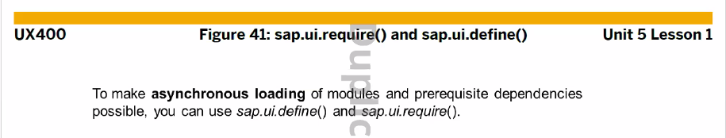
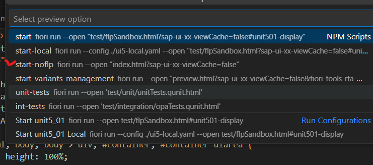
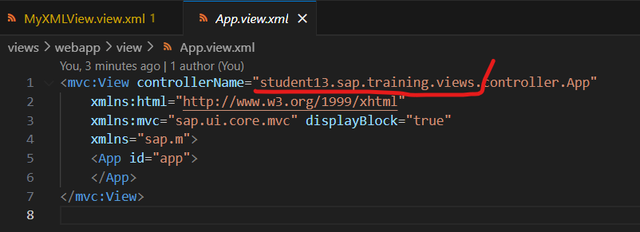
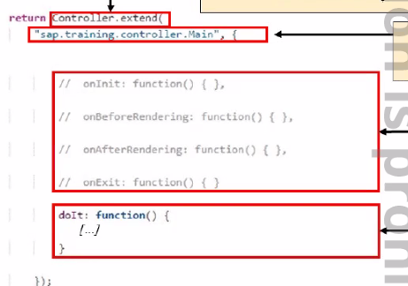
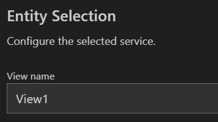
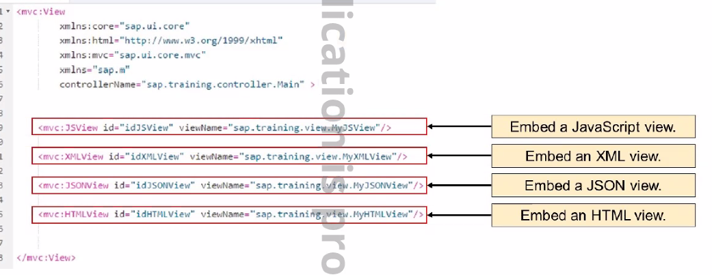

# Modules



- define(), require() , async 사용
- 비동기화 방식으로 사용 (그때그때 필요할때 사용 하겠다)


# Index.html

프로젝트 main : "webapp/index.html"
얘는 실행할때 



Index.html

```html
<!-- root 경로 꼭 확인할 것. unit5_01 아니고 unint501 이라는 것. 어디 쓰일때가 있나? -->
data-sap-ui-resourceroots='{
    "unit501": "./"
}'
data-sap-ui-libs="sap.m"
<script>
// sap.ui.getCore().attachInit -> ui5 초기화 된 후 실행 될 함수 등록하기.
sap.ui.getCore().attachInit (
    function () {
        // 버튼 생성
        let onButton = new sap.m.Button({
            text : "Press Me"
        })
        // HTML tag 생성, 아래 id = content
        oButton.placeAt("content")

        // click
        oButton.attachPress(
            function () {
                sap.ui.require(
                    // 패키지 경로는 . 아니고 / 쓰는거 잊지말기
                    // 이 안에서 다른 모듈을 사용할거면 . 대신 /을 사용하도록 한다.
                    ["unit501/MyLib/MessageManager"],
                    function (MessageManager) {
                        // 파라미터 보내기 뒤에 js 함수 확인할 것
                        MessageManager.reportSuccess("메세지", "제목")
                    }
                )

            }
        )
    }
)
</script>
```

MessageManager.js

```js
// 모듈
// define, require를 써야 비동기적으로 모듈을 가져와 필요한 시점에 호출이 가능하다.
sap.ui.define([
    "sap/m/MessageBox"	// 주로 마지막 단어?를 파라미터로 사용한다. 아래 function (파라미터)
],
// 모듈 순서와 파라미터 순서는 보장되어야 한다. 
function (MessageBox) {
    "use strict";

    return {
        reportSuccess: function (pMsg, pTitle) {	// 여기서 파라미터 받아줘야함
            // API Reference 		https://sapui5.hana.ondemand.com/#/api/sap.m.MessageBox%23methods/Summary
            MessageBox.show(pMsg, {
                title: pTitle
            })
        }
    }
});

```

----

# view, controller

#### HTML, JS, JSON, XML View, Controller, 임베디드



표시된 부분까지

> pack : student13.sap.training.views

new {name}.view.[js, json, xml]

```js
// JS View 생성
sap.ui.jsview (
    // [pack].view.[name]
    "student13.sap.training.views.view.MyJsView",
    {
        getControllerName: function () {	// 컨트롤러 취득하는 부분, view와 controller는 1대1관계
            // [pack].controller.[name]
            return "student13.sap.training.views.controller.MyJsView"
        },
        // UI 생성하기
        createContent : function (oController) {
            // js는 이 안에서 new TAG 생성하기
            let oTxt = new sap.m.Text({
                text: "Text on JS View"
            })
            // 이렇듯 id가 안 붙어도 되고
            let label = new sap.m.Label({
                text: "Team Name(JS View)"
            })
            // ID의 고유성을 보장하기 위해 this.createId를 사용한다
            let input = new sap.m.Input(this.createId("teamName3"), {
                description: 'Enter Team Name'
            })
            // 이렇게 id를 붙여도 되고
            let button = new sap.m.Button("btnId", {
                text: 'Search(JS View)'
            })
            // attachEvent(sEventId, oData?, fnFunction, oListener?) : this
            oCheckBox.attachSelect(oController.onCBSelect, oController)
            // Button은 attachPress인걸 보면 event 메서드에 attach 붙이는게 룰인가?
            button.attachPress(oController.onSearch, oController)
            return [oTxt, oCheckBox]
        }
    }
)
```

new {name}.controller.[js, json, xml]

```js
sap.ui.define([
    // 이리 픽스 된 형태
    "sap/ui/core/mvc/Controller"
],
function (Controller) {
    "use strict";

    // [pack].controller.[name]
    return Controller.extend("student13.sap.training.views.controller.MyJsView", {
        // 이 안에 lifecycle hook 들어옴. 
        onCBSelect: function () {
            let checkBox = this.byId("idCheckBox1")
            if (checkBox.getSelected()) {	// true 나옴
                checkBox.setText("Yes")	// text set으로 변경기
            } else {
                checkBox.setText("No")
            }
        }
    });
});
```

- hook 
  

  view -> controller 될때 자동으로 호출되는 메서드는 onInit() 이다.

  - onInit (多)
    대부분 model 생성할때 사용
  - onBeforeRendering
    html 페이지에 ui가 표시되기 전
  - onAfterRendering
    ui 렌더링이 끝날때
  - onExit
    controller가 종료될때 사용, 자원 종료?

임베디드 하기
App.view 말고 너가 지정한 view name이 Main.view 임


이거 지정한거 기억하고 여기다가 생성한 view 전부 임베디드 해야함



```xml
<mvc:View controllerName="student13.sap.training.views.controller.MyXMLView"
    xmlns:mvc="sap.ui.core.mvc" displayBlock="true"
    xmlns="sap.m">
    <Page id="page" title="{i18n>title}">
        <!-- <content /> -->
        <Text text="Text on XML View" id="oTxt"></Text>
         <CheckBox id="chkBox1" text="No" select="onSelect"></CheckBox>
        <!-- mvc:JSView, JSONView 지정 후(픽스), id="아무거나", viewName=[pack].view.[name] -->
         <mvc:JSView id="idJSView" viewName="student13.sap.training.views.view.MyJsView"/>
    </Page>
</mvc:View>
```

---


