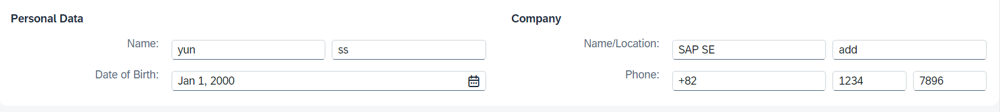
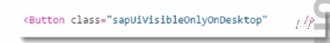

# 07.08. 월요일
```bash
# 용량 확인
df -ih

# npm modules 삭제
npm uninstall -g package
```

## 회원가입 정보 입력 fommat



```xml

<f:Form id="form">
    <f:title />
    <f:layout />
    <f:formContainers>
        <f:FormContainer id="container">
            <f:title />
            <f:formElements>
                <f:FormElement  id="formEle">
                    <f:label />
                    <f:fields>
                        <Input id="fName" value="yun" />
                        <DatePicker id="fDpBdate" value="2000-01-01">
                            <layoutData>
                                <l:ResponsiveFlowLayoutData />
                            </layoutData>
                       </DatePicker>
                    </f:fields>
                </f:FormElement>
            </f:formElements>
        </f:FormContainer>
    </f:formContainers>
</f:Form>
```

```xml
<mvc:View controllerName="unit704.controller.Main"
    xmlns:mvc="sap.ui.core.mvc" displayBlock="true"
    xmlns="sap.m"
    xmlns:f="sap.ui.layout.form"
    xmlns:core="sap.ui.core"
    xmlns:l="sap.ui.layout">
</mvc:View>
```

### 위에 form이 너무 복잡해서 간단하게 할 수 있는거 나옴 : simpleForm

```xml
<Label text="Country" />
<Select id="country" selectedKey="{Country}">
    <items>
        <core:Item text="England" key="England"/>
        <core:Item text="Germany" key="Germany"/>
        <core:Item text="USA" key="USA"/>
    </items>
</Select>
```

### Panel 기능

```xml
<!-- expandable: 접히고 펴는 기능 사용할래?, expandAnimation: 애니메이션 효과는? expanded : true면 펼친 상태로, 아니면 접힌 상태로-->
<Panel width="auto" expanded="true" class="sapUiResponsiveMargin" accessibleRole="Region" expandable="true" expandAnimation="true">
```

---

## CSS , Table  을 디바이스에 따라 다르게 지정 가능

[Ref](https://ui5.sap.com/1.108.27/#/topic/50eadaac8d2e49ee8996dc2b560cb76b)



위 사진 예시처럼 Desktop에서만 Button을 보여줄 수 있다.

```js
// attach to event
sap.ui.Device.media.attachHandler(fnSizeChanged, null, sap.ui.Device.media.RANGESETS.SAP_STANDARD);
// eventHandler: 
function fnSizeChanged(mParams) {
    switch(mParams.name) {
        case "Phone":
            // Do what is needed for a little screen
            break;
        case "Tablet":
            // Do what is needed for a medium sized screen
            break;
        case "Desktop":
            // Do what is needed for a large screen
    }
}


sap.ui.define([
	"sap/ui/Device",
], function (Device) {
	return Controller.extend("sap.m.sample.SplitApp.C", {
		onInit: function () {
			this.getSplitAppObj().setHomeIcon({
				'phone': 'phone-icon.png',
				'tablet': 'tablet-icon.png',
				'icon': 'desktop.ico'
			});
			Device.orientation.attachHandler(this.onOrientationChange, this);
		},
```

CSS class 이용하기

```xml
 <!-- 
    sapUiVisibleOnlyOnDesktop
    sapUiHideOnDesktop
    sapUiVisibleOnlyOnTablet
    sapUiHideOnTablet
    sapUiVisibleOnlyOnPhone
    sapUiHideOnPhone 
-->
<Image src="/image/plane.png" width="100%" class="sapUiHideOnPhone"></Image>
```

```xml
 <!-- Quize01 span 기능 잘 사용해서 반응형으로 생성하기 -->
<f:SimpleForm id="simple2">
    <f:content>
        <core:Title id="pf" text="Panel with SimpleForm"></core:Title>
        <Label text="Carrier">
            <layoutData>
                <!-- L은 PC버전, M은 태블릿, S는 폰버전으로 span으로 반응형 생성 가능 
				indent="M4" 로 시작점 체크해서 할 수 있음
				-->
                <l:GridData span="L2 M4 S12" /> 
            </layoutData>
        </Label>
        <Input value="이야">
            <layoutData>
                <l:GridData span="L10 M8 S12" />
            </layoutData>
        </Input>

        <Button text="Submit">
            <layoutData>
                <l:GridData indent="M4" span="L2 M8 S12" />
            </layoutData>
        </Button>
    </f:content>
</f:SimpleForm>
```

----

