# 24.07.09

# Fragment

- 화면을 작은 단위로 만들어서 임베디드 시키기 

  xmlns:core = "sap.ui.core"

  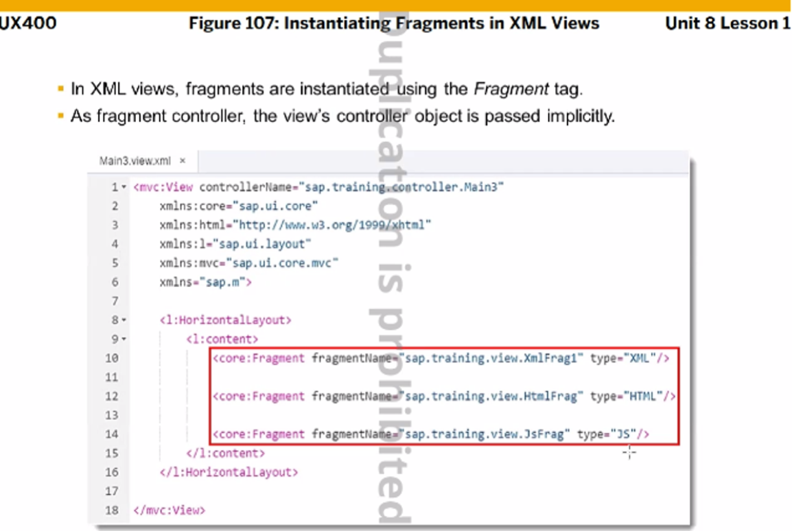

- 재사용

- View로 분류되기는 함

- 지원되는 Type : XML fragment , HTML fragment, JS fragment

- [name].flagment.[js,html,xml]

- sap.ui.core.Fragment.load

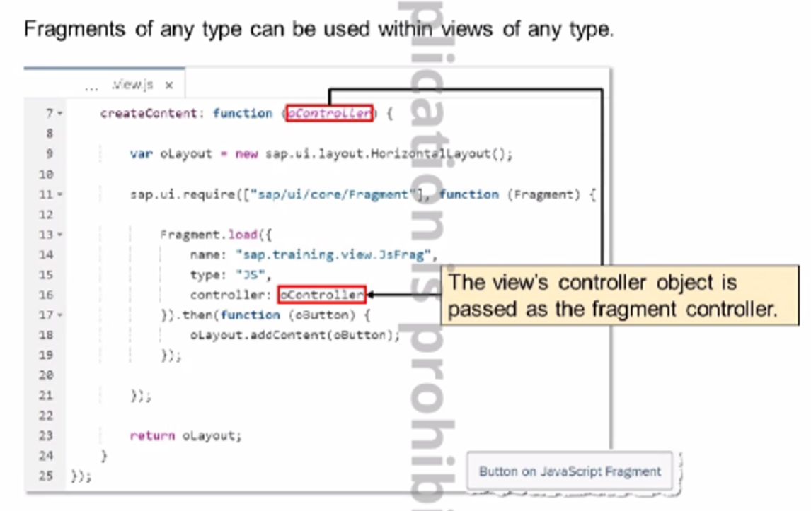

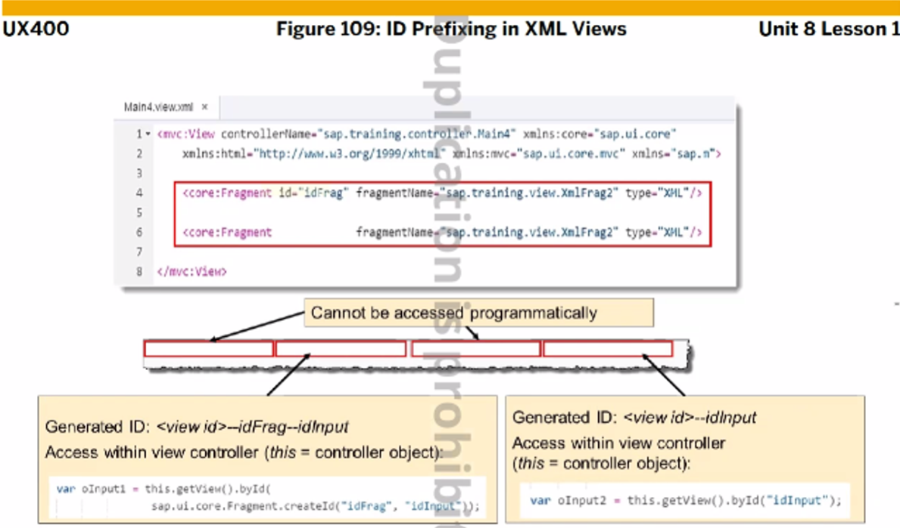

- core:Fragment 태그 역시 id값을 안줄수있어 
  그렇게 될 경우 id 값이 없는 태그는 a TAG와 b TAG 가 서로 같다고 여겨진다.

  ```xml
  <Input id="e"> this.getView().byId
  <Input> this.getView().byId
  <Input> 
  ```

  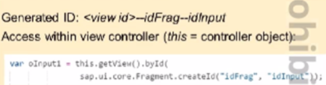

new XmlFrag.fragment.xml 

```xml
<core:FragmentDefinition
    xmlns="sap.m"
    xmlns:core="sap.ui.core">

    <Input id="inpFrag" value="Fragment Input Field"></Input>
    <Button id="btnFrag" text="Fragment Button" press="onFragClick"></Button>

</core:FragmentDefinition>
```

Main.view.xml

```xml
<!-- 모듈 추가하기 
    xmlns:core="sap.ui.core"
    xmlns:l ="sap.ui.layout"
-->

 <!-- XML Fragment -->
<core:Fragment fragmentName="unit801.view.XmlFrag" type="XML" />
<core:Fragment fragmentName="unit801.view.XmlFrag" type="XML" />
```

Main.Controller.js

```js
"sap/ui/core/Fragment"
onFragClick: function(){
    var fValue= this.getView().byId("inpFrag");
    sap.m.MessageBox.show(fValue.getValue());
}
```

---

Main.view.xml

```xml
<!-- JS Flagment -->
<core:Fragment fragmentName="unit801.view.JSFragPractice" type="JS"/>
```

JSFragPractice.fragment.js

```js
sap.ui.jsfragment("unit801.view.JSFragPractice",{
    createContent: function(oController){
        var oInput = new sap.m.Input(this.createId("inpJSFrag"),{
            value:"Walldorf"
        })

        var oButton = new sap.m.Button({
            text: "Say Hello",
            // press를 이렇게 써도 되는거였다.
            press:[oController.onJSButtonPress, oController]
        })

        var oText = new sap.m.Text(this.createId("txtJSFrag"), {
            text: "Hello Walldorf"
        });

        return new sap.ui.layout.HorizontalLayout({
            content: [oInput, oButton, oText] 
        });
    }
})
```

Main.Controller.js

```sj
onJSButtonPress: function() {
    var jsValue = this.byId(sap.ui.core.Fragment.createId("idJSFrag", "inpJSFrag")).getValue();
        sap.m.MessageBox.show(jsValue);
}
```

# Dialog

```xml
<!-- Dialong -->
<VBox id="idVBox">
    <items>
        <Button id="btnPopup" text="Popup" press="onPopup"></Button>
        <Text id="idTxt"></Text>
    </items>
</VBox>
```

PopupFrag.fragment.xml

```xml
<core:FragmentDefinition
    xmlns="sap.m"
    xmlns:core="sap.ui.core">

<Dialog id="digPopup" title="Popup Fragment">
    <buttons>
        <Button id="btnClose" text="Close" press="onClose"></Button>
    </buttons>

    <content>
        <Text id="txtPopup" text="Popup Fragment Text"></Text>
        <HBox id="idHbox" alignItems="End">
            <!-- <Label id="lblName" text="Name" class="sapUiResponsiveMargin"></Label> -->
            <Label id="lblName" text="Name" class="sapUiResponsiveMargin"></Label>
            <Input id="inpName"></Input>
        </HBox>
    </content>
</Dialog>

</core:FragmentDefinition>
```

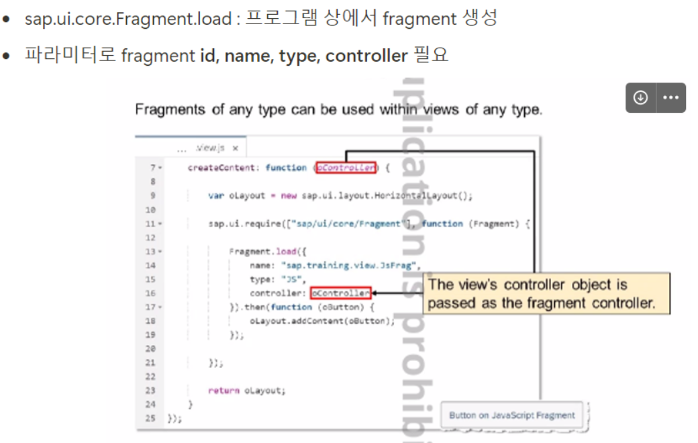

- controller.js

  ```js
  sap.ui.define([
      "sap/ui/core/mvc/Controller",
      "sap/ui/core/Fragment"
  ],
  function (Controller, Fragment) {
      "use strict";
  
      return Controller.extend("unit802.controller.View1", {
          onPopup: function() {
              var oView = this.getView();
  
              // Popup Dialog 생성
              if (!this.byId("digPopup")) {
                  Fragment.load({
                      id: oView.getId(),
                      name: "unit802.view.PopupFrag",
                      type: "XML",
                      controller: this
                      // then을 통해 success 여부 확인
                  }).then(function (oDialog) {
                      // Dialog Fragment에 대한 model, lifecycle 관리를 해당 컨트롤러에 연결하려면 addDependent 메소드 사용
                      oView.addDependent(oDialog);
                      oDialog.open();
                  });
              } else {
                  this.byId("digPopup").open();
              }
          },
          onClose:function() {
              this.byId("digPopup").close();
              var vInput = this.getView().byId("inpName").getValue();
              this.getView().byId("idTxt").setText(vInput);
          }
      });
  });
  
  ```

  ## Model

  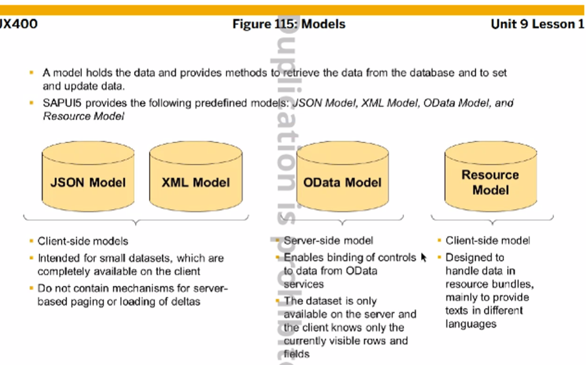

  JSON,XML은 client단에서 처리한다.
  OData, Resource는 controller에 바인딩해서 use (페이징, 필터, 정렬 가능)

## JSON model

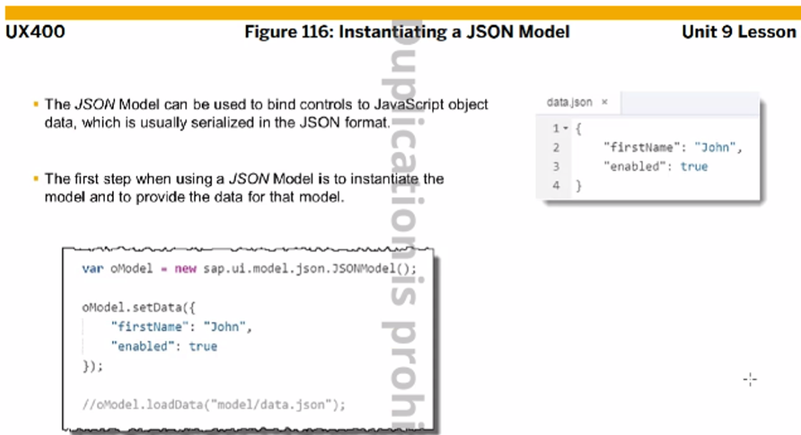

JSON 모델을 사용하려면 object를 생성해야 한다.

두 가지 방법이 있다.

- 별도의 json 파일을 생성해 json 포맷으로 사용(우) → loadData() 사용해 할당
- javascript의 object를 선언해 사용(좌) → setData() 사용해 할당

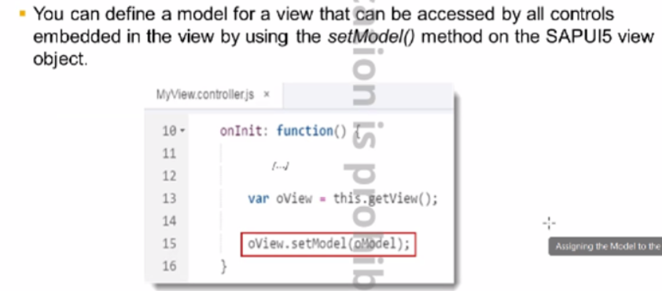

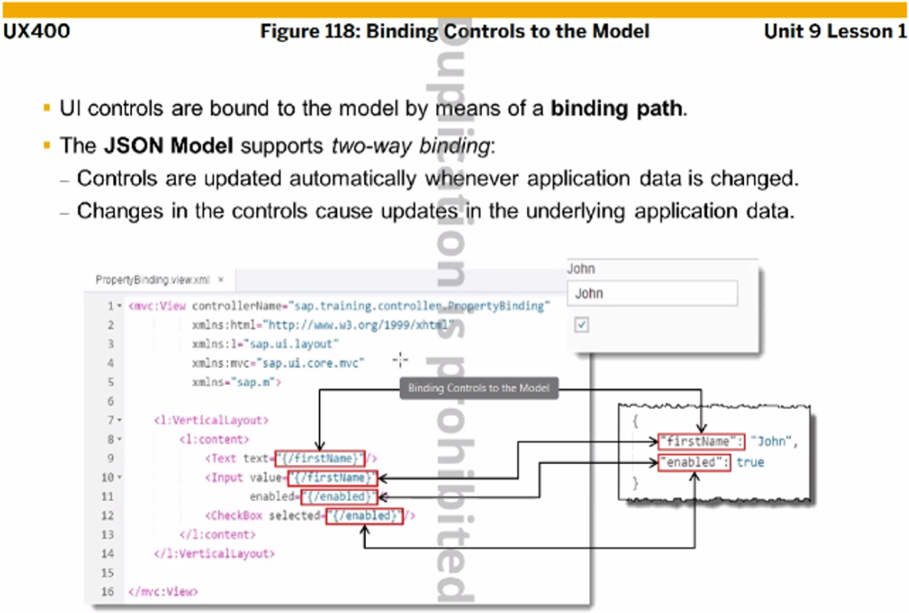

json 모델은 기본적으로 2-way 바인딩이다.

- 2-way 바인딩 : 데이터를 가지고 있는 모델에서 데이터가 변경되면 UI 단으로 넘어간다. 반대로 UI 단에서 데이터가 변경되어도 모델에 반영된다.
- 1-way 바인딩 : 모델에서 데이터가 변경되면 UI 단으로 업데이트 되지만 반대는 불가능하다.

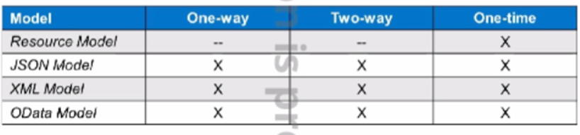

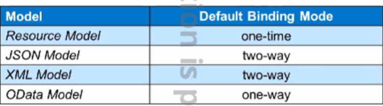

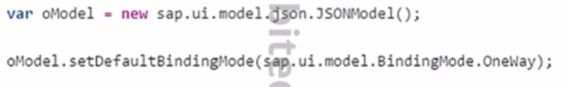

