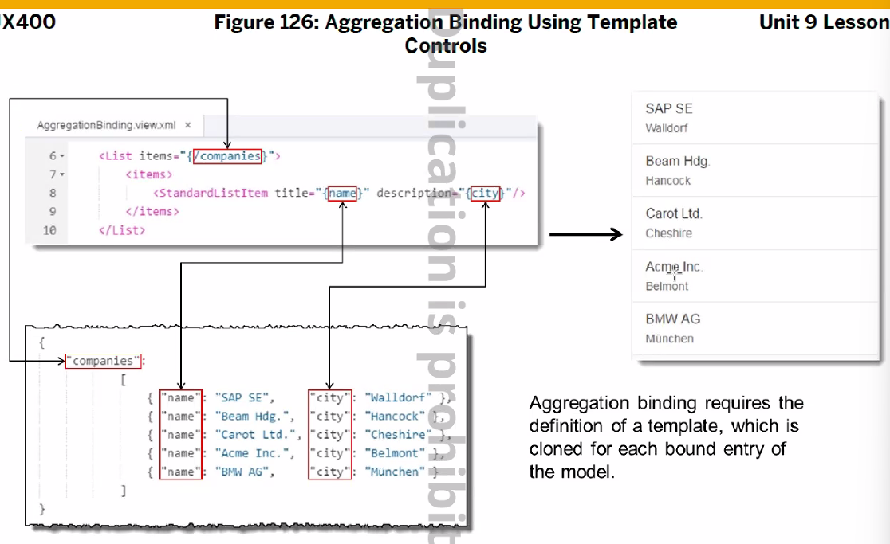

# 24.07.10


for문 아니고 json 형태로 바인딩하는 방식임


```js
onInit: function () {
    let oData = {
        lastName: "김",
        firstName: "하나",
        skill : [
            {sId : "s01", sName:"ABAP"},
            {sId : "s02", sName:"SAPUI5"},
            {sId : "s03", sName:"SAP Gateway"},
            {sId : "s04", sName:"Fiori"},
            {sId : "s05", sName:"WebdynPro ABAP"}
        ]
    }

    let oModel = new sap.ui.model.json.JSONModel(oData);
    this.getView().setModel(oModel);
}
```

```xml
<Input id="inpLname" value="{/lastName}"></Input>
<Input id="inpFname" value="{/firstName}"></Input>
<!-- 
    절대경로(/skill)  , 상대 경로(sId, sName)가 있다.
    n건의 데이터를 나열할때의 n의 하위노드들은 (/skill의 종속관계인 sId와 sName애들은) '/'를 따로 붙이지 않는다.
-->
<List id="idList" items="{/skill}">
    <items>
        <StandardListItem id="stListItem" title="{/sId}" description="{sName}" />
    </items>
</List>
```


```js
let oData1 = {
        data : {
            depId : "SAP Team",
            emp : [
                {id : "E001", name : "Jungkook Kim", skill : ["s01", "s02", "s03"]},
                {id : "E002", name : "Minyoung Kim", skill : ["s02", "s03", "s04"]},
                {id : "E003", name : "Sangmin Lee", skill : ["s01", "s03", "s05"]},
                {id : "E004", name : "Younghee Lee", skill : ["s01", "s02", "s04"]},
                {id : "E005", name : "Jungwoo Yoon", skill : ["s01", "s02", "s03"]}
            ]
        }
    }

    let oModel1 = new sap.ui.model.json.JSONModel(oData1);
    this.getView().setModel(oModel1, "com");    // 모델에 대한 이름을 'com'로 지정
}
```

```xml
<!--  xmlns:core="sap.ui.core" 추가--> 
<!-- comboBox는 key와 text로 구성되어 있다. -->
<!-- 이름을 com으로 지정했기에 com>/ 이런 방식으로 써야 굴러간다. 만약 이름을 지정하지 않았다면 -->
<ComboBox id="box" items="{com>/data/emp}">
    <!-- <ComboBox id="box" items="{/data/emp}"> -->
    <items>
		<!-- <core:Item id="cItem" key="{id}" text="{name}"></core:Item> -->
        <core:Item id="cItem" key="{com>id}" text="{com>name}"></core:Item>
    </items>
</ComboBox>
```

```js
let oData2 = {
    companies : [
        {sId : "s01", city:"ABAP"},
        {sId : "s02", city:"SAPUI5"},
        {sId : "s03", city:"SAP Gateway"},
        {sId : "s04", city:"Fiori"},
        {sId : "s05", city:"WebdynPro ABAP"}
    ]
}

let oModel2 = new sap.ui.model.json.JSONModel(oData2);
this.getView().setModel(oModel2, "city");
```

### 주의

```js
// 만약 JSONModel을 한 페이지에서 여러번 생성했다면? 작동되지 않는다.
// 아니 작동된다. 너가 이상하게 했나보지
let oModel1 = new sap.ui.model.json.JSONModel(oData1);	
this.getView().setModel(oModel1, "com");
```


### Integer Type


### String Type


Date Type


### Sort 와 Filter

Sort 할때 default는 DESC 이다. 최신 데이터를 먼저 보기 위함


````js
// 1. json 데이터 더미 넣기
// 2. controller에서 json 데이터 가져오기

"sap/ui/model/json/JSONModel" // 모듈 추가 후
// 파라미터에 JSONModel 넣기

// json 데이터 가져오기
let model = new JSONModel("/model/level.json");
this.getView().setModel(model, "level");

let model2 = new JSONModel("/model/employ.json");
this.getView().setModel(model2, "emp");
````

level.json
```json
{
    "Level": [
        {"key": "1"},
        {"key": "2"},
        {"key": "3"},
        {"key": "4"}
    ]
}
```

```xml

<!-- 추가 시켜줘요
xmlns:core="sap.ui.core"
xmlns:f="sap.ui.layout.form"
xmlns:t="sap.ui.table" 
-->
        
<f:SimpleForm>
    <f:content>
        <Label text="Salary Level"></Label>
        <ComboBox id="comBox" items="{level>/Level}" selectionChange="onSelectionChange">
            <core:Item id="idItem" key="{level>key}" text="{level>key}" />
        </ComboBox>
        <Button id="btn" text="Remove Filter" press="onClick"></Button>
        <Label text="Sorting" />
        <Button id="btnSort" text="Sorting" press="onSort" />
        <Button id="btnRm" text=" Remove Sorting" press="onRemoveSort" />
    </f:content>
</f:SimpleForm>

<!-- <t:Table 
    rows="{path: 'emp>/employees', 
    filters:
    [
		Level이 2와 4사이에 있는 값을 가져와서
        {path:'Level', operator:'BT', value1: '2', value2:'4'},
		Gender가 1인 값만
        {path:'Gender', operator:'EQ', value1: '1'}
    ],
    sorter:
    [
		asc로는 T,F값을 줄 수 없다. DESC로 조절하자. Default는 desc이다.
        {path:'Salary', descending:false}
    ]
    }" 
    selectionMode="None" 
    alternateRowColors="true"
> -->
 <t:Table 
    rows="{emp>/employees}"
    selectionMode="None" 
    alternateRowColors="true"
>
    <t:columns>
        <t:Column id="cId">
            <t:label><Label text="name"></Label></t:label>
            <t:template><Text text="{emp>Ename}"></Text></t:template>
        </t:Column>

         <t:Column id="cId2">
            <t:label><Label text="Date of Birth"></Label></t:label>
            <t:template><Text text="{emp>Gbdat}"></Text></t:template>
        </t:Column>

         <t:Column id="cId3">
            <t:label><Label text="Gender"></Label></t:label>
            <t:template><Text text="{emp>Gender}"></Text></t:template>
        </t:Column>

         <t:Column id="cId4">
            <t:label><Label text="Gender Text"></Label></t:label>
            <t:template><Text text="{emp>GenderTx}"></Text></t:template>
        </t:Column>


         <t:Column id="cId7" hAlign="Center">
            <t:label><Label text="Salary Level"></Label></t:label>
            <t:template><Text text="{emp>Level}"></Text></t:template>
        </t:Column>

         <t:Column id="cId5">
            <t:label><Label text="Salary"></Label></t:label>
            <t:template><Text text="{emp>Salary}"></Text></t:template>
        </t:Column>

         <t:Column id="cId6">
            <t:label><Label text="Department"></Label></t:label>
            <t:template><Text text="{emp>Orgtx}"></Text></t:template>
        </t:Column>
    </t:columns>
</t:Table>
</Page>
</mvc:View>
```

---

# 정리

## JSONModel 

json 데이터를 가져와서 model에 할당하는 방법 : JSONModel (two-way 방식이 default)

```js
let oModel = new sap.ui.model.json.JSONModel(oData);
this.getView().setModel(oModel);
```

model에 할당된 데이터를 UI에 연결 시키는 것 : Data Binding
바인딩 Type: 프로퍼티, element(회사 직원의 목록), aggregation(콤보박스-선택-선택된 리스트 쫘르륵)


## 프로퍼티 바인딩 방법 


## aggregation (n건의 데이터를 보일때)

```xml
<StandardListItem id="stListItem" title="{/sId}" description="{sName}" />
```



## Element Binding

부서에 속한 직원이 몇인가, 오늘 10시에 판매된 물건이 무엇인가
```xml
<ComboBox id="comBox" items="{level>/Level}" selectionChange="onSelectionChange">
```

```js
let getList = event.getParameter("listItem")
let sPath = getList.getBindingContext().getPath()
let oLists = this.byId("cccc")
oLists.bindElement(sPath)	// bindElement
```


모델에 데이터 변경시 자동적으로 UI에 update : two-way
데이터 변경만 되고 update 안되는 거 : one-way
ui에 바인딩이 딱한번 되는 것 : one-time


json은 디폴트가 two-way라 바꾸려면 저런 예시처럼 부여해야함

## Data Binding Type

sap.ui.model.type


사용 예시


int에서 groupingSeparator : ',' 를 하면 세자리씩 , 로 끊어서 표현해준다.

## Sort & Filter


```xml
<t:Table 
    rows="{path: 'emp>/employees', 
    filters:
    [
		Level이 2와 4사이에 있는 값을 가져와서
        {path:'Level', operator:'BT', value1: '2', value2:'4'},
		Gender가 1인 값만
        {path:'Gender', operator:'EQ', value1: '1'}
    ],
    sorter:
    [
		asc로는 T,F값을 줄 수 없다. DESC로 조절하자. Default는 desc이다.
        {path:'Salary', descending:false}
    ]
    }" 
    selectionMode="None" 
    alternateRowColors="true"
> 
```


