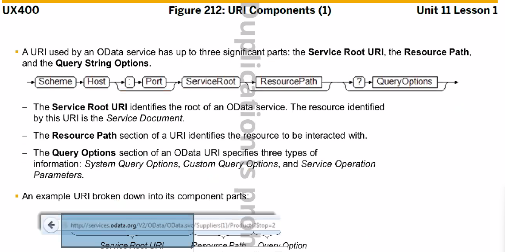
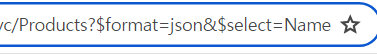
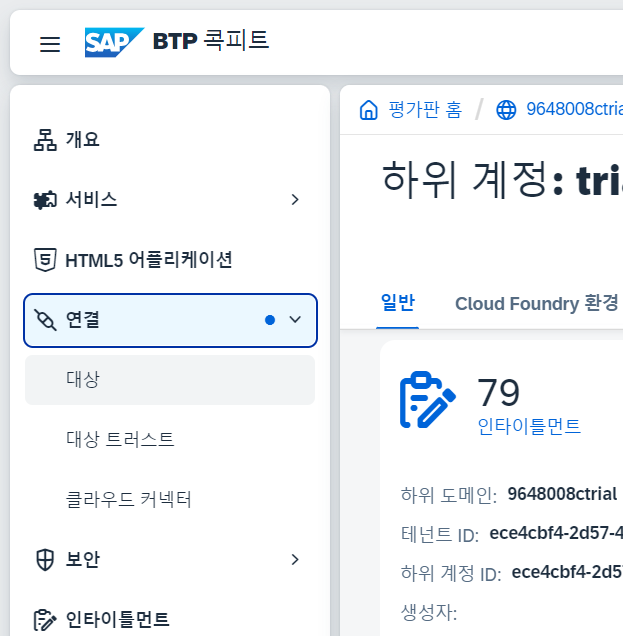
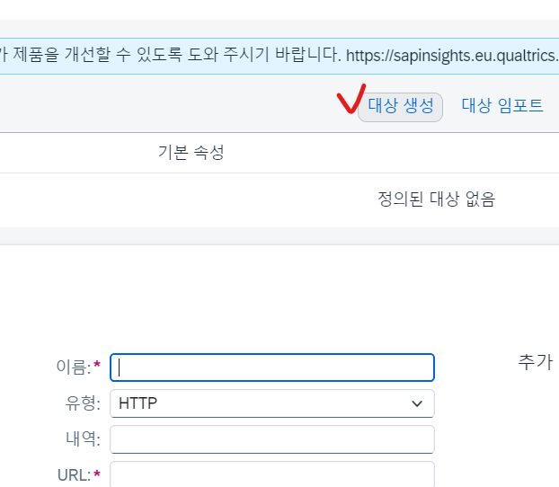

```xml
<t:Column id="cId" sortProperty="Ename">
<t:label><Label text="name"></Label></t:label>
<t:template><Text text="{emp>Ename}"></Text></t:template>
</t:Column>
```

sortProperty="Ename" 를 써넣을 경우


## OData

- HTTP 기반
- AtomPub 과 JSON의 data format

링크? [Entity](https://services.odata.org/V2/OData/OData.svc/Products?$format=json)
$format=json 이라고 지칭하면 json 포맷으로 보여줌





Query Option에는 전부 $ 가 붙는다


[예시 링크](https://services.odata.org/V2/OData/OData.svc/Products?$filter=Price%20gt%2020&$format=json)




top은 몇건의 데이터를 가져올지 정하는 것
&$ 이런식으로 and 해서 조건식 추가 가능
skip=3은 0~3건의 데이터를 skip하고 4 데이터부터 보여준다.
skip=2&$top=2 라는것은 2건을 skip하고 2건의 데이터를 보여주겠다.

## HTTP


---

## OData Model

- 생성하기
  


Cloud Connector

- 설치
  https://tools.hana.ondemand.com/
- 


JVM 압축 풀기 -> cd :C  -> sapcc 설치 -> 설치 중간에 jvm 폴더에서 
C:\sapjvm-8.1.099-windows-x64\sapjvm_8
선택 후 설치 진행

user = Administrator
pw = sync00

https://github.com/SAP-samples/btp-msteams-extend-workflow/blob/main/tutorial/Step4-Configure-Cloud-Connector/README.md

https://localhost:8443/ 로 이동 후


ABAP system


교육용 서버로
210.16.199.140 , 8001
allow 체크 풀고 전부 next








비번 : sync00
사용자 : KDT-B-00


dev_abap,odata_abap

