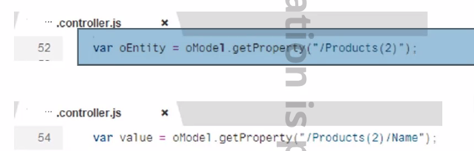
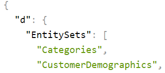
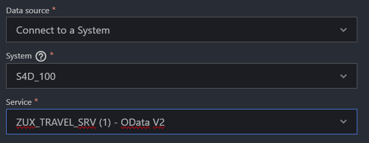

[링크](https://github.com/SAP-samples/fiori-elements-opensap/blob/main/week3/unit4.md)


Name 규칙 : Z or Y 붙이기
```bash
npx fiori add deploy-config
```

## OData 이어서



어떤 엔티티에 접근할건지 getProperty() 로 지정

## CRUD, HTTP

새로운 엔티티 만들때는 


- Create - POST
  

- Read - GET
  
- Update - PUT
  
- Delete - DELETE
  

## OData Model 사용하기

### URL 이용해서 프로젝트 생성하기


[NorthWind](https://services.odata.org/V2/Northwind/Northwind.svc/?$format=json)


여기서 필요한 데이터를 추출하기
Entity set에서 보고싶은 데이터 이름을 url에 붙여주면 된다.

[Categories](https://services.odata.org/V2/Northwind/Northwind.svc/Categories/?$format=json)

### ZUX ? 로 프로젝트 생성하기




[UX_TRAVEL_SRV](http://210.16.199.140:8001/sap/opu/odata/sap/UX_TRAVEL_SRV)
ID : kdt-b-00
PW : sync00
[Json](http://210.16.199.140:8001/sap/opu/odata/sap/UX_TRAVEL_SRV/?$format=json)


하면 데이터 갯수가 나옴

```xml
<Table items="{/UX_C_Carrier_TP}" width="auto" growing="true" growingThreshold="10" class="sapUiSmallMargin">
```

growing, growingThreshold 는 more 기능을 사용


mode="SingleSelectLeft" 는 체크표시처럼 item check 가능 

---


[OData.V2](https://services.odata.org/V2/OData/OData.svc//Products(2)/?$format=json)

## Quize

Main.view

```xml
<Button text="Button" press="onPopup"></Button>
```

Main.controller.js

```js
"sap/ui/core/Fragment"

onPopup: function (event) {
    var oView = this.getView();
    // selected change 
 	let sPath = event.getParameter("selectedItem").getBindingContext().getPath();
	this.getView().byId("tableId").bindElement(sPath);
    if(!this.byId("popUp")){	// 1. 첫 로드 ( id가 없을경우 )
        // 2. 처음 생성할때 여기로 넘어와서 생성
        Fragment.load({
            id: oView.getId(),
            name: "quize03.view.PopupFrag",
            type: "XML",
            controller: this
        }).then (
            // 3. load가 성공한다면 여기로 넘어오는데
            function(oDialog) {
                // 4. this.getView가 popup을 바라보기 때문에 this.getView()로 Main page에 접근이 불가능하다.
                // 5, 그래서 위에 Main view를 변수로 저장해줘야 한다. 
                // 6. addDependent 을 통해 main view에 popup을 붙여주고
                oView.addDependent(oDialog);
                // 7. open() 시키기
                oDialog.open();
                // 8. 선택한 아이템 path 가져오기
                // ??. event.getSource().getBindingContext()
                // 에서 sDeepPath를 보면 "/Categories(1)/Products(1)" 이렇게 전체 경로가 담겨져 있다.
                var sPath = event.getSource().getBindingContext().getPath();
                // 9. path를 통해 데이터 바인딩 시킬것
                oView.byId("popUp").bindElement(sPath);
            }
        );
    } else {	// 만약 이미 생성된 애라면
        this.byId("popUp").open();
        var sPath = event.getSource().getBindingContext().getPath();
        oView.byId("popUp").bindElement(sPath);
    }
},
onClose: function() {
    this.byId("popUp").close();
},
```

PopupFrag.fragment.xml
```xml
<core:FragmentDefinition
    xmlns="sap.m"
    xmlns:core="sap.ui.core">

<Dialog id="popUp" title="Dialog box">
    <buttons>
        <Button id="btnClose" text="Close" press="onClose"></Button>
    </buttons>

    <content>
        <Text id="txtPopup" text="Detail data"></Text>
        <HBox id="idHbox" alignItems="End">
            <Label text="ID" />
            <Input editable="false" value="{ID}" />
            <Label text="Name" />
            <Input editable="false" value="{Name}" />
            <Label text="Price" />
            <Input editable="false" value="{Price}" />
        </HBox>
    </content>
</Dialog>

</core:FragmentDefinition>
```

