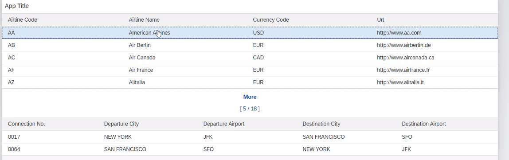
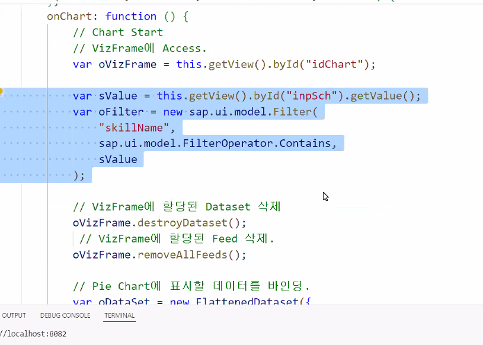

1. Table 리스트 클릭 이벤트 받기 위해서는
   ```xml
   <!-- 이렇듯 mode와 change 두개를 써야함 -->
   <Table
       selectionChange="onChange"
       mode="SingleSelectMaster"
   >
   ```

2. Table에 데이터를 바인딩 하기 위해서는
   ```js
   onChange: function (event) {
       // 리스트를 클릭하면 주소 가져오기
       let path = event.getParameter("listItem").getBindingContext().getPath();
       // bindContext 를 사용해 바인딩을 해줘야 한다.
       this.getView().byId("tableId").bindContext(`${path}`)
   }
   ```

3. 만약 uri 주소가 /UX_C_Carrier_TP('AA')/to_Connection 와 같아서
    /UX_C_Carrier_TP('AA') 뒤에 /to_Connection  쿼리 스트링을 붙여줘야 한다면
   /to_Connection 은 

   ```xml
   <Table items="{to_Connection}">
   ```

   와 같이 붙여주도록 한다....?

----

# Chart

```xml
<!-- xmlns:viz="sap.viz.ui5.controls" 모듈 추가하기 --> 
<viz:VizFrame id="idVizFrame" vizType='stacked_column' />
```

controller.js
````js
sap.ui.define([
    "sap/ui/core/mvc/Controller",
    'sap/ui/model/json/JSONModel',
    'sap/viz/ui5/data/FlattenedDataset',
    'sap/viz/ui5/controls/common/feeds/FeedItem'
],
function (Controller, JSONModel, FlattendDataSet, FeedItem) {
````

```json
"newSAP": [
    {"skillName" : "ABAP",       "rate" : "10"},
    {"skillName" : "New ABAP",   "rate" : "15"},
    {"skillName" : "W4D ABAP",   "rate" : "20"},
    {"skillName" : "SAPUI5",     "rate" : "30"},
    {"skillName" : "Fiori",      "rate" : "35"},
    {"skillName" : "SAP HANA",   "rate" : "50"},
    {"skillName" : "JAVAScript", "rate" : "40"}
]
```



