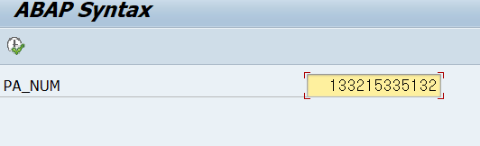
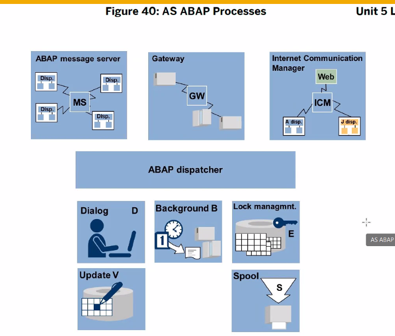

# ABAP Setup

[설치파일](https://mybox.naver.com/share/list?shareKey=BdepTf9UryZ2YUtJIA19TItfLCEp76rBgDOwqRzzZkAD)


계속 next next


만약에 툴바가 잘 안보인다면 위에 체크 해제 되었는지 확인할것


210.16.199.141
EDU 입력


---

----

# 이론


End User 입장에서 Black Box (자신이 보는 화면 안에 백단, DB는 사용자는 몰라도 된다.)
이들이 아는 것은 t-code 뿐이다.


End User가 알 수 있게 t-code를 지정해주는 것도 프로그래머의 몫이다.


/n : 현재 GUI에서 실행하라
/o : 새 GUI에서 실행시켜라


이렇게 자주 사용하는 것은 Insert Transaction으로 저장이 가능하다


----


abap repository 를 access 할 수 있다 -> object navigator

SE80 Object Navigator
SE24 CLASS Builder
SE11 ABAP Dictionary
SE37 ABAP Function Modules
SE38 ABAP Editor
SE41 Menu Painter
SE51 Screen Painter

----

# 패키지 생성

패키지 이름은 Y/Z 로 시작해야 한다.
대/소문자 구분하지 않는다.


t-code : /ose09 (패키지 생성)


패키지 생성 , se80 or se38에서 create 가능


Own Request 버튼 클릭 -> 

전에 만들어둔거 더블클릭


GUI는 최대 6개까지 open 가능

/ose09 Transport 


----

# Create ABAP program

- 프로그램 이름은 여기도 Y/Z 로 시작해야 한다. (대소문자 상관x)


**체크 해제** 후 확인


save - 저장 - 끝

아밥 레포지토리 > 어플리케이션 컴포넌트 > 패키지

----

| JS / 한글 설명 | ABAP  |
| -------------- | ----- |
| Dispaly        | WRITE |
| var, let       | DATA  |
| number, string | TYPE  |
|                |       |
|                |       |
|                |       |

Ctrl + F1 으로 Change mode로 바꿔야 입력이 가능하다.

```sql
# display
WRITE 
```


Ctrl + F3
Active 된 상태에서 F8 하면 실행된다


----

# ABAP 특징

- Cast (형변환)
- multi lang (언어 변환 가능)
- SQL access 가능 (Open SQL 사용)
- 프로시저 프로그램 모델
- platrom-independent
- 계속 업데이트 됨

##  Syntax


' ' 안에서는 대소문자 구분함

| JAVA/JS                   | ABAP                               |
| ------------------------- | ---------------------------------- |
| ;                         | .                                  |
|                           | word - word 사이에 space 꼭 있어야 |
|                           | 들여쓰기 (가독성)                  |
| 상수/변수 대소문자 구분함 | 상수/변수 대소문자 구분x           |
| Input filed 생성          | PARAMETERS                         |
| int                       | TYPE i                             |
| a = b                     | move a to b 또는 a = b             |
| a+=1                      | ADD 1 TO a 또는 a = a + 1          |
| /n                        | NEW-LINE                           |


```ABAP
* 화면에 입력 필드 생성. 이름 최대 8자리
* TYPE이 i(INTEGER) 라 정수값만 입력 가능
PARAMETERS pa_num TYPE i.

* 변수선언
DATA gv_result TYPE i.

* JS의 = 는 move_to_로 표시해준다.
* pa_num에 할당된 데이터를 gv_result에 할당.
move PA_NUM to GV_RESULT.
GV_RESULT = PA_NUM.

* gv_result 변수에 1 더하기
ADD 1 TO GV_RESULT.
* 혹은 이런 방법으로도 가능 
gv_result = gv_result + 1.

* 디스플레이
WRITE 'Screen Input Data :'.
WRITE PA_NUM.

* 다음 라인
NEW-LINE.

* 이렇듯 : 을 통해 한 라인에다 적을 수도 있다. 하지만 가독성을 늘 고려하자
WRITE: 'Screen Input Data :', PA_NUM. NEW-LINE.

WRITE 'Result Data : '.
WRITE GV_RESULT.
```



---

## Work process


