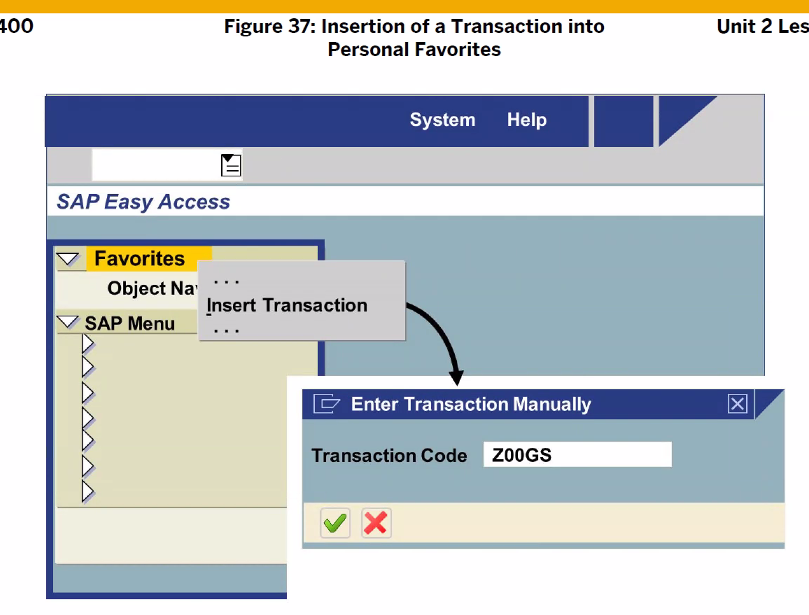
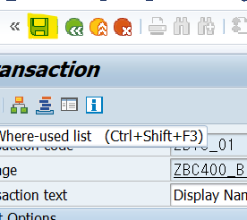

[TOC]


키워드 검색을 하고 싶다면 커서를 둔채로 F1 을 누르자

또는


---

# ABAP Dev Projects

- create transactions

  프로그램이 완성되면 t-code를 만들어서 user 에게 전달해줘야 한다.
  그럼 user는 t-code로 프로그램을 이용함

- Release change request

개발되어지는 모든 코드에는 t-code를 생성해줘야 한다. 그래야만 User가 사용할 수 있다. 

## create transactions

create = se80, se93


프로그램 이름 == Transactions Program 이름



### 실습, /ose80 으로 실습


Context menu안에 있는 Create - Transaction을 선택해준다.


Transaction code는 z,y로 시작

t-code 옵션 선택 :
report transaction 을 check해줘야 한다. (module pool 프로그램 t-code 생성때는 dialog t를 선택해줘야 한다.)

TODO. report는 무엇인가, excute 어쩌고? unit11에 나오는듯



저장 - 저장 하면 생성된다 -> 실행은 F8 또는 /nZB13_01 (t-code 이름)

----

### 실습 , /ose93 으로 실습해보기


그 다음 과정은 위와 같다.

---


---

## Release change request

/ose09


----

# ABAP language Elements

- 변수 : data objects, 타입 : data type
- 조건문 : statements (if / switch case)
  반복문 : 5가지
- 디버깅

## Data Type

1 byte : 0~255

### Standard Data Types (고정된 size)


가변 size Type
packed number만이 소수점 자릿수를 맘대로 지정할 수 있다.


local data type : 직접 데이터 타입을 선언하는 방법도 있다.

```ABAP
* 암묵적인 룰 : 'tv_c_이름' 이렇게 써준다
TYPES tv_c_type TYPE c LENGTH 8.
TYPES tv_n_type TYPE n LENGTH 5.
* 소수점 두자리 와라. p 타입은 소수점 지정해서 사용 가능
TYPES tv_p_type TYPE p LENGTH 3 DECIMALS 2.
```

### ABAP Dictionary (Global data type)


tv_ : local 변수
gv_ : global 변수

```ABAP
DATA 변수이름 LIKE 다른 변수 이름.
* [D,T,I,F,STRING,XSTRING,P,N,C,X] 와 같이 TYPE이 들어옴
DATA 변수이름 TYPE [D,T,I,F,STRING,XSTRING,P,N,C,X]
```


```ABAP
* VALUE는 Default 정해주는거
DATA gv_test TYPE i VALUE 17
* abap dic에 포함되는 type이다.
DATA gv_carrid TYPE s_carr_id
* packed number만이 소수점 자릿수를 맘대로 지정할 수 있다.
* p LENGTH 3 은 3*2=6 해서 자릿수는 6으로 나온다
* signed(+,-) 자리가 마지막에 존재 123.44+ (이런식의 형태,  최대값 999.99)
p LENGTH 3 DECIMALS 2.
* 상수는 lc_ , gc_ 이렇게 해주도록한다.
CONSTANS gc_test TYPE i VALUE {literal | IS INITIAL}
```

실습

```ABAP
* 선언부
* local data type 선언.
TYPES tv_perc TYPE p LENGTH 8 DECIMALS 2.

* Variable 선언.
DATA gv_result TYPE tv_perc.
* 상수 선언
CONSTANTS gc_pi TYPE tv_perc VALUE '3.14'.

* selection screen (screen number 1000)
* input/output field 생성.
PARAMETERS pa_num TYPE i.

* 구현부
gv_result = 2 * gc_pi * pa_num.
* LEFT-JUSTIFIED은 왼쪽 정렬
WRITE: '원의 둘레 : ', GV_RESULT LEFT-JUSTIFIED.

* 이렇게도 가능
CONSTANT tv_perc TYPE p LENGTH 8 DECIMALS 2 VALUE '3.14'.
```


변수와 상수를 선언하는 방식이 여러가지이다.


text-001 (id) 숫자,영문자,혼합 조합으로 가능 (무조건 세자리의 id값이 와야한다.)
'manager'(002) abap editor

EN 아니고 KO 또는 3 으로 로그인 해준다.


한글로 로그온 해서 F8로 실행 -> 역시 영어로 뜸
우리는 이것을 text symbols을 통해 한국어로 로그온시 한국어로, 영어로 로그온시 영어로 바꿔줄것이다


---


/ose11

Data Type


### Operator

DIV : 결과의 몫은 항상 정수 (10/3 = 3)
/ : 결과의 몫이 실수 (10/3 = 3.33333....)

실습

```ABAP
*local data type.
TYPES: tv_result TYPE p LENGTH 8 DECIMALS 2.

DATA: gv_result TYPE tv_result.

PARAMETERS: pa_int1 TYPE i,
            pa_int2 TYPE i,
            pa_str TYPE STRING.

gv_result = pa_int1 / pa_int2.
WRITE:/ '/ Result : ', gv_result.

gv_result = pa_int1 DIV pa_int2.
WRITE:/ 'DIV Result : ', gv_result.

* strlen () 문자열의 길이
gv_result = strlen( pa_str ).

WRITE:/ '문자열의 길이 : ', gv_result.
```

