[TOC]

# 조건문

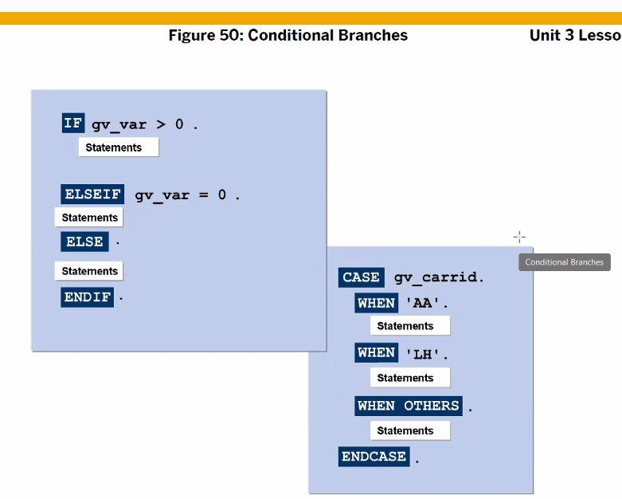
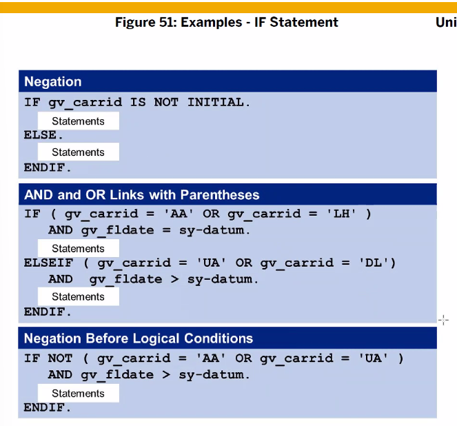
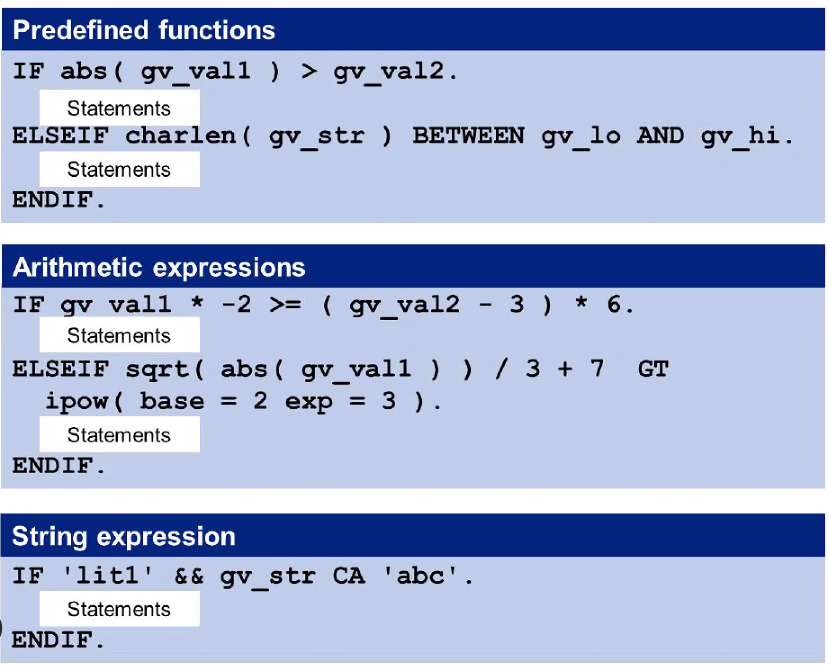

sy-datum : date 현재 날짜
ipow( base =2 exp =3 ) : 2의3승
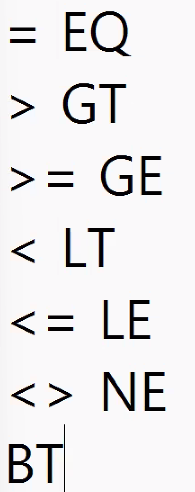

```ABAP
* 변수의 값이 초기값이 아니면
IF gv_carrid IS NOT INITIAL.
ELSE.
ENDIF.

* AND , OR
IF NOT ( a OR b) AND c
```

## 실습

```ABAP
* IF pa_car IS NOT INITIAL.
IF NOT pa_car IS INITIAL.
  WRITE:/ 'IS NOT INITIAL'.
ELSE.
  WRITE:/ 'IS INITIAL'.
ENDIF.

* 또는 이렇게
IF pa_car IS INITIAL.
  WRITE:/ 'IS INITIAL'.
ELSE.
  WRITE:/ 'IS NOT INITIAL'.
ENDIF.

**********************

PARAMETERS: pa_car TYPE s_carr_id.
DATA gv_num TYPE i VALUE 13.

* clear 를 하게되면 default 값은 13이 아니라 INITIAL 값이 된다.

* result : false
* gv_num = 0.
* 을 넣어버리면 true로 
IF gv_num IS INITIAL.
    WRITE:/ 'IS INITIAL'.
ELSE.
  WRITE:/ 'IS NOT INITIAL'.
ENDIF.

* result : true
IF gv_num = 13.
    WRITE:/ 'IS INITIAL'.
ELSE.
  WRITE:/ 'IS NOT INITIAL'.
ENDIF.

* result : true
IF pa_car IS INITIAL.
    WRITE:/ 'IS INITIAL'.
ELSE.
  WRITE:/ 'IS NOT INITIAL'.
ENDIF.
```

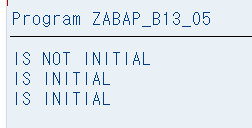

---

# Loop

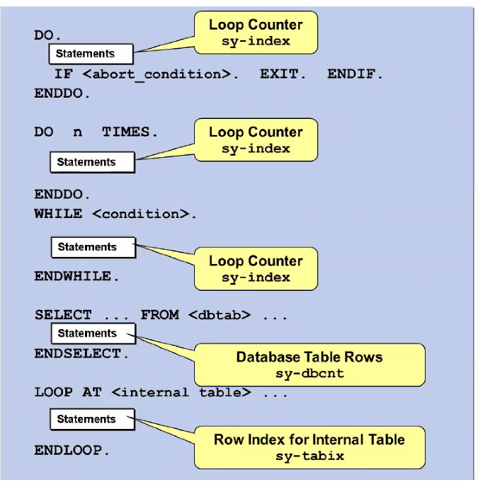

```ABAP
do
exit. endif.
enddo

do n times
enddo

while ()
endwhile

select from
endselect

loop at ()
endloop
```

loop에서 빠져나오는 방법 : Contunue, STOP, CHECK

```ABAP
IF gv_test = 1.
* 이 부분에 CONTINUE, EXIT, STOP, CHECK 등이 올 수 있다.
	CONTINUE. 
ENDIF.
```


## 실습

```ABAP
DATA gv_result TYPE i.
DATA gv_result TYPE i.
DATA gv_result2 TYPE i.
DATA gv_result3 TYPE i.
PARAMETERS: pa_num TYPE i DEFAULT 10.

* 첫번째 방법
* !10
* sy-index는 counter로 통용.
DO.
  gv_result = gv_result + sy-index.

* EXIT 없으면 무한루프
  IF sy-index = 10.
    EXIT.
   ENDIF.

ENDDO.

* 두번째 방법
*DO 10 TIMES.
DO pa_num TIMES.
  gv_result2 = gv_result2 + sy-index.
ENDDO.

* 세번째 방법
WHILE sy-index <= pa_num.
  gv_result3 = gv_result3 + sy-index.
ENDWHILE.

WRITE:/ '1, Result :', gv_result.
WRITE:/ '2, Result :', gv_result2.
WRITE:/ '3, Result :', gv_result3.
```

## 퀴즈 01

```ABAP
TYPES: tv_result TYPE p LENGTH 8 DECIMALS 2.
DATA: gv_result TYPE tv_result.

* pa_typ 에 
* WHERE [컬럼명] IN ('A','B'); 처럼 쓰는게 있는가? -> 없다
  
PARAMETERS: pa_rad TYPE i,
  pa_typ TYPE c LENGTH 1.

* TYPE을 tv_result를 쓸 수는 있으나 값이 너무 크다. 낭비 낭비
* 실수는 ' ' 를 붙여줄것
CONSTANTS gc_pi TYPE p LENGTH 3 DECIMALS 2 VALUE '3.14'.

* ' ' 안에서는 대소문자를 구분한다.
IF ( pa_typ = 'S' ). 
    GV_RESULT = gc_pi * pa_rad ** 2.
    WRITE: '원의 넓이 : ', GV_RESULT LEFT-JUSTIFIED.
ELSEIF ( pa_typ = 'R' ).
  GV_RESULT = 2 * gc_pi * pa_rad.
  WRITE: '원의 둘레 : ', GV_RESULT LEFT-JUSTIFIED.
ELSE.
  WRITE:/ 'R 또는 S를 입력하세요'.
ENDIF.
```

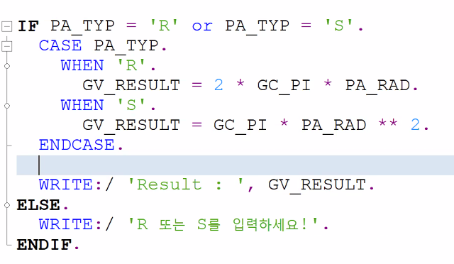


## 퀴즈 02

```ABAP
TYPES: tv_result TYPE p LENGTH 8 DECIMALS 2.
DATA: gv_result TYPE tv_result.

* pa_typ 에 
* WHERE [컬럼명] IN ('A','B'); 처럼 쓰는게 있는가? -> 없다
  
PARAMETERS: pa_rad TYPE i,
  pa_typ TYPE c LENGTH 1.

* TYPE을 tv_result를 쓸 수는 있으나 값이 너무 크다. 낭비 낭비
* 실수는 ' ' 를 붙여줄것
CONSTANTS gc_pi TYPE p LENGTH 3 DECIMALS 2 VALUE '3.14'.

* ' ' 안에서는 대소문자를 구분한다.
IF ( pa_typ = 'S' ). 
    GV_RESULT = gc_pi * pa_rad ** 2.
    WRITE: '원의 넓이 : ', GV_RESULT LEFT-JUSTIFIED.
ELSEIF ( pa_typ = 'R' ).
  GV_RESULT = 2 * gc_pi * pa_rad.
  WRITE: '원의 둘레 : ', GV_RESULT LEFT-JUSTIFIED.
ELSE.
  WRITE:/ 'R 또는 S를 입력하세요'.
ENDIF.
```


## 퀴즈 03

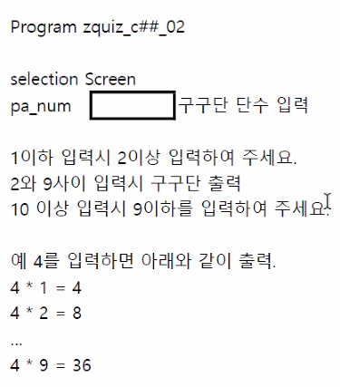

```ABAP
DATA: gv_result TYPE i.
PARAMETERS: pa_num TYPE i.

IF ( pa_num < 2 ).
    WRITE: '2이상의 값을 입력하세요.'.
ELSEIF ( pa_num >= 10 ).
  WRITE: '9이하의 값을  입력하세요.'.
ELSE.
* 9로 하게되면 1~9 까지 돈다. 0부터 시작x
  DO 9 TIMES.
    gv_result = pa_num * sy-index.
  WRITE: pa_num,'*',sy-index,'=',gv_result.
  ENDDO.
ENDIF.
```

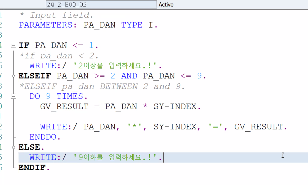

---

# ABAP RETURN CODE

## System Fields

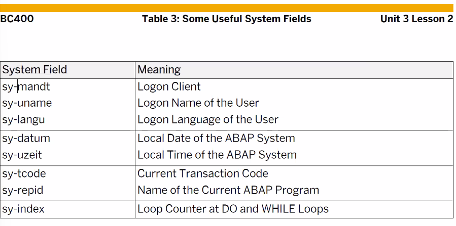

mandt : 로그인할때 사용하는 클라이언트 번호를 리턴 해줌
uname : user name return
langu : user lang. return

### 실습

```ABAP
* 30번째 컬럼에다 데이터를 표시하겠다.
* 정렬 맞추려고 저렇게 한거
WRITE: / 'Client : ', 30 sy-mandt,
          / 'User Name : ', 30 sy-UNAME,
          / 'Language : ', 30 sy-LANGU,
          / 'Date : ', 30 sy-DATUM,
          / 'Time : ', 30 sy-UZEIT,
          / 'Program Name : ', 30 sy-REPID.
```

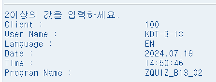

## SY-SUBRC

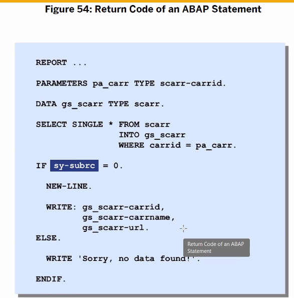

sy-subrc : 정상 실행 되었나를 return, 성공하면 0
select single * from scarr into gs_scarr where carrid...
scarr 테이블에서 'single' 데이터 한건만 가져와라, 데이터가존재하면 0

/ose11

### 실습

```ABAP
* Structure Variable.
DATA : gs_carrier TYPE scarr.

PARAMETERS: pa_car TYPE scarr-carrid.

* Database Table에서 1건의 데이터 Read.
SELECT SINGLE *
  INTO gs_carrier
  FROM scarr
  WHERE carrid = pa_car.

* 0이면 정상적으로 데이터를 읽어온 것이다.
IF sy-subrc = 0.
  WRITE:/ gs_carrier-mandt,
          gs_carrier-carrid,
          gs_carrier-carrname,
          gs_carrier-currcode.
 ELSE.
   WRITE:/'Sorry, Data Not Found!'.
ENDIF.
```

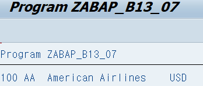

ABAP dic


# Dialog Message

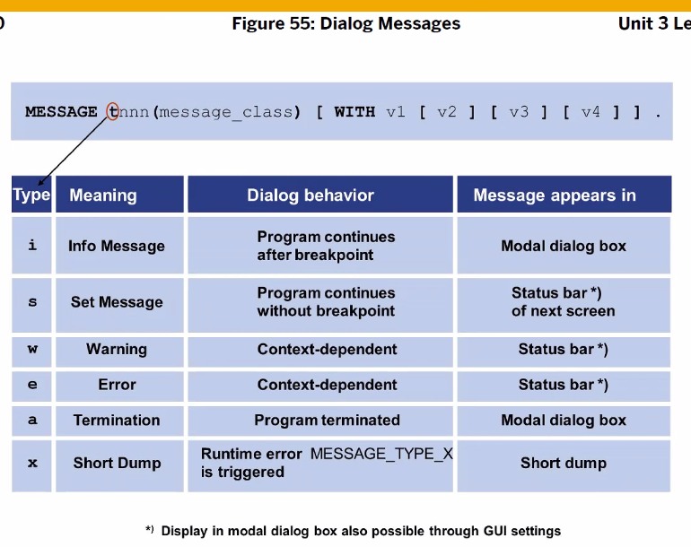
6가지의 타입이 존재

하나의 message_class에는 천개의 메시지 등록 가능
천개에 대한 번호도 존재 (0부터 시작)

with [4개의 valiable 표시 가능]

## 실습

/se80
/se91 에서 생성가능
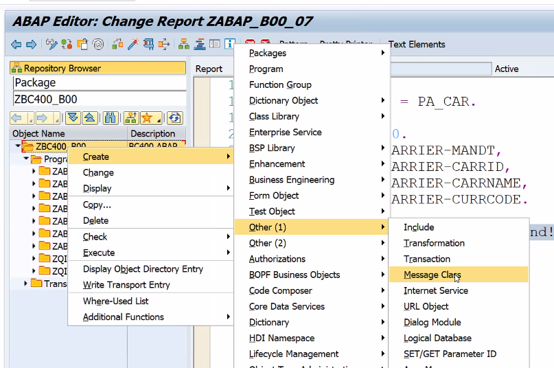
이름 첫글자는 역시 y,z
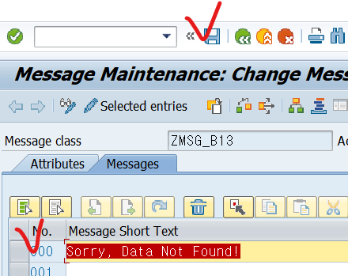

```ABAP
MESSAGE i000(zmsg_b13).
```

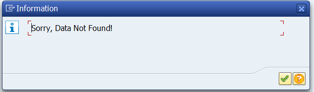

```ABAP
MESSAGE i000(zmsg_b13) WITH pa_car.
```

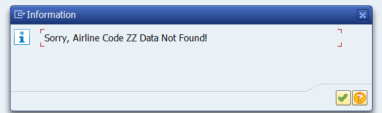
이렇듯 'zz' input에 넣은 값을 메시지 박스에 넣을 수 있다.

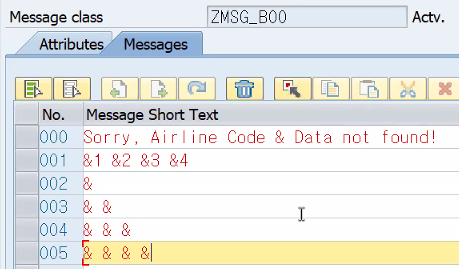

```abap
MESSAGE i001(zmsg_b13) WITH pa_car sy-datum.
```

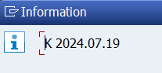
& 기호 한개인 002에 넣을경우 K 하나만 표시

```ABAP
REPORT ZABAP_B13_07 MESSAGE-ID zmsg_b13.
* message_class 생략 가능 (위에 선언해주었기 때문에)
MESSAGE i000 WITH pa_car.

* TYPE 부분에 무조건 대문자를 써줘야 한다.
* 이렇게도 사용이 가능하다. (안 좋은 방법)
MESSAGE 'Sorry, Data Not Found!' TYPE 'I'.
```

---

# 퀴즈 04 / P.97

```ABAP
REPORT ZBC400_13_COMPUTE MESSAGE-ID zmsg_b13.

PARAMETERS: pa_int1 TYPE i,
            pa_int2 TYPE i,
            pa_op TYPE c LENGTH 1.

DATA: gv_result TYPE p LENGTH 16 DECIMALS 2.

CASE pa_op.
  WHEN '+'.
    gv_result = pa_int1 + pa_int2.
  WHEN '-'.
   gv_result = pa_int1 - pa_int2.
  WHEN '*'.
   gv_result = pa_int1 * pa_int2.
  WHEN '/'.
    IF pa_int1 = 0.
      MESSAGE a006.
   gv_result = pa_int1 * pa_int2.
   ENDIF.
  WHEN OTHERS.
    WRITE:'Invalid Operator!'.
ENDCASE.

WRITE:/ 'Result :', gv_result.
```

# 퀴즈 05

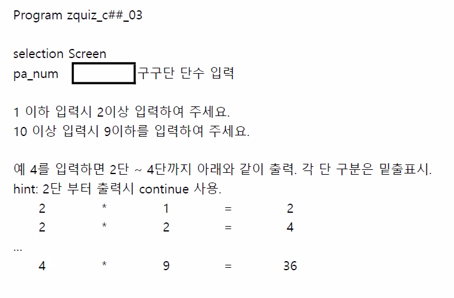

```ABAP
DATA: gv_result TYPE i,
      pa_num2 TYPE i.
PARAMETERS: pa_num TYPE i.

IF ( pa_num < 2 ).
    WRITE: '2이상의 값을 입력하세요.'.
ELSEIF ( pa_num >= 10 ).
  WRITE: '9이하의 값을  입력하세요.'.
ELSE.
  DO pa_num TIMES.
     IF sy-index < 2.
        CONTINUE.
       ENDIF.
      pa_num2 = sy-index.
    DO 9 TIMES.
      gv_result = pa_num2 * sy-index.
      WRITE: pa_num2,'*',sy-index,'=',gv_result.
    ENDDO.
    ULINE.
  ENDDO.
ENDIF.
```

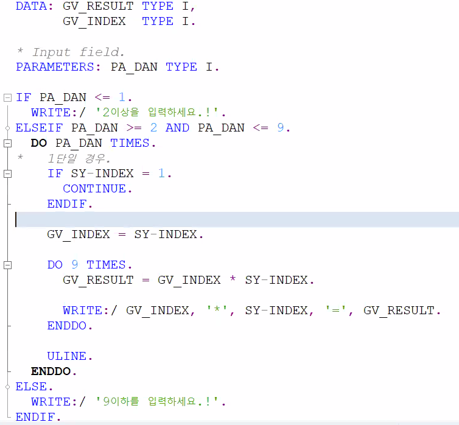
