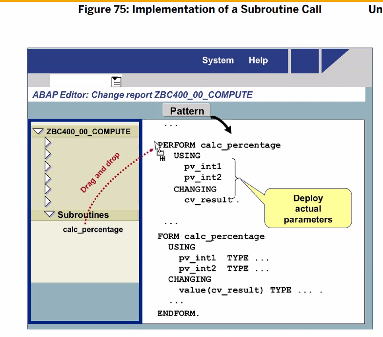

[TOC]

# ABAP debugger

1. 디버거 모드에 들어간다.
   - 구현부에만 break point를 걸 수 있다.
   - Active된 상태에서 커서 두고, Ctrl + Shift + F12
     
   - 혹은 노란색 라인 클릭! 클릭
   - 실행된 프로그램에서 /h 입력
     
     
     실행하게 되면 첫번째 라인을 break point로 잡는다

2. break point 설정 후, F8로 실행하면 이게 뜸
   

3. **디버깅 모드** 안에서 단축키
   F5 : 한 라인 실행
   F8 : 다음 break point로 이동

4. **디버깅 모드** 안에서
   F5 : 한 라인 실행
   F8 : 다음 break point로 이동
   F6 : 한단계씩 이동하며, 서브루틴을 만나면 실행 후 다음 단계로 이동합니다.
   F7 : 현재 실행중인 서브루틴을 빠져나오고 다음 단계로 이동합니다.

5. 변수 더블클릭시 바인딩 된 값 표시
   
   이렇게 값이 옆에 뜬다.

6. 필드 값 Change로 변경 가능

   

7. 모드 안에서도 break point 걸기 가능

# Modularization Techniques in ABAP


- 모듈로 나누어서 유지보수 쉽게 하기 (작은단위로 조각조각)
  - Subroutines
  - Function modules
  - Methods

- 공통으로 사용하는 것만 따로 빼기
  - 쉬운 유지보수
  - 간결한 코드, 가독성 증가
  - 재사용


## Local Program Modularzation (Subroutines)


- Subroutine, local_class 
  그 안에서만 사용 가능, 다른 프로그램이 사용 불가

## Global Modularzation (Function modules)


전역변수들, 프로그램 실행시 Repo에 저장되며, 호출될때 로드된다.


main 프로그램이라해도 각각의 모듈에 있는 데이터를 읽거나 변경할 수 없다. (즉, 캡슐화 되어 있다.)

그럼 어떻게 접근하냐? 메인 프로그램과 모듈끼리 데이터를 주고 받는건
Function modules 에서는 파라미터들을 인터페이스
Method에서는 파라미터들을 시그니처 라고 한다.


EXPORTING :  줄때
IMPORTING : 받을때

Event Block
프로그램이 실행될 때, 사전 정의된 이벤트가 트리거된다면 ABAP 런타임 환경에 의해 호출됨. 이 Processing Block은 특정 Event 키워드를 사용하여 프로그램 내부에서 유지보수됩니다.

Dialog Block
일반적인 Screen이 처리되는 동안, Screen Flow Logic으로부터 ABAP 런타임 환경에 의해 호출됩니다. 이 Processing Block은 MODULE~ENDMODULE 사이의 스크린의 메인 로직에 의해 유지보수되고, Screen Flow Logic에서 MODULE 구문을 사용하여 호출됩니다.

**Subroutines**
프로그램 내부에서 모듈화에 유용한 Processing Block. Subroutine은 프로그램 내부에서 내적으로 혹은 다른 프로그램에서 외부적으로 둘 다 호출될 수 있음에도 불구하고, 주로 한 프로그램 내부에서 재사용성을 위해 사용됩니다. 외부에서 Subroutine을 호출하는 것은 추천하지 않고 피하는 것이 좋습니다.Subroutine은 FORM~ENDFORM 사이에서 유지보수되고 PERFORM 구문을 통해 호출됩니다.


**Function Modules**
이 Procedure는 시스템 전역에서 유지보수되고 어떠한 **다른 프로그램을 통해 호출이 가능**합니다. SE37(Function Builder)을 사용해서 유지보수되고, 해당 T-CODE를 통해 함수를 시스템 중앙에서 관리할 수 있습니다.Funciton Module은 function pool 유형의 프로그램에서 FUNCTION~ENDFUNCTION 구문 사이에서 유지보수되고, CALL FUNCTION 구문을 통해 호출됩니다.Function Module은 Subroutine과 유사하게 작동되지만, Function Module은 **시스템 전역에서 정의**되고 더 찾기 쉽습니다.

**Methods**
ABAP Object안에 클래스의 기능을 포함합니다. Methods들은 클래스에서 정의도고, OOP(object-oriented programming)을 지원합니다.Methods는 METHOD~ENDMETHOD 구문 사이에서 유지보수되며, CALL METHOD 구문을 통해 호출됩니다.클래스는 ABAP 프로그램 안에서 로컬적으로 정의될 수 있고 SE24(Class Builder)을 통해  시스템 전역적으로 정의할 수 있습니다.

---

## Subroutines


```ABAP
* main 프로그램
REPORT ZABAP_B13_08.

* 전역 변수
DATA: gv_int1 TYPE i,
      gv_int2 TYPE i,
      gv_reulst TYPE i.

gv_int1 = 10.
gv_int2 = 3.

* 서브루틴 호출
PERFORM calcu(zabap_b13_08).

* 한줄 삭제 단축키???
WRITE :/'Result : ', gv_reulst.


* 서브루틴
*&---------------------------------------------------------------------*
*& Form calcu
*&---------------------------------------------------------------------*
*& text
*&---------------------------------------------------------------------*
*& -->  p1        text
*& <--  p2        text
*&---------------------------------------------------------------------*
FORM calcu .
*  메인에 있는 변수들을 서브루틴에서 사용하고 있다 (이런식으로 쓰지 마라 전역변수 놉)
* 대신에 인터페이스 파라미터를 정의해서 사용해라 
* 서브루틴 정의할때 파라미터를 같이 정의해서 써 (Fomal Param)
  gv_reulst = gv_int1 + gv_int2.

ENDFORM.
```


PERFORM calcu(). 을 선언한 후,
calcu를 더블클릭 하면 서브루틴 생성 가능

## call by value vs reference


Actual Param(보내는 쪽) 과 Formal Param(받는 쪽)은 1대1로 매개변수 넘겨짐


call by Value : return 없음
call by Value and Result : return이 존재. 
call by Reference : 참조값

SAP에서 Processing Block으로 대표되는 Subroutine, Function Module, Method의 경우에는 전부 Parameter Interface(매개변수를 통해 데이터를 주고받는 방식)으로 구성되어있다. 
여기서 가장 중요한 개념이 Parameter를 넘겨줄 때, 데이터를 어떻게 전달(Pass)시킬 것이냐의 문제이다. 이것에는 두 가지 방식이 있다.

1. Pass by Value

  **값으로 매개변수** 를 전달하면 값에 대한 **새 메모리가 할당**됩니다. 이 메모리는 서브루틴이 호출될 때 할당되고 서브루틴이 반환될 때 해제됩니다. 따라서 매개변수에 대한 참조는 서브루틴 내에서만 알려진 고유한 메모리 영역에 대한 참조입니다. 원래 메모리 위치는 별도입니다.

  Pass by Value는 사전에 언급된 VALUE 라는 addition을 통해 가능해진다. 성능측면에서, Pass by Value는 actual Parameter( 실제 파라미터 : 호출하는 쪽의 파라미터 )의 복사( copy )를 생성하고 소비(사용)을 위해 받는 Pcocessing Block 쪽으로 넘겨주는 것을 의미한다. 결과적으로, Processing Block(Subroutine, Function Module, Method) 안에서 매개변수에 대해 변화를 가져간다 하더라도 오직 그 복사한 값에만 영향을 미치는 것이므로 **실제 actual Parameter에는 혼란을 주지 않는다.**
  Method를 예시로 본다면, Actual Parameter인 x는 해당 Method가 호출된다면 x의 복사본이 만들어 지고 이 x의 **복사본**이 Formal Parameter인 a로 할당될 것이다. 예상할수 있듯이, 이러한 종류의 작업은 대용량 데이터 객체를 처리할 때, 다소 비용(메모리, 시간 등)이 많이 들 수 있다.
  단, Changing Parameter의 경우에는, Pass by Value로 선언되었다고 하더라도, 실제 값을 바꾸겠다는 이유로 선언한 것이 기 때문에 Formal Parameter에 가져온 변화가 Actual Parameter에 영향을 줄 수 있다.

2. Pass by Reference (포인터 주소를 생각해라)

  **참조로 매개변수** 를 전달하면 값에 대해 **새 메모리가 할당되지 않습니다**. 대신 원래 메모리 위치에 대한 포인터가 전달됩니다. 매개변수에 대한 모든 참조는 원래 메모리 위치에 대한 참조입니다. 서브루틴 내의 변수에 대한 변경 사항은 원래 메모리 위치를 즉시 업데이트합니다.

  다른 방식으로 Pass by Reference는 Reference Parameter는 호출될 때 사용되는 Actual Parameter에 대해서 Reference(참조 혹은 Pointer)를 포함한다. 그러므로, Referece Parameter에 대한 변화가 만들어진다면 이것은 실제 Actual Parameter에도 반영이 됩니다. 그림 1을 보면, Parameter b를 보도록 합니다. Method안에서 b에 대해 **값에 변화를 줬다면, 호출되는 프로그램에서의 y에도 마찬가지로 변화가 반영**이 됩니다.
  다만, 이 변화를 가져오는 행동에는 잠재적인 부작용이 있습니다. 값을 바꾸는 행동을 가져가기 때문에 결과가 달라질 수 도 있기 때문이다. 그래서 Method와 같은 경우에는, Importing Parameter로 정의된 것에 대해서는 Method 안에서 reference parameter의 값을 바꾸는 것에 대해 ABAP은 Lock Down을 진행한다. 그렇지만, 이러한 부작용을 제외하고 생각하면, Pass by Reference는 퍼포먼스 측면에서 더 좋다.

런타임동안, Subroutine, Function Module, Method 에서 Parameter(매개변수)가 호출될 때라면, 파라미터를 Pass by Value, Pass by Reference 방식 중 한가지의 방식으로 호출하는 쪽( 호풀하는 프로그램 : Actual Parameter) 과 받는 쪽에 매칭되는 Parameter 를 넘겨줘야 합니다.


```ABAP
* By Value
Data : a type I value 20.
Perform sub1 using a.
Write a.

FORM sub1 using value (p_a)
	P u2013 a = 15
ENDORM.

* 실습 예제
* 서브루틴 호출
PERFORM calcu USING gv_int1	"얘네 다 전역변수였음
                    			gv_int2
                CHANGING gv_reulst.
                
FORM calcu USING VALUE(pv_int1) TYPE i  "call by value
                 VALUE(pv_int2) TYPE i  "call by value
                 CHANGING VALUE(pv_result) TYPE i.  "call by value and result
  pv_result = pv_int1 + pv_int2.
ENDFORM.


* By Reference
Data: a type I value 20.
Perform sub1 using a.
Write a.

FORM sub1 using value (p_a)
	P u2013 a = 15.
ENDORM.

* 실습 예제
FORM calcu CHANGING  pv_int1 TYPE i  "call by value
                  pv_int2 TYPE i  "call by value
                 pv_result TYPE i. "call by reference

  pv_result = pv_int1 + pv_int2.
  pv_int1 = 100.
  pv_int2 = 300.
ENDFORM.
```

call by value  예제


call by reference


# TYPE ANY (지양)


ANY : Generic data type, 모든 타입을 뜻함, 
	근데 이걸 쓰지 말자. 런타임 에러가 농후해진다.


이렇게 type이 다를경우 syntax error가 나는데
Formal Parameter 에 TYPE을 ANY로 바꿀 경우 (모든 타입 == ANY) 정상 실행된다.


## Global vs local Obj

main에서 만든 전역변수는 서브루틴에서 쓸 수 있으나
서브루틴에서 만든 변수는 다른데서 사용불가 즉 로컬변수임 (지역변수)




F4 버튼 누르면 CALCU이 자동입력된다.

이렇게 자동완성 되는걸 볼 수 있다. pv 대신 gv(Actual param)으로 변경해준다.
TODO. 환경설정하는 부분이 있지 않을까??

## 퀴즈 04


```ABAP
DATA gv_result TYPE i.

PARAMETERS: pa_atm TYPE i,
            pa_vat TYPE i.

PERFORM calc_vat(zquiz_b13_04)
  CHANGING pa_atm pa_vat gv_result.

WRITE:/'Result :', pv_result.

*&---------------------------------------------------------------------*
*& Form CALC_VAT
*&---------------------------------------------------------------------*
*& text
*&---------------------------------------------------------------------*
*& -->  p1        text
*& <--  p2        text
*&---------------------------------------------------------------------*
FORM calc_vat CHANGING pv_atm TYPE i
                       pv_vat TYPE i
                       pv_result TYPE i.

pv_result = pa_atm + ( pv_atm * pa_vat / 100 ).

ENDFORM.
```


## 실습 p154

````ABAP
TYPES tv_result TYPE p LENGTH 16 DECIMALS 2.
DATA gv_result TYPE tv_result.

PARAMETERS: pa_int1 TYPE i,
            pa_int2 TYPE i,
            pa_op   TYPE string.

CASE pa_op.
  WHEN '+'.
    gv_result = pa_int1 + pa_int2.
  WHEN '-'.
    gv_result = pa_int1 - pa_int2.
  WHEN '*'.
    gv_result = pa_int1 * pa_int2.
  WHEN '/'.
    IF pa_int1 = 0.
      WRITE: 'No Division by zero!'.
      gv_result = pa_int1 * pa_int2.
    ENDIF.
  WHEN OTHERS.
    PERFORM calc_percentage(zbc400_13_subroutine)
    USING pa_int1 pa_int2
    CHANGING gv_result.
ENDCASE.

WRITE:/ 'Result :', gv_result.

*WRITE:
*&---------------------------------------------------------------------*
*& Form CALC_PERCENTAGE
*&---------------------------------------------------------------------*
*& text
*&---------------------------------------------------------------------*
*& -->  p1        text
*& <--  p2        text
*&---------------------------------------------------------------------*
FORM calc_percentage USING pv_act TYPE i
                           pv_max TYPE i
                      CHANGING cv_result TYPE tv_result.

*  % 계산하고 0과 나눌때는 에러를 뱉어내라
  IF pv_max = 0.
    cv_result = 0.
    WRITE: 'ERROR'.
  ELSE.
    cv_result = pv_act / pv_max * 100.
  ENDIF.


ENDFORM.
````


