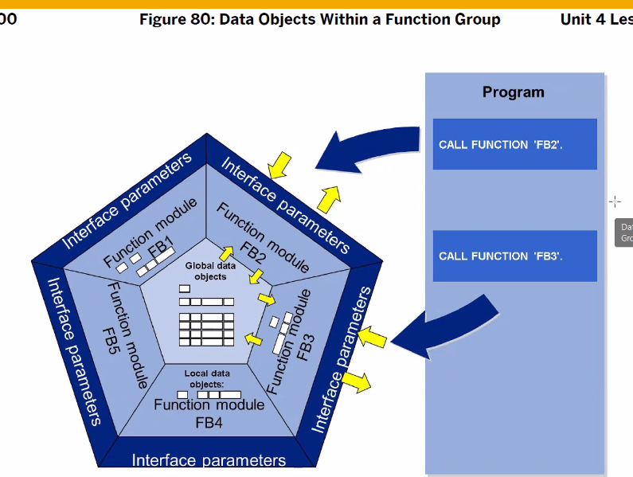
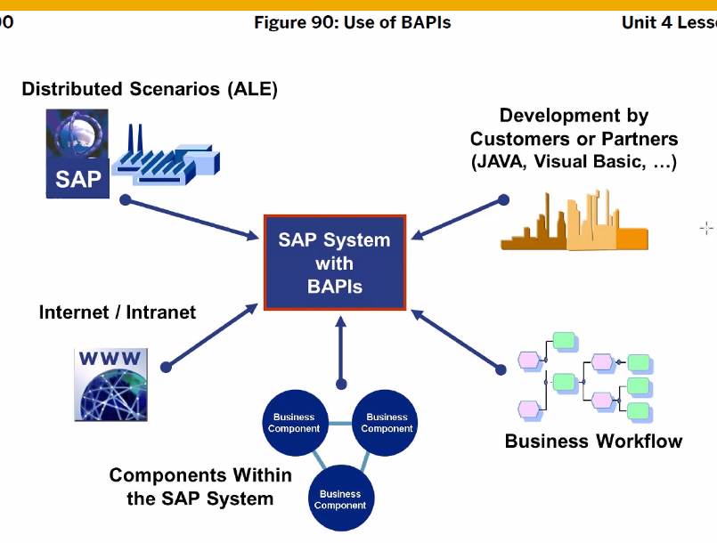
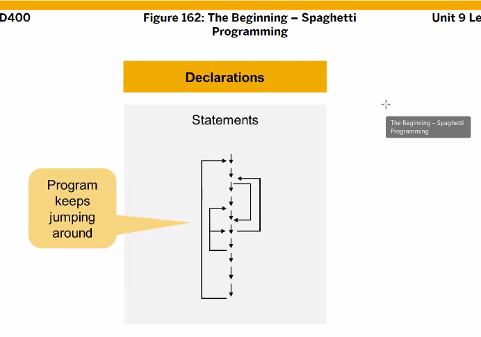
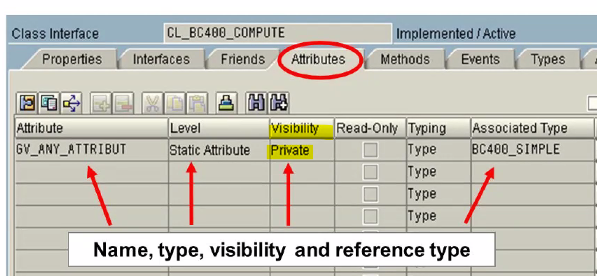

[TOC]

# Function Modules

: se37
: Global 하게 시스템 전체에서 사용하는 함수를 정의
: 시스템 내부나 외부에서 사용이 가능하다 (ABAP 프로그램으로부터 호출)
: 사용자가 직접 실행 불가 대신에 테스트 환경을 제공


데이터를 주고 받기 위한 인터페이스 파라미터가 존재
FG 안에는 글로벌 데이터, 서브루틴, 스크린이 존재
하나의 FG 안에 FM은 20개 정도 만듬 (왜 몇백개 안 만들어? FM 하나 호출시 FG가 전부 로드되기 때문이다.)


FM > Interface > Interface param ( import, export, changing, exception (sy-subrc 사용) ) 이것들은 전부 지역변수라 생각할것



import param은 IV_ 로 시작한다.   export는 EV_


Optional 옵션은 export에 없음 왜? 받은 값을 안 써도 되기 때문에 (호출한 네 맘)


## FM 실습

/nse37


FM 이름은 대문자로


## Exception 실습


exception 발생시 sy-subrc로 넘어가고, power_value_too_high exception 발생시 case에서 1로 넘어감

생성


BC400_MOS_POWER


BC400_MOS_POWER

## 솔루션 179

```ABAP

PARAMETERS: pa_int1 TYPE i,
            pa_int2 TYPE i,
            pa_op TYPE c LENGTH 1.

DATA: gv_result TYPE p LENGTH 16 DECIMALS 2.

CASE pa_op.
  WHEN '+'.
    gv_result = pa_int1 + pa_int2.
  WHEN '-'.
   gv_result = pa_int1 - pa_int2.
  WHEN '*'.
   gv_result = pa_int1 * pa_int2.
  WHEN '/'.
    IF pa_int1 = 0.
      WRITE: 'No Division by zero!'.
   gv_result = pa_int1 * pa_int2.
   ENDIF.
  WHEN 'P'.
        CALL FUNCTION 'BC400_MOS_POWER'
      EXPORTING
        iv_base = pa_int1
       IV_POWER = pa_int2
     IMPORTING
       EV_RESULT = gv_result
     EXCEPTIONS
       POWER_VALUE_TOO_HIGH        = 1
       RESULT_VALUE_TOO_HIGH       = 2
       OTHERS  = 3.
    CASE sy-subrc.
      WHEN 0.
        WRITE: gv_result.
      WHEN 1.
        WRITE: 'Power Value max 4'.
      WHEN 2.
        WRITE: 'Unknown Error'.
    ENDCASE.
* % 로 서브루틴 만드는거 다시 해볼것 (헤맨다)
  WHEN OTHERS.
    WRITE:'Invalid Operator!'.
ENDCASE.

WRITE:/ 'Result :', gv_result.
```

## Function Group 생성

: 이름은 z,y로 시작한다

이미 생성된 그룹에서 function module 생성하기


여기서 코드를 작성하도록 한다

## FG 생성 실습


fg 생성시 includes에 파일 두개가 생성되며 active된 상태여야 정상이다.
B13TOP 파일에 쓰여지는 것들은 Global Data Object 이라 어디서든 쓸 수 있다.
B13UXX에는 Fuction Module을 만들어준다

`


## 퀴즈


```ABAP
```


# BAPIs


바피는 SPA 뿐 아니라 외부에서도 사용 가능




분산환경시스템으로 구축 됨, 다른 언어로 사용 가능.


BAPI_ 로 시작하며
Function Module로 되어 있다

t-code : /nbapi


데이터 수정시 쿼리문 아니고 SAP 메소드를 사용해야만 한다.
문제가 생긴 지점부터 가서 순차적으로 해결


바피 Function Group은 Nomal Function Group와 달리 스크린과 exception을 생성할 수 없다. 대신 return을 통해 해결해준다.

여기에서 사용하는 data type은 전부 글로벌 타입이며 bapi로 시작된다.


다른 시스템에서도 사용이 가능한 function module 이기에 reference로 사용이 불가능하다. 

----

# Global class




OOP (붕어빵)




public 과 private의 차이는 알고 (접근 권한)

/se24 (class builder) 여기서 class 생성
이름 : zcl_ 또는 ycl_ 로 생성


이미 있는 exception class들이 존재한다. 위에처럼 검색해서 사용 혹은 직접 만들어서 사용


FM을 다 만들고 나면 Test를 진행해줘야 한다.


## 실습

/ose24


display로 들어가서 소스보기까지 싹 들어가면 저게 뜨고
소스코드 안에서의 변수를 보고 싶다면 시그니처 버튼을 누르자

F8


### Method Test


입력 후 F8


Static method 호출하는 방법


WRITE 구문 대신 Dialog 를 사용하도록 하자. WRITE는 잘 안 써.

## Class - instances


- class 는 static / instance 로 나뉘어 진다. (나중에..)

- 위에 실습 예제 : 

  static -> call method 클래스 이름 => 메소드 이름 exporting, importing

- 지금 위에 사진 : (?? TODO.)

  instance -> class로 object를 생성. 이 obj를 가르킬 수 있는 변수 (reference variable === address variable) 가 필요하다.
  reference variable은 DATA 변수이름a TYPE REF TO 클래스 이름. 으로 선언한다.
  myClass 를 이용해 여러개의 obj를 생성할 수 있다. obj 생성은 create obj를 사용한다. create obj를 이용해 ref 변수에 방향을 설정할 수 있다. (원하는 클래스에 화살표)
  메소드를 호출할때 call method ref v이름 -> 메소드 이름 이렇게 한다.

계란 ? 이미지 설명

> meth1은 public이라는 뜻 (달걀껍질)
> meth2는 private 이라는 뜻 (노른자)

## 실습 205

```ABAP
 WHEN 'P'.
    TRY.
        CALL METHOD cl_bc400_compute=>get_power
          EXPORTING
            iv_base   = pa_int1
            iv_power  = pa_int2
          IMPORTING
            ev_result = gv_result.
      CATCH cx_bc400_power_too_high.
        WRITE:/'Error : power_too_high'.
      CATCH cx_bc400_result_too_high.
        WRITE:/'Error : result_too_high'.
    ENDTRY.
    WRITE: / 'Result :', gv_result.
```


