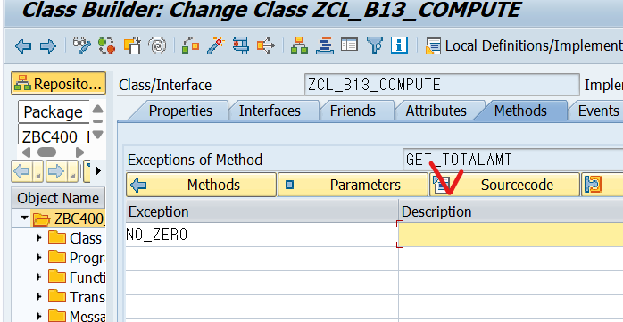

[TOC]

# Global Class


ycl , zcl , 클래스 빌더에서 생성되어 모든 프로그램에서 사용


static, instance 와 글로벌이니까 public

## 클래스 생성 실습


method, param, exection , source code 작성




```abap
  METHOD get_totalamt.
    IF iv_amt = 0.
      ev_total = 0.
      RAISE no_zero.
    ELSE.
      ev_total = iv_amt + iv_amt * iv_vat / 100.
    ENDIF.
  ENDMETHOD.
````

시그니처 버튼을 눌러서 전체 요약처럼 볼 수 있음


# Local Class

: 해당 프로그램에서만 사용, 지역변수


difinition은 정의하고 local 은 lcl_ 로 시작 public --> private 순으로 정의 중요


# Complex Data Object


배열 변수 == Internal Table 

**data object**

> 변수의 종류 = elementary  variable, structure variable, internal table
> standard type 과 아밥 사전에 type들로 변수를 선언하면 elementary variable라 한다.
> 아밥 프로그램에 structure 타입을 가지고 변수를 선언하면 structure variable이라하고
> 아밥 사전에 table type 가지고 변수선언시 internal table이라 한다.

/ose11


local structure 타입은 ts_ 시작
gs_flig..는 다섯개의 컴포넌트가 존재한다 (carrid, connid...)


```ABAP
* Local Structure data type.
TYPES: BEGIN OF TS_FLIGHT,
         CARRID   TYPE S_CARR_ID,
         CARRNAME TYPE S_CARRNAME,
         CONNID   TYPE S_CONN_ID,
         FLDATE   TYPE S_DATE,
         SEATSMAX TYPE S_SEATSMAX,
         SEATSOCC TYPE S_SEATSOCC,
       END OF TS_FLIGHT.

* Structure variable.
DATA: GS_CARRIER TYPE BC400_S_CARRIER,
      GS_FLIGHT  TYPE TS_FLIGHT.

* Structure variable component에 데이터 할당.
GS_CARRIER-CARRID = 'LH'.

* Global class method 호출.
TRY.
    CALL METHOD CL_BC400_FLIGHTMODEL=>GET_CARRIER
      EXPORTING
        IV_CARRID  = GS_CARRIER-CARRID
      IMPORTING
        ES_CARRIER = GS_CARRIER.

*    WRITE:/ GS_CARRIER-CARRID,
*            GS_CARRIER-CARRNAME,
*            GS_CARRIER-CURRCODE,
*            GS_CARRIER-URL.

    WRITE:/ GS_CARRIER.

    MOVE-CORRESPONDING GS_CARRIER TO GS_FLIGHT.
    ULINE.
    WRITE:/ GS_FLIGHT-CARRID,
            GS_FLIGHT-CARRNAME,
            GS_FLIGHT-CONNID,
            GS_FLIGHT-FLDATE,
            GS_FLIGHT-SEATSMAX,
            GS_FLIGHT-SEATSOCC.

  CATCH CX_BC400_NO_DATA.
  CATCH CX_BC400_NO_AUTH.
ENDTRY.
```


같은 이름을 가진 컴포넌트면 대입!
구조가 다른 애들끼리 매칭시키려 할때 사용


디버깅 모드임

charlike (CHAR(C), D, T, CUKY(화폐단위)) type으로 되어 있으면 아래 방법 처럼 쓸 수 있다. String, XString은 charlike이 아니다.


# Internal Tables

크기가 가변인 변수이다. 여러개의 데이터 처리 , 한개의 데이터 처리는 structure
max size 시스템마다 다르다.


행과 열로 구성되기에 열의 갯수와 이름 결정하는게 line type (=structure type)
배열이지만 pk가 존재한다. 
테이블의 종류는 세가지 (standard, sorted, hashed)
index는 0번 아니고 1번부터 시작한다.


key non-unique???? 중복 허용하기에
hash table은 중복 허용 x, sorted는 key access를 주로 씀
TODO. 분명 이런 제약이 있는 이유가 있을건데?


Structure type은 배열 형태인데 이것을 가지고 internal table를 선언한다.
TYPE TABLE OF

## 실습 /ose11


Internal table 선언하는 세가지 방법


3번 타입은 디폴트가 standard table로 설정되고 non-unique로 설정
키는 논??된 타입의 컴포넌트가 키로 설정된다???

위와 같이 SAPLANE의 KEY 필드는 MANDT와 PLANETYPE이다.

```ABAP
TYPES : 
TY_PLANETYPES TYPE STANDARD TABLE OF SAPLANE WITH NON-UNIQUE KEY PLANETYPE.

DATA : GT_PLANETYPES TYPE TY_PLANETYPES.

READ TABLE GT_PLANETYPES
          INTO LS_PLANETYPE
          WITH KEY PLANETYPE = IV_TYPE
          WITH TABLE KEY PLANETYPE = IV_TYPE
```

위 방식은 KEY 값 하나로만 매칭 시키기 위한 방법이다.
WITH **TABLE** KEY

아래 방식은 Default key를 사용하는 방식이다.
WITH KEY

```ABAP
DATA : GT_PLANETYPES  TYPE TABLE OF SAPLANE.

 READ TABLE GT_PLANETYPES
          INTO LS_PLANETYPE
          WITH KEY PLANETYPE = IV_TYPE
          TRANSPORTING WEIGHT TANKCAP.
```


