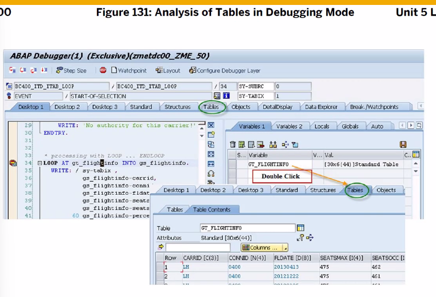
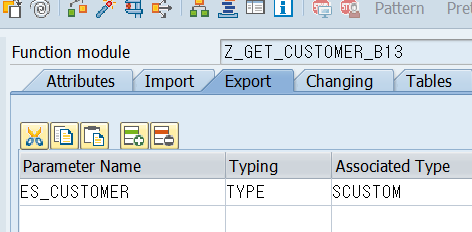

[TOC]

# Intenal Table


- Append = 제일 뒤에 한건의 데이터 추가 // work area == structure
- Insert = 조건문 걸어서 원하는 위치에 삽입 가능
- Read = 한건의 데이터 읽어오기
- Change
- Delete

## 실습


### Append

```ABAP
* Internal Table & work area.
DATA: GT_FLIGHTS TYPE BC400_T_FLIGHTS,
      GS_FLIGHT  TYPE BC400_S_FLIGHT.

* work area에 값 할당
GS_FLIGHT-CARRID = 'A'.
GS_FLIGHT-CONNID = '0017'.
GS_FLIGHT-FLDATE = '20240701'.
GS_FLIGHT-SEATSMAX = 350.
GS_FLIGHT-SEATSOCC = 266.
GS_FLIGHT-PERCENTAGE = GS_FLIGHT-SEATSOCC / GS_FLIGHT-SEATSMAX * 100.

* 1건의 데이터 internal table에 추가하기
APPEND GS_FLIGHT TO GT_FLIGHTS.

* work area에 값 할당
GS_FLIGHT-CARRID = 'B'.
GS_FLIGHT-CONNID = '055'.
GS_FLIGHT-FLDATE = '20240705'.
GS_FLIGHT-SEATSMAX = 350.
GS_FLIGHT-SEATSOCC = 300.
GS_FLIGHT-PERCENTAGE = GS_FLIGHT-SEATSOCC / GS_FLIGHT-SEATSMAX * 100.

* 1건의 데이터 internal table에 추가하기
APPEND GS_FLIGHT TO GT_FLIGHTS.

CL_DEMO_OUTPUT=>DISPLAY( GT_FLIGHTS ).
```

### Insert


```ABAP
* work area에 값 할당
GS_FLIGHT-CARRID = 'C'.
GS_FLIGHT-CONNID = '0017'.
GS_FLIGHT-FLDATE = '20240701'.
GS_FLIGHT-SEATSMAX = 350.
GS_FLIGHT-SEATSOCC = 266.
GS_FLIGHT-PERCENTAGE = GS_FLIGHT-SEATSOCC / GS_FLIGHT-SEATSMAX * 100.

* 1건의 데이터 마지막에 추가됨
INSERT GS_FLIGHT INTO TABLE GT_FLIGHTS.

* work area에 값 할당
GS_FLIGHT-CARRID = 'D'.
GS_FLIGHT-CONNID = '0017'.
GS_FLIGHT-FLDATE = '20240701'.
GS_FLIGHT-SEATSMAX = 350.
GS_FLIGHT-SEATSOCC = 266.
GS_FLIGHT-PERCENTAGE = GS_FLIGHT-SEATSOCC / GS_FLIGHT-SEATSMAX * 100.

* 1건의 데이터 조건 설정해서 1행에 삽입
INSERT GS_FLIGHT INTO GT_FLIGHTS INDEX 1.
```

### Read

[도움1](https://stepwith.tistory.com/entry/SAP-ABAP-%EA%B0%95%EC%A2%8C-21-Internal-Table-%ED%99%9C%EC%9A%A92-READ-LOOP)

```ABAP
* READ TABLE 은 한건의 데이터만 읽어온다. 여러건 읽으려면 LOOP 쓰자
* 1건의 데이터 읽어오기
READ TABLE GT_FLIGHTS INTO GS_FLIGHT INDEX 3.

* CL_DEMO_OUTPUT=>DISPLAY( GT_FLIGHTS ).
CL_DEMO_OUTPUT=>DISPLAY( GS_FLIGHT ).
```


pk를 확인한 후 key access를 해주도록 한다.

```ABAP
* key access , key가 3개라서 3개 다 써줘야한다.
READ TABLE GT_FLIGHTS INTO GS_FLIGHT
  WITH TABLE KEY CARRID = 'D'
                 CONNID = '0017'
                 FLDATE = '20240701'.
```

만약 조건에 맞는 데이터가 없다면? sy-subrc 를 이용해서 0인지 아닌지 확인해보자

```ABAP
* 1건의 데이터 조건 설정해서 1행에 삽입
INSERT GS_FLIGHT INTO GT_FLIGHTS INDEX 1.

* 0이면 조건에 맞는 데이터가 없다.
IF sy-subrc <> 0.
ENDIF.

* 1건의 데이터 읽어오기 index access
*READ TABLE GT_FLIGHTS INTO GS_FLIGHT INDEX 3.

* key access , key가 3개라서 3개 다 써줘야한다.
* 한건의 데이터만 읽어오는데 우선순위는 INDEX 순서이다.
READ TABLE GT_FLIGHTS INTO GS_FLIGHT
  WITH TABLE KEY CARRID = 'bb'
                 CONNID = '8'
                 FLDATE = '20240701'.

* 0이면 조건에 맞는 데이터가 없다.
IF sy-subrc <> 0.
ENDIF.
```

저렇게 key를 여러개 써줘야 한다고? 아니  WITH TABLE KEY  말고 WITH KEY@
```ABAP
READ TABLE GT_FLIGHTS INTO GS_FLIGHT
  " WITH TABLE KEY CARRID = 'bb'
  WITH KEY CARRID = 'A'.
```

### Change

```ABAP
* 원하는 데이터 수정
GS_FLIGHT-SEATSOCC = 999.
GS_FLIGHT-PERCENTAGE = GS_FLIGHT-SEATSOCC / GS_FLIGHT-SEATSMAX * 100.

* 한건 조회 후 수정 작업 진행하기
*MODIFY TABLE GT_FLIGHTS FROM GS_FLIGHT.

*MODIFY GT_FLIGHTS FROM GS_FLIGHT INDEX 2.

* table에 index 값 반환
MODIFY GT_FLIGHTS FROM GS_FLIGHT INDEX SY-TABIX.
```

### Delete

```ABAP
DELETE GT_FLIGHTS INDEX 3.

DELETE GT_FLIGHTS 
  WHERE CARRID = 'A'
  AND CONNID = '055'
  AND FLDATE = '20240705'.
  
* 조건 구문에 따라 한건 혹은 여러개의 데이터 삭제 가능
DELETE GT_FLIGHTS
	WHERE CARRID = 'AA'.
```

## LOOP AT ~ (Internal Table만) ENDLOOP


```ABAP
LOOP AT GT_FLIGHTS INTO GS_FLIGHT.
  WRITE: / SY-TABIX,
  GS_FLIGHT-CARRID,
  GS_FLIGHT-CONNID,
  GS_FLIGHT-FLDATE,
  GS_FLIGHT-SEATSMAX,
  GS_FLIGHT-SEATSOCC,
  GS_FLIGHT-PERCENTAGE, '%'.
ENDLOOP.
```


```ABAP
LOOP AT GT_FLIGHTS INTO GS_FLIGHT FROM 2 TO 4.

* 또는 첫번째부터 3번째까지
LOOP AT GT_FLIGHTS INTO GS_FLIGHT TO 3.

* 또는 3번째부터 마지막까지
LOOP AT GT_FLIGHTS INTO GS_FLIGHT FROM 3.

* WHERE 이용해 조건문 가능
LOOP AT GT_FLIGHTS INTO GS_FLIGHT WHERE carrid = 'AA' 

* OR
LOOP AT GT_FLIGHTS INTO GS_FLIGHT WHERE CARRID = 'AA' OR CARRID = 'LH'.

* AND
LOOP AT GT_FLIGHTS INTO GS_FLIGHT WHERE CARRID = 'AA' AND CARRID = 'LH'.
```


[참조링크1](https://m.blog.naver.com/softwon1/221838105541)

LIKE LINE OF : LIKE 다음은 변수 이름인데 LINE OF Internal table이 온 것은??

Internal Table(=IT)은 임시적인 성격을 띄고 있다. (실제 DBMS에서 사용되는 테이블은 TRANSPARENT TABLE라고 부른다.)

IT는 그 자체를 가지고 데이터를 핸들링할 수 없다. 이 데이터들을 핸들링하기 위해서는 TABLE은 Structure로 담아서 핸들링해줘야 한다.

좀 더 깊게 들어가면 IT는 Header를 통해 CURD를 할 수 있는데
Header라는 것은 테이블의 레코드와 동일한 Size와 Type을 가지는 것으로 Structure와 같습니다

> 책 'SS'를 찾아다 'SS가 무엇인가?' 를 조회하고 싶다

책장안에 수많은 책들을 IT라 비유하면 수많은 책 중에 'SS'를 선택해야 한다. 
이 SS를 선택하는게 ss를 선택하려면 이를 가방에 담아줘야지 LIKE LINE OF Structure.
이를 통해 READ 를 이용한다.

TYPE은 실행 후에 메모리를 할당하는 반면, LIKE는 즉시 메모리를 할당합니다.

LIKE LINE OF 변수(Internal table 변수 이름) 는 , 데이터 라인 한줄과 같게 만들어라
라인 형태로 바꿔


LIKE로 시작하면 다음엔 변수이름이 오고, TYPE은 데이터 타입이 온다.

### TYPE과 LIKE의 차이

TYPE과 LIKE의 차이는 Data Object 선언시 TYPE 또는 LIKE 뒤에
**Data Object와 Data Type 중 어느 것을 reference 하는지 차이**라고 볼 수 있다.

**• Data Object : 실제 메모리 공간에 할당된 존재. **
**• Data Type : 메모리 공간을 차지하지 않고 Data Object를 정의하기 위한 하나의 템플릿.**

구문의 뜻으로 보면 TYPE 뒤에는 Data Type이 오고,
ABAP Dictionary에 Structure Type / Table / Classic View 가 이에 해당한다.

SAP 에서 과거에는 사용가능하도록 만들어 놓았지만 SAP ABAP도 버전업이 되면서 
LIKE는 Data Object인 경우에만 사용하라고 권고 하고 있다.

추가로 CLASS 같은 OO(Objected-Oriented) 개념에서는 TYPE만 사용 가능하다.

정리하자면, 
TYPE은 뒤에 Data Type을 reference 할 때 사용
LIKE는 뒤에 Data Object를 reference 할 때 사용


## MOVE-CORRECPONDING


Component 이름을 가지고 테이블1 과 테이블2의 매칭을 시작한다.

## Sort


디폴트 : ASC
주로 Clear 많이 사용



[설명링크](https://stepwith.tistory.com/entry/SAP-ABAP-%EA%B0%95%EC%A2%8C-19-%EB%B3%80%EC%88%98-%EC%84%A0%EC%96%B8-%EB%B0%8F-Internal-Table)

왼쪽은 이름이 두개 변수 두개 (gs(1차원 배열), itab(2차원 배열))
오른쪽은 with header line 으로 인해 itab이라는 이름으로 변수 두개 사용가능 
(가시성이 없으니 쓰지말자..복잡하네)
insert itab index n. (insert itab into itab index n 생략)

데이터 삭제
clear itab. (header lin itab 즉 1차원 배열만 삭제된다. 아래에 2차원 배열인 internal table까지 삭제하려면??? clear itab[ ])

## Occurs

Occurs 0 은 완전 초기화
Occurs 50은 데이터 50건만 남겨놔
되도록이면 쓰지말자

## 테이블 사용? 컬럼들??


더블클릭


## 실습 273

```abap
DATA: GT_CONNECTIONS TYPE BC400_T_CONNECTIONs,
      GS_CONNECTION  TYPE BC400_S_CONNECTION.

TRY.
    CALL METHOD CL_BC400_FLIGHTMODEL=>GET_CONNECTIONS
      IMPORTING
        ET_CONNECTIONS = GT_CONNECTIONS.
    .
  CATCH CX_BC400_NO_DATA.
    WRITE: / 'Error'.
ENDTRY.

SORT GT_CONNECTIONS ASCENDING BY DEPTIME.

LOOP AT GT_CONNECTIONS INTO GS_CONNECTION.
  WRITE: /
      Gs_CONNECTION-CARRID,
      Gs_CONNECTION-CONNID,
      Gs_CONNECTION-CITYFROM,
      Gs_CONNECTION-AIRPFROM,
      Gs_CONNECTION-CITYTO,
      Gs_CONNECTION-AIRPTO,
      Gs_CONNECTION-FLTIME,
      Gs_CONNECTION-DEPTIME,
      Gs_CONNECTION-ARRtiME.
ENDLOOP.
```


Optional 은 null 허용한다는 의미?

## Internal Table Definition

Internal table 선언하는 방법
인터널 테이블은 INITIAL SIZE 구문으로 테이블 크기만 선언할 뿐 메모리에 Load 하지 않는다. 따라서 INSERT 또는 APPEND 구문을 사용해서 Line이 추가될 때마다 메모리에 Load 한다.

```ABAP
* 1. internal table - table type.
DATA: GT_TAB1 TYPE BC400_T_CONNECTIONS.

*--------------------------------------------------------------------*

* 2. internal table - local table type.
* local table type.
TYPES: TT_DATA TYPE STANDARD TABLE OF BC400_S_CONNECTION
        WITH NON-UNIQUE KEY CARRID CONNID.

DATA: GT_ITAB3 TYPE TT_DATA.

*--------------------------------------------------------------------*

* 3. internal table - global structure type.
DATA: GT_ITAB TYPE STANDARD TABLE OF BC400_S_CONNECTION
      WITH NON-UNIQUE KEY CARRID CONNID.

*--------------------------------------------------------------------*

* 4. internal table - local structure type.
* local structure type.
TYPES: BEGIN OF TS_DATA,
         CARRID   TYPE  S_CARR_ID,
         CONNID   TYPE  S_CONN_ID,
         CITYFROM TYPE  S_FROM_CIT,
         AIRPFROM TYPE  S_FROMAIRP,
         CITYTO   TYPE  S_TO_CITY,
         AIRPTO   TYPE  S_TOAIRP,
         FLTIME   TYPE  S_FLTIME,
         DEPTIME  TYPE  S_DEP_TIME,
         ARRTIME  TYPE  S_ARR_TIME,
       END OF TS_DATA.

DATA: GT_ITAB4 TYPE STANDARD TABLE OF TS_DATA
        WITH NON-UNIQUE KEY CARRID CONNID.
```

# Data Modeling


DBMS로 접속하지 못하고 ABAP Dictionary에 접속해서 한다.


# Transparent Table


아밥 사전에서 transparent table을 생성 (필드도 같이 정의 아밥 사전에 data type사용. element type) 후 active를 해야만 테이블이 생성된다.

2level 이라 한다 (element, 도메인) 
도메인을 수정시 element들 전부 같이 변경됨

하나의 도메인은 여러 Data Element (필드의 의미) 사용 가능


abap dictionary에서 transparent table생성 (db에서의 스크립트 같은거)
active
db에 테이블 생성됩니다.

transparent table 은 structure type임을 기억

# OPEN SQL


우리는 Open SQL을 사용하도록 한다.


여기도 DML, DCL, DDL 이 있네
SELECT * FROM 테이블명 INTO (조회한 데이터 담을 바구니, 변수이름) WHERE (조건문)
GROUP BY HAVING 가능


**한건의 데이터**를 읽어오는 방법 : 

> SELECT SINGLE **INTO** Structure variable WHERE

## 실습




```ABAP
FUNCTION Z_GET_CUSTOMER_B13.

  SELECT SINGLE *
    INTO ES_CUSTOMER
    FROM SCUSTOM
    WHERE ID = IV_ID.

*    <> not equal
  IF SY-SUBRC <> 0.
    RAISE NO_DATA.
  ENDIF.

ENDFUNCTION.
```

읽어온 데이터 할당하는 방법, SLINGLE 이후에 컬럼들과 INTO 바구니의 컬럼들의 순서가 **1대1**로 서로 맞아야 한다. 아니면 에러 남. 하지만 데이터 타입이 서로 같다면 나올 수 있다. BUT 타입이 호환되어 값이 나올수는 있으나 오류임. SIZE가 달라지므로 CUT된다. 아니 그러면 어떻게 써야하나???? INTO **CORRESPONDING FIELDS OF** 을 써주자!


ls_flight는 스트럭처 데이터인데 , 이것을 into 로! 바구니로 써서 데이터 조회한거 담아온다.


## 실습 309

```ABAP
  SELECT SINGLE CARRID
    INTO ES_CONNECTION
    FROM SPFLI
    WHERE CARRID = IV_CARRID
          AND CONNID = IV_CONNID.

*    <> not equal
  IF SY-SUBRC <> 0.
    RAISE NO_DATA.
  ENDIF.
```

## 테이블 안에 데이터 보는 방법

/ose11


여기서 F8 눌러야 데이터들 볼 수 있음


