[TOC]

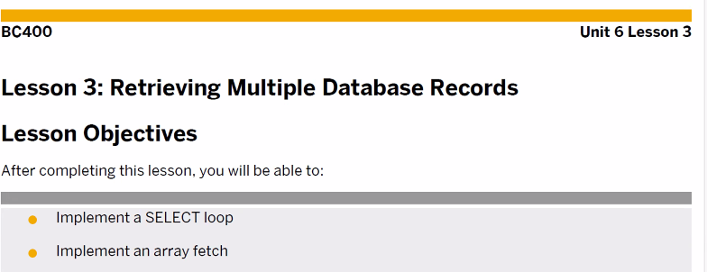

# Select endselect

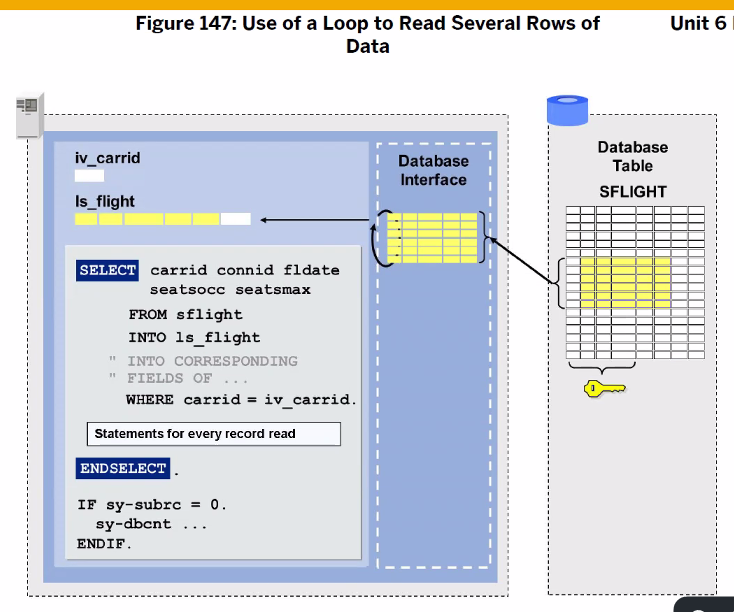
여러건의 데이터를 **하나씩 처리**하기 위해 select endselect 사용
sy-dbcnt를 이용해 조회된 데이터 건수 확인 가능

> INTO Structure variable

## 실습

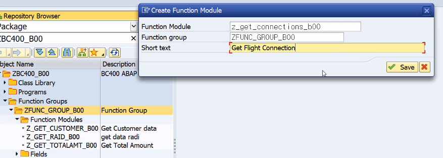
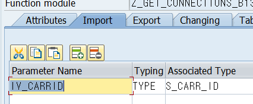
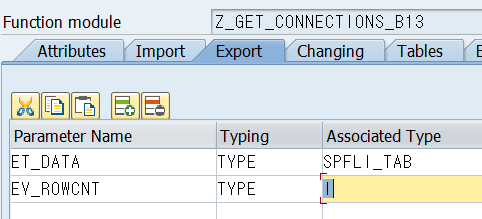
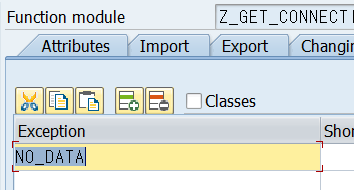

```ABAP
  DATA: LS_SPFLI TYPE SPFLI.

  SELECT *
    INTO CORRESPONDING FIELDS OF LS_SPFLI
    FROM SPFLI
    WHERE CARRID = IV_CARRID.
    APPEND LS_SPFLI TO ET_DATA.
  ENDSELECT.

  IF SY-SUBRC <> 0.
    RAISE NO_DATA.
  ELSE.
    EV_ROWCNT = SY-DBCNT.
  ENDIF.
```

F8로 실행, AZ 입력 후 F8
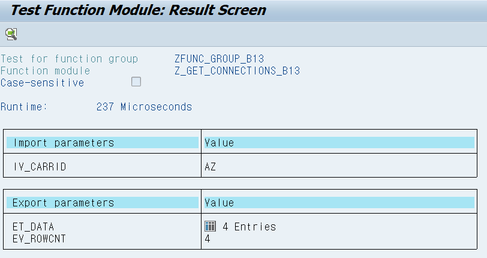

## 실습 317

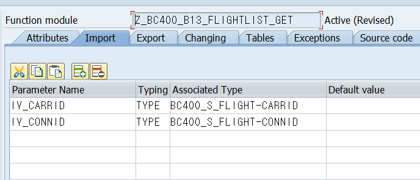
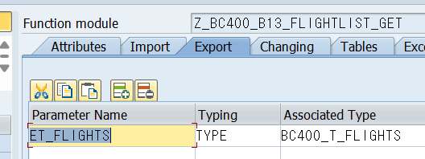
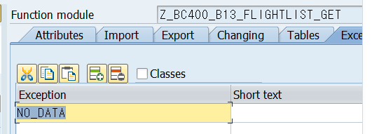

```ABAP
* Structure 타입을 이용해 TABLE 데이터 한건 담기 위함.
  DATA: LS_FLIGHT TYPE BC400_S_FLIGHT.

* 테이블을 위에서 선언한
  SELECT CARRID CONNID FLDATE SEATSMAX SEATSOCC
    FROM SFLIGHT
    INTO LS_FLIGHT
    WHERE CARRID = IV_CARRID
    AND CONNID = IV_CONNID.
    LS_FLIGHT-PERCENTAGE = LS_FLIGHT-SEATSOCC / LS_FLIGHT-SEATSMAX * 100.
    APPEND LS_FLIGHT TO ET_FLIGHTS.
  ENDSELECT.

  IF SY-SUBRC <> 0.
    RAISE NO_DATA.
  ELSE.
    SORT ET_FLIGHTS BY PERCENTAGE DESCENDING.
  ENDIF.
```

# Array Fetch

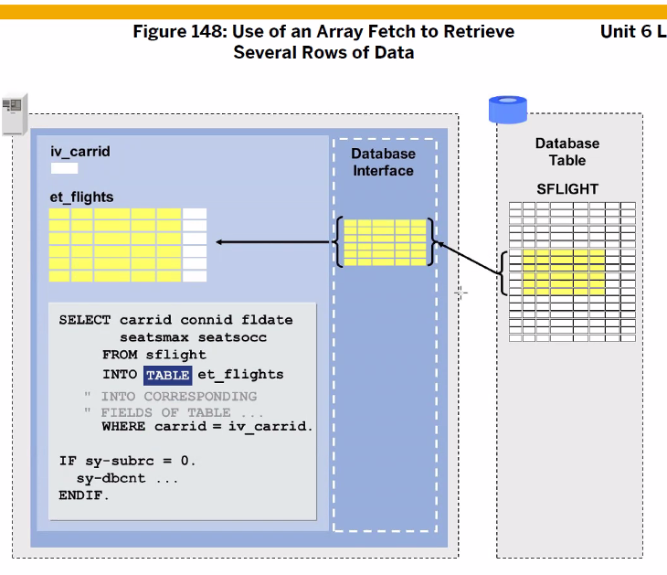
TranParent Table을 Internal Table에 담아서 처리하는 방법

## 실습

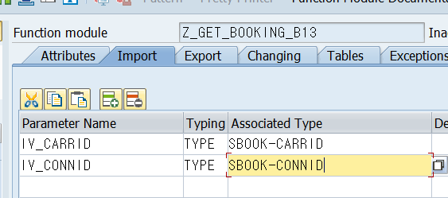
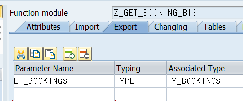
excetion no_data

```ABAP
* 루프문 아니다. 
  SELECT *
    INTO CORRESPONDING FIELDS OF TABLE ET_BOOKINGS
*  INTO TABLE
    FROM SBOOK
    WHERE CARRID = IV_CARRID
      AND CONNID = IV_CONNID.
```

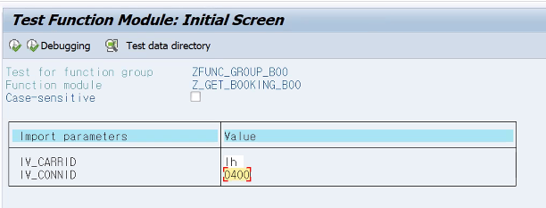
## 실습

```abap
DATA: LS_SPFLI TYPE SPFLI.

PARAMETERS: PA_CAR TYPE SPFLI-CARRID.

SELECT *
  INTO CORRESPONDING FIELDS OF LS_SPFLI
  FROM SPFLI
  WHERE CARRID = PA_CAR.

  WRITE:/ LS_SPFLI-CARRID,
       LS_SPFLI-CONNID,
       LS_SPFLI-COUNTRYFR,
       LS_SPFLI-CITYFROM,
       LS_SPFLI-AIRPFROM,
       LS_SPFLI-COUNTRYTO,
       LS_SPFLI-CITYTO,
       LS_SPFLI-AIRPTO.
ENDSELECT.
```

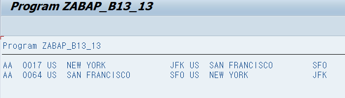


```ABAP
REPORT ZABAP_B13_14.

DATA: GT_SPFLI TYPE TABLE OF SPFLI,
      GS_SPFLI LIKE LINE OF GT_SPFLI.

PARAMETERS: PA_CAR TYPE SPFLI-CARRID.

* ARRAY FETCH
SELECT *
  INTO CORRESPONDING FIELDS OF TABLE GT_SPFLI
  FROM SPFLI
  WHERE CARRID = PA_CAR.

LOOP AT GT_SPFLI INTO GS_SPFLI.
    WRITE:/ GS_SPFLI-CARRID,
     GS_SPFLI-CONNID,
     GS_SPFLI-COUNTRYFR,
     GS_SPFLI-CITYFROM,
     GS_SPFLI-AIRPFROM,
     GS_SPFLI-COUNTRYTO,
     GS_SPFLI-CITYTO,
     GS_SPFLI-AIRPTO.
  ENDLOOP.
  
  SELECT *
      INTO CORRESPONDING FIELDS OF LS_SPFLI
      FROM SPFLI
      WHERE CARRID = PA_CAR.

  WRITE:/ LS_SPFLI-CARRID,
       LS_SPFLI-CONNID,
       LS_SPFLI-COUNTRYFR,
       LS_SPFLI-CITYFROM,
       LS_SPFLI-AIRPFROM,
       LS_SPFLI-COUNTRYTO,
       LS_SPFLI-CITYTO,
       LS_SPFLI-AIRPTO.
ENDSELECT.
```

- 한건의 데이터 : SELECT **SINGLE** FROM INTO WHERE
- SELECT INTO FROM WHERE ENDSELECT (한건 읽고 변경, 한건 읽고 변경 하기에 느림)
- **ARRAY FETCH** -> SELECT INTO **TABLE** INTERNAL TABLE FROM WHERE (DB에서 한꺼번에 레코드를 읽은 뒤 처리하므로 효율적이다.)

```ABAP
"조건에 맞는 모든 데이터를 Structure를 사용하여 Select"
*시스템은 한번에 한 Line의 데이터를 가져오고 Select ~ EndSelect의 루프안에서 데이터를 계속 가져온다

SELECT vbeln fkdat netwr kunrg FROM vbrk
  INTO wa_vbrk
 WHERE vbeln EQ '9000'.
ENDSELECT.

"조건에 맞는 VBRK의 데이터를 한번에 다수의 Row를 Internal Table에 SELECT 하기"
SELECT vbeln fkdat netwr kunrg 
  FROM vbrk
  INTO TABLE it_vbrk
  WHERE vbeln EQ '9000'.
```

# CLIENT SPECIFIED

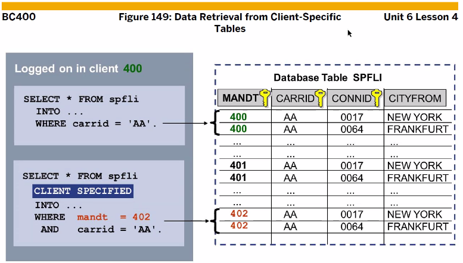
400번으로 로그인이 된 상태에서, 
402번 client 데이터를 가져오고 싶다면? CLIENT SPECIFIED 구문 추가
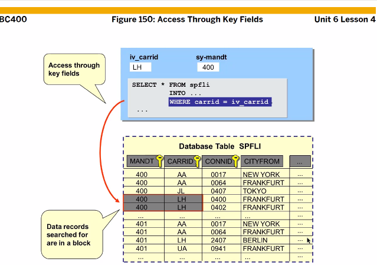
테이블 생성시 키필드를 설정해준다. 키필드를 이용해 조건문 걸면 속도 빠름
만약 키필드가 아닌걸 쓴다면? Secondary index를 생성해서 사용해야 속도가 빨라진다.
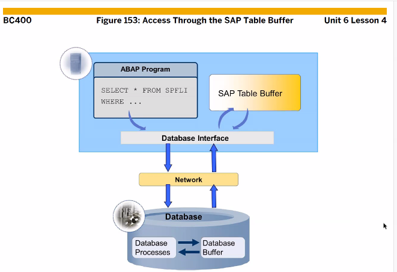
버퍼가 캐시역할

# Join

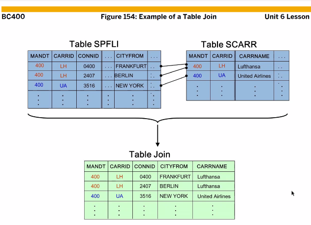
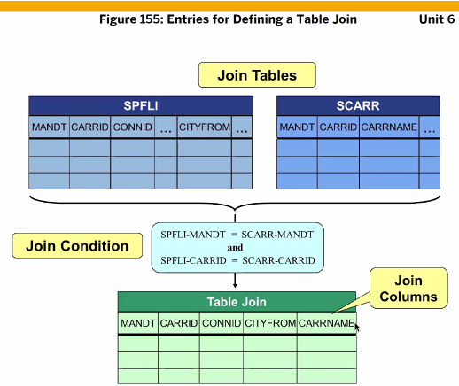
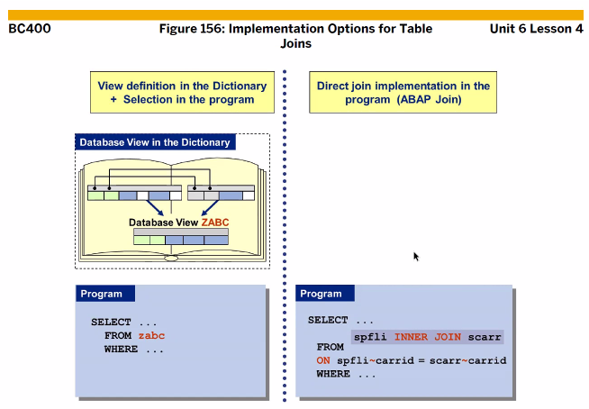
View 는 ReadOnly
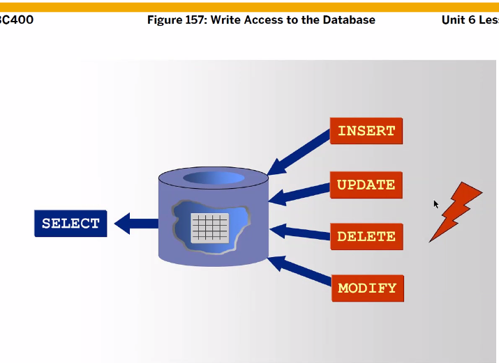

## inner join

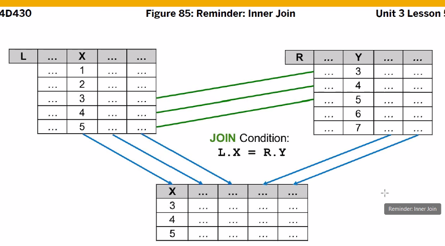

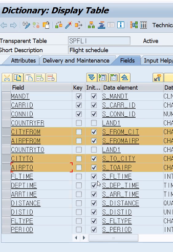
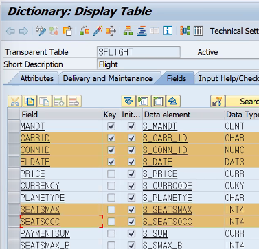
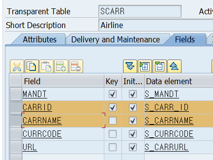
위에 총 세개의 테이블에서 컬럼 10개를 join할 것이다.
이 10개의 필드를 받을 수 있는 변수 즉 structure variable이 필요해
local structure type을 선언해서 만들자

```ABAP
* local structure 생성하기
TYPES: BEGIN OF TS_DATA,
         CARRID   TYPE S_CARR_ID,
         CONNID   TYPE S_CONN_ID,
         FLDATE   TYPE S_DATE,
         SEATSMAX TYPE S_SEATSMAX,
         SEATSOCC TYPE S_SEATSOCC,
         CITYFROM TYPE S_FROM_CIT,
         AIRPFROM TYPE S_FROMAIRP,
         CARRNAME TYPE SCARR-CARRNAME,
       END OF TS_DATA.
```

a.name 이렇게 . 으로 구분하는게 아니라 a~name 이렇게 함
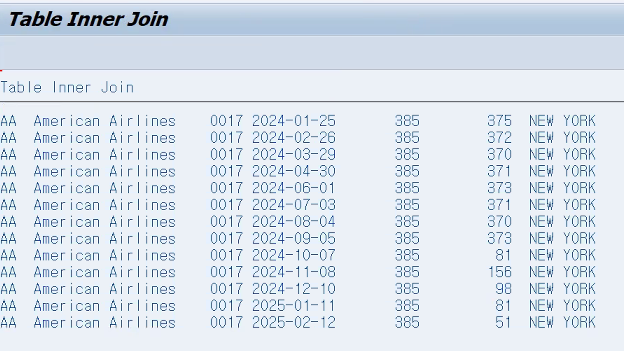

```ABAP
DATA: GT_DATA TYPE TABLE OF TS_DATA,
      GS_DATA LIKE LINE OF GT_DATA.

PARAMETERS: PA_CAR TYPE SFLIGHT-CARRID,
            PA_CON TYPE SFLIGHT-CONNID.

SELECT A~CARRID A~CONNID A~FLDATE A~SEATSMAX A~SEATSOCC
       B~CARRNAME
       C~CITYFROM C~AIRPFROM C~CITYTO C~AIRPTO
  FROM SFLIGHT AS A INNER JOIN SCARR AS B
                      ON A~CARRID = B~CARRID
                    INNER JOIN SPFLI AS C
                      ON A~CARRID = C~CARRID
                     AND A~CONNID = C~CONNID
  INTO CORRESPONDING FIELDS OF TABLE GT_DATA
  WHERE A~CARRID = PA_CAR
    AND A~CONNID = PA_CON.

LOOP AT GT_DATA INTO GS_DATA.
  WRITE:/ GS_DATA-CARRID,
          GS_DATA-CARRNAME,
          GS_DATA-CONNID,
          GS_DATA-FLDATE,
          GS_DATA-SEATSMAX,
          GS_DATA-SEATSOCC,
          GS_DATA-CITYFROM,
          GS_DATA-AIRPFROM,
          GS_DATA-CITYTO,
          GS_DATA-AIRPTO.
ENDLOOP.
```

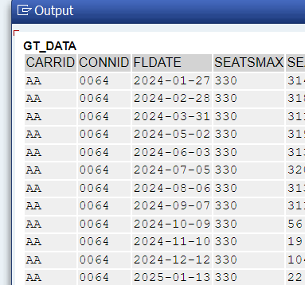
```ABAP
TYPES: BEGIN OF TS_DATA,
         CARRID   TYPE S_CARR_ID,
         CONNID   TYPE S_CONN_ID,
         FLDATE   TYPE S_DATE,
         SEATSMAX TYPE S_SEATSMAX,
         SEATSOCC TYPE S_SEATSOCC,
         CITYFROM TYPE S_FROM_CIT,
         AIRPFROM TYPE S_FROMAIRP,
         CITYTO   TYPE SPFLI-CITYTO,
         AIRPTO   TYPE SPFLI-AIRPTO,
         CARRNAME TYPE SCARR-CARRNAME,
       END OF TS_DATA.

DATA: GT_DATA TYPE TABLE OF TS_DATA,
      GS_DATA LIKE LINE OF GT_DATA.

DATA: GT_SCARR TYPE TABLE OF SCARR,
      GS_SCARR LIKE LINE OF GT_SCARR.

DATA: GT_SPFLI TYPE TABLE OF SPFLI,
      GS_SPFLI LIKE LINE OF GT_SPFLI.

PARAMETERS: PA_CAR TYPE SFLIGHT-CARRID,
            PA_CON TYPE SFLIGHT-CONNID.

SELECT *
  INTO TABLE GT_SCARR
  FROM SCARR.

SELECT *
  INTO TABLE GT_SPFLI
  FROM SPFLI
  WHERE CARRID = PA_CAR.

SELECT *
  INTO CORRESPONDING FIELDS OF TABLE GT_DATA
  FROM SFLIGHT
  WHERE CARRID = PA_CAR
  AND CONNID = PA_CON.

LOOP AT GT_DATA INTO GS_DATA.
  READ TABLE GT_SCARR INTO GS_SCARR
  WITH KEY CARRID = GS_DATA-CARRID.
  IF SY-SUBRC = 0.
    GS_DATA-CARRNAME = GS_SCARR-CARRNAME.
  ENDIF.

  READ TABLE GT_SPFLI INTO GS_SPFLI
  WITH KEY CARRID = GS_DATA-CARRID
  CONNID = GS_DATA-CONNID.

  IF SY-SUBRC = 0.
    GS_DATA-CITYFROM = GS_SPFLI-CITYFROM.
    GS_DATA-CITYTO = GS_SPFLI-CITYTO.
    GS_DATA-AIRPFROM = GS_SPFLI-AIRPFROM.
    GS_DATA-AIRPTO = GS_SPFLI-AIRPTO.
  ENDIF.
  MODIFY GT_DATA FROM GS_DATA.
  CLEAR: GS_DATA, GS_SCARR, GS_SPFLI.
ENDLOOP.

CL_DEMO_OUTPUT=>DISPLAY( GT_DATA ).
```

