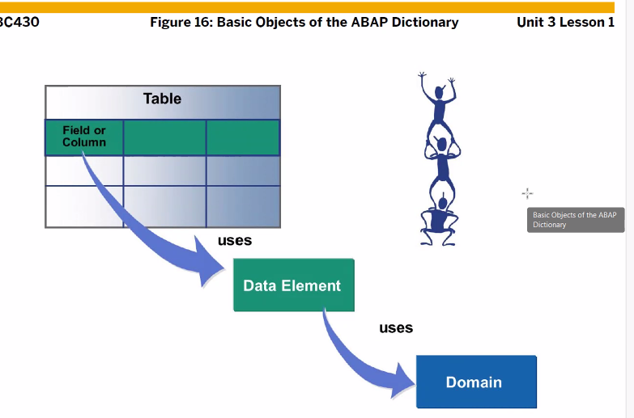

[TOC]

# ABAP Dictionary

Type 정의 가능
Table, View 생성
Input, output 필드 display
List 형태로 데이터를 보여주는 것 : poss.values

데이터 수정 후 activate 하면 자동적으로 db서버에 생성/수정 이루어짐

소스코드/스크린에서 처리할때 abap dic에서 데이터 읽어옴. 오타나면 메시지로 알려줄 수 있는 이유가 이거

# Create Data Types

## Domains data elements

TODO. Line structure 와 structure 는 다른건가?

sap memory 스크린 필드에 입력된 값을 sap memory에 저장 가능
sap m에 있는 데이터를 읽어올수도 있다. (사진 예시 screen 100, 400)
sap parameters: get/set 이용해서 RW 가능

### search help

보일때와 안 보일때의 차이, 다 들어가서 일일이 봐야하나?

### parameters 라벨명 바꾸는 방법

## 실습

/ose11

Create

패키지 : ZBC400_B13

체크표시 : 대소문자 구분

# Structure Types (3)

data elem, table type, 다른 st으로 이루어진게 simple st

st. 안에 다른 st. 가 들어가 있는게 nested

.include 는 abap keyword

Deep Structure

data elem 생성할 것

subject는 internal table이며 이것은 deep st.
항상 Active인지 확인할것

> 위에 ZSTUDENT_B13은 st.이며 componet중 하나인 subject가 internal table 형태로 들어가 있는것 table type인 subject를 핸들링 하기 위해선 또다르 st.가 필요함(work area)

# Type Group

: 이름은 다섯자리만
: data type 또는 상수 선언시 타입그룹이름 _ 로 시작

구버전, 지금은 TYPE-POOL 선언 안해도 되드라

# Database Tables

 
중복 x ( Key Field(=PK)로 check )
DB 서버에 테이블 생성하려면 Transparent table 필요

여러개의 테이블에서 공통적으로 사용되어지는 필드들 ( abap dic에서 structure를 생성 후 그 필드들 오고 이걸 table에 포함시키고 )

flagment(생성,수정,삭제시 발생하는 조각들?)를 방지하기 위에 data class 생성

공간이 full일때 얼만큼 더 확장할건지? 

> size category로 설정 번호가 클수록 확장크기 큼

logging ( 모든 이력 log table에 저장 )

## 실습

첫번째 필드 이름은 Client , MANDT 둘중 하나가 와야한다.

화폐단위는 currency 필드를 참고해야 한다. 데이터 저장시에 
100(value) kr(currncy) 이렇게 들어옴.

위에 사진으로 데이터 생성 , or /SE16 으로 생성