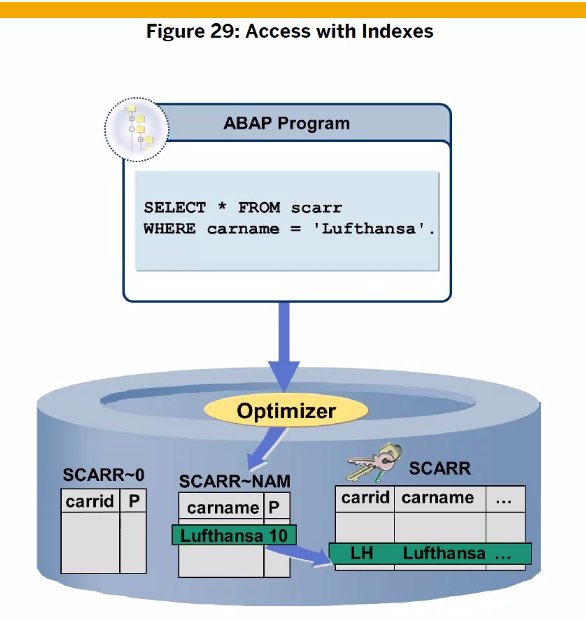
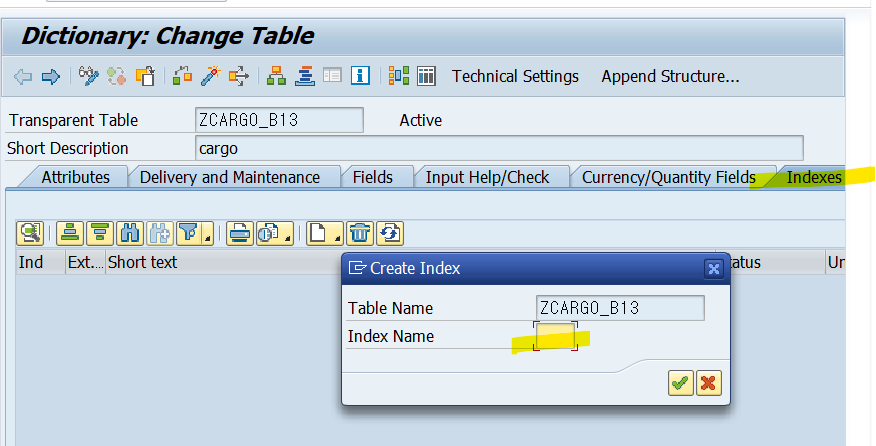
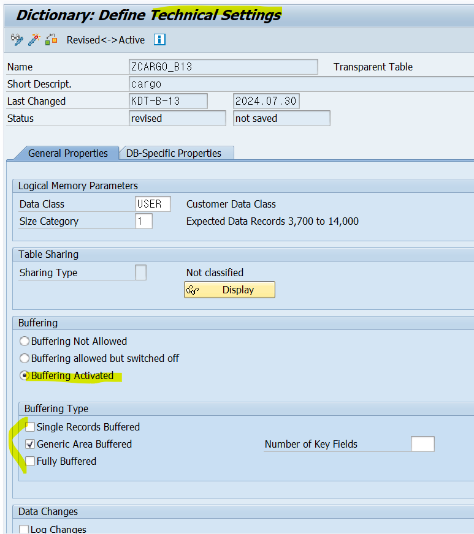
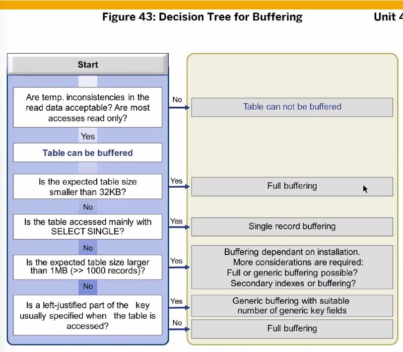
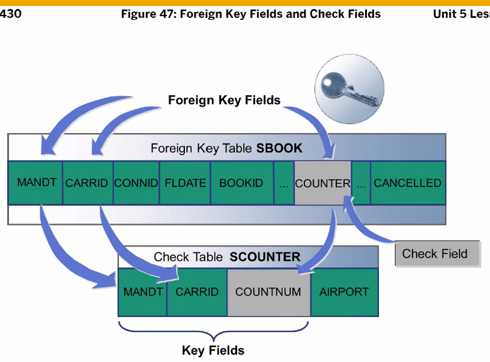

[TOC]

# Table Index

자주 쓰이는 필드들은 따로 저장해주자
(ex. 180개 테이블에 공통으로 사용되는 사원번호 는 st로 만들어!)
아래와 같이 실습 함.

위에 저장한 st type을 다른 테이블에서 사용하려면 다른 테이블로 가서 .include 해서 사용하면 된다. 이렇게 공통으로 된 필드를 사용하기 위해선 위와 같은 방법 사용

KEY 필드로 선택되면 Index가 생성된다. (자동 정렬된 채로 primary index에 저장)

만약 Function Field를 사용해서 검색을 해야 한다면? 이에 따른 index를 새로 생성

## 실습

z01

# Table Buffering

모든 데이터 올려

LH인 CAARID를 전부 버퍼에 올려버려 ( Generic key 설정이 꼭 )

Single-Record Buffer : 읽으려는 데이터 딱 한건만 올림

1번 서버와 2번 서버는 실시간 동기화 x ( 1번 서버에서 A를 삭제하면 DB에서는 삭제 되었으나 2번 서버는 A가 존재함 ) -- 동기화를 위해 Synchronization 사용

## Synchronization

변경이 일어날 경우 Sync. Table에 저장해둔다. 

설정한 시간에 맞춰 동기화가 이루어진다
( 1번 서버는 이미 반영되어 있기 떄문에 작업 x )
2번 서버에 데이터 삭제 , 

2번 서버에는 데이터가 없어졌기에 다시 DB에서 데이터 읽어들여옴
수정/삭제가 빈번하면 버퍼를 사용하지 말자

# Input Checks

입력값 유효성 체크, search help도 표시해줌

## Fixed Values

## Foreign Key

: 데이터 일관성 체크

AA의 COUTER는 1 인데 8을 저장하려하는 거. 이건 저장할 수 없다.

FK 설정할때 아밥 시스템에서는 도메인에 있는 VALUE TABLE을 Check Table로해서 FK설정해라

MANDT 는 KEY 필드라 위에 라디오 버튼이 저랬던거고
KEY 필드가 아닌거 선택한거면 아래처럼 해야해

SUBSPART가 아니라 STRAVELAG에서 FK가 만들어진다??
제안을 해주는 테이블이 아닌 다른 테이블에서 FK가 만들어질수도 있다.

# Cardinality

Cardinality는 테이블끼리의 데이터의 관계를 나타낸다. 
ex. 회원가입만 해놓고 주문을 안한 것 == 1 : C 관계

# Text Table

코드 아이디 넘버로 관리되는 데이터들의 text는 (각국의 언어로) 키필드 + FK 

