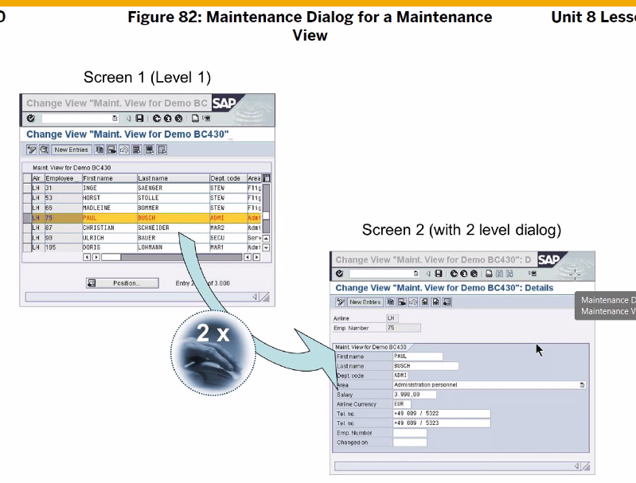
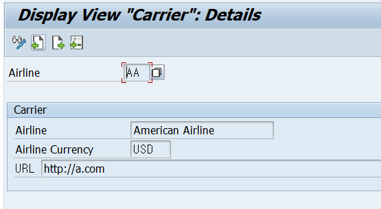
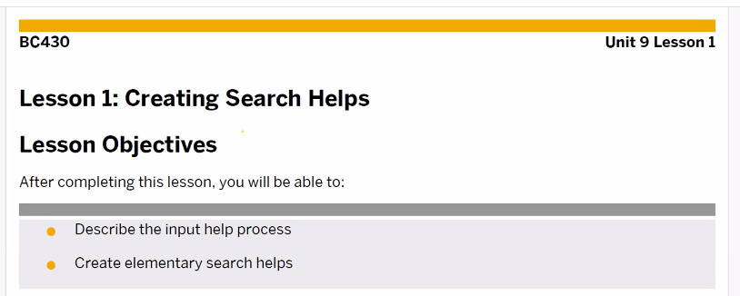
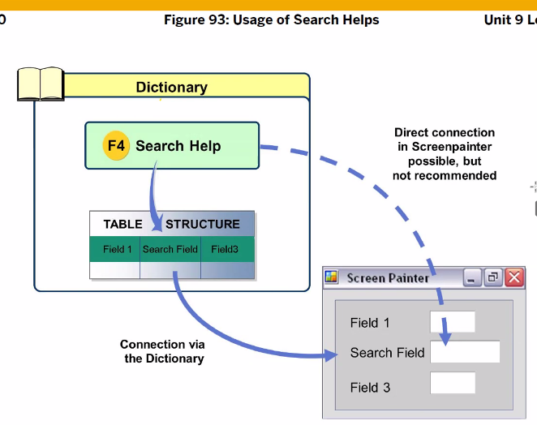
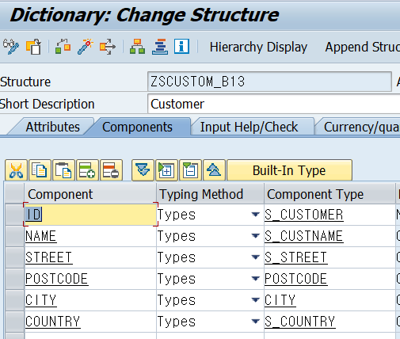

[TOC]

# View

View에는 4가지 타입이 존재한다.


maintenance : 유지보수, left, outer join
help : search help에서 사용 , left, outer join
projection, database ( inner join ) 이 둘만 아밥에서 사용가능

## Database Views


table join 의 디폴트는 cross join


## Projection View

: 하나의 테이블만 올 수 있다.
: table field의 제한을 위해 ( 특정 필드 숨김 )


## Database view

: 필터링 가능


view를 사용할때는 from 절에서table 대신 view가 오면 된다.
Transparent table에서 database view, projection view를 만들수 있다. 이를 정의할때 아밥 사전에 있는 structure type을 사용한다. 

## Inner , Outer Join


database view 는 무조건 inner join
projection view는 테이블 하나만 사용하기에 join이란게 없다.
나머지 두개의 view는 모든 join사용 가능

> inner join을 하게 되면 carrid 필드가 두개 복사된다. 이렇게 되면 필드 유니크 문제로 에러가 떨어지므로 `-` 를 이용해 carrid 필드를 하나 빼줘야 한다.


view에서의 data type : structure type

## 실습


FK로 서로 연결되어 있는 테이블은 저 버튼으로 테이블 선택 가능


필드 선택


생성한 view를 program으로 돌려보기
st.type을 이용해서!

```ABAP
DATA: GS_FLIGHT TYPE ZVFLIGHT_B13,
      GT_FLIGHT LIKE TABLE OF GS_FLIGHT,
      GV_FREE   TYPE I,
      GV_RATE   TYPE P LENGTH 3 DECIMALS 2.

PARAMETERS: PA_CAR TYPE ZVFLIGHT_B13-CARRID.

SELECT *
  INTO CORRESPONDING FIELDS OF TABLE GT_FLIGHT
  FROM ZVFLIGHT_B13
  WHERE CARRID = PA_CAR.


LOOP AT GT_FLIGHT INTO GS_FLIGHT.
  GV_FREE = GS_FLIGHT-SEATSMAX - GS_FLIGHT-SEATSOCC.
  GV_RATE = GS_FLIGHT-SEATSOCC / GS_FLIGHT-SEATSMAX * 100.
  WRITE:/ GS_FLIGHT-CARRID,
          GS_FLIGHT-CONNID,
          GS_FLIGHT-FLDATE,
          GS_FLIGHT-SEATSMAX,
          GS_FLIGHT-SEATSOCC,
          GS_FLIGHT-CARRNAME,
          GS_FLIGHT-CURRCODE,
          GS_FLIGHT-COUNTRYFR,
          GS_FLIGHT-CITYFROM,
          GS_FLIGHT-AIRPFROM,
          GS_FLIGHT-COUNTRYTO,
          GS_FLIGHT-CITYTO,
          GS_FLIGHT-AIRPTO,
          GV_FREE,
          GV_RATE, '%'.
ENDLOOP.
```


view에는 view field가 있어야 하는데 * , - 기호로 dynamic attachment 사용 가능


`*`은 SPFLI TABLE에 있는 `모든 필드`를 View Field로 쓸거야!

`-`는 SCARR에 있는 MANDT 필드를 View Field 안에서 `뺄거야`

inner join이 디폴트인데 key값이 왜 중복되지? 저렇게 - 로 뺴주지 않으면 중복된다고 에러 떨어짐.. ( 필드 이름은 무조건 유니크해야한다 )
select * from 처럼 openSQL로 쓰면 이것은 알아서 중복을 허용해준다. 이거와 다르게 보도록 하자.

# Maintenance View

: FK가 없으면 Join이 불가능하다
: 유지보수를 위함
: view 생성할때 dialog를 생성해줘야 한다.



1번 스크린은 over view라 부르며 data list 표시함,
대체 무슨 스크린인가? number는 10 아니면 100을 보통 쓴다.

1번 스크린

2번 스크린


2번 스크린은 1번 스크린에서 선택된 데이터에 대한 상세정보가 나타나

생성 순서 :: **view 생성 -> dialog 생성**


장점 : dialog를 쉽고 빠르게 생성가능
단점 : 동기화x 따라서 유지보수할때 문제 多, custom된 테이블만 가능( z나y 이름으로 시작되는 테이블 )

## 실습


Function Group은 생성함


# Create Search Helps

: abap에서 제공해주는 standard
: F4




LH 입력 -> import -> selection m이 데이터 읽어와서 dialog에 표시됨 -> 원하는 데이터 선택 -> export

`

dialog는 두개의 화면 타입이 존재하는데 이는 옵션으로 선택가능





위에는 우선순위


## 실습


Full text : 유사성이 높은 단어를 알아서 검색해서 알려줌 홍기동 하면 홍길동이 search help 덕에 뜨게 됨





```ABAP
PARAMETERS: PA_ID TYPE ZsCUSTOM_B13-ID.
```


