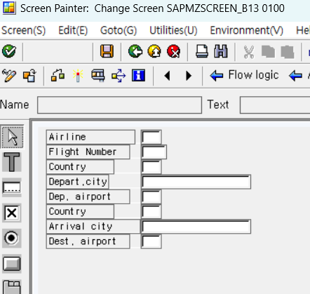

[TOC]

# Dynpros

- module pool = screen program
  데이터 생성 삭제 수정 가능, 스크린을 생성 - 스크린 element로 생성
- Executable Program = report program  : Read Only
- fuction group , 스크린 생성 가능
- oop : type j, type k
- include program ( mp, ep, fg 에서 사용되어짐 )

module pool 프로그램 이름은 sapmz , sapmy 로 시작해줘야 한다.
그리고 with TOP INCL. ( 전역변수를 여기에다 선언 ) 체크를 꼭 해줘야 한다.
Includes program을 사용하는데 아래와 같이 여러개가 있다. 

| includes  | 설명                     |
| --------- | ------------------------ |
| E01       | 이벤트, 없어도 됨        |
| F01       | 서브루틴                 |
| PBO / O01 | 스크린이 뜨기 전 할 로직 |
| PAI / I01 | 스크린 뜨고나서 할 로직  |
| TOP       | 전역변수                 |

active 한다고 해서 실행 x module pool?????

# Screen Program

parameter을 사용할 수 없다.
module pool 생성 -> 스크린 생성 -> 스크린 element 를 담을 수 있는 컨테이너가 필요해

Static은 초기때 생성된건 변경 x

모듈풀 프로그램에서는 selection screen을 사용할 수 없다. 
100번 부터 시작. nomal type (100번부터 시작, 100단위) subscreen , modal은 (10 단위)
노란색 표시 : dynamic attribute

PBO, PAI 전부 모듈을 가지고 처리된다.

스크린 number는 대부분 100번 사용

screen layout에 가서 screen element ( 좌측에 버튼들 ) 가지고 생성이 되어진다

**identical names** **이름으로 식별**해서 데이터를 처리한다.
스크린 페인터 화면 -> 데이터 element을 스크린에 생성 (element에는 각자의 이름이 존재한다) 
따라서 아밥 프로그램에도 똑같은 이름의 변수를 선언해서 값을 할당해주면 스크린 페인터와 동기화된다.

## 실습

이름 지을때 앞에 sap을 빼고 나머지 + TOP 해주면 된다.

Screen Painter 생성

100번 입력

저렇게 고유한 Name을 지정해줘야 한다.

후에 프로그램 실행 F8

보이는것과 같이 위에 툴바가 비활성화되어 있다.

## 실습 이어서

set param 체크시 sap system에 있는 sap memory에 parameter ID로 입력값을 저장한다. get param 체크시 sap memory에 저장된걸 가져와서 읽는다.

실행할때마다 session 처럼 입력값이 남아서 자동으로 입력되어 있는다.

필수값 표시 방법

스크린 페인터에 있는걸 abap에서 조건문 거는 방법, x를 넣으면 goback 하라
TOP에 전역변수 Command 넣고, PAI 활성화 시키기

| Includes  | 설명                         |
| --------- | ---------------------------- |
| E01       | 이벤트 ( Enter 이런거 )      |
| F01       | 서브루틴 ( 공통 모듈 )       |
| PBO / O01 | 스크린이 뜨기 **전** 할 로직 |
| PAI / I01 | 스크린 뜬 **후** 할 로직     |
| TOP       | 전역변수                     |

더블클릭

두개의 로직이 있는데 이는 순차적으로 실행된다.

