[TOC]

# Modifying Attributes

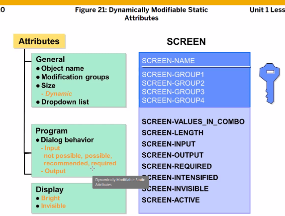
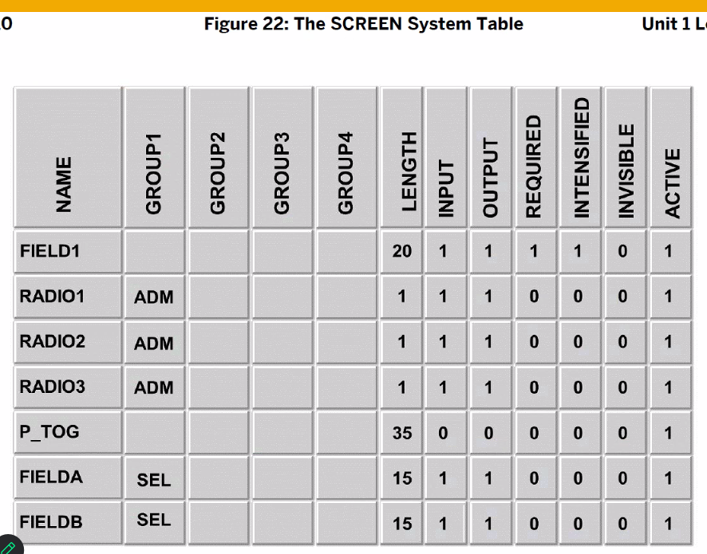
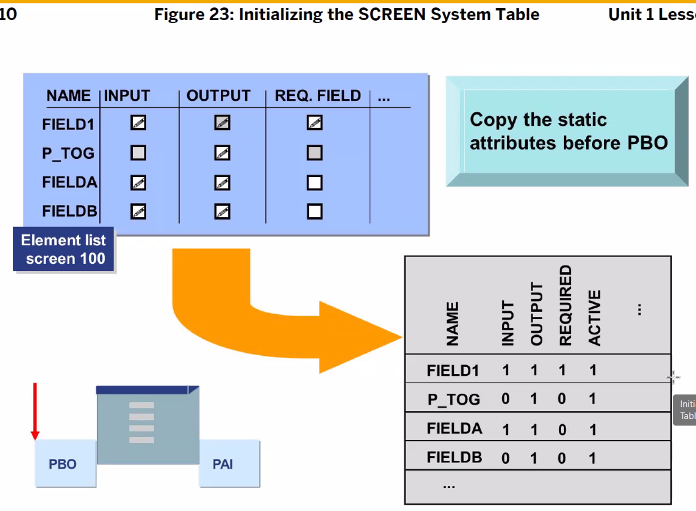

pbo 불러오기전 element들의 속성을 스크린 table에 저장된다. 
100 번 pai가 끝나고 200이 불러지면 위와같은 방식으로 흐름이 전개된다.

## Group 설정

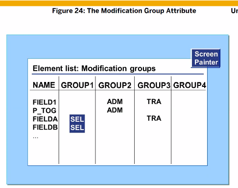
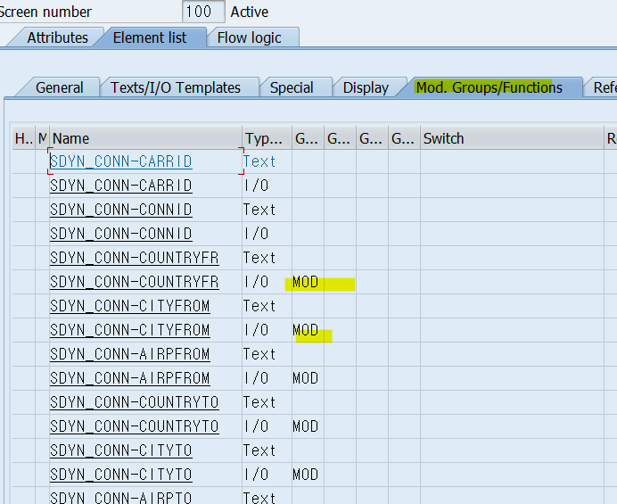
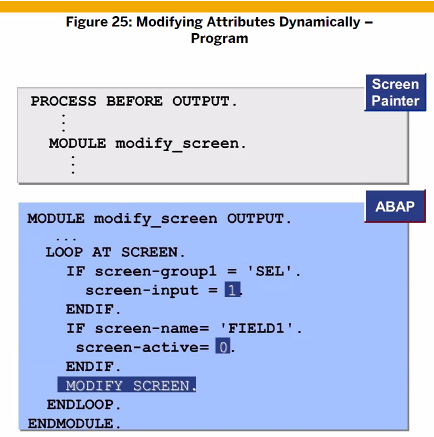

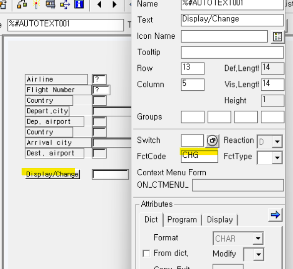
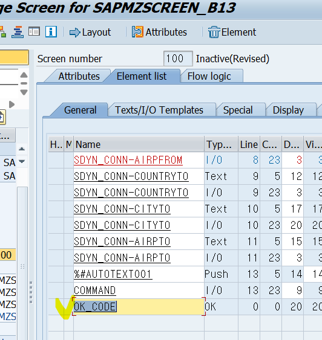

# Screen Sequnce

: 여러개의 스크린을 생성, sequnce 이용

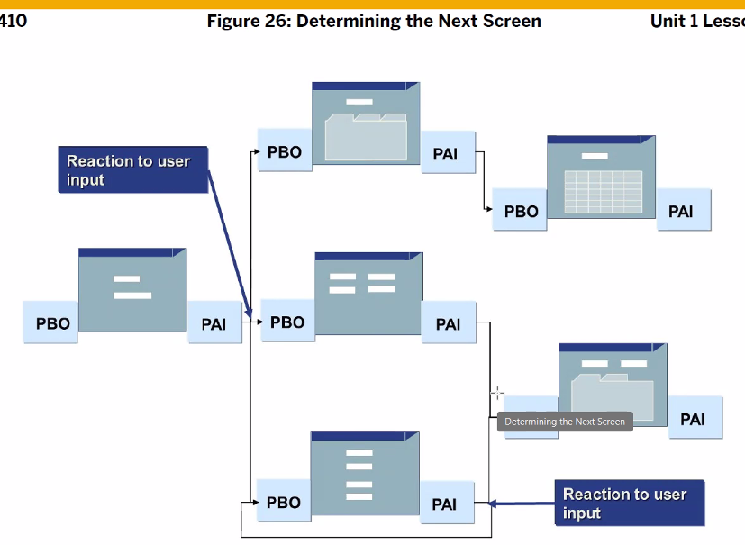
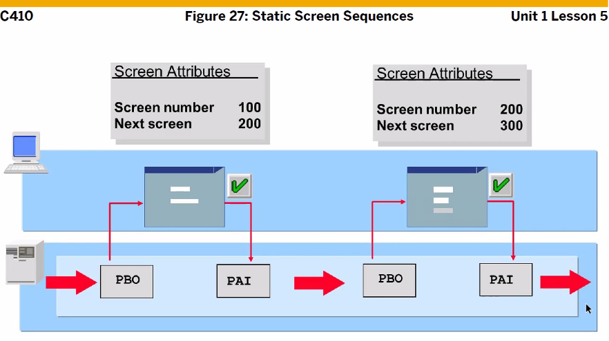
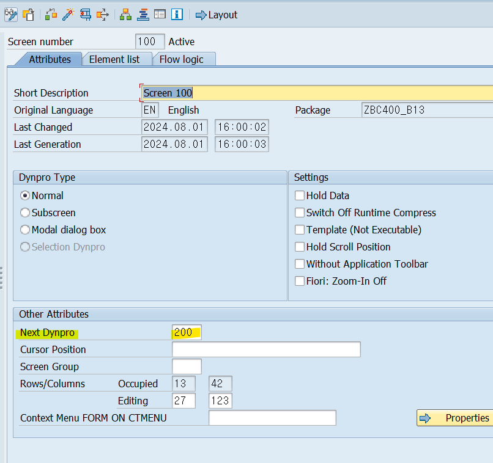

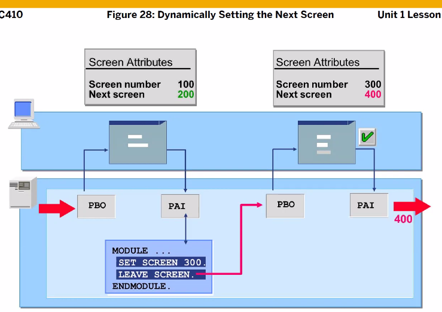

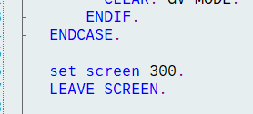
우선순위는 후자
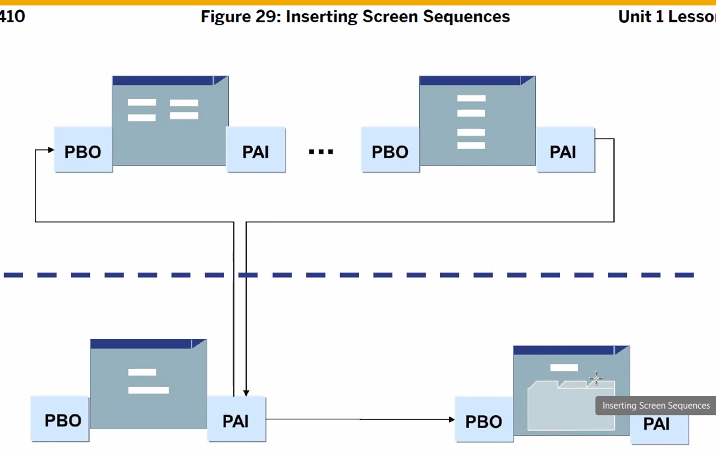

현재 스크린에서 다른 스크린을 살짝 낑겨넣는 것 1 - 2 - ( 3 - 1 ) inserting screen
call screen 사용 ( 인터셉터 느낌 )

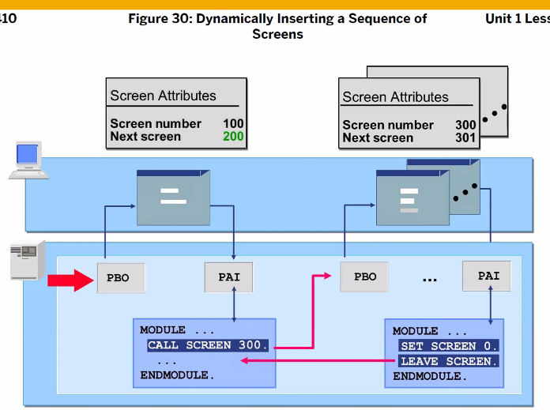
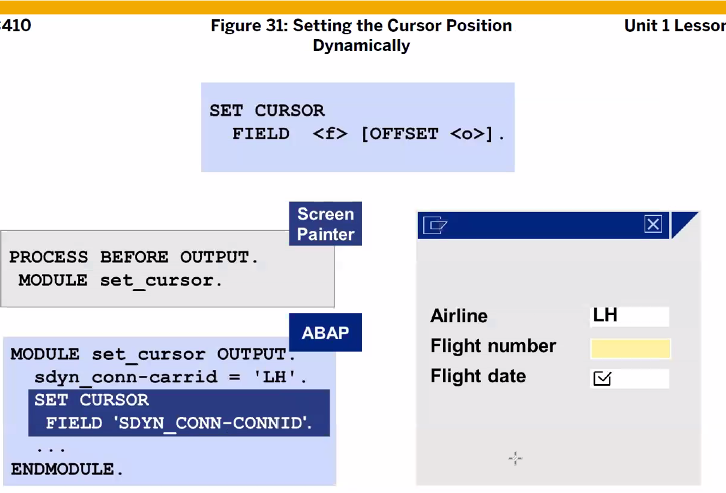
입력 후 커서 이동?

# Dialog Box

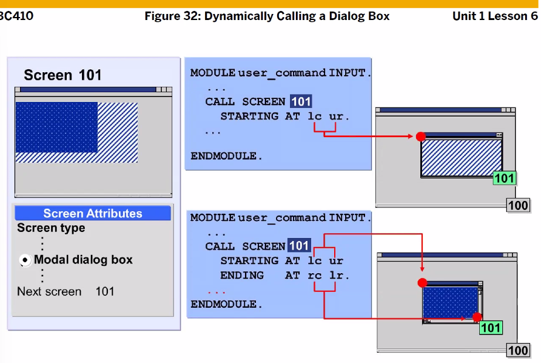
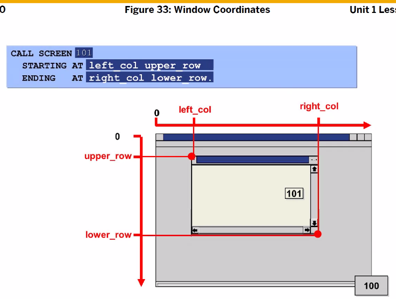

