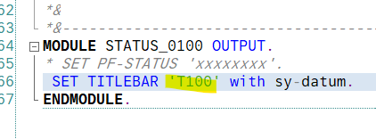

[TOC]

# Program Interface

user 인터페이스 비활성화 되어 있는 것, 제목을 추가하고 사용하는 방법

# Setting GUI Title

더블클릭

& 를 이용하면 with 키워드로 데이터값 바인딩 가능
TODO. 그냥 & 를 표시하고 싶을떈 어찌해야하나?

OK_code 필드에 event와 관련된 Funtion이 들어온다
이건 기본적으로 생성되는데, 이를 사용하려면
TOP에다가 DATA 선언을 해서 다뤄야 한다.

## 실습

뒤로가기 버튼 활성화, 팝업창에 버튼 생성

> SET PF-STATUS 'S100'.

더블클릭

# Creating Screen Element

VALUE 'X' 로 디폴트 설정함

