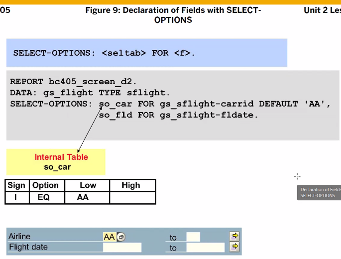

pa_ 로 대부분 시작한다 (파라미터 변수명, 필드 이름), TYPE으로

select option은 so_ 로 시작한다. FOR (TYPE, LIKE가 아님) DATA Object의 필드가 와야한다. so_car는 헤더가 있는 인터널 테이블이다.

파라미터는 EQ
select option은 in

중복 사용이 불가
어떤 이벤트도 없으면 디폴트는 START OF SELECTION 이벤트 사용

03 : 디스플레이를 뜻함.  디스플레이 권한 체크
01은 create 02 update 03 dispaly 권한 여부 확인

MEMORY ID CAR. , SAP Memory 사용 가능. 세션 느낌

sap memory에는 여러개의 데이터를 저장할 수 없다. 첫번째 필드에 있는 한개의 값만 저장이 가능하다.

for field를 해주면 text와 라디오 버튼을 연결해준다. 안해주면 아래 사진과 같이 따로 선택된다.

