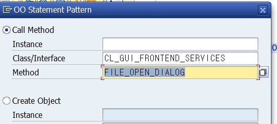

# Selection Screen



F4


pos_low(길이) - 버튼 이름 - user-command on((Function code)).
**TABLES sscrfields** 를 절대 잊지 말자? 이게 뭔데? 스트럭처란다.

> 버튼을 클릭하면 Function code를 받아야 하는데 ok code로 받는게 아니라 모듈풀에서는 ok_code로 받았으나 selection screen에서는 sscrfields에 ucomm컴포넌트로 받기 때문이다.


```ABAP
TABLES: SSCRFIELDS.
SELECTION-SCREEN PUSHBUTTON /POS_LOW(20) BTN USER-COMMAND MODE.

INITIALIZATION.
  BTN = 'Display/Change'. " 버튼 이름 생성
  
  AT SELECTION-SCREEN.
  CASE SSCRFIELDS-UCOMM.
    WHEN 'MODE'.
      MESSAGE 'Push Button' TYPE 'I'.
  ENDCASE.
```


더블클릭 - 확인

OK CODE 대신에 UCOMM이 들어온거 확인됨


