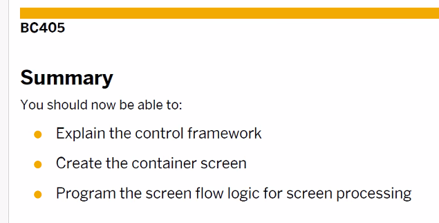
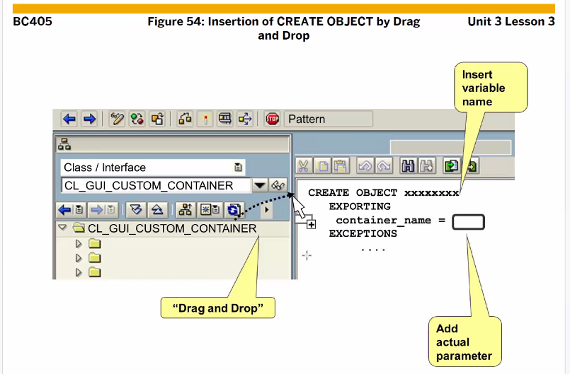
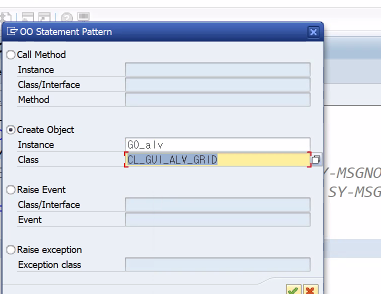
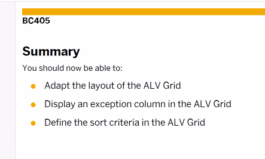

[TOC]

# Over Veiw


# Constructor


Area > Custom Container Control > SAP Grid Control
100번 스크린 (Area) PBO에서 처리 되는 일련의 일들

> Custom Container Control에서 OBJ 생성 후 100번 스크린과 연결하는 과정은 전부 PBO에서 해요


Constructor 는 메소드에 해당된다. 프로그램에서 불러서 사용하는 애가 아님 주의
( Call Method 사용 불가 ) 얘는 **특정 시점에 자동 호출**되는 메서드이다.

> 특정 시점?
> class에 Obj가 생성될때
> Create Object 라는 구문을 가지고 생성할때


Constructor 는 import 와 exception만 가질 수 있다. 


global obj ( go ) , local obj ( lo ) 로 시작함 (변수명)
TYPE REF TO ( 참조타입 )
internal table이 필요한데 왜?? 여러건의 데이터를 표시해줘야 하기 때문에


grid는 container 위에서 지어지는 거니까 i_parent에 컨테이너 어쩌고


abap dic에 structure type만 올 수 있음 주의 ( i_structure_name에 )

> abap dic : tranparent table, database view, projection view, structure

it_outtab에는 grid에 표시할 list를 가질 수 있는 internal table이 온다.

> table 내용이 바뀐다고 grid에서도 내용 안 바뀌니 뭔가 조치( refresh... )를 취해야한다. ( 서로 동기화 되지 않기에 주의 ) 

# ALV





ALV 에는 툴바를 제공해주는데 툴바 자체를 hidden, update 가능 ( 커스텀화 가능 )
layout structure 사용함




```ABAP
DATA: GO_CONT TYPE REF TO CL_GUI_CUSTOM_CONTAINER.
```


GRID 생성
```ABAP
 DATA: GO_ALV TYPE REF TO CL_GUI_ALV_GRID.
```




```ABAP
* TOP
DATA: GS_VARIANT TYPE DISVARIANT,
```

**I_SAVE 파라미터**
set_table_for_first_display 함수의 I_SAVE 파라미터는 앞에서 설명했으므로 간단히 값에 대한 정리만 하고 넘어간다.

- X
  - Global 레이아웃 세팅만 가능함.
- U
  - 특정 사용자에 한해서 레이아웃 세팅만 가능함.
- A
  - X와 U둘 다 가능함
- SPACE
  - 레이아웃 저장을 하지 않음.

**I_DEFAULT 파라미터**
사용자가 Default 변형을 저장할 수 있는지를 결정하게 한다.

- X
  - Default 변형을 저장할 수 있다.
- SPACE
  - Default 변형을 저장할 수 없다.


```ABAP
* TOP
DATA: GS_LAYOUT  TYPE LVC_S_LAYO.

* PAO
PERFORM SET_LAYOUT.

* FOI
FORM SET_LAYOUT .
  GS_LAYOUT-GRID_TITLE = 'Booking List'.
  GS_LAYOUT-ZEBRA = 'X'.
  GS_LAYOUT-CWIDTH_OPT = 'X'.
ENDFORM.

IS_LAYOUT                     = GS_LAYOUT
```


B는 디폴트 CTRL , SHIFT 이용해 여러개 ROW 선택 가능




레코드에 대한 데이터 상태를 표현할 수 있다. (컴포넌트가 필요함)

 
이것을 줄인게 이거

```ABAP
TYPES: BEGIN OF TS_DATA.
         INCLUDE TYPE SBOOK.
TYPES: EXCP TYPE CHAR1,
       END OF TS_DATA.
```


criterion-up : asc , down은 desc
```ABAP
* top
DATA: GT_SORT    TYPE LVC_T_SORT.

* PAI
PERFORM SET_SORT.

* F01
FORM SET_SORT .
  DATA: LS_SORT TYPE LVC_S_SORT.
  LS_SORT-FIELDNAME = 'CUSTOMID'.
  LS_SORT-DOWN = 'X'.
  APPEND LS_SORT TO GT_SORT.

  CLEAR: LS_SORT.
  LS_SORT-FIELDNAME = 'ORDER_DATE'.
  LS_SORT-UP = 'X'.
  APPEND LS_SORT TO GT_SORT.
ENDFORM.
```


````ABAP
DATA: gs_sseats    TYPE zsseats_b02,
      gt_sseats    LIKE TABLE OF gs_sseats,
      ok_code      TYPE sy-ucomm,
      go_container TYPE REF TO cl_gui_custom_container,
      go_alv       TYPE REF TO cl_gui_alv_grid.

SELECT-OPTIONS: so_car FOR gs_sseats-carrid,
                so_con FOR gs_sseats-connid.

INITIALIZATION.

  so_car-sign = 'I'.
  so_car-option = 'EQ'.
  so_car-low = 'AZ'.
  APPEND so_car.

  CLEAR: so_Car.
  so_car-sign = 'I'.
  so_car-option = 'BT'.
  so_car-low = 'LH'.
  so_car-high = 'UA'.
  APPEND so_Car.

  CLEAR: so_car.
  so_car-sign = 'E'.
  so_Car-option = 'EQ'.
  so_Car-high = 'QF'.
  APPEND so_Car.

START-OF-SELECTION.

  SELECT * FROM sflight INNER JOIN scarr
    ON sflight~carrid = scarr~carrid
    INTO CORRESPONDING FIELDS OF TABLE gt_sseats
    WHERE sflight~carrid IN so_Car
     AND  sflight~connid IN so_con.

  CALL SCREEN 100.

*LOOP AT gt_sseats INTO gs_sseats.
*  gs_sseats-seatsfree = gs_sseats-seatsmax - gs_sseats-seatsocc.
*  gs_sseats-bookrate = gs_sseats-seatsocc / gs_sseats-seatsmax * 100.
*
*  WRITE:/ gs_sseats-carrid,
*          gs_sseats-carrname,
*          gs_sseats-connid,
*          gs_sseats-fldate,
*          gs_sseats-seatsmax,
*          gs_sseats-seatsocc,
*          gs_sseats-seatsfree,
*          gs_sseats-bookrate.
*ENDLOOP.
*&---------------------------------------------------------------------*
*& Module STATUS_0100 OUTPUT
*&---------------------------------------------------------------------*
*&
*&---------------------------------------------------------------------*
MODULE status_0100 OUTPUT.
  SET PF-STATUS 'S100'.
  SET TITLEBAR 'T100'.
ENDMODULE.
*&---------------------------------------------------------------------*
*&      Module  USER_COMMAND_0100  INPUT
*&---------------------------------------------------------------------*
*       text
*----------------------------------------------------------------------*
MODULE user_command_0100 INPUT.
  CASE ok_code.
    WHEN 'Back' OR 'CANCEL'.
      LEAVE TO SCREEN 0.
    WHEN 'EXIT'.
      LEAVE PROGRAM.
  ENDCASE.
ENDMODULE.
*&---------------------------------------------------------------------*
*& Module CLEAR_OK_CODE OUTPUT
*&---------------------------------------------------------------------*
*&
*&---------------------------------------------------------------------*
MODULE clear_ok_code OUTPUT.
  CLEAR: ok_code.
ENDMODULE.
*&---------------------------------------------------------------------*
*& Module CREATE_AND_TRANSFER OUTPUT
*&---------------------------------------------------------------------*
*&
*&---------------------------------------------------------------------*
MODULE create_and_transfer OUTPUT.
  IF go_container IS INITIAL.
    CREATE OBJECT go_container
      EXPORTING
        container_name = 'AREA'
      EXCEPTIONS
        OTHERS         = 1.
    IF sy-subrc <> 0.
      MESSAGE a010(bc405_08).
    ENDIF.

    CREATE OBJECT go_alv
      EXPORTING
        i_parent = go_container
      EXCEPTIONS
        OTHERS   = 1.
    IF sy-subrc <> 0.
      MESSAGE a010(bc405_08).
    ENDIF.

    CALL METHOD go_alv->set_table_for_first_display
      EXPORTING
        i_structure_name              = 'ZSSEATS_B02'
*        i_default                     = 'X'
      CHANGING
        it_outtab                     = gt_sseats
      EXCEPTIONS
        others                        = 1
            .
    IF sy-subrc <> 0.
      MESSAGE a010(bc405_08).
    ENDIF.


  ENDIF.
ENDMODULE.
````


