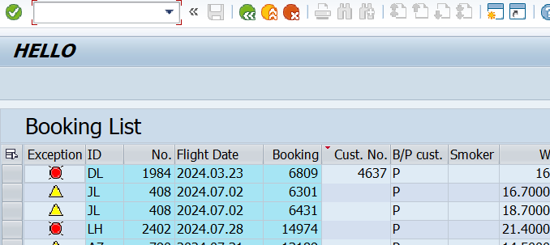
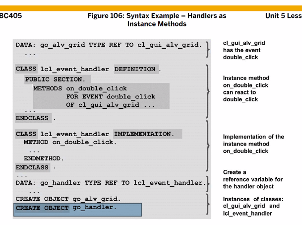

[TOC]

[참조](https://abapta0903.tistory.com/11)

# ALV GRID2


Line에 Color 넣기
무조건 TYPE C
3번째 자리 : 1 은 Bold
4번째 자리 : 배경과 글씨 색이 반전된다.

```ABAP
TYPES: COLOR TYPE C
```

다음에는 색깔 번호 0~7번 까지 오는데 상수로 정의한다.


CTRL + F8


## 실습


smoker x에 색 표시를 해보자

```ABAP
* top
TYPES:   EXCP  TYPE CHAR1,
         COLOR TYPE CHAR4,
       END OF TS_DATA.

* FO1
  LOOP AT GT_DATA INTO GS_DATA.
    if GS_DATA-smoker = 'X'.
      GS_DATA-COLOR = 'C700'.
*      GS_DATA-COLOR = 'C' && COL_GROUP && '00'.
*      CONCATENATE 'C' COL_GROUP '00' INTO GS_DATA-COLOR.
      ENDIF.
      
GS_LAYOUT-INFO_FNAME = 'COLOR'.
```


Deep Structure를 이용해 (스트럭처 안에 테이블 존재하는거) 저렇게 색 표시를 할 수 있다. 여기서의 컬러 internal table은 it_colfields이다.


## 실습


저 셋에다 색을 표시해보자

```ABAP
TYPES:   EXCP   TYPE CHAR1,
         COLOR  TYPE CHAR4,
         IT_COL TYPE LVC_T_SCOL,
       END OF TS_DATA.
```

```ABAP
DATA: LS_SCOL TYPE LVC_S_SCOL.
data: ls_scol type line of lvc_t_scol.
data: ls_scol like line of gs_data-it_col.
```

변수하나 선언하는데 방법이 세가지..


# Hidden


전부 다 상수이다. 클래스의 fuction들이 여기 모여있어

```ABAP
* TOP
DATA : GT_TOOLBAR TYPE UI_FUNCTIONS.

* PBO
PERFORM SET_TOOLBAR_EXCLUDING.

* FIO
FORM SET_TOOLBAR_EXCLUDING .
*  APPEND CL_GUI_ALV_GRID=>MC_FC_DETAIL TO GT_TOOLBAR.
*  APPEND CL_GUI_ALV_GRID=>MC_MB_SUM TO GT_TOOLBAR.
*  APPEND CL_GUI_ALV_GRID=>MC_FC_FILTER TO GT_TOOLBAR.

* 툴바에 있는 버튼만 숨겨라 , 툴바 자체를 숨기는건 다른데 있음
  APPEND CL_GUI_ALV_GRID=>MC_FC_EXCL_ALL TO GT_TOOLBAR.
ENDFORM.
```


를 하면 위에 툴바가 숨겨진다



필드 카탈로그를 정의하는 방법

- ABAP Dictionary 오브젝트를 이용하는 방법
- 프로그램 내에서 스크립트로(수동으로) 구성하는 방법
- 위 두가지를 혼용

**1) 인터널 테이블 선언**
화면에 보이게 될 인터널 테이블을 선언한다. ALV에서 데이터 저옵를 저장하는 인터널 테이블 영역을 아웃풋 테이블(Output Table)이라고 한다.

**2) 데이터의 구조(필드 카탈로그)**
ALV GRID 컨트롤이 스크린에 조회되는 구조를 정의한다. 즉, ALV GRID 컨트롤에서 정의 되는 데이터의 구조, 기술 속성, 내역과 같은 정보들을 가지고 있다. 일반적으로 ABAP Dictionary의 테이블 또는 구조체를 이용하거나, 인터널 테이블의 구조를 그대로 사용한다.

ALV GRID 컨트롤에 전달되는 아웃풋 테이블에 대한 정보는 ALV GRID 컨트롤이 작동하는 이상은 유용하게 작용한다.
아웃풋 테이블은 ABAP Dictioanry 오브젝트를 이용할 수도 있지만, 필드 카탈로그만으로 ALV 구조를 생성할 수 있다.
**필드 카탈로그는 ALV 화면에 보이게 되는 필드들의 정보를 담는 테이블이다.**
예를 들어, ALV 필드의 타입, 속성, 길이 등을 정의하게 된다.
필드 카탈로그는 LVC_T_FCAT 타입의 테이블이다.


테이블과 카탈로그 필드 이름이 같으면 생략 가능, 아니면 REF_FIELD에 정의내릴것


# ALV EVENT Handler





row를 더블클릭하면 ? 이벤트 핸들러 사용해보기

```ABAP
* main
INCLUDE ZABAP_B13_25_C01.
```

```ABAP
*&---------------------------------------------------------------------*
*& Report  BC402_PCt_CONN_LIST
*&
*&---------------------------------------------------------------------*
*& Exercise 32 Call programs (submit report)
*&
*&---------------------------------------------------------------------*

REPORT  zbc400_e03_conn_list

" 프로그램에서 사용할 메시지 클래스의 기본값으로 지정
MESSAGE-ID bc402.

" Local Type으로 Structure를 하나 선언
TYPES: BEGIN OF gty_s_conn,
        carrid TYPE spfli-carrid,     " 항공사id
        connid TYPE spfli-connid,     " 항공편 번호
        cityfrom TYPE spfli-cityfrom, " 출발 도시
        cityto TYPE spfli-cityto,     " 도착 도시
        deptime TYPE spfli-deptime,   " 출발 시간
        arrtime TYPE spfli-arrtime,   " 도착 시간
        period TYPE spfli-period,     " 소요일자(기간)
      END OF gty_s_conn.

" Local Type으로 Table Type을 하나 선언
TYPES gty_t_conn TYPE STANDARD TABLE OF gty_s_conn
                 WITH NON-UNIQUE DEFAULT KEY.

" 전역변수로 Local Table Type을 이용한 Internal Table 선언
" 필드가 ? 개 있다.
DATA gt_conn TYPE gty_t_conn.

" 문자열 전역변수
DATA gv_msg TYPE string.

" TYPE REF TO : 참조변수를 선언할 때 사용하는 방식
" DATA 참조변수 TYPE REF TO 클래스
" 목적은?
DATA: go_alv TYPE REF TO cl_salv_table,
      go_evt TYPE REF TO cl_salv_events_table,
      gx_msg TYPE REF TO cx_salv_msg.

*----------------------------------------------------------------------*
*       CLASS lcl_handler DEFINITION
*----------------------------------------------------------------------*
* 정의구현( DEFINITION & IMPLEMENTATION )
*----------------------------------------------------------------------*
CLASS lcl_handler DEFINITION.

  PUBLIC SECTION. " 프로그램에서도 호출이 가능한 영역

    " STATIC METHOD를 선언하는 방법
    CLASS-METHODS:
          " 마우스 좌클릭을 연달아 두번 누를 때
          " ON_DOUBLE_CLICK 이라는 이름을 가진 METHOD 가 자동으로
          " 호출되기 위해 선언
          on_double_click FOR EVENT double_click
                                 OF if_salv_events_actions_table
                          IMPORTING row column.

ENDCLASS.                    "lcl_handler DEFINITION

*----------------------------------------------------------------------*
*       CLASS lcl_handler IMPLEMENTATION
*----------------------------------------------------------------------*
*
*----------------------------------------------------------------------*
CLASS lcl_handler IMPLEMENTATION.

    METHOD on_double_click.

*    MESSAGE '더블클릭함' TYPE 'I'.

    DATA ls_conn LIKE LINE OF gt_conn.

    " GT_CONN: 현재 화면에 출력되는 데이터를 가진 Internal Table
    " ROW : 현재 출력된 LIST에서 Double Click한 라인 번호
    " LS_CONN: 현재 Double Click한 라인에 대한 정보
    READ TABLE gt_conn INTO ls_conn INDEX row.

    " COLUMN: 현재 Double Click한 열의 이름
    CASE column.

      WHEN 'CARRID'.
        " 화면에서 첫번째 열을 Double Click한 경우
        " 화면에서 항공사ID 값을 Double Click한 경우

        SUBMIT BC402_INS_FLIGHT_LIST_OSQL
                WITH PA_CAR = LS_CONN-CARRID
                AND RETURN.

      WHEN OTHERS.

    ENDCASE.

  ENDMETHOD.                    "on_double_click

ENDCLASS.                    "lcl_handler IMPLEMENTATION

" Selection Screen이 없기 때문에
" 이 프로그램이 실행되면,
" 곧바로 START-OF-SELECTION 이벤트 구간이 실행된다.
START-OF-SELECTION.

  " 가져오는 필드의 이름과 Internal Table GT_CONN이 서로 이름은 달라도 된다.
  " 하지만, 가져오는 필드의 순서에 따라 Internal Table GT_CONN의 필드의
  " 타입이 동일해야 한다.
  SELECT carrid connid cityfrom cityto
         deptime arrtime period
    FROM spfli
    INTO TABLE gt_conn. "<= GT_CONN에 DB에 존재하는 모든 비행 스케쥴이
                        "   기록된다. 왜? WHERE이 없기 때문에 전체 조회

  TRY.
      " GO_ALV: 프로그램 앞부분에서 참조변수로 선언된 변수
      CALL METHOD cl_salv_table=>factory
        IMPORTING
          r_salv_table = go_alv   " 메소드로부터 무언가 받아온다.
        CHANGING
          t_table      = gt_conn. " 메소드와 비행 스케쥴을 주고 받는다.
    CATCH cx_salv_msg INTO gx_msg.
      gv_msg = gx_msg->get_text( ).
      MESSAGE gv_msg TYPE 'E'.
  ENDTRY.

  " GO_ALV로부터 GET_EVENT 라는 Method를 호출하고 있다.
  " 클래스=>스태틱메소드
  " 객체->메소드
  " 스트럭쳐-필드
  " GET + EVENT 의 단어 조합으로 보아, EVENT 라는 정보를 가져온다.
  go_evt = go_alv->get_event( ).

  " LCL_HANDLER는 이 프로그램에서 만든 LOCAL CLASS 이다.
  " ON_DOUBLE_CLICK은 마우스 좌클릭을 연속으로 두번 했을 때
  " 호출되기 위해 만든 메소드다.
  " 이 메소드를 이벤트에 등록하고 있는 모습으로 보인다.
  SET HANDLER lcl_handler=>on_double_click FOR go_evt.

  go_alv->display( ). " DISPLAY: 의미상 화면에 무언가를 출력한다
```


