[TOC]

# ALV Toolbar


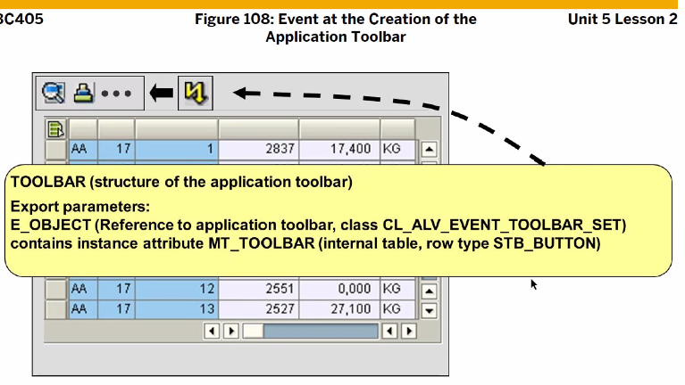
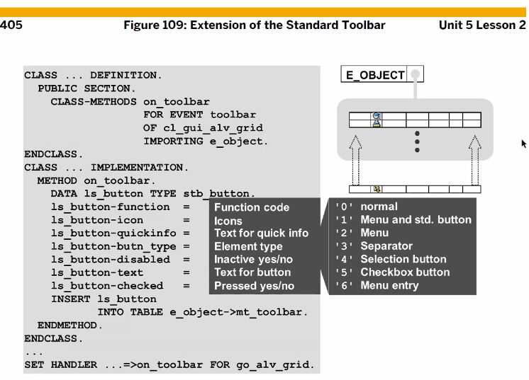

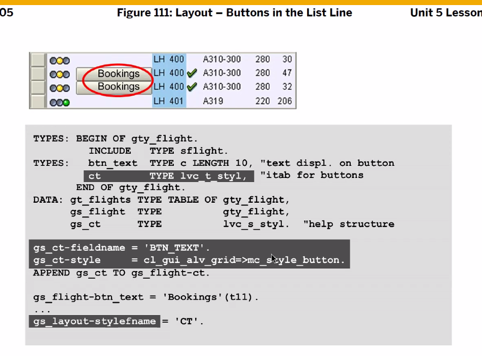
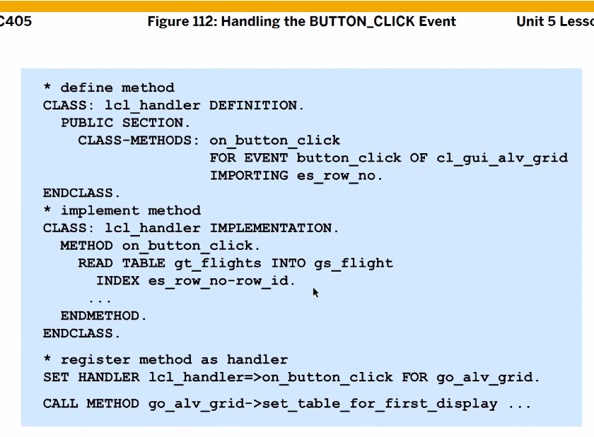

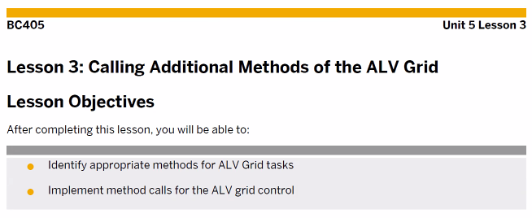
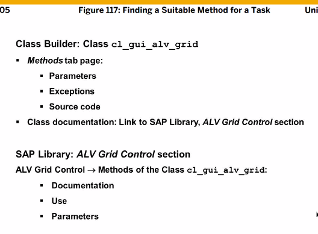
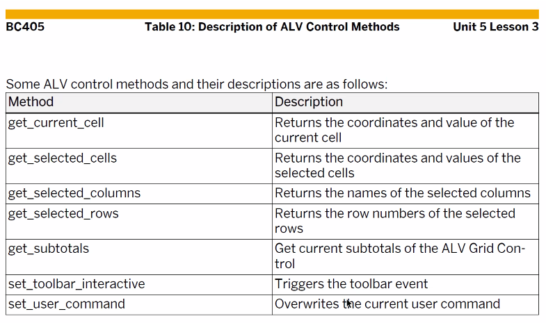

# ALV 기타 메서드
set_table_for_first_display 메서드 이외 ALV에서 자주 사용되는 메서드들에 대해서 학습한다.

**get_current_cell** 
get_current_cell 메서드는 ALV GRID 컨트롤에 커서가 놓인 위치의 값과 속성들을 반환한다. 
선택된 셀이 존재하지 않으면 라인의 ROW 값은 0을 반환한다. 
ALV GRID 컨트롤은 두 개의 라인과 칼럼의 인덱스 번호를 반환하는데, 하나는 현재 선택된 셀의 라인과 칼럼이고 다른 하나는 아웃풋 테이블(인터널 테이블) 라인과 칼럼의 인덱스이다. 
이것은 필터링을 설정하거나 숨기기를 하였을 때 실제 화면에 보이는 값과 인터널 테이블의 순서가 다를 수 있기 때문이다.

```ABAP
CALL METHOD <ref.var. to CL_GUI_ALV_GRID>->get_current_cell
    IMPORTING
        E_ROW       = < var. of type I >
        E_VALUE     = < var. of type c >
        E_COL       = < var. of type I >
        ES_ROW_ID   = < structure of type LVC_S_ROW >
        ES_COL_ID   = < structure of type LVC_S_COL >
```

**get_current_cell 메서드의 파라미터**
- E_ROW
  - ALV GRID 컨트롤의 현재 라인 인덱스
- E_VALUE
  - ALV GRID 컨트롤의 현재 셀의 값
- E_COL
  - ALV GRID 컨트롤의 현재 칼럼 이름
- ES_ROW_ID
  - 아웃풋 테이블의 혀재 라인 타입과 인덱스에 대한 정보 구조
- ES_COL-ID
  - 아웃풋 테이블의 현재 칼럼과 필드명에 대한 정보 구조

```ABAP
REPORT Z15_10.
* 중략

MODULE USER_COMMAND_100 INPUT.
DATA : L_ROW TYPE I,
       L_VALUE TYPE C,
       L_COL TYPE I,
       LS_ROW TYPE LVC_S_ROW,
       LS_COL TYPE LVC_S_COL,
       LS_ROID TYPE LVC_S_ROID.

CALL METHOD G_GRID->GET_CURRENT_CEL1
    IMPORTING
        E_ROW = L_ROW
        E_VALUE = L_VALUE
        E_COL = L_COL
        ES_ROW_ID = LS_ROW
        ES_COL_ID = LS_COL
        ES_ROW_NO = LS_ROID.

ENDMODULE.        
```

**get_frontend_layout**
현재 설정된 ALV GRID의 레이아웃 정보를 가져온다.
```ABAP
CALL METHOD (ref.var. to CL_GUI_ALV_GRID)->get_frontend_layout
    IMPORTING
        ES_LAYOUT = <structure of type LVC_S_LAYO>.
```

**get_selected_cells**
현재 선택된 복수의 셀 정보를 LVC_T_CELL 타입의 테이블로 반환한다. 
즉, 현재 선택된 셀들의 필드명, 인덱스 등의 정보를 가져온다.

```ABAP
CALL METHOD (ref.var. to CL_GUI_ALV_GRID)->get_selected_cells
    IMPORTING
        ET_CELL = <internal table of type LVC_T_CELL>.
```

**get_selected_columns** 
선택된 칼럼들의 정보를 LVC_T_COL 타입의 테이블로 반환한다.

```ABAP
CALL METHOD (ref.var. to CL_GUI_ALV_GRID)->get_selected_columns
    IMPORTING
        ET_INDEX_COLUMNS = <internal table of type LVC_T_COL>.
```

**get_selected_rows** 
선택된 멀티 라인의 정보를 LVC_T_ROW 타입의 테이블로 반환한다.

```ABAP
CALL METHOD (ref.var. to CL_GUI_ALV_GRID)->get_selected_rows
    IMPORTING
        ET_INDEX_ROWS = <internal table of type LVC_T_ROW>.
```

**refresh_table_display** 
이미 화면에 조회된 ALV의 아웃풋 테이블을 다시 조회할 때 사용하는 메서드이다.
데이터가 변경되거나 다시 SELECT 구문을 수행한 경우 ALV 오브젝트를 생성하지 않고 데이터만 다시 보여준다.

```ABAP
CALL METHOD (ref.var. to CL_GUI_ALV_GRID)->refresh_table_display
    EXPORTING
        IS_STABE = <structure of type LVC_S_STBL>
        I_SOFT_REFRESH = <variable of TYEP CHAR01>.
```
```abap
REPORT Z15_11.

DATA : LS_SCROLL TYPE LVC_S_STBL.
       LS_SCROLL-ROW = 'X'.
       LS_SCROLL-COL = 'X'.

CALL METHOD G_GRID->REFRESH_TABLE_DISPLAY
    EXPORTING
        I_SOFT_REFRESH = 'X'
        IS_STABLE = L_SCROLL.
```

**set_frontend_layout**
ALV GRID 레이아웃을 변경한다. 이 메서드를 호출하고 REFRESH_TABLE_DISPLAY 메서드를 호출하면 변경된 레이아웃이 적용된다.

```ABAP
CALL METHOD <ref.var. to CL_GUI_ALV_GRID>->set_frontend_layout
    EXPORTING
        IS_LAYOUT = <structure of type LVC_S_LAYO>.
```

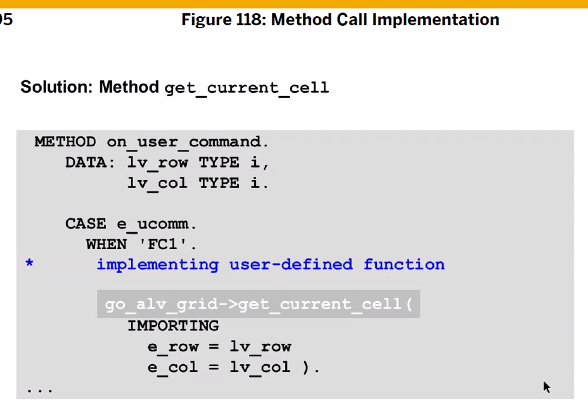


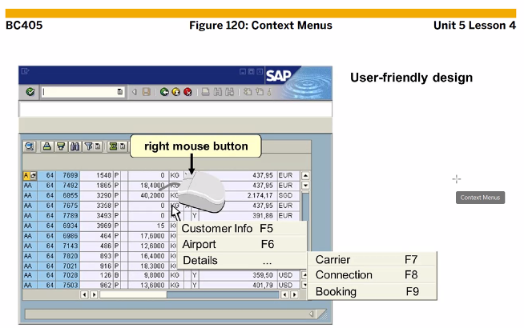
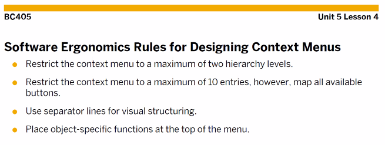

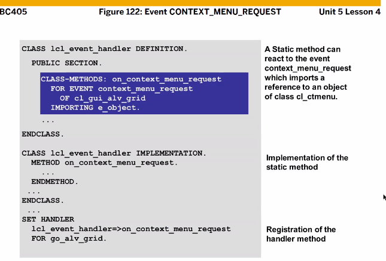
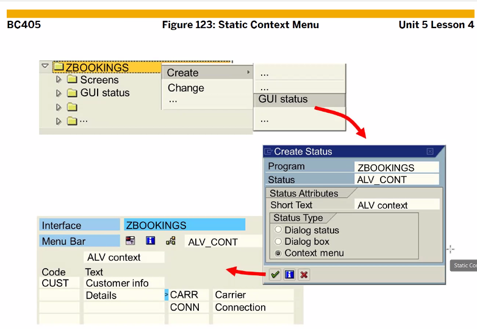
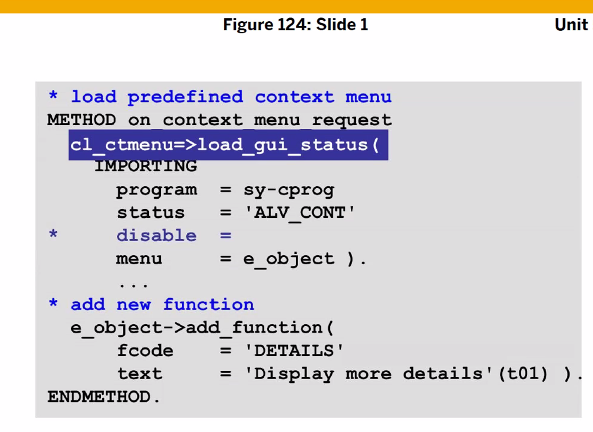
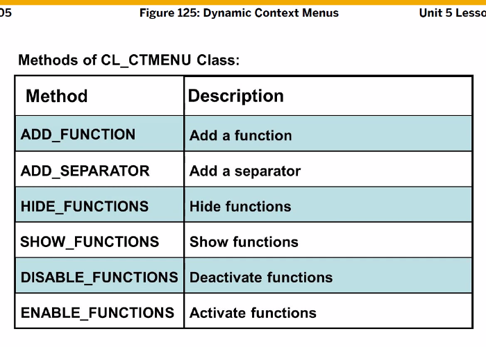
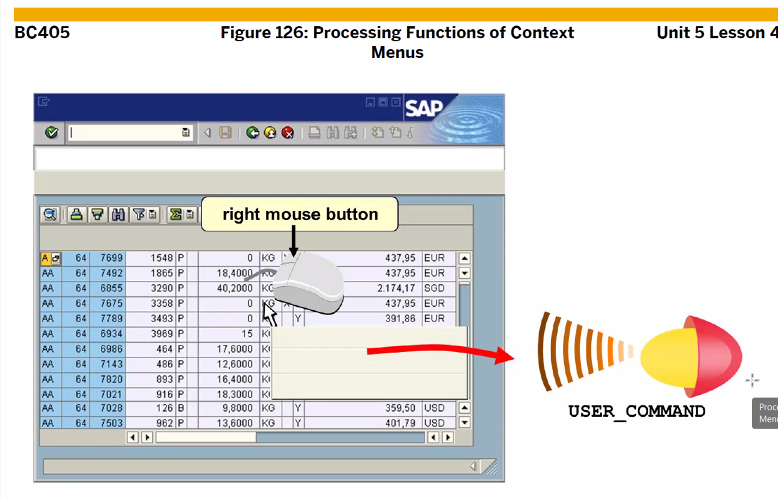


