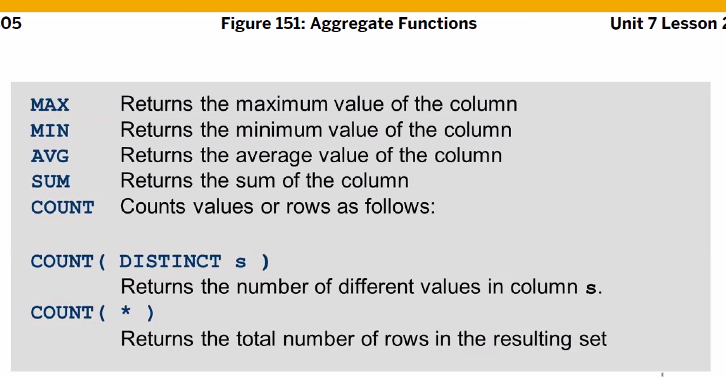
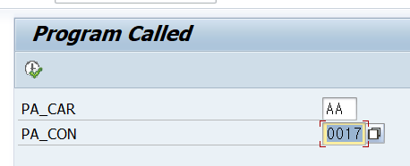
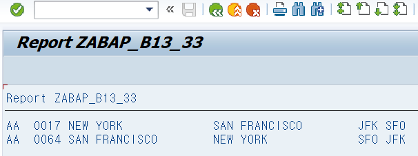
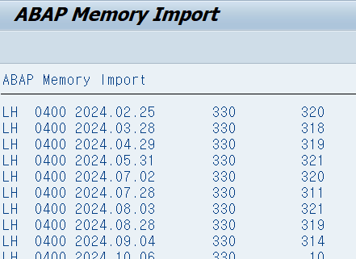
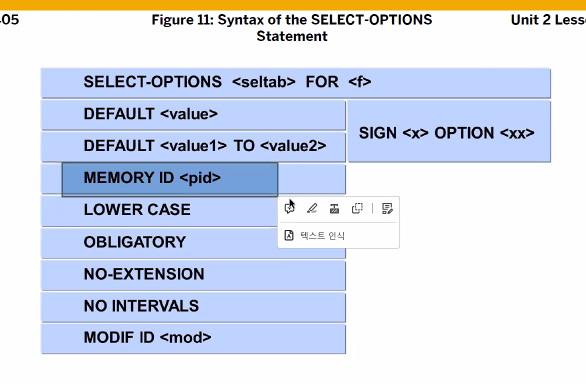
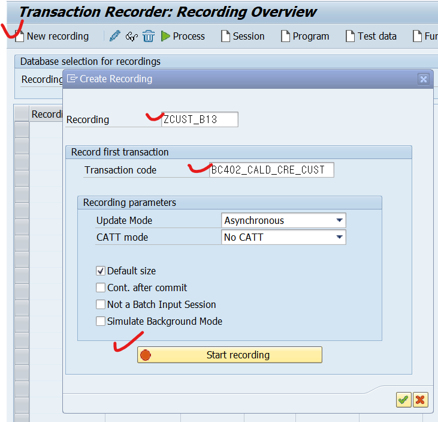

[TOC]

# DB 데이터 SELECT


여러 테이블에서 데이터를 읽어오는 방법


Database view 의 장점

- 다른 프로그램에서도 사용 가능
- 하나의 select 구문으로 사용 가능


OpenSQL 은 테이블 이름과 컬럼 이름 구분은 구분자 (~ 틸드) 가 필요하다.

```ABAP
*--------------------------------------------------------------------*
*                         Task 3 : Insert Data
*
* 1. SBOOK의 데이터를 기준으로 SPFLI와 SCUSTOM의 데이터를 JOIN 한다.
*    이때, 모든 테이블은 서로 존재하는 데이터만 취급하도록 한다. (INNER JOIN)
* 2. 데이터 검색 시, Selection Screen의 모든 입력필드가 검색조건에 포함 되어야 하며,
*    [체크박스]의 경우 체크 시, SBOOK의 필드 CANCELLED에 대해 조건 없음
*    [체크박스]의 경우 체크 해제 시, SBOOK의 필드 CANCELLED의 값이 공란인 레코드
* 3. 검색된 데이터는 Task 1의 테이블에 저장
*--------------------------------------------------------------------*

" 체크박스가 선택됐을 시, 수행되는 Subroutines
FORM INSERT_CHECKDATA.

  REFRESH GT_ZDETAIL. " Internal Table 초기화

  SELECT A~CARRID     " Airline Code
         A~CONNID     " Flight Connection Number
         A~FLDATE     " Flight date
         A~BOOKID     " Booking number
         A~CUSTOMID   " Customer Number
         A~ORDER_DATE " Booking Date
         A~CANCELLED  " Cancelation flag
         A~CLASS      " Flight Class
         B~COUNTRYFR  " Country Key
         B~CITYFROM   " Departure city
         B~COUNTRYTO  " Country Key
         B~CITYTO     " Arrival city
         C~NAME       " Customer name
         C~FORM       " Form of address
         C~CITY       " City
         C~COUNTRY    " Country Code
         C~REGION     " Region
         A~FORCURAM   " Booking price in foreign currency
         A~FORCURKEY  " Payment currency
         A~LOCCURAM   " Price of booking in local currency of airline
         A~LOCCURKEY  " Local currency of airline

  " SCARR 테이블과 SPFLI 테이블을 공통된 키 필드인 'CARRID'과 'CONNID'를
  " 통해 Inner Join을 수행
  FROM SBOOK AS A
  INNER JOIN SPFLI AS B
  ON A~CARRID EQ B~CARRID AND A~CONNID EQ B~CONNID

  " SCUSTOM의 테이블의 키필드인 ID와 SBOOK의 CUSTOMID를 Inner Join 함
  INNER JOIN SCUSTOM AS C
  ON A~CUSTOMID EQ C~ID

  " Internal Table에 데이터를 삽입. 이때 Corrspondig을 사용하여
  " 일치하는 필드에 데이터를 넣음
  INTO CORRESPONDING FIELDS OF TABLE GT_ZDETAIL

  WHERE A~CARRID IN SO_CAR AND  " SELECT-OPTION의 SO_CAR (Airline)이 조건에 포함
  A~CONNID IN SO_CON AND        " SELECT-OPTION의 SO_CON (Connection Number)이 조건에 포함
  A~FLDATE IN SO_FLD AND        " SELECT-OPTION의 SO_FLD (Flight Date)이 조건에 포함
  A~ORDER_DATE IN SO_POD AND    " SELECT-OPTION의 SO_POD (Posting Date)이 조건에 포함
  B~COUNTRYFR IN SO_COFR AND    " SELECT-OPTION의 SO_COFR (Depart. Coutry)이 조건에 포함
  B~CITYFROM IN SO_CIFR AND     " SELECT-OPTION의 SO_CIFR (Depart. City)이 조건에 포함
  B~COUNTRYTO IN SO_COTO AND    " SELECT-OPTION의 SO_COTO (Arrival Country)이 조건에 포함
  B~CITYTO IN SO_CITO.          " SELECT-OPTION의 SO_CITO (Arrival City)이 조건에 포함

  " 기존에 Insert 시 DB 테이블에 존재하는 데이터를 지우기 위해 선언함.
  DELETE FROM ZDETAIL_E03.
  " Internal Table의 결과 값을 생성한 DB 테이블 (ZDETAIL_E03)에 삽입
  INSERT ZDETAIL_E03 FROM TABLE GT_ZDETAIL.

ENDFORM.


" 체크박스가 미 선택됐을 시, 수행되는 Subroutines
FORM INSERT_NOCHECKDATA.

  REFRESH GT_ZDETAIL. " Internal Table 초기화

  SELECT A~CARRID     " Airline Code
         A~CONNID     " Flight Connection Number
         A~FLDATE     " Flight date
         A~BOOKID     " Booking number
         A~CUSTOMID   " Customer Number
         A~ORDER_DATE " Booking Date
         A~CANCELLED  " Cancelation flag
         A~CLASS      " Flight Class
         B~COUNTRYFR  " Country Key
         B~CITYFROM   " Departure city
         B~COUNTRYTO  " Country Key
         B~CITYTO     " Arrival city
         C~NAME       " Customer name
         C~FORM       " Form of address
         C~CITY       " City
         C~COUNTRY    " Country Code
         C~REGION     " Region
         A~FORCURAM   " Booking price in foreign currency
         A~FORCURKEY  " Payment currency
         A~LOCCURAM   " Price of booking in local currency of airline
         A~LOCCURKEY  " Local currency of airline

  " WHERE의 한가지 조건을 제외하고 위와 동일함
  FROM SBOOK AS A
  INNER JOIN SPFLI AS B
  ON A~CARRID EQ B~CARRID AND A~CONNID EQ B~CONNID

  INNER JOIN SCUSTOM AS C
  ON A~CUSTOMID EQ C~ID

  INTO CORRESPONDING FIELDS OF TABLE GT_ZDETAIL


  WHERE A~CARRID IN SO_CAR AND
  A~CONNID IN SO_CON AND
  A~FLDATE IN SO_FLD AND
  A~ORDER_DATE IN SO_POD AND
  B~COUNTRYFR IN SO_COFR AND
  B~CITYFROM IN SO_CIFR AND
  B~COUNTRYTO IN SO_COTO AND
  B~CITYTO IN SO_CITO AND
  A~CANCELLED NE GC_MARK. " GC_MARK는 상수로써 'X'의 값을 가짐. 따라서
                          " CANCELLED의 값이 공란인 레코드만을 조회하기 위해
                          " CANCELLED 필드에서 'X' 가 아닌 값만 조회될 수
                          " 있도록 조건을 추가함.

  " 기존에 Insert 시 DB 테이블에 존재하는 데이터를 지우기 위해 선언함.
  DELETE FROM ZDETAIL_E03.
  " Internal Table의 결과 값을 생성한 DB 테이블 (ZDETAIL_E03)에 삽입.
  INSERT ZDETAIL_E03 FROM TABLE GT_ZDETAIL.


ENDFORM.

```


**SQL문과 다른 점**

- LEFT JOIN이라면 오른쪽 테이블의 컬럼을 WHERE절 안에서 사용 할 수 없다.

# FOR ALL ENTRIES IN 


**FOR ALL ENTRIES IN** (인터널 테이블) 이 온다.
데이터가 NULL일 경우 에러 그래서 IF SY-SUBRC 체크가 필요하다.
또한 중복된 데이터가 있을 경우 제거가 필요하다. (DELETE), SORT 하지 않고 지울 경우 문제가 생기니 그 전에 SORT도 필수이다.

FOR ALL ENTY 구문은 인터널 테이블과 데이터베이스의 테이블을 JOIN 하는 개념과 유사하며 , 이것도 LOOP를 돌면서 SQL을 수행한다.
데이터베이스에 반복적으로 접근하기 때문에 데이터베이스 테이블간의 JOIN 보다는 비효율적일 수 있지만 ABAP 언어에서 많은 경우에 유용하게 활용된다. 예를 들어 다음 왼쪽의 SQL 구문은 오른쪽 구문처럼 FOR ALL ENTRY 구문에 사용된 인터널 테이블의 데이터가 5개씩 그룹으로 나뉘어 SQL이 반복 수행된다. 이 5개의 제한은 SAP 파라미터를 이용해서 변경이 가능하다. 

[](https://github.com/hansung0904/ABAP-Study/blob/main/ABAP정리/img/1-19.png)

항공시 스케줄 정보를 저장하고 있는 spfli 테이블의 모든 데이터를 가져와서, FOR ALL ENTRIES 구문을 이용해서 일자별 항공기 운항 정보 테이블에서 관련 데이터를 SELECT 하는 프로그램을 만들어보자.

```ABAP
DATA gt_spfli TYPE TABLE OF spfli.
DATA gt_sflight TYPE TABLE OF sflight.
DATA gs_sflight TYPE sflight.

SELECT * FROM spfli
INTO TABLE gt_spfli.

SELECT * FROM sflight
        INTO TABLE gt_sflight
        FOR ALL ENTRIES IN gt_spfli
        WHERE carrid = gt_spfli-carrid
        AND connid = gt_spfli-connid.

LOOP AT gt_sflight INTO gs_sflight.
    WRITE :/ gs_sflight-carrid, gs_sflight-connid.
ENDLOOP.  
```

```ABAP
*&---------------------------------------------------------------------*
*& Report ZBC405_B13_INNER_JOIN
*&---------------------------------------------------------------------*
*&
*&---------------------------------------------------------------------*
REPORT ZBC405_B13_INNER_JOIN.

TYPES: BEGIN OF GTY_JOIN,
         CARRID     TYPE SPFLI-CARRID,
         CONNID     TYPE SPFLI-CONNID,
         FLDATE     TYPE SFLIGHT-FLDATE,
         CITYFROM   TYPE SPFLI-CITYFROM,
         CITYTO     TYPE SPFLI-CITYTO,
         FLTIME     TYPE SPFLI-FLTIME,
         SEATSMAX   TYPE SFLIGHT-SEATSMAX,
         SEATSOCC   TYPE SFLIGHT-SEATSOCC,
         PLANETYPE  TYPE SAPLANE-PLANETYPE,
         OP_SPEED   TYPE SAPLANE-OP_SPEED,
         SPEED_UNIT TYPE SAPLANE-SPEED_UNIT,
       END OF GTY_JOIN.

DATA: GT_JOIN     TYPE TABLE OF GTY_JOIN,
      GS_JOIN     TYPE GTY_JOIN,
      GO_ALV_GRID TYPE REF TO CL_SALV_TABLE.

SELECT-OPTIONS: SO_CAR FOR GS_JOIN-CARRID MEMORY ID CAR.


START-OF-SELECTION.

* JOIN한 테이블들중에 컬럼이 중복될 경우 ~ 틸드를 써서 사용하도록 한다.
  SELECT
    SPFLI~CARRID SPFLI~CONNID
    FLDATE
    CITYFROM CITYTO FLTIME
    SFLIGHT~SEATSMAX SEATSOCC
    SFLIGHT~PLANETYPE OP_SPEED SPEED_UNIT

    INTO CORRESPONDING FIELDS OF TABLE GT_JOIN
    FROM SPFLI INNER JOIN SFLIGHT
    ON SPFLI~CARRID = SFLIGHT~CARRID AND
    SPFLI~CONNID = SFLIGHT~CONNID

    INNER JOIN SAPLANE
    ON SFLIGHT~PLANETYPE = SAPLANE~PLANETYPE

    WHERE SPFLI~CARRID IN SO_CAR.


  CALL METHOD CL_SALV_TABLE=>FACTORY
    IMPORTING
      R_SALV_TABLE = GO_ALV_GRID                        " Basis Class Simple ALV Tables
    CHANGING
      T_TABLE      = GT_JOIN. "INTERNAL TABLE

  GO_ALV_GRID->DISPLAY( ).
```


혹은 LOOP문도 사용 가능
하지만 위에는 좋은 방식이 아니다 (가독성)


COUNT(*) 쓸때 INTO 생략가능



```ABAP
REPORT ZABAP_B13_30.

DATA: BEGIN OF GS_FLIGHT,
        CARRID TYPE SFLIGHT-CARRID,
        CONNID TYPE SFLIGHT-CONNID,
        TOTMAX TYPE SFLIGHT-SEATSMAX,
        TOTOCC TYPE SFLIGHT-SEATSOCC,
        ROWCNT TYPE I,
      END OF GS_FLIGHT,
      GT_FLIGHT LIKE TABLE OF GS_FLIGHT.

SELECT-OPTIONS: SO_CAR FOR GS_FLIGHT-CARRID.

SELECT CARRID CONNID
  SUM( SEATSMAX )
  SUM( SEATSOCC )
  COUNT( * )
  INTO TABLE GT_FLIGHT
  FROM SFLIGHT
  WHERE CARRID IN SO_CAR
  GROUP BY CARRID CONNID.

SORT GT_FLIGHT BY CARRID CONNID.

CL_DEMO_OUTPUT=>DISPLAY( GT_FLIGHT ).
```


## 데이터 중복 제거 DISTINCT


```ABAP
REPORT ZABAP_B13_31.

TYPES: BEGIN OF TS_DATA,
         CONALL TYPE I,
         CONDIS TYPE I,
         SUMALL TYPE I,
         SUMDIS TYPE I,
       END OF TS_DATA.

DATA: GS_DATA TYPE TS_DATA.

SELECT COUNT( * ) COUNT( DISTINCT CARRID )
  SUM( SEATSOCC ) SUM( DISTINCT SEATSOCC )
  INTO GS_DATA
  FROM SFLIGHT.

CL_DEMO_OUTPUT=>DISPLAY( GS_DATA ).
```


# CALL PROGRAM


internal session = MEMORY ID 사용한게 이것임, Screen element에 attribute가 있는데 이 getParam, setParam이 예시 중 하나.

1번에서 2번을 call transaction으로 호출을 하게 되면 external session에 새로운 internal session이 생성된다. 따라서 2번 스크린에 internal session이 두개가 있는 것이다.


## 실습

32번 프로그램에서 33번 프로그램을 보여줘

```ABAP
REPORT ZABAP_B13_32.

DATA: GT_FLIGHT TYPE TABLE OF SFLIGHT,
      GS_FLIGHT LIKE LINE OF GT_FLIGHT.

PARAMETERS: PA_CAR TYPE SFLIGHT-CARRID,
            PA_CON TYPE SFLIGHT-CONNID.

SELECT *
  INTO CORRESPONDING FIELDS OF TABLE GT_FLIGHT
  FROM SFLIGHT
  WHERE CARRID = PA_CAR
  AND CONNID = PA_CON.

* 33번 프로그램을 한번 호출해보자
SUBMIT ZABAP_B13_33
  WITH PA_CARR = PA_CAR" 33번 PA_CARR = 33번 PA_CAR\
  VIA SELECTION-SCREEN " 이 구문이 오면 32번의 값 pa_car 를 을 33번 pa_carr로 보내버리고 selection screen을 보여준다
  AND RETURN. "Insert program으로 호출하겠다. 뒤로 돌아갈 경우 32번 writr문이 등장함.
* 만약 and return이 없을 경우 33번 writr문만 나와

LOOP AT GT_FLIGHT INTO GS_FLIGHT.
  WRITE:/ GS_FLIGHT-CARRID,
          GS_FLIGHT-CONNID,
          GS_FLIGHT-FLDATE,
          GS_FLIGHT-SEATSMAX,
          GS_FLIGHT-SEATSOCC.
ENDLOOP.
```

33번 프로그램

```ABAP
REPORT ZABAP_B13_33.

DATA: GT_CONNECT TYPE TABLE OF SPFLI,
      GS_CONNECT LIKE LINE OF GT_CONNECT.
*      GS_CONNECT TYPE GT_CONNECT.

PARAMETERS: PA_CARR TYPE SPFLI-CARRID.

SELECT *
  INTO CORRESPONDING FIELDS OF TABLE GT_CONNECT
  FROM SPFLI
  WHERE CARRID = PA_CARR.

LOOP AT GT_CONNECT INTO GS_CONNECT.
  WRITE:/ GS_CONNECT-CARRID,
          GS_CONNECT-CONNID,
          GS_CONNECT-CITYFROM,
          GS_CONNECT-CITYTO,
          GS_CONNECT-AIRPFROM,
          GS_CONNECT-AIRPTO.
ENDLOOP.
```




back back


# ABAP Memory


gs_spfli를 gs_p2에 저장할래

## 실습

SFT라는 ID를 아밥 메모리에 보내서 34번과 35번 프로그램 연결해보기
34번

```ABAP
REPORT ZABAP_B13_34.

DATA: GT_SFLIGHT TYPE TABLE OF SFLIGHT.

PARAMETERS: PA_CAR TYPE SFLIGHT-CARRID.

SELECT *
  INTO TABLE GT_SFLIGHT
  FROM SFLIGHT
  WHERE CARRID = PA_CAR.

EXPORT
  FLIGHT = GT_SFLIGHT
  TO MEMORY ID 'SFT'.
```

35번

```ABAP
REPORT ZABAP_B13_35.

DATA: GT_FLIGHT TYPE TABLE OF SFLIGHT,
      GS_FLIGHT LIKE LINE OF GT_FLIGHT.

IMPORT
  FLIGHT = GT_FLIGHT
  FROM MEMORY ID 'SFT'.

LOOP AT GT_FLIGHT INTO GS_FLIGHT.
  WRITE:/ GS_FLIGHT-CARRID,
          GS_FLIGHT-CONNID,
          GS_FLIGHT-FLDATE,
          GS_FLIGHT-SEATSMAX,
          GS_FLIGHT-SEATSOCC.
ENDLOOP.
```

34번에서 LH 넣고 실행

35번 실행하면 데이터 뜸

BUT, 만약에 새로운 SAP GUI (/ose80)을 실행하면 abap memory는 남아있지 않아서 실행이 안된다. 동기화 xx session 같은 존재





 교재 오타


# BCD 프로그램


여러개의 데이터를 처리하는 것 (배치 데이터) BDC 프로그램

## 실습

/SHDB



이 데이터들을 internal table에 채우자

### 잠깐만, search help 생성하는 방법


abap dic에서 만든 search help는 table이나 view를 기반으로 만들어진다.
근데 db만 가지고 search help를 만드는건 아니라서 db에 없는걸로 search help를 띄워야 되는 경우가 있다. 이때 위와 같이 사용한다.

이런 파일 탐색기를 OPEN 하려할때 사용한다.

```ABAP
REPORT ZABAP_B13_36.

DATA: GT_BDC TYPE TABLE OF BDCDATA,
      GS_BDC LIKE LINE OF GT_BDC.

PARAMETERS: PA_FILE TYPE STRING.

* Search Help 만들어주는 거
AT SELECTION-SCREEN ON VALUE-REQUEST FOR PA_FILE.
  PERFORM GET_FILE.
*&---------------------------------------------------------------------*
*& Form GET_FILE
*&---------------------------------------------------------------------*
*& text
*&---------------------------------------------------------------------*
*& -->  p1        text
*& <--  p2        text
*&---------------------------------------------------------------------*
FORM GET_FILE .
  DATA: LT_FILE TYPE FILETABLE,
        LS_FILE LIKE LINE OF LT_FILE,
        LV_RC   TYPE I.

  CALL METHOD CL_GUI_FRONTEND_SERVICES=>FILE_OPEN_DIALOG
    CHANGING
      FILE_TABLE              = LT_FILE             " Table Holding Selected Files
      RC                      = LV_RC      " Return Code, Number of Files or -1 If Error Occurred
    EXCEPTIONS
      FILE_OPEN_DIALOG_FAILED = 1                " "Open File" dialog failed
      CNTL_ERROR              = 2                " Control error
      ERROR_NO_GUI            = 3                " No GUI available
      NOT_SUPPORTED_BY_GUI    = 4                " GUI does not support this
      OTHERS                  = 5.

  IF SY-SUBRC = 0.
    READ TABLE LT_FILE INTO LS_FILE INDEX 1.
    PA_FILE = LS_FILE-FILENAME.
  ENDIF.
ENDFORM.
```

BDC 예시
```ABAP
REPORT ZABAP_B13_36.

DATA: GT_BDC TYPE TABLE OF BDCDATA,
      GS_BDC LIKE LINE OF GT_BDC.

PARAMETERS: PA_FILE TYPE STRING.

* Search Help 만들어주는 거
AT SELECTION-SCREEN ON VALUE-REQUEST FOR PA_FILE.
  PERFORM GET_FILE.


START-OF-SELECTION.
* 첫번째 레코드 : 프로그램 이름
  GS_BDC-PROGRAM = 'SAPBC402_PGCD_CREATE_CUSTOMER'.
  GS_BDC-DYNPRO = '0100'.
  GS_BDC-DYNBEGIN = 'X'.
  APPEND GS_BDC TO GT_BDC.

  CLEAR: GS_BDC.
  GS_BDC-FNAM = 'SCUSTOM-NAME'.
  GS_BDC-FVAL = '김철수'.
  APPEND GS_BDC TO GT_BDC.

  CLEAR: GS_BDC.
  GS_BDC-FNAM = 'SCUSTOM-STREET'.
  GS_BDC-FVAL = '서울시 종로구'.
  APPEND GS_BDC TO GT_BDC.

  CLEAR: GS_BDC.
  GS_BDC-FNAM = 'SCUSTOM-POSTCODE'.
  GS_BDC-FVAL = '123456'.
  APPEND GS_BDC TO GT_BDC.

  CLEAR: GS_BDC.
  GS_BDC-FNAM = 'SCUSTOM-CITY'.
  GS_BDC-FVAL = '서울'.
  APPEND GS_BDC TO GT_BDC.

  CALL TRANSACTION 'BC402_CALD_CRE_CUST'
     USING GT_BDC
     MODE 'A'. "화면표시
*&---------------------------------------------------------------------*
*& Form GET_FILE
*&---------------------------------------------------------------------*
*& text
*&---------------------------------------------------------------------*
*& -->  p1        text
*& <--  p2        text
*&---------------------------------------------------------------------*
FORM GET_FILE .
  DATA: LT_FILE TYPE FILETABLE,
        LS_FILE LIKE LINE OF LT_FILE,
        LV_RC   TYPE I.

  CALL METHOD CL_GUI_FRONTEND_SERVICES=>FILE_OPEN_DIALOG
    CHANGING
      FILE_TABLE              = LT_FILE             " Table Holding Selected Files
      RC                      = LV_RC      " Return Code, Number of Files or -1 If Error Occurred
    EXCEPTIONS
      FILE_OPEN_DIALOG_FAILED = 1                " "Open File" dialog failed
      CNTL_ERROR              = 2                " Control error
      ERROR_NO_GUI            = 3                " No GUI available
      NOT_SUPPORTED_BY_GUI    = 4                " GUI does not support this
      OTHERS                  = 5.

  IF SY-SUBRC = 0.
    READ TABLE LT_FILE INTO LS_FILE INDEX 1.
    PA_FILE = LS_FILE-FILENAME.
  ENDIF.
ENDFORM.
```


# SALV


Factory 메서드를 이용해 alv obj를 생성하고 it에 데이터도 같이 넘겨준다.
그리고 dispaly라는 메소드를 이용해 full screen으로 데이터 표시


