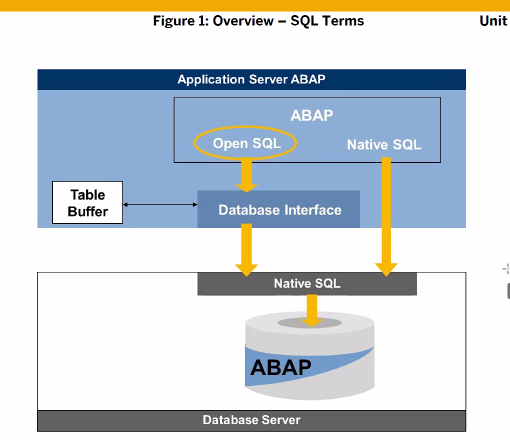
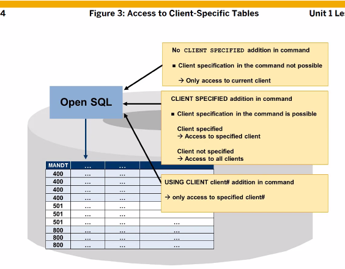
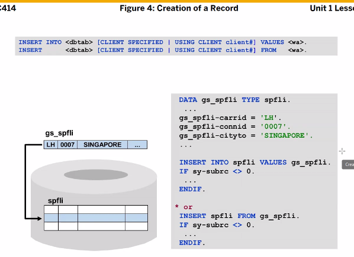
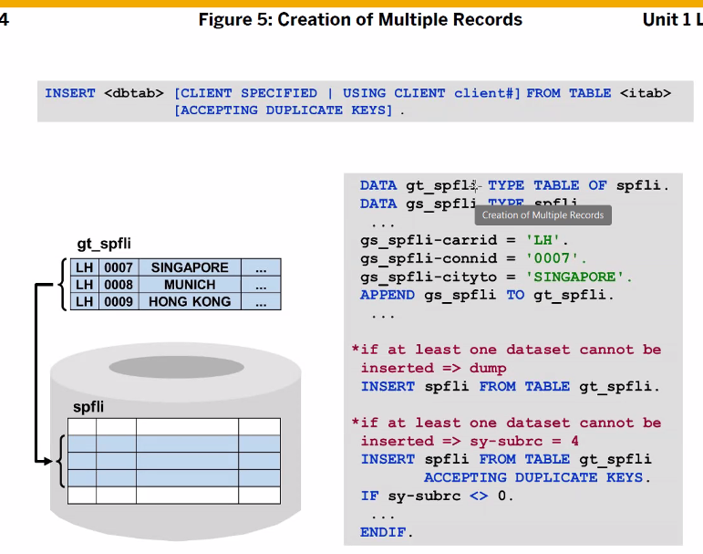
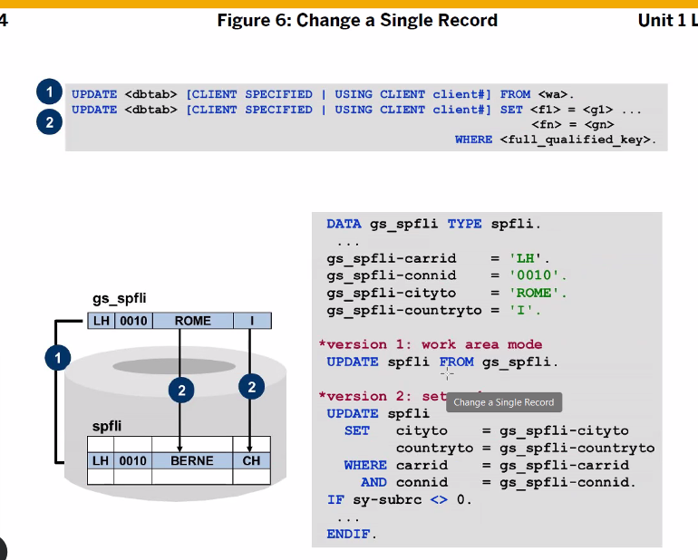
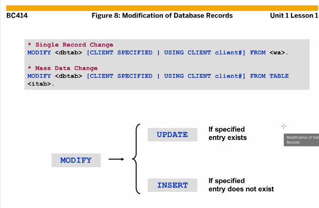
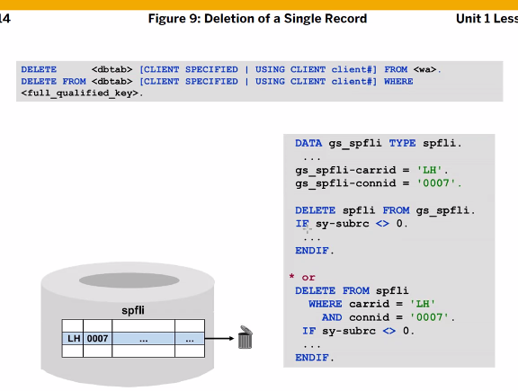
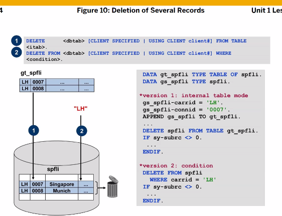
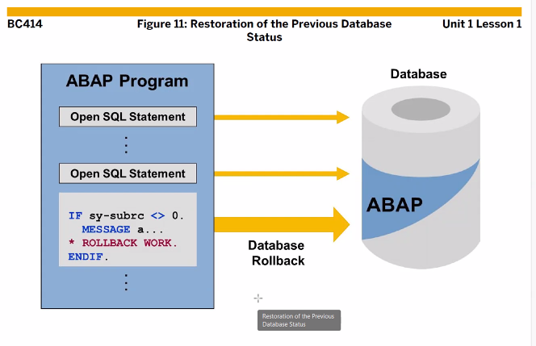

[TOC]

[정리](https://blog.naver.com/l_yh6/221464955368)

# OPEN SQL



내가 어떤 번호로 로그인하느냐에 따라 DB 구분해서 보여준다.
하지만 내가 다른 번호 DB를 읽어오고 싶다면
OPEN SQL 구문에 CLIENT SPECIFIED 를 추가해준다.
WHERE 절에 특정 클라이언트 번호를 적는데, 디폴트는 전부다.
USING CLIENT는 NEW OPEN SQL이다.

\* SELECT
DB TABLE에서 데이터를 읽어들임

\* INSERT
DB TABLE에 데이터를 추가함

\* UPDATA
DB TABLE에 데이터을 변경함

\* MODIFY
DB TABLE에 입력한 키값과 같은 DATA가 있다면 UPDATA, 같은 DATA가 없다면 INSERT

\* DELETE
DB TABLE에서 데이터를 삭제함

## SELECT

```ABAP
SELECT 읽어드릴 데이터 
INTO 변수
FROM 읽어드릴 테이블
WHERE 테이블을 읽을 때 조건
GROUP BY 그룹지정할 필드
HAVING 그룹의 조건
ORDER BY 정렬할 조건필드

* 하나의 LINE 을 읽어 올 경우
DATA : BEGIN OF gs_sflight,
         carrid TYPE sflight-carrid,
         connid TYPE sflight-connid,
       END OF gs_sflight.

SELECT SINGLE carrid
              connid INTO gs_sflight
  FROM sflight
  WHERE carrid = 'AA'. "사실상 AA가 하나이지 않기 때문에 여러 AA 중 임의의 라인을 반환하게 됨.

WRITE : 'Single LInes : ', gs_sflight-carrid, gs_sflight-connid.

CLEAR gs_sflight.
SKIP.

* 여러개의 LINE 을 읽어 올 경우
DATA : gt_sflight LIKE TABLE OF gs_sflight.

SELECT carrid
       connid INTO TABLE gt_sflight
  FROM sflight
  WHERE carrid = 'AA'.

WRITE 'Several Lines'.
LOOP AT gt_sflight INTO gs_sflight.

  WRITE :/ gs_sflight-carrid, gs_sflight-connid.

ENDLOOP.
```

## INSERT



DATA GS_DATA TYPE SPFLI (스트럭처 변수 생성)



중복된 데이터 넣으면 에러!! 주의 주의

> **INSERT INTO** ZTSFLIGHT_B13 VALUES GS_FLIGTH.
> **INSERT** ZTSFLIGHT_B13 **FROM** GS_FLIGTH.
> "사용하지말자 중복된 데이터를 넣으려면 DUPLICATE KEYS를 넣어주면 되는데 문제는 SY-SUBRC에서 4가 떨어짐
> **INSERT** ZTSFLIGHT_B13 **FROM TABLE** GT_FLIGHT **ACCEPTING DUPLICATE KEYS.** 

```ABAP
REPORT ZABAP_B13_37.

* Structure 변수 생성
DATA: GS_FLIGTH TYPE ZTSFLIGHT_B13.

GS_FLIGTH-CARRID = 'AA'.
GS_FLIGTH-CONNID = '0017'.
GS_FLIGTH-FLDATE = SY-DATUM.
GS_FLIGTH-SEATSMAX = 370.
GS_FLIGTH-SEATSOCC = 300.

INSERT INTO ZTSFLIGHT_B13 VALUES GS_FLIGTH.

CLEAR: GS_FLIGTH.

* 데이터 중복 막아줘 ( KEY 필드 )
GS_FLIGTH-CARRID = 'BB'.
GS_FLIGTH-CONNID = '0018'.
GS_FLIGTH-FLDATE = SY-DATUM.
GS_FLIGTH-SEATSMAX = 370.
GS_FLIGTH-SEATSOCC = 300.

INSERT ZTSFLIGHT_B13 FROM GS_FLIGTH.

CLEAR: GS_FLIGTH.
SELECT SINGLE *
  INTO CORRESPONDING FIELDS OF GS_FLIGTH
  FROM SFLIGHT
  WHERE CARRID = 'LH'
    AND CONNID = '0400'
    AND FLDATE = '20240225'.

INSERT INTO ZTSFLIGHT_B13 VALUES GS_FLIGTH.

IF SY-SUBRC = 0.
  MESSAGE 'Success, data save' TYPE 'I'.
ELSE.
  MESSAGE 'Error, data save' TYPE 'I'.
ENDIF.
```

```ABAP
*&---------------------------------------------------------------------*
*& Report ZABAP_B13_37
*&---------------------------------------------------------------------*
*&
*&---------------------------------------------------------------------*
REPORT ZABAP_B13_37.

* Structure 변수 생성
DATA: GS_FLIGTH TYPE ZTSFLIGHT_B13,
      GT_FLIGHT TYPE TABLE OF ZTSFLIGHT_B00.

GS_FLIGTH-CARRID = 'AA'.
GS_FLIGTH-CONNID = '0017'.
GS_FLIGTH-FLDATE = SY-DATUM.
GS_FLIGTH-SEATSMAX = 370.
GS_FLIGTH-SEATSOCC = 300.

INSERT INTO ZTSFLIGHT_B13 VALUES GS_FLIGTH.

CLEAR: GS_FLIGTH.

* 데이터 중복 막아줘 ( KEY 필드 )
GS_FLIGTH-CARRID = 'BB'.
GS_FLIGTH-CONNID = '0018'.
GS_FLIGTH-FLDATE = SY-DATUM.
GS_FLIGTH-SEATSMAX = 370.
GS_FLIGTH-SEATSOCC = 300.

INSERT ZTSFLIGHT_B13 FROM GS_FLIGTH.

CLEAR: GS_FLIGTH.
SELECT SINGLE *
  INTO CORRESPONDING FIELDS OF GS_FLIGTH
  FROM SFLIGHT
  WHERE CARRID = 'LH'
    AND CONNID = '0400'
    AND FLDATE = '20240225'.

INSERT INTO ZTSFLIGHT_B13 VALUES GS_FLIGTH.

SELECT *
  INTO CORRESPONDING FIELDS OF TABLE GT_FLIGHT
  FROM SFLIGHT
  WHERE CARRID = 'LH'.

INSERT ZTSFLIGHT_B13 FROM TABLE GT_FLIGHT
ACCEPTING DUPLICATE KEYS. "사용하지말자

IF SY-SUBRC = 0.
  MESSAGE 'Success, data save' TYPE 'I'.
ELSE.
  MESSAGE 'Error, data save' TYPE 'I'.
ENDIF.
```

```ABAP
```


## UPDATE


한건의 데이터 UPDATE
WHERE 절에 해당 테이블의 키필드가 전부 와야 한다.

> **UPDATE** ZTSFLIGHT_B13 **FROM** GS_FLIGHT.
>
> 아래는 테이블의 모든 키필드가 WHERE 절에 와야 한다.
>
> **UPDATE** ZTSFLIGHT_B13 **SET** SEATSMAX_B = 123
>                          SEATSOCC_B = 456
>                          SEATSMAX_F = 1
>                          SEATSOCC_F = 7
> **WHERE** CARRID = 'AA'
>   **AND** CONNID = '0017'
>   **AND** FLDATE = '20240820'.
>
> 테이블의 여러 데이터를 한꺼번에 변경 하려면
> **UPDATE** ZTSFLIGHT_B13 **FROM TABLE** GT_FLIGHT.
>
> **UPDATE** ZTSFLIGHT_B13
>   **SET** PRICE = '10.00' CURRENCY = 'USD'
>   **WHERE** CARRID = 'LH'
>    **AND** CONNID = '0400'.

```ABAP
REPORT ZABAP_B13_38.

DATA: GS_FLIGHT TYPE ZTSFLIGHT_B13,
      GT_FLIGHT LIKE TABLE OF GS_FLIGHT.

SELECT SINGLE *
  INTO CORRESPONDING FIELDS OF GS_FLIGHT
  FROM ZTSFLIGHT_B13
  WHERE CARRID = 'AA'
    AND CONNID = '0017'
    AND FLDATE = SY-DATUM.

IF SY-SUBRC = 0.
  GS_FLIGHT-PRICE = '422.94'.
  GS_FLIGHT-CURRENCY = 'USD'.
  GS_FLIGHT-PLANETYPE = '747-400'.
  GS_FLIGHT-PAYMENTSUM = '192860.89'.

*  UPDATE ZTSFLIGHT_B13 FROM GS_FLIGHT.
  UPDATE ZTSFLIGHT_B13 SET SEATSMAX_B = 123
                           SEATSOCC_B = 456
                           SEATSMAX_F = 1
                           SEATSOCC_F = 7
  WHERE CARRID = 'AA'
    AND CONNID = '0017'
    AND FLDATE = '20240820'.

  IF SY-SUBRC = 0.
    MESSAGE 'Success, data save' TYPE 'I'.
  ELSE.
    MESSAGE 'Error, data save' TYPE 'I'.
  ENDIF.
ENDIF.
```

##  MODIFY


< MODIFY >
데이터가 존재하면 UPDATE
데이터가 없으면 INSERT

> **MODIFY** GT_FLIGHT **FROM** GS_FLIGHT.
> **MODIFY** ZTSFLIGHT_B13 **FROM TABLE** GT_FLIGHT.

```ABAP
REPORT ZABAP_B13_40.

DATA: GS_FLIGHT TYPE ZTSFLIGHT_B13,
      GT_FLIGHT LIKE TABLE OF GS_FLIGHT.

SELECT *
  INTO CORRESPONDING FIELDS OF TABLE GT_FLIGHT
  FROM ZTSFLIGHT_B13
  WHERE CARRID = 'LH'
    AND CONNID = '0400'.

LOOP AT GT_FLIGHT INTO GS_FLIGHT.
  GS_FLIGHT-PRICE = '777.7'.
  GS_FLIGHT-CURRENCY = 'EUR'.

  MODIFY GT_FLIGHT FROM GS_FLIGHT.
  CLEAR: GS_FLIGHT.
ENDLOOP.

* APPENDING이 있기에 위에랑 이어져서? ADD 해서 사용이 가능한 것이다.
SELECT *
  APPENDING CORRESPONDING FIELDS OF TABLE GT_FLIGHT
  FROM SFLIGHT
  WHERE CARRID = 'QF'
    AND CONNID = '0005'.

* 데이터가 존재하면 UPDATE
* 데이터가 없으면 INSERT
MODIFY ZTSFLIGHT_B13 FROM TABLE GT_FLIGHT.

IF SY-SUBRC = 0.
  MESSAGE 'Success, data save' TYPE 'I'.
ELSE.
  MESSAGE 'Error, data save' TYPE 'I'.
ENDIF.
```

## DELETE




> **DELETE** ZTSFLIGHT_B13 FROM **TABLE** GT_FLIGHT.
> **DELETE FROM** ZTSFLIGHT_B13 **WHERE** CURRENCY = 'AUD'.

```ABAP
REPORT ZABAP_B13_41.

DATA: GS_FLIGHT TYPE ZTSFLIGHT_B13,
      GT_FLIGHT LIKE TABLE OF GS_FLIGHT.

GS_FLIGHT-CARRID = 'AA'.
GS_FLIGHT-CONNID = '0017'.
GS_FLIGHT-FLDATE = SY-DATUM.

*DELETE ZTSFLIGHT_B13 FROM GS_FLIGHT.

SELECT *
  INTO CORRESPONDING FIELDS OF TABLE GT_FLIGHT
  FROM ZTSFLIGHT_B13
  WHERE CARRID = 'LH'
  AND CONNID = '0402'.

*DELETE ZTSFLIGHT_B13 FROM TABLE GT_FLIGHT.
DELETE FROM ZTSFLIGHT_B13 WHERE CURRENCY = 'AUD'.


IF SY-SUBRC = 0.
  MESSAGE 'Success, data save' TYPE 'I'.
ELSE.
  MESSAGE 'Error, data save' TYPE 'I'.
ENDIF.
```

# ROLL BACK


여러건의 데이터 처리 하다가 이슈가 생기면 ROLL BACK이 필요하다.
