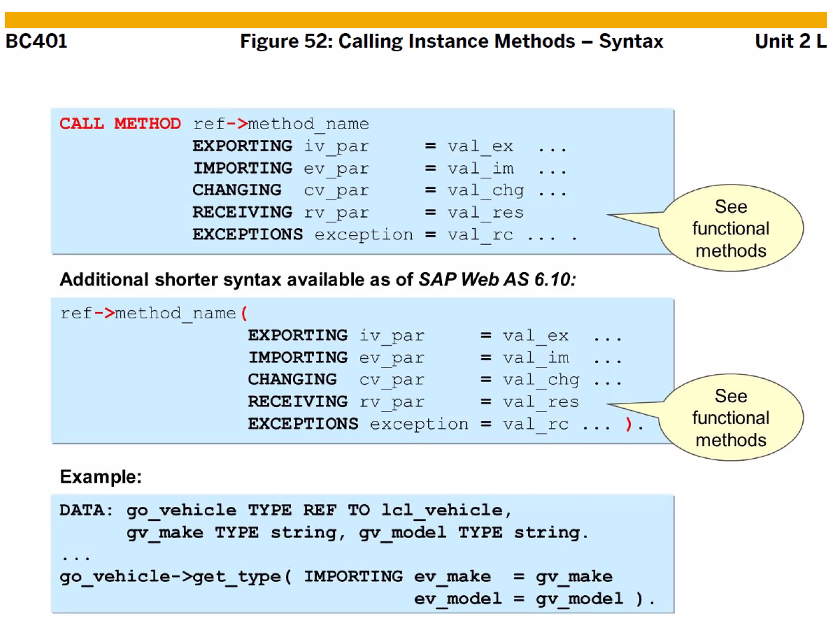

[TOC]

# ABAP Object


C++ , JAVA의 합성 => ABAP Object


TYPE 선언 후 DATA 즉 변수 선언 후 스크린 후 메인 프로그램 안에 서브루틴 혹은 Function module 

Function module 은 Function Group 안에 있어요.

FUCTION GROUP 이름은 앞에 SAL이 붙는다.


main 프로그램이라해도 각각의 모듈에 있는 데이터를 읽거나 변경할 수 없다. (즉, 캡슐화 되어 있다.)

그럼 어떻게 접근하냐? 메인 프로그램과 모듈끼리 데이터를 주고 받는건
Function modules 에서는 파라미터들을 인터페이스
Method에서는 파라미터들을 시그니처 라고 한다.


여러개의 인스턴스 (object)를 생성해서 사용할 수 없다.


붕어빵 틀 하나로 슈크림, 팥, 피자 가능해요

call fuction module을 실행하면 fuction group이 호출된다.
fm에는 에러가 없는데 fg에 에러가 있는 경우 존재함 주의
따라서 fg에 많은 fm을 생성하면 안된다. 보통 20개 내외로 만든다.


TABLES: 구문은 CLASS 안에서 사용 불가
F1 으로 Obsolete 되어 있는지 확인하기 ( abap object에서 사용 불가능 )

상속, 다양성, 이벤트 control


class는 object의 설명서 같은거 class에 의해 object 생성


class들의 관계 ( 클래스 다이어그램 )

서로 어떤 관계인가? association
예약을 했다면 예약한 고객 이름이 있어야 한다.
고객은 예약을 한번도 안 했을수도 있다.


# Creat Local Class


public 에는 주로 method나 event가 온다.
private에는 주로 data type, attribute가 온다.


definition에 메서드가 없다면 아래에 implementation은 정의하지 않아도 된다.


data는 public에 선언하지말자

static 선언 : CLASS-DATA


## 실습

```abap
REPORT ZABAP_B13_42.

* local class 생성.
* public -> protected -> private 순서! 꼭!
CLASS LCL_VEHICLE DEFINITION.
  PUBLIC SECTION.
*  Instance Method
    METHODS:
      SET_ATTRIBUTES IMPORTING IV_MAKE  TYPE STRING
                               IV_MODEL TYPE STRING,
      DISPLAY_ATTRIBUTES.

*   Static Method
    CLASS-METHODS:
      DISPLAY_N_O_VEHICLE.

  PRIVATE SECTION.
*  Instance Attribute.
    DATA: MV_MAKE  TYPE STRING,
          MV_MODEL TYPE STRING.
*    Static data 선언
    CLASS-DATA: GV_N_O_VEHICLE TYPE I.
ENDCLASS.

CLASS LCL_VEHICLE IMPLEMENTATION.
  METHOD SET_ATTRIBUTES.
    MV_MAKE = IV_MAKE.
    MV_MODEL = IV_MODEL.

    ADD 1 TO GV_N_O_VEHICLE.
  ENDMETHOD.

  METHOD DISPLAY_ATTRIBUTES.
    WRITE:/ 'Make :', MV_MAKE.
    WRITE:/ 'Model : ', MV_MODEL.
  ENDMETHOD.

* Static method에서는 static attr만 사용이 가능하다.
  METHOD DISPLAY_N_O_VEHICLE.
    WRITE:/ 'Number of Vehicle : ', GV_N_O_VEHICLE.
*    이와같이 인스턴스 attr이 오면 에러가 떨어진다.
*    WRITE:/ 'Make : ', MV_MAKE.
  ENDMETHOD.

ENDCLASS.
```


클래스를 create object 해서 포인터로 가르키는 것 ( 아 이래서 C++,,,,이였네 )


참조 변수는 LIKE로


CLASS를 ITAB으로 선언하는 방법

> TYPE TABLE OF REF TO


```ABAP
REPORT ZABAP_B13_42.

* local class 생성.
* public -> protected -> private 순서! 꼭!
CLASS LCL_VEHICLE DEFINITION.
  PUBLIC SECTION.
*  Instance Method
    METHODS:
      SET_ATTRIBUTES IMPORTING IV_MAKE  TYPE STRING
                               IV_MODEL TYPE STRING,
      DISPLAY_ATTRIBUTES.

*   Static Method
    CLASS-METHODS:
      DISPLAY_N_O_VEHICLE.

  PRIVATE SECTION.
*  Instance Attribute.
    DATA: MV_MAKE  TYPE STRING,
          MV_MODEL TYPE STRING.
*    Static data 선언
    CLASS-DATA: GV_N_O_VEHICLE TYPE I.
ENDCLASS.

CLASS LCL_VEHICLE IMPLEMENTATION.
  METHOD SET_ATTRIBUTES.
    MV_MAKE = IV_MAKE.
    MV_MODEL = IV_MODEL.

    ADD 1 TO GV_N_O_VEHICLE.
  ENDMETHOD.

  METHOD DISPLAY_ATTRIBUTES.
    WRITE:/ 'Make :', MV_MAKE.
    WRITE:/ 'Model : ', MV_MODEL.
  ENDMETHOD.

* Static method에서는 static attr만 사용이 가능하다.
  METHOD DISPLAY_N_O_VEHICLE.
    WRITE:/ 'Number of Vehicle : ', GV_N_O_VEHICLE.
*    이와같이 인스턴스 attr이 오면 에러가 떨어진다.
*    WRITE:/ 'Make : ', MV_MAKE.
  ENDMETHOD.

ENDCLASS.

DATA: GO_VEHICLE1 TYPE REF TO LCL_VEHICLE,
      GO_VEHICLE2 TYPE REF TO LCL_VEHICLE,
      GO_VEHICLE3 LIKE GO_VEHICLE1.

DATA: GO_VEHICLE TYPE REF TO LCL_VEHICLE,
      GT_VEHICLE TYPE TABLE OF REF TO LCL_VEHICLE.

START-OF-SELECTION.

CREATE OBJECT GO_VEHICLE.
APPEND GO_VEHICLE TO GT_VEHICLE.

CREATE OBJECT GO_VEHICLE.
APPEND GO_VEHICLE TO GT_VEHICLE.

CREATE OBJECT GO_VEHICLE.
APPEND GO_VEHICLE TO GT_VEHICLE.


*  CREATE OBJECT GO_VEHICLE1.
*
** GO_VEHICLE1에 포인터 하고 있다.
*  IF GO_VEHICLE1 IS NOT BOUND.
*
*  ENDIF.
*
**  이 변수에 포인터가 없다.
*  IF GO_VEHICLE1 IS INITIAL.
*
*  ENDIF.
*
**  이 변수에 포인터가 없다.
*  IF GO_VEHICLE1 IS BOUND.
*
*  ENDIF.
*
*  CREATE OBJECT GO_VEHICLE2.
*  CREATE OBJECT GO_VEHICLE3.

  IF SY-SUBRC = 0.

  ENDIF.
```

# Access Method and Attribute


return이 있는걸 Fuctional Method 라고 한다.


CALL METHOD 생략 가능함, 대신 ( )를 써줘야 함.

instance 와 static의 호출 방법이 다르다

| General Object, 인스턴스 메소드 | Static Object             |
| ------------------------------- | ------------------------- |
| cref -> attribute               | class=>attribute          |
| CALL METHOD cref- > method      | CALL METHOD class=>method |

>Instance는 call method 

```abap
CALL METHOD GO_VEHICLE->SET_ATTRIBUTES
LCL_VEHICLE=>DISPLAY_N_O_VEHICLE( ).

CLASS LCL_VEHICLE DEFINITION.
  PUBLIC SECTION.
*   Instance Method
    METHODS:
      SET_ATTRIBUTES IMPORTING IV_MAKE  TYPE STRING
                               IV_MODEL TYPE STRING,

      DISPLAY_ATTRIBUTES.

*   Static Method
    CLASS-METHODS:
      DISPLAY_N_O_VEHICLE.

  PRIVATE SECTION.
*   Instance Attriburte
    DATA: MV_MAKE  TYPE STRING,
          MV_MODEL TYPE STRING.
*   Static Attribute
    CLASS-DATA: GV_N_O_VEHICLE TYPE I.

ENDCLASS.

CLASS LCL_VEHICLE IMPLEMENTATION.
  METHOD SET_ATTRIBUTES.
    MV_MAKE = IV_MAKE.
    MV_MODEL = IV_MODEL.

    ADD 1 TO GV_N_O_VEHICLE.
  ENDMETHOD.

  METHOD DISPLAY_ATTRIBUTES.
    WRITE:/ 'Make  : ', MV_MAKE.
    WRITE:/ 'Model : ', MV_MODEL.
  ENDMETHOD.

  METHOD DISPLAY_N_O_VEHICLE.
    WRITE:/ 'Number of Vehicle : ', GV_N_O_VEHICLE.
  ENDMETHOD.

ENDCLASS.

*DATA: GO_VEHICLE1 TYPE REF TO LCL_VEHICLE,
*      GO_VEHICLE2 TYPE REF TO LCL_VEHICLE,
*      GO_VEHICLE3 LIKE GO_VEHICLE1.

DATA: GO_VEHICLE TYPE REF TO LCL_VEHICLE,
      GT_VEHICLE TYPE TABLE OF REF TO LCL_VEHICLE.

START-OF-SELECTION.

*  CREATE OBJECT GO_VEHICLE1.
*  CREATE OBJECT GO_VEHICLE2.
*  CREATE OBJECT GO_VEHICLE3.

  CALL METHOD LCL_VEHICLE=>DISPLAY_N_O_VEHICLE.

  CREATE OBJECT GO_VEHICLE.

  CALL METHOD GO_VEHICLE->SET_ATTRIBUTES
    EXPORTING
      IV_MAKE  = 'BMW'
      IV_MODEL = '325I'.

  APPEND GO_VEHICLE TO GT_VEHICLE.

  CREATE OBJECT GO_VEHICLE.
  APPEND GO_VEHICLE TO GT_VEHICLE.

  GO_VEHICLE->SET_ATTRIBUTES(
    EXPORTING
      IV_MAKE  = 'AUDI'
      IV_MODEL = 'A3'
  ).

  CREATE OBJECT GO_VEHICLE.
  APPEND GO_VEHICLE TO GT_VEHICLE.

  GO_VEHICLE->SET_ATTRIBUTES(
    EXPORTING
      IV_MAKE  = 'PORSCHE'
      IV_MODEL = '911'
  ).


  LOOP AT GT_VEHICLE INTO GO_VEHICLE.
    CALL METHOD GO_VEHICLE->DISPLAY_ATTRIBUTES.
    ULINE.
  ENDLOOP.

  LCL_VEHICLE=>DISPLAY_N_O_VEHICLE( ).
```

# Functional Methods


RETURINING 사용


