[TOC]

# Constructors

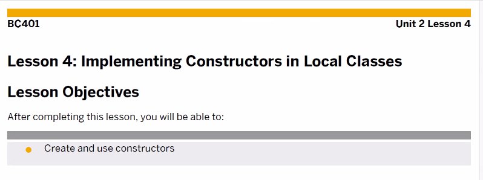
호출이 불가능하다. ( CALL 불가 )
ABAP SYSTEM에서 특정 시점에 자동으로 호출.

Constructor 는 메소드에 해당된다. 프로그램에서 불러서 사용하는 애가 아님 주의
( Call Method 사용 불가 ) 얘는 **특정 시점에 자동 호출**되는 메서드이다.

> 특정 시점?
> class에 Obj가 생성될때
> Create Object 라는 구문을 가지고 생성할때

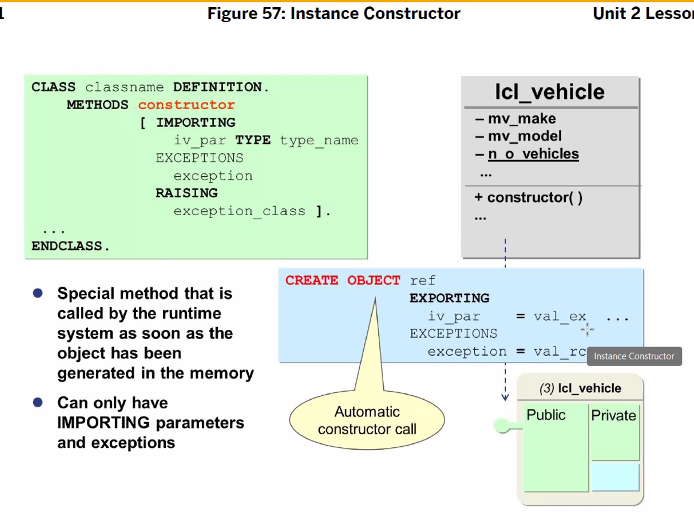Constructor 는 import 와 exception만 가질 수 있다. 
PUBLIC SECTION에서만 선언 가능 
중복 선언 불가능
메소드 이름은 늘 Constructor
만약 에러가 떨어지면 해당 클래스에대한 Object는 생성x
사용용도 : 초기값 생성, Object 생성시 다른 Obj에 알려줌, Static Attribute 의 값 변경시
AREA 넘겨줄때, ALV_GIRD도

```ABAP
*&---------------------------------------------------------------------*
*& Report ZABAP_B13_42
*&---------------------------------------------------------------------*
*&
*&---------------------------------------------------------------------*
REPORT ZABAP_B13_42.

* local class 생성.
* public -> protected -> private 순서! 꼭!
CLASS LCL_VEHICLE DEFINITION.
  PUBLIC SECTION.
*  Instance Method
    METHODS:
      CONSTRUCTOR IMPORTING  IV_MAKE  TYPE STRING
                             IV_MODEL TYPE STRING
                  EXCEPTIONS WRONG_VEHICLE,

      SET_ATTRIBUTES IMPORTING IV_MAKE  TYPE STRING
                               IV_MODEL TYPE STRING,
      DISPLAY_ATTRIBUTES.

*   Static Method
    CLASS-METHODS:
      DISPLAY_N_O_VEHICLE,
      GET_N_O_VEHICLE RETURNING VALUE(RV_CNT) TYPE I.

    DATA: MV_COLOR TYPE STRING VALUE 'Black'.
    CLASS-DATA : MV_PRICE TYPE STRING VALUE '2000만원'.

  PRIVATE SECTION.
*  Instance Attribute.
    DATA: MV_MAKE  TYPE STRING,
          MV_MODEL TYPE STRING.
*    Static data 선언
    CLASS-DATA: GV_N_O_VEHICLE TYPE I.

ENDCLASS.

CLASS LCL_VEHICLE IMPLEMENTATION.

  METHOD CONSTRUCTOR.
    SELECT COUNT( * )
      FROM SVEHICLE
      WHERE MAKE = IV_MAKE
        AND MODEL = IV_MODEL.

    IF SY-SUBRC = 0.
      MV_MAKE = IV_MAKE.
      MV_MODEL = IV_MODEL.
    ELSE.
      RAISE WRONG_VEHICLE.
    ENDIF.
  ENDMETHOD.

  METHOD SET_ATTRIBUTES.
    MV_MAKE = IV_MAKE.
    MV_MODEL = IV_MODEL.

    ADD 1 TO GV_N_O_VEHICLE.
  ENDMETHOD.

  METHOD DISPLAY_ATTRIBUTES.
    WRITE:/ 'Make :', MV_MAKE.
    WRITE:/ 'Model : ', MV_MODEL.
  ENDMETHOD.

* Static method에서는 static attr만 사용이 가능하다.
  METHOD DISPLAY_N_O_VEHICLE.
    WRITE:/ 'Number of Vehicle : ', GV_N_O_VEHICLE.
*    이와같이 인스턴스 attr이 오면 에러가 떨어진다.
*    WRITE:/ 'Make : ', MV_MAKE.
  ENDMETHOD.

  METHOD GET_N_O_VEHICLE.
    RV_CNT = GV_N_O_VEHICLE.
  ENDMETHOD.
ENDCLASS.

* REF TO : LCL_VEHICLE을 가르키다
*DATA: GO_VEHICLE1 TYPE REF TO LCL_VEHICLE,
*      GO_VEHICLE2 TYPE REF TO LCL_VEHICLE,
*      GO_VEHICLE3 LIKE GO_VEHICLE1.

DATA: GO_VEHICLE TYPE REF TO LCL_VEHICLE,
      GT_VEHICLE TYPE TABLE OF REF TO LCL_VEHICLE.

DATA: GV_CNT TYPE I.

START-OF-SELECTION.

  CALL METHOD LCL_VEHICLE=>DISPLAY_N_O_VEHICLE.

*  CREATE OBJECT GO_VEHICLE.

  CREATE OBJECT GO_VEHICLE
    EXPORTING
      IV_MAKE       = 'BMW'
      IV_MODEL      = '123'
    EXCEPTIONS
      WRONG_VEHICLE = 1
      OTHERS        = 2.
*   0이면  CREATE OBJECT가 생성되었다
  IF SY-SUBRC = 0.
*    성공했다면 ITAB에다 넣어주자
    APPEND GO_VEHICLE TO GT_VEHICLE.
  ENDIF.

  CREATE OBJECT GO_VEHICLE
    EXPORTING
      IV_MAKE       = 'AUDI'
      IV_MODEL      = 'A3'
    EXCEPTIONS
      WRONG_VEHICLE = 1
      OTHERS        = 2
    .
  IF SY-SUBRC = 0.
    APPEND GO_VEHICLE TO GT_VEHICLE.
  ENDIF.

    CREATE OBJECT GO_VEHICLE
    EXPORTING
      IV_MAKE       = 'PORSCHE'
      IV_MODEL      = '911'
    EXCEPTIONS
      WRONG_VEHICLE = 1
      OTHERS        = 2
    .
  IF SY-SUBRC = 0.
    APPEND GO_VEHICLE TO GT_VEHICLE.
  ENDIF.
*
* 메소드 호출 방법 두가지
*  CALL METHOD GO_VEHICLE->SET_ATTRIBUTES
*    EXPORTING
*      IV_MAKE  = 'BMW'
*      IV_MODEL = '325I'.
*
*  APPEND GO_VEHICLE TO GT_VEHICLE.
*
*  CREATE OBJECT GO_VEHICLE.
*  APPEND GO_VEHICLE TO GT_VEHICLE.
*
*  GO_VEHICLE->SET_ATTRIBUTES(
*    EXPORTING
*      IV_MAKE  = 'AUDI'
*      IV_MODEL = 'A3'
*  ).
*
*  CREATE OBJECT GO_VEHICLE.
*  APPEND GO_VEHICLE TO GT_VEHICLE.
*
*  GO_VEHICLE->SET_ATTRIBUTES(
*    EXPORTING
*      IV_MAKE  = 'PORSCHE'
*      IV_MODEL = '911'
*  ).

  LOOP AT GT_VEHICLE INTO GO_VEHICLE.
    CALL METHOD GO_VEHICLE->DISPLAY_ATTRIBUTES.
    ULINE.
  ENDLOOP.

*  CALL METHOD LCL_VEHICLE=>GET_N_O_VEHICLE
*    RECEIVING
*      RV_CNT = GV_CNT.
  GV_CNT = LCL_VEHICLE=>GET_N_O_VEHICLE( ).

  WRITE:/ 'Number of Vehicle : ', GV_CNT.

  DO LCL_VEHICLE=>GET_N_O_VEHICLE( ) TIMES.
    WRITE:/ SY-INDEX.
  ENDDO.

  IF LCL_VEHICLE=>GET_N_O_VEHICLE( ) = 3.
    WRITE:/ 'test'.
  ENDIF.

  GV_CNT = LCL_VEHICLE=>GET_N_O_VEHICLE( ) + LCL_VEHICLE=>GET_N_O_VEHICLE( ).
  WRITE:/  GV_CNT.

*  LCL_VEHICLE=>DISPLAY_N_O_VEHICLE( ).

*  APPEND GO_VEHICLE TO GT_VEHICLE.
*
*  CREATE OBJECT GO_VEHICLE.
*  APPEND GO_VEHICLE TO GT_VEHICLE.
*
*  CREATE OBJECT GO_VEHICLE.
*  APPEND GO_VEHICLE TO GT_VEHICLE.


*  CREATE OBJECT GO_VEHICLE1.
*
** GO_VEHICLE1에 포인터 하고 있다.
*  IF GO_VEHICLE1 IS NOT BOUND.
*
*  ENDIF.
*
**  이 변수에 포인터가 없다.
*  IF GO_VEHICLE1 IS INITIAL.
*
*  ENDIF.
*
**  이 변수에 포인터가 없다.
*  IF GO_VEHICLE1 IS BOUND.
*
*  ENDIF.
*
*  CREATE OBJECT GO_VEHICLE2.
*  CREATE OBJECT GO_VEHICLE3.

  IF SY-SUBRC = 0.

  ENDIF.

  WRITE:/ 'Color : ', GO_VEHICLE->MV_COLOR,
        /'Price : ', GO_VEHICLE->MV_PRICE.
```

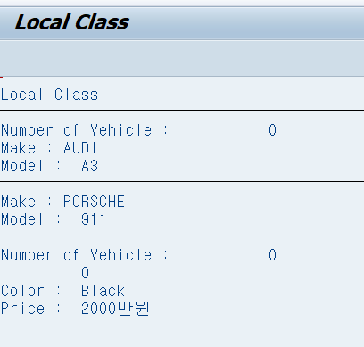
BMW는 있지 않아서 OBJECT가 생성되지 않았다.

EX)
```ABAP
*&---------------------------------------------------------------------*
*& Report ZBC401_B13_MAIN
*&---------------------------------------------------------------------*
*&
*&---------------------------------------------------------------------*
REPORT ZBC401_B13_MAIN.

TYPE-POOLS ICON.

CLASS LCL_AIRPLANE DEFINITION.
  PUBLIC SECTION.

*  Instance Method
    METHODS:
*      SET_ATTRIBUTES IMPORTING IV_NAME      TYPE STRING
*                               IV_PLANETYPE TYPE SAPLANE-PLANETYPE,
      CONSTRUCTOR IMPORTING  IV_NAME      TYPE STRING
                             IV_PLANETYPE TYPE SAPLANE-PLANETYPE
                  EXCEPTIONS WRONG_PLANETYPE,
      DISPLAY_ATTRIBUTES.

*   Static Method
    CLASS-METHODS:
      DISPLAY_N_O_AIRPLANES,
      GET_N_O_AIRPLANES RETURNING VALUE(RV_COUNT) TYPE I.

  PRIVATE SECTION.
    CONSTANTS: C_POS_1 TYPE I VALUE 30.
*  Instance Attribute.
    DATA: MV_NAME      TYPE STRING,
          MV_PLANETYPE TYPE SAPLANE-PLANETYPE,
          MV_WEIGHT    TYPE SAPLANE-WEIGHT,
          MV_TANKCAP   TYPE SAPLANE-TANKCAP.
*    Static data 선언
    CLASS-DATA: GV_N_O_AIRPLANES TYPE I.

ENDCLASS.

CLASS LCL_AIRPLANE IMPLEMENTATION.
*  METHOD SET_ATTRIBUTES.
*    MV_NAME = IV_NAME.
*    MV_PLANETYPE = IV_PLANETYPE.
*    GV_N_O_AIRPLANES = GV_N_O_AIRPLANES + 1.
*  ENDMETHOD.

  METHOD CONSTRUCTOR.
*    TABLE  을 스트럭처 타입으로 생성
    DATA: IS_PLANETYPE TYPE SAPLANE.
* MV_NAME 은 PRIVATE 이지만 같은 클래스 안에서 선언중이므로 바로 꺼내서 사용 가능
    MV_NAME = IV_NAME.
    MV_PLANETYPE = IV_PLANETYPE.

    SELECT SINGLE *
      FROM SAPLANE
      INTO IS_PLANETYPE
      WHERE PLANETYPE = IV_PLANETYPE.

    IF SY-SUBRC <> 0.
      RAISE WRONG_PLANETYPE.
    ELSE.
      MV_WEIGHT = IS_PLANETYPE-WEIGHT.
      MV_TANKCAP = IS_PLANETYPE-TANKCAP.
      GV_N_O_AIRPLANES = GV_N_O_AIRPLANES + 1.
    ENDIF.
  ENDMETHOD.

  METHOD DISPLAY_ATTRIBUTES.
    WRITE:/ ICON_WS_PLANE AS ICON,
    / 'Name of AIRPLANE : '(001), AT C_POS_1 MV_NAME,
    / 'Type of AIRPLANE : '(002), AT C_POS_1 MV_PLANETYPE,
    / 'Weight : '(003), AT C_POS_1 MV_WEIGHT
    LEFT-JUSTIFIED,
    / 'Tank capacity : '(004), AT C_POS_1 MV_TANKCAP
    LEFT-JUSTIFIED.
  ENDMETHOD.

  METHOD DISPLAY_N_O_AIRPLANES.
    SKIP.
    WRITE:/ 'Number of AIRPLANE: '(cal),
    AT C_POS_1 GV_N_O_AIRPLANES LEFT-JUSTIFIED.
  ENDMETHOD.

  METHOD GET_N_O_AIRPLANES.
    RV_COUNT = GV_N_O_AIRPLANES.
  ENDMETHOD.
ENDCLASS.

DATA: GO_AIRPLANE  TYPE REF TO LCL_AIRPLANE,
      GT_AIRPLANES TYPE TABLE OF REF TO LCL_AIRPLANE,
      GV_COUNT     TYPE I.

START-OF-SELECTION.
  LCL_AIRPLANE=>DISPLAY_N_O_AIRPLANES( ).

  CREATE OBJECT GO_AIRPLANE
    EXPORTING
      IV_NAME         = 'LH Berlin'
      IV_PLANETYPE    = 'A321'
    EXCEPTIONS
      WRONG_PLANETYPE = 1.
  IF SY-SUBRC = 0.
    APPEND GO_AIRPLANE TO GT_AIRPLANES.
  ENDIF.

  CREATE OBJECT GO_AIRPLANE
    EXPORTING
      IV_NAME      = 'AA New York'
      IV_PLANETYPE = '747-400'
    EXCEPTIONS
      WRONG_PLANETYPE = 1.
  IF SY-SUBRC = 0.
    APPEND GO_AIRPLANE TO GT_AIRPLANES.
  ENDIF.

  CREATE OBJECT GO_AIRPLANE
    EXPORTING
    IV_NAME      = 'US Hercules'
    IV_PLANETYPE = '747-200F'
    EXCEPTIONS
    WRONG_PLANETYPE = 1.
  IF SY-SUBRC = 0.
    APPEND GO_AIRPLANE TO GT_AIRPLANES.
  ENDIF.

  LOOP AT GT_AIRPLANES INTO GO_AIRPLANE.
    GO_AIRPLANE->DISPLAY_ATTRIBUTES( ).
  ENDLOOP.

  GV_COUNT = LCL_AIRPLANE=>GET_N_O_AIRPLANES( ).
  SKIP 2.
  WRITE:/ 'Number of AIRPLANE'(cal), GV_COUNT.
```


# STATIC CONSTRUCTOR

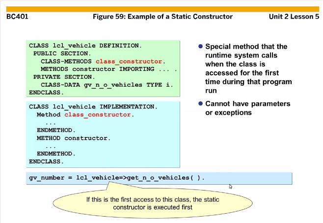
STATIC CONSTRUCTOR 호출 시점

- CLASS에 OBJECT가 생성이 될때 (CREATE OBJECT)
- CLASS에는 STATIC ATTR이 있는데 여기에 ACCESS 되어질때
- 프로그램에서 STATIC METHOD를 호출할때
- 이벤트 핸들러 메서드가 등록되어질때 SET HANDLER

STATIC이라 한번 호출하면 끝임, 항상 우선 1순위

```ABAP
* DB에 여러번 접근 하므로 좋지 않은 방법이라 다른 방법을 써보도록 하자
    SELECT COUNT( * )
      FROM SVEHICLE
      WHERE MAKE = IV_MAKE
        AND MODEL = IV_MODEL.

* 시작 ITAB 생성해서 여기에 넣어주자
* OBJCET마다 하나씩 생성할 이유가 없기에 Single로 사용해주도록 한다.
CLASS-DATA : GT_VEHICLE TYPE TABLE OF SVEHICLE.

* 세상 심플 IMPORT 이런거 사용 못함
CLASS-METHODS: CLASS_CONSTRUCTOR.

* 메소드 정의
  METHOD CLASS_CONSTRUCTOR.
    SELECT * 
      INTO TABLE GT_VEHICLE
      FROM SVEHICLE.
  ENDMETHOD.
  
  
METHOD CONSTRUCTOR.
* GT_VEHICLE에는 이미 10개의 데이터가 존재한다. 
* 데이터 존재 유무만 체크하기 때문에 Structure를 쓸 필요가 없다.
* 만약 데이터 하나를 꺼내서 사용해야만 한다면 into는 꼭 와야한다.
    READ TABLE GT_VEHICLE
    WITH KEY MAKE = IV_MAKE
             MODEL = IV_MODEL
    TRANSPORTING NO FIELDS. " structure에 데이터를 할당 안할래

    IF SY-SUBRC = 0.
      MV_MAKE = IV_MAKE.
      MV_MODEL = IV_MODEL.
    ELSE.
      RAISE WRONG_VEHICLE.
    ENDIF.
ENDMETHOD.

* 이렇듯 static method를 하나만이라도 호출하면 static method가 전부 호출된다.
* 따라서 CLASS_CONSTRUCTOR 가 같이 호출된다.
START-OF-SELECTION.
 CALL METHOD LCL_VEHICLE=>DISPLAY_N_O_VEHICLE.
 
* 혹은 위에 call method가 없더라도 
* CREATE OBJCET 를 하게되면 호출된다 (위에 자동 호출되는 네가지 경우 있음)
* STATIC 은 딱 한번만 실행된다
  CREATE OBJECT GO_VEHICLE
    EXPORTING
      IV_MAKE       = 'BMW'
      IV_MODEL      = '123'
    EXCEPTIONS
      WRONG_VEHICLE = 1
      OTHERS        = 2.
*   0이면  CREATE OBJECT가 생성되었다
  IF SY-SUBRC = 0.
*    성공했다면 ITAB에다 넣어주자
    APPEND GO_VEHICLE TO GT_VEHICLE.
  ENDIF.
```

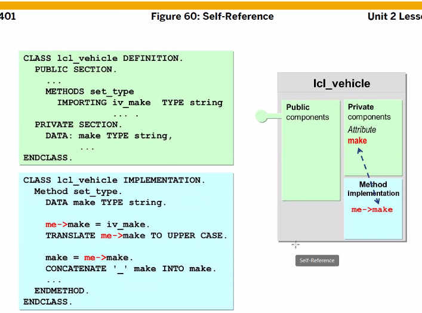
me 는 this. 같은거다
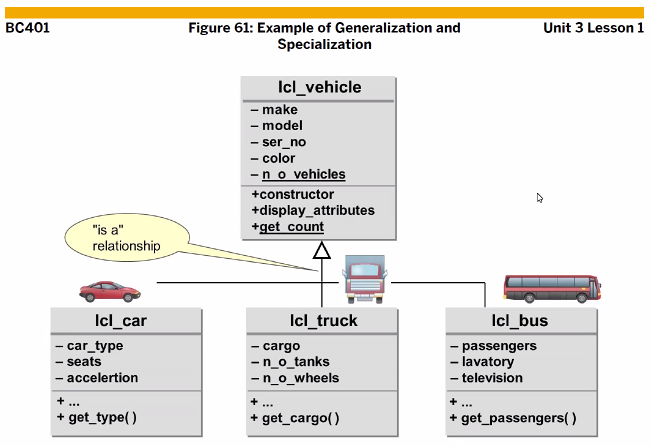
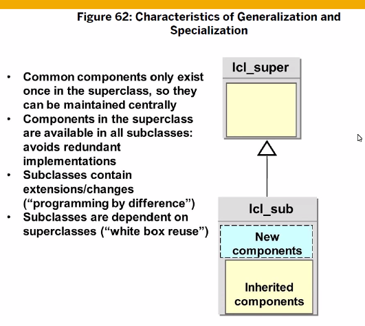
공통적인 컴포넌트가 SUPER CLASS에서 관리된다.
상속 : **CLASS** LCL_BUS **DEFINITION INHERITING FROM** LCL_VEHICLE.

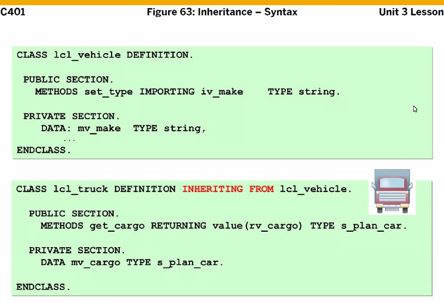

# Redefinition

자식 클래스에서 부모에게 상속받은 메서드 사용 방법

> **CLASS** LCL_TRUCK **IMPLEMENTATION**.
>   **METHOD** CONSTRUCTOR.
>     **SUPER->**CONSTRUCTOR(

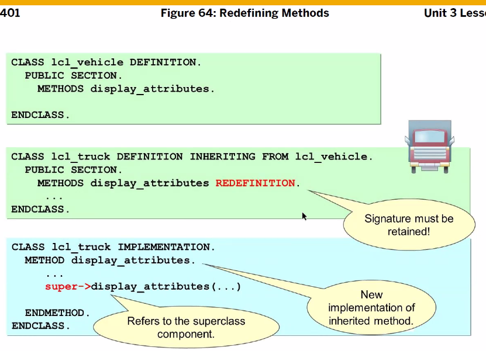
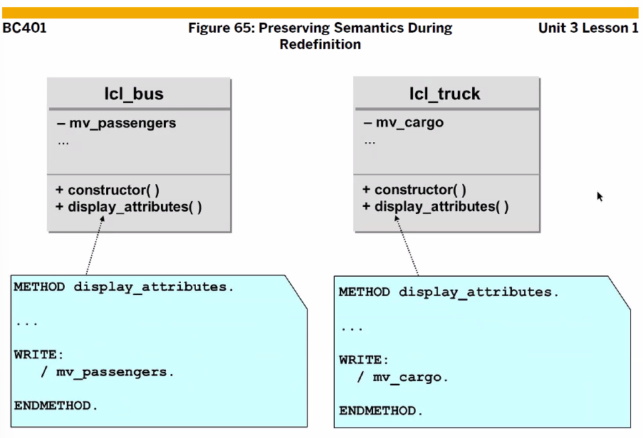

Constructor가 부모에게 있다면 자식은 무조건 상속 받아야 한다.

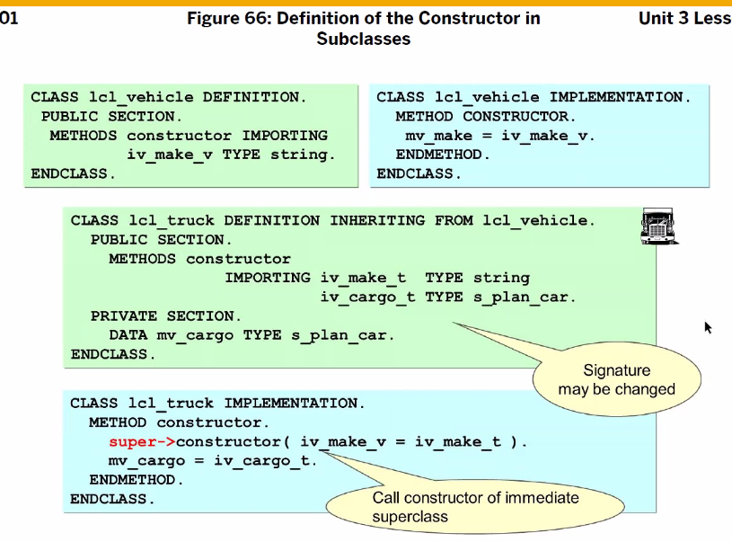

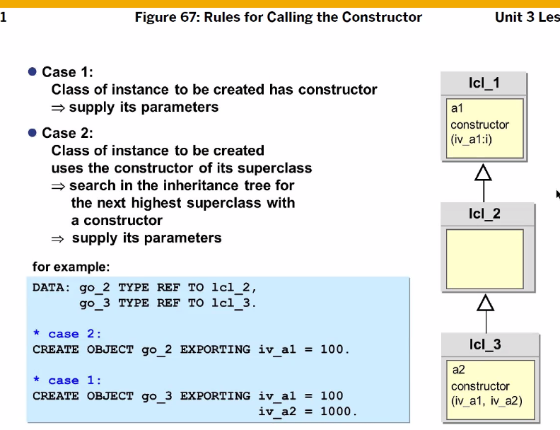
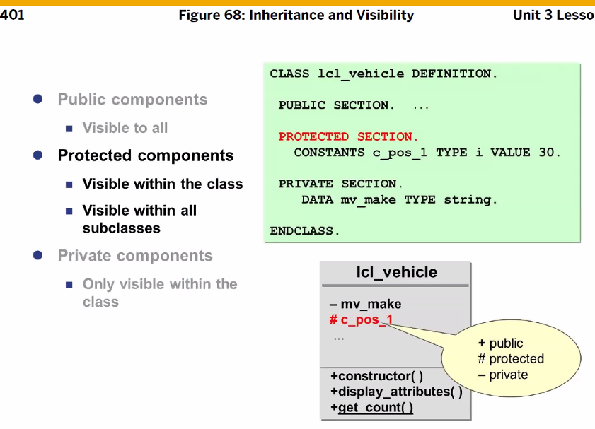
+public > #protected > -private 순서로 해야함을 잊지마

## 접근 제한영역

CLASS의 접근 제한영역은 크게 3가지로 구분

- PUBLIC SECTION
  - 하나의 클래스내에 선언된 컴포넌트들은 모든 클래스에서 상속 받아 사용할 수 있는 영역
  - 클래스와 사용자 간의 인터페이스 역할
- PROTECTED SECTION
  - 자신과 상속받은 클래스에서만 컴포넌트들을 접근할 수 있는영역으로 자식과의 인터페이스 역할
- PRIVATED SECTION
  - PRIVATED 선언 컴포넌트들은 같은 클래스에서만 메서드를 사용할 수 있는영역으로 외부에서 접근할 수 없음.
  - 완전히 클래스에서 캡슐화되어 타 클래스에서 사용불가.

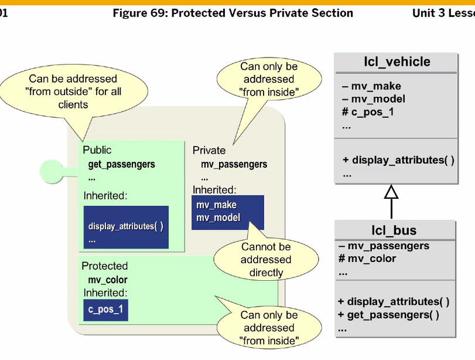
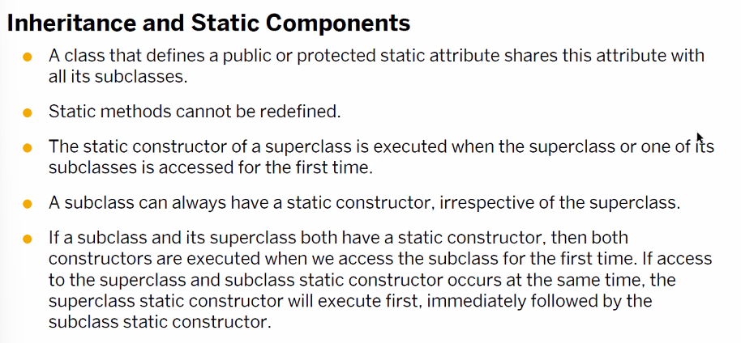

부모의  static method는 사용할 수 없다.
하지만 static constructor는 자동으로 생성되서 네가지의 특정 시점이 발생하면 호출되게 된다. 순서는 부모 constructor --> 자식 constructor가 실행된다.

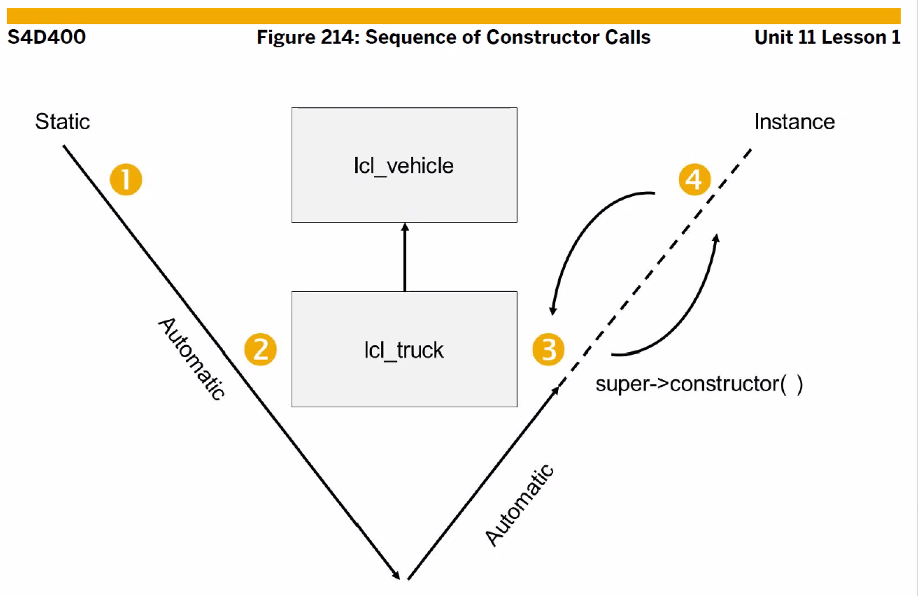

## 실습

 LCL_BUS 와 LCL_TRUCK 생성하고 LCL_VEHICLE 상속하기

```ABAP
*&---------------------------------------------------------------------*
*& Report ZABAP_B13_42
*&---------------------------------------------------------------------*
*&
*&---------------------------------------------------------------------*
REPORT ZABAP_B13_422.

* local class 생성.
* public -> protected -> private 순서! 꼭!
CLASS LCL_VEHICLE DEFINITION.
  PUBLIC SECTION.
*  Instance Method
    METHODS:
      CONSTRUCTOR IMPORTING  IV_MAKE  TYPE STRING
                             IV_MODEL TYPE STRING
                  EXCEPTIONS WRONG_VEHICLE,

      SET_ATTRIBUTES IMPORTING IV_MAKE  TYPE STRING
                               IV_MODEL TYPE STRING,
      DISPLAY_ATTRIBUTES.

*   Static Method
    CLASS-METHODS:
      DISPLAY_N_O_VEHICLE,
      GET_N_O_VEHICLE RETURNING VALUE(RV_CNT) TYPE I,
      CLASS_CONSTRUCTOR.

    DATA: MV_COLOR TYPE STRING VALUE 'Black'.
    CLASS-DATA : MV_PRICE TYPE STRING VALUE '2000만원'.

  PRIVATE SECTION.
*  Instance Attribute.
    DATA: MV_MAKE  TYPE STRING,
          MV_MODEL TYPE STRING.
*    Static data 선언
    CLASS-DATA: GV_N_O_VEHICLE TYPE I,
                GT_VEHICLE     TYPE TABLE OF SVEHICLE.

ENDCLASS.

CLASS LCL_VEHICLE IMPLEMENTATION.

  METHOD CLASS_CONSTRUCTOR.
    SELECT *
      INTO TABLE GT_VEHICLE
      FROM SVEHICLE.
  ENDMETHOD.

  METHOD CONSTRUCTOR.

    READ TABLE GT_VEHICLE
    WITH KEY MAKE = IV_MAKE
             MODEL = IV_MODEL
    TRANSPORTING NO FIELDS.

    IF SY-SUBRC = 0.
      MV_MAKE = IV_MAKE.
      MV_MODEL = IV_MODEL.
    ELSE.
      RAISE WRONG_VEHICLE.
    ENDIF.
  ENDMETHOD.

  METHOD SET_ATTRIBUTES.
    MV_MAKE = IV_MAKE.
    MV_MODEL = IV_MODEL.

    ADD 1 TO GV_N_O_VEHICLE.
  ENDMETHOD.

  METHOD DISPLAY_ATTRIBUTES.
    WRITE:/ 'Make :', MV_MAKE.
    WRITE:/ 'Model : ', MV_MODEL.
  ENDMETHOD.

  METHOD DISPLAY_N_O_VEHICLE.
    WRITE:/ 'Number of Vehicle : ', GV_N_O_VEHICLE.
  ENDMETHOD.

  METHOD GET_N_O_VEHICLE.
    RV_CNT = GV_N_O_VEHICLE.
  ENDMETHOD.
ENDCLASS.

CLASS LCL_BUS DEFINITION INHERITING FROM LCL_VEHICLE.
  PUBLIC SECTION.
    METHODS:
      CONSTRUCTOR IMPORTING  IV_MAKE_B  TYPE STRING
                             IV_MODEL_B TYPE STRING
                             IV_SEATS   TYPE I
                  EXCEPTIONS WRONG_VEHICLE,
      DISPLAY_ATTRIBUTES REDEFINITION.
  PROTECTED SECTION.
  PRIVATE SECTION.
    DATA: MV_SEATS TYPE I.
ENDCLASS.

CLASS LCL_BUS IMPLEMENTATION.
  METHOD CONSTRUCTOR.
    SUPER->CONSTRUCTOR(
      EXPORTING
        IV_MAKE       = IV_MAKE_B
        IV_MODEL      = IV_MODEL_B
      EXCEPTIONS
        WRONG_VEHICLE = 1
        OTHERS        = 2
    ).
    IF SY-SUBRC <> 0.
      RAISE WRONG_VEHICLE.
    ENDIF.
    MV_SEATS = IV_SEATS.
  ENDMETHOD.

  METHOD DISPLAY_ATTRIBUTES.
    SUPER->DISPLAY_ATTRIBUTES( ).
    WRITE:/ 'Max Seats : ', MV_SEATS.
  ENDMETHOD.
ENDCLASS.

CLASS LCL_TRUCK DEFINITION INHERITING FROM LCL_VEHICLE.
  PUBLIC SECTION.
    METHODS:
      CONSTRUCTOR IMPORTING  IV_MAKE_T  TYPE STRING
                             IV_MODEL_T TYPE STRING
                             IV_CARGO   TYPE I
                  EXCEPTIONS WRONG_VEHICLE,
      DISPLAY_ATTRIBUTES REDEFINITION.
  PRIVATE SECTION.
    DATA: MV_CARGO TYPE I.
ENDCLASS.

CLASS LCL_TRUCK IMPLEMENTATION.
  METHOD CONSTRUCTOR.
    SUPER->CONSTRUCTOR(
      EXPORTING
        IV_MAKE       = IV_MAKE_T
        IV_MODEL      = IV_MODEL_T
      EXCEPTIONS
        WRONG_VEHICLE = 1
        OTHERS        = 2
    ).
    IF SY-SUBRC <> 0.
      RAISE WRONG_VEHICLE.
    ENDIF.
    MV_CARGO = IV_CARGO.
  ENDMETHOD.

  METHOD DISPLAY_ATTRIBUTES.
    SUPER->DISPLAY_ATTRIBUTES( ).
    WRITE:/ 'Max Cargo : ', MV_CARGO.
  ENDMETHOD.
ENDCLASS.

DATA: GO_VEHICLE TYPE REF TO LCL_VEHICLE,
      GT_VEHICLE TYPE TABLE OF REF TO LCL_VEHICLE,
      GO_BUS     TYPE REF TO LCL_BUS,
      GO_TRUCK   TYPE REF TO LCL_TRUCK.

DATA: GV_CNT TYPE I.

START-OF-SELECTION.

  CREATE OBJECT GO_BUS
    EXPORTING
      IV_MAKE_B     = 'MERCEDES'
      IV_MODEL_B    = 'SPRINTER'
      IV_SEATS      = 20
    EXCEPTIONS
      WRONG_VEHICLE = 1
      OTHERS        = 2
    .
  IF SY-SUBRC <> 0.

  ENDIF.

  CREATE OBJECT GO_TRUCK
    EXPORTING
      IV_MAKE_T     = 'MAN'
      IV_MODEL_T    = 'TGX'
      IV_CARGO      = 350
    EXCEPTIONS
      WRONG_VEHICLE = 1
      OTHERS        = 2
    .
  IF SY-SUBRC <> 0.
  ENDIF.

  GO_BUS->DISPLAY_ATTRIBUTES( ).
  ULINE.
  GO_TRUCK->DISPLAY_ATTRIBUTES( ).
```


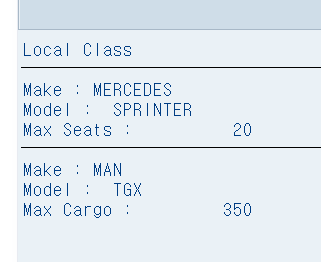

```ABAP
*&---------------------------------------------------------------------*
*& Report YE03_EX028
*&---------------------------------------------------------------------*
*& Constructor 연습
*&---------------------------------------------------------------------*
REPORT YE03_EX028.

CLASS LCL_TEST DEFINITION.
  PUBLIC SECTION.
    " Static 은 참조변수 없이 사용할 수 있음.
    CLASS-METHODS WRITE_ALONE. " Static Methods
    CLASS-METHODS CLASS_CONSTRUCTOR. " Static Constructor
    METHODS CONSTRUCTOR. " Instance Constructor
    METHODS WRITE_HELLO. " Instance Methods
  PRIVATE SECTION.
    METHODS SECRET_METHOD. " Instance Methods
ENDCLASS.

CLASS LCL_TEST IMPLEMENTATION.
  METHOD WRITE_ALONE.
    WRITE : / '난 객체 없어도 실행 가능한 Public Static Method야.'.
    WRITE : / '대신 클래스로 호출해줘'.
    ULINE.
  ENDMETHOD.
*--------------------------------------------------------------------*
  METHOD CLASS_CONSTRUCTOR.
    WRITE : / 'LCL_TEST는 처음이지? 온 걸 환영해'.
    WRITE : / 'LCL_TEST를 사용하면 제일 먼저 나를 거칠 거야'.
    ULINE.
  ENDMETHOD.
*--------------------------------------------------------------------*
  METHOD CONSTRUCTOR.
    WRITE : / '객체를 생성하면서 제가 자동으로 실행됩니다.'.
    WRITE : / '저는 Public Instance Constructor(생성자) 입니다.'.
    ULINE.
  ENDMETHOD.
*--------------------------------------------------------------------*
  METHOD WRITE_HELLO.
    WRITE : / '안녕하세요 저는 Public Instance Method 입니다.'.
    WRITE : / '나는 Private에 접근이 가능해, 내가 호출할게'.
    ULINE.
    CALL METHOD ME->SECRET_METHOD.
  ENDMETHOD.
*--------------------------------------------------------------------*
  METHOD SECRET_METHOD.
    WRITE : / '나는 외부에서 호출할 수 없는 Private Instance Method 야'.
    ULINE.
  ENDMETHOD.
ENDCLASS.

DATA GO_TEST TYPE REF TO LCL_TEST.

START-OF-SELECTION.

  CALL METHOD LCL_TEST=>WRITE_ALONE.

  CREATE OBJECT GO_TEST.
  CREATE OBJECT GO_TEST.
  CREATE OBJECT GO_TEST.

  CALL METHOD GO_TEST->WRITE_HELLO.

*  Private SECTION 에 있기에 호출 불가
*  CALL METHOD GO_TEST->SECRET_METHOD.
```

