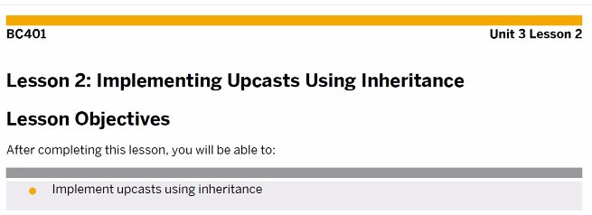
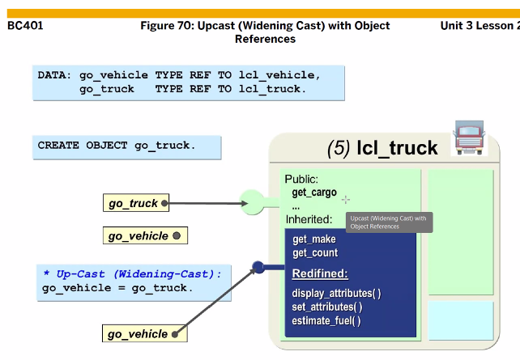
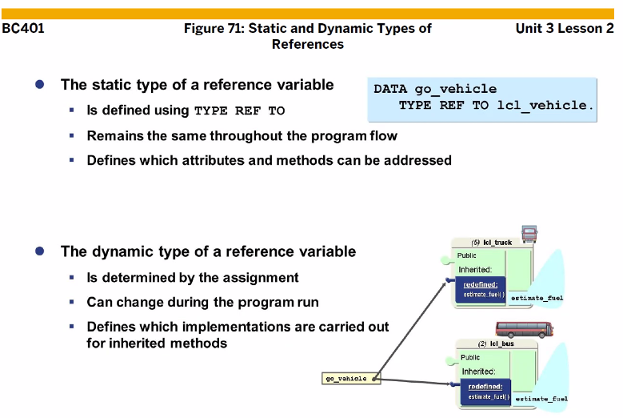
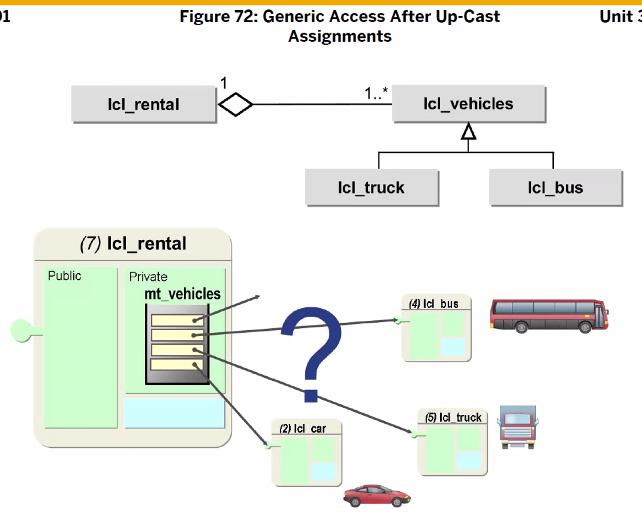
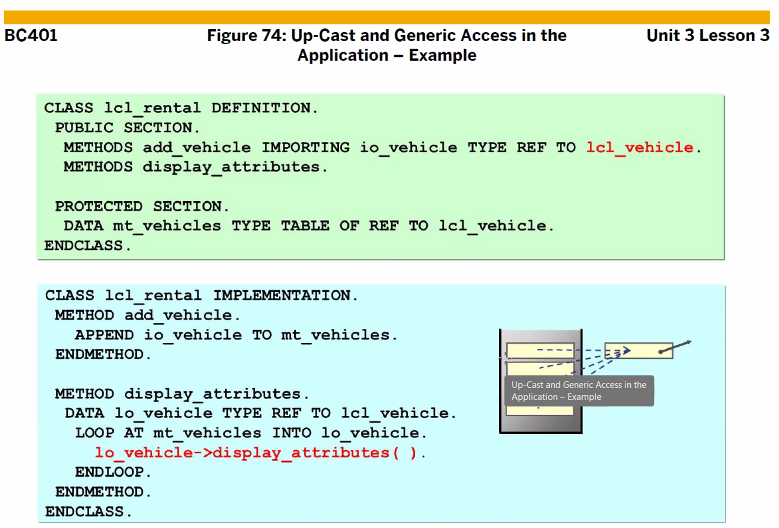
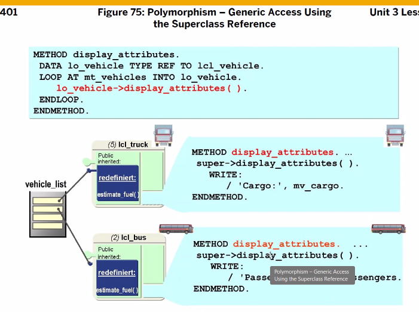
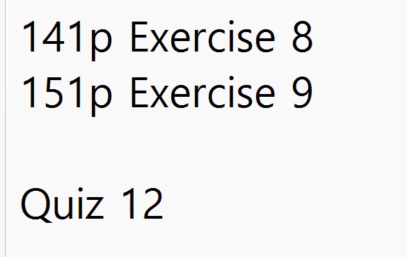

[TOC]

# CAST, 형변환



# UPCAST


부모에게 받은 메소드를 내가 다시 만들겠다.? UP-CAST
전제조건 : 상속

> 1) go_vehicle(super) go_truck(sub) 상속 관계 구현. 
> 2) create object go_truck 구문 통해 lcl_truck(sub) 객체 생성. 
> 3) go_truck(ref variable)은 lcl_truck 전체 가리킴.
> 4) 객체 안, 까만 부분은 lcl_vehicle(super) 상속받은 객체들(get_make, get_count, display_attribute, set_attribute, estimate_fuel) 
> 5) Redefined : static 컴포넌트가 아닌, 부모에서 상속받은 다음 새롭게 변형된 것. 그러므로 lcl_vehicle(super)에서도 반드시 가지고 있음. 
> 6) lcl_truck만 가지고 있는 속성(get_cargo) 
> 7) 그러므로, go_truck 전체 다 access 가능.



```ABAP
*&---------------------------------------------------------------------*
*& Report ZABAP_B13_42
*&---------------------------------------------------------------------*
*&
*&---------------------------------------------------------------------*
REPORT ZABAP_B13_423.

* local class 생성.
* public -> protected -> private 순서! 꼭!
CLASS LCL_VEHICLE DEFINITION.
  PUBLIC SECTION.
*  Instance Method
    METHODS:
      CONSTRUCTOR IMPORTING  IV_MAKE  TYPE STRING
                             IV_MODEL TYPE STRING
                  EXCEPTIONS WRONG_VEHICLE,

      SET_ATTRIBUTES IMPORTING IV_MAKE  TYPE STRING
                               IV_MODEL TYPE STRING,
      DISPLAY_ATTRIBUTES.

*   Static Method
    CLASS-METHODS:
      DISPLAY_N_O_VEHICLE,
      GET_N_O_VEHICLE RETURNING VALUE(RV_CNT) TYPE I,
      CLASS_CONSTRUCTOR.

    DATA: MV_COLOR TYPE STRING VALUE 'Black'.
    CLASS-DATA : MV_PRICE TYPE STRING VALUE '2000만원'.

  PRIVATE SECTION.
*  Instance Attribute.
    DATA: MV_MAKE  TYPE STRING,
          MV_MODEL TYPE STRING.
*    Static data 선언
    CLASS-DATA: GV_N_O_VEHICLE TYPE I,
                GT_VEHICLE     TYPE TABLE OF SVEHICLE.

ENDCLASS.

CLASS LCL_VEHICLE IMPLEMENTATION.

  METHOD CLASS_CONSTRUCTOR.
    SELECT *
      INTO TABLE GT_VEHICLE
      FROM SVEHICLE.
  ENDMETHOD.

  METHOD CONSTRUCTOR.
*    DB에 여러번 접근 하므로 좋지 않은 방법이라 다른 방법을 써보도록 하자
*    SELECT COUNT( * )
*      FROM SVEHICLE
*      WHERE MAKE = IV_MAKE
*        AND MODEL = IV_MODEL.

    READ TABLE GT_VEHICLE
    WITH KEY MAKE = IV_MAKE
             MODEL = IV_MODEL
    TRANSPORTING NO FIELDS.

    IF SY-SUBRC = 0.
      MV_MAKE = IV_MAKE.
      MV_MODEL = IV_MODEL.
    ELSE.
      RAISE WRONG_VEHICLE.
    ENDIF.
  ENDMETHOD.

  METHOD SET_ATTRIBUTES.
    MV_MAKE = IV_MAKE.
    MV_MODEL = IV_MODEL.

    ADD 1 TO GV_N_O_VEHICLE.
  ENDMETHOD.

  METHOD DISPLAY_ATTRIBUTES.
    WRITE:/ 'Make :', MV_MAKE.
    WRITE:/ 'Model : ', MV_MODEL.
  ENDMETHOD.

* Static method에서는 static attr만 사용이 가능하다.
  METHOD DISPLAY_N_O_VEHICLE.
    WRITE:/ 'Number of Vehicle : ', GV_N_O_VEHICLE.
*    이와같이 인스턴스 attr이 오면 에러가 떨어진다.
*    WRITE:/ 'Make : ', MV_MAKE.
  ENDMETHOD.

  METHOD GET_N_O_VEHICLE.
    RV_CNT = GV_N_O_VEHICLE.
  ENDMETHOD.
ENDCLASS.

CLASS LCL_BUS DEFINITION INHERITING FROM LCL_VEHICLE.
  PUBLIC SECTION.
    METHODS:
      CONSTRUCTOR IMPORTING  IV_MAKE_B  TYPE STRING
                             IV_MODEL_B TYPE STRING
                             IV_SEATS   TYPE I
                  EXCEPTIONS WRONG_VEHICLE,
      DISPLAY_ATTRIBUTES REDEFINITION.
  PROTECTED SECTION.
  PRIVATE SECTION.
    DATA: MV_SEATS TYPE I.
ENDCLASS.

CLASS LCL_BUS IMPLEMENTATION.
  METHOD CONSTRUCTOR.
    SUPER->CONSTRUCTOR(
      EXPORTING
        IV_MAKE       = IV_MAKE_B
        IV_MODEL      = IV_MODEL_B
      EXCEPTIONS
        WRONG_VEHICLE = 1
        OTHERS        = 2
    ).
    IF SY-SUBRC <> 0.
      RAISE WRONG_VEHICLE.
    ENDIF.
    MV_SEATS = IV_SEATS.
  ENDMETHOD.

  METHOD DISPLAY_ATTRIBUTES.
    SUPER->DISPLAY_ATTRIBUTES( ).
    WRITE:/ 'Max Seats : ', MV_SEATS.
  ENDMETHOD.
ENDCLASS.

CLASS LCL_TRUCK DEFINITION INHERITING FROM LCL_VEHICLE.
  PUBLIC SECTION.
    METHODS:
      CONSTRUCTOR IMPORTING  IV_MAKE_T  TYPE STRING
                             IV_MODEL_T TYPE STRING
                             IV_CARGO   TYPE I
                  EXCEPTIONS WRONG_VEHICLE,
      DISPLAY_ATTRIBUTES REDEFINITION.
  PRIVATE SECTION.
    DATA: MV_CARGO TYPE I.
ENDCLASS.

CLASS LCL_TRUCK IMPLEMENTATION.
  METHOD CONSTRUCTOR.
    SUPER->CONSTRUCTOR(
      EXPORTING
        IV_MAKE       = IV_MAKE_T
        IV_MODEL      = IV_MODEL_T
      EXCEPTIONS
        WRONG_VEHICLE = 1
        OTHERS        = 2
    ).
    IF SY-SUBRC <> 0.
      RAISE WRONG_VEHICLE.
    ENDIF.
    MV_CARGO = IV_CARGO.
  ENDMETHOD.

  METHOD DISPLAY_ATTRIBUTES.
    SUPER->DISPLAY_ATTRIBUTES( ).
    WRITE:/ 'Max Cargo : ', MV_CARGO.
  ENDMETHOD.
ENDCLASS.

* REF TO : LCL_VEHICLE을 가르키다
*DATA: GO_VEHICLE1 TYPE REF TO LCL_VEHICLE,
*      GO_VEHICLE2 TYPE REF TO LCL_VEHICLE,
*      GO_VEHICLE3 LIKE GO_VEHICLE1.

DATA: GO_VEHICLE TYPE REF TO LCL_VEHICLE,
      GT_VEHICLE TYPE TABLE OF REF TO LCL_VEHICLE,
      GO_BUS     TYPE REF TO LCL_BUS,
      GO_TRUCK   TYPE REF TO LCL_TRUCK.

DATA: GV_CNT TYPE I.

START-OF-SELECTION.

  CREATE OBJECT GO_BUS
    EXPORTING
      IV_MAKE_B     = 'MERCEDES'
      IV_MODEL_B    = 'SPRINTER'
      IV_SEATS      = 20
    EXCEPTIONS
      WRONG_VEHICLE = 1
      OTHERS        = 2
    .
  IF SY-SUBRC = 0.
*    UPCAST 된 것이다.
    APPEND GO_BUS TO GT_VEHICLE.
  ENDIF.

  CREATE OBJECT GO_TRUCK
    EXPORTING
      IV_MAKE_T     = 'MAN'
      IV_MODEL_T    = 'TGX'
      IV_CARGO      = 350
    EXCEPTIONS
      WRONG_VEHICLE = 1
      OTHERS        = 2
    .
  IF SY-SUBRC = 0.
*    UPCAST 된 것이다.
    APPEND GO_TRUCK TO GT_VEHICLE.
  ENDIF.

*  GO_BUS->DISPLAY_ATTRIBUTES( ).
*  ULINE.
*  GO_TRUCK->DISPLAY_ATTRIBUTES( ).

* DISPLAY_ATTRIBUTES( ) 라는 메서드가 팥,슈크림 붕어빵처럼 달리 나옴
LOOP AT GT_VEHICLE INTO GO_VEHICLE.
  GO_VEHICLE->DISPLAY_ATTRIBUTES( ).
  ULINE.
ENDLOOP.
```






```ABAP
*&---------------------------------------------------------------------*
*& Report ZABAP_B13_42
*&---------------------------------------------------------------------*
*&
*&---------------------------------------------------------------------*
REPORT ZABAP_B13_423.

* local class 생성.
* public -> protected -> private 순서! 꼭!
CLASS LCL_VEHICLE DEFINITION.
  PUBLIC SECTION.
*  Instance Method
    METHODS:
      CONSTRUCTOR IMPORTING  IV_MAKE  TYPE STRING
                             IV_MODEL TYPE STRING
                  EXCEPTIONS WRONG_VEHICLE,

      SET_ATTRIBUTES IMPORTING IV_MAKE  TYPE STRING
                               IV_MODEL TYPE STRING,
      DISPLAY_ATTRIBUTES.

*   Static Method
    CLASS-METHODS:
      DISPLAY_N_O_VEHICLE,
      GET_N_O_VEHICLE RETURNING VALUE(RV_CNT) TYPE I,
      CLASS_CONSTRUCTOR.

    DATA: MV_COLOR TYPE STRING VALUE 'Black'.
    CLASS-DATA : MV_PRICE TYPE STRING VALUE '2000만원'.

  PRIVATE SECTION.
*  Instance Attribute.
    DATA: MV_MAKE  TYPE STRING,
          MV_MODEL TYPE STRING.
*    Static data 선언
    CLASS-DATA: GV_N_O_VEHICLE TYPE I,
                GT_VEHICLE     TYPE TABLE OF SVEHICLE.

ENDCLASS.

CLASS LCL_VEHICLE IMPLEMENTATION.

  METHOD CLASS_CONSTRUCTOR.
    SELECT *
      INTO TABLE GT_VEHICLE
      FROM SVEHICLE.
  ENDMETHOD.

  METHOD CONSTRUCTOR.
*    DB에 여러번 접근 하므로 좋지 않은 방법이라 다른 방법을 써보도록 하자
*    SELECT COUNT( * )
*      FROM SVEHICLE
*      WHERE MAKE = IV_MAKE
*        AND MODEL = IV_MODEL.

    READ TABLE GT_VEHICLE
    WITH KEY MAKE = IV_MAKE
             MODEL = IV_MODEL
    TRANSPORTING NO FIELDS.

    IF SY-SUBRC = 0.
      MV_MAKE = IV_MAKE.
      MV_MODEL = IV_MODEL.
    ELSE.
      RAISE WRONG_VEHICLE.
    ENDIF.
  ENDMETHOD.

  METHOD SET_ATTRIBUTES.
    MV_MAKE = IV_MAKE.
    MV_MODEL = IV_MODEL.

    ADD 1 TO GV_N_O_VEHICLE.
  ENDMETHOD.

  METHOD DISPLAY_ATTRIBUTES.
    WRITE:/ 'Make :', MV_MAKE.
    WRITE:/ 'Model : ', MV_MODEL.
  ENDMETHOD.

* Static method에서는 static attr만 사용이 가능하다.
  METHOD DISPLAY_N_O_VEHICLE.
    WRITE:/ 'Number of Vehicle : ', GV_N_O_VEHICLE.
*    이와같이 인스턴스 attr이 오면 에러가 떨어진다.
*    WRITE:/ 'Make : ', MV_MAKE.
  ENDMETHOD.

  METHOD GET_N_O_VEHICLE.
    RV_CNT = GV_N_O_VEHICLE.
  ENDMETHOD.
ENDCLASS.

CLASS LCL_BUS DEFINITION INHERITING FROM LCL_VEHICLE.
  PUBLIC SECTION.
    METHODS:
      CONSTRUCTOR IMPORTING  IV_MAKE_B  TYPE STRING
                             IV_MODEL_B TYPE STRING
                             IV_SEATS   TYPE I
                  EXCEPTIONS WRONG_VEHICLE,
      DISPLAY_ATTRIBUTES REDEFINITION.
  PROTECTED SECTION.
  PRIVATE SECTION.
    DATA: MV_SEATS TYPE I.
ENDCLASS.

CLASS LCL_BUS IMPLEMENTATION.
  METHOD CONSTRUCTOR.
    SUPER->CONSTRUCTOR(
      EXPORTING
        IV_MAKE       = IV_MAKE_B
        IV_MODEL      = IV_MODEL_B
      EXCEPTIONS
        WRONG_VEHICLE = 1
        OTHERS        = 2
    ).
    IF SY-SUBRC <> 0.
      RAISE WRONG_VEHICLE.
    ENDIF.
    MV_SEATS = IV_SEATS.
  ENDMETHOD.

  METHOD DISPLAY_ATTRIBUTES.
    SUPER->DISPLAY_ATTRIBUTES( ).
    WRITE:/ 'Max Seats : ', MV_SEATS.
  ENDMETHOD.
ENDCLASS.

CLASS LCL_TRUCK DEFINITION INHERITING FROM LCL_VEHICLE.
  PUBLIC SECTION.
    METHODS:
      CONSTRUCTOR IMPORTING  IV_MAKE_T  TYPE STRING
                             IV_MODEL_T TYPE STRING
                             IV_CARGO   TYPE I
                  EXCEPTIONS WRONG_VEHICLE,
      DISPLAY_ATTRIBUTES REDEFINITION.
  PRIVATE SECTION.
    DATA: MV_CARGO TYPE I.
ENDCLASS.

CLASS LCL_TRUCK IMPLEMENTATION.
  METHOD CONSTRUCTOR.
    SUPER->CONSTRUCTOR(
      EXPORTING
        IV_MAKE       = IV_MAKE_T
        IV_MODEL      = IV_MODEL_T
      EXCEPTIONS
        WRONG_VEHICLE = 1
        OTHERS        = 2
    ).
    IF SY-SUBRC <> 0.
      RAISE WRONG_VEHICLE.
    ENDIF.
    MV_CARGO = IV_CARGO.
  ENDMETHOD.

  METHOD DISPLAY_ATTRIBUTES.
    SUPER->DISPLAY_ATTRIBUTES( ).
    WRITE:/ 'Max Cargo : ', MV_CARGO.
  ENDMETHOD.
ENDCLASS.

CLASS LCL_RENTAL DEFINITION.
  PUBLIC SECTION.
    METHODS:
      CONSTRUCTOR IMPORTING IV_NAME TYPE STRING,
      DISPLAY_ATTRIBUTES,
      ADD_VEHICLE IMPORTING IO_VEHICLE TYPE REF TO LCL_VEHICLE.

  PRIVATE SECTION.
    DATA: MV_NAME    TYPE STRING,
          MT_VEHICLE TYPE TABLE OF REF TO LCL_VEHICLE.
ENDCLASS.

CLASS LCL_RENTAL IMPLEMENTATION.
  METHOD CONSTRUCTOR.
    MV_NAME = IV_NAME.
  ENDMETHOD.

  METHOD ADD_VEHICLE.
    APPEND IO_VEHICLE TO MT_VEHICLE.
  ENDMETHOD.

  METHOD DISPLAY_ATTRIBUTES.
    DATA LO_VEHICLE TYPE REF TO LCL_VEHICLE.
    WRITE:/ 'Name : ', MV_NAME.
    ULINE.

    LOOP AT MT_VEHICLE INTO LO_VEHICLE.
      LO_VEHICLE->DISPLAY_ATTRIBUTES( ).
      ULINE.
    ENDLOOP.
  ENDMETHOD.
ENDCLASS.

* REF TO : LCL_VEHICLE을 가르키다
*DATA: GO_VEHICLE1 TYPE REF TO LCL_VEHICLE,
*      GO_VEHICLE2 TYPE REF TO LCL_VEHICLE,
*      GO_VEHICLE3 LIKE GO_VEHICLE1.

DATA: GO_VEHICLE TYPE REF TO LCL_VEHICLE,
      GT_VEHICLE TYPE TABLE OF REF TO LCL_VEHICLE,
      GO_BUS     TYPE REF TO LCL_BUS,
      GO_TRUCK   TYPE REF TO LCL_TRUCK,
      GO_RENTAL  TYPE REF TO LCL_RENTAL.

DATA: GV_CNT TYPE I.

START-OF-SELECTION.

  CREATE OBJECT GO_RENTAL
    EXPORTING
      IV_NAME = 'SYNC Rental Co.'.

  CREATE OBJECT GO_BUS
    EXPORTING
      IV_MAKE_B     = 'MERCEDES'
      IV_MODEL_B    = 'SPRINTER'
      IV_SEATS      = 20
    EXCEPTIONS
      WRONG_VEHICLE = 1
      OTHERS        = 2.
  IF SY-SUBRC = 0.
*    UPCAST 된 것이다.
*    APPEND GO_BUS TO GT_VEHICLE.
    GO_RENTAL->ADD_VEHICLE( IO_VEHICLE = GO_BUS ).
  ENDIF.

  CREATE OBJECT GO_TRUCK
    EXPORTING
      IV_MAKE_T     = 'MAN'
      IV_MODEL_T    = 'TGX'
      IV_CARGO      = 350
    EXCEPTIONS
      WRONG_VEHICLE = 1
      OTHERS        = 2.
  IF SY-SUBRC = 0.
*    UPCAST 된 것이다.
*    APPEND GO_TRUCK TO GT_VEHICLE.
    GO_RENTAL->ADD_VEHICLE( IO_VEHICLE = GO_TRUCK ).
  ENDIF.

*  GO_BUS->DISPLAY_ATTRIBUTES( ).
*  ULINE.
*  GO_TRUCK->DISPLAY_ATTRIBUTES( ).

* DISPLAY_ATTRIBUTES( ) 라는 메서드가 팥,슈크림 붕어빵처럼 달리 나옴
*  LOOP AT GT_VEHICLE INTO GO_VEHICLE.
*    GO_VEHICLE->DISPLAY_ATTRIBUTES( ).
*    ULINE.
*  ENDLOOP.

  GO_RENTAL->DISPLAY_ATTRIBUTES( ).
```




