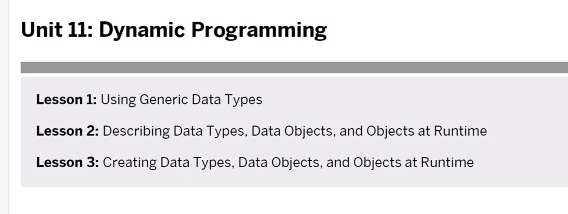
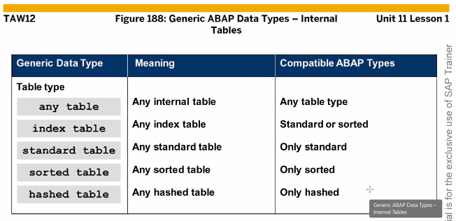
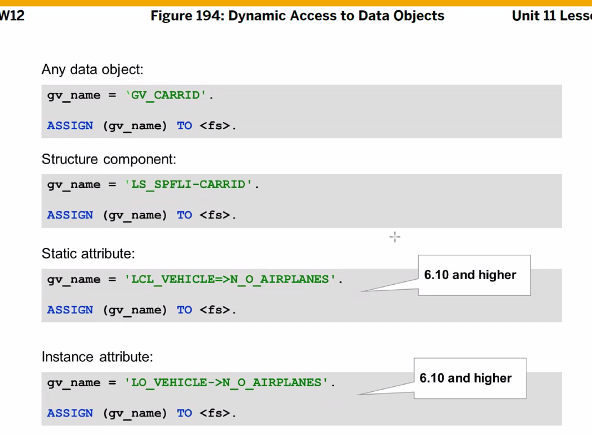
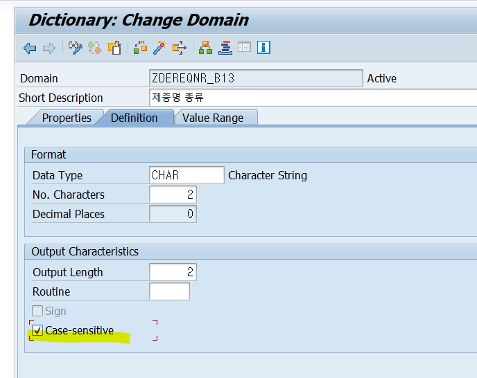

```ABAP
*&---------------------------------------------------------------------*
*& Report ZABAP_B00_45
*&---------------------------------------------------------------------*
*&
*&---------------------------------------------------------------------*
REPORT ZABAP_B00_45.

DATA: GT_SCARR   TYPE TABLE OF SCARR,
      GT_SPFLI   TYPE TABLE OF SPFLI,
      GT_SFLIGHT TYPE TABLE OF SFLIGHT.

DATA: GO_SALV TYPE REF TO CL_SALV_TABLE.

FIELD-SYMBOLS: <FS_ITAB> TYPE ANY TABLE.

PARAMETERS: PA_TNAME TYPE STRING,
            PA_ROW   TYPE I DEFAULT 100.

CASE PA_TNAME.
  WHEN 'SCARR'.
    ASSIGN GT_SCARR TO <FS_ITAB>.
  WHEN 'SPFLI'.
    ASSIGN GT_SPFLI TO <FS_ITAB>.
  WHEN 'SFLIGHT'.
    ASSIGN GT_SFLIGHT TO <FS_ITAB>.
ENDCASE.

IF <FS_ITAB> IS ASSIGNED.
  SELECT *
    INTO TABLE <FS_ITAB>
    FROM (PA_TNAME)
    UP TO PA_ROW ROWS.

  CALL METHOD CL_SALV_TABLE=>FACTORY
    IMPORTING
      R_SALV_TABLE = GO_SALV
    CHANGING
      T_TABLE      = <FS_ITAB>.

  GO_SALV->DISPLAY( ).

ENDIF.
```


case-sensitive는 대소문자 구분을 하지 않는다.
