[TOC]

[도움1](https://brunch.co.kr/@lifeisex/10)

# HANA 특징

SAP HANA는 DB를 의미한다.
Old OPEN SQL은 너무나 제한적이라 CDS VIEW과 NEW OPEN SQL이 만들어졌다.
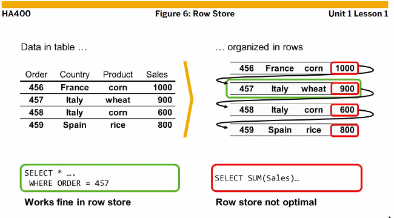
ROW 는 오른쪽 집계함수들은 최적화 되어 있지 않아 왼쪽보다 성능이 좋지 않다.
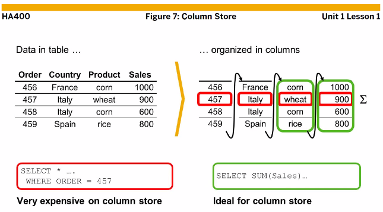
반대로 COLUMN은 특정 컬럼을 집계할때 성능이 좋다.

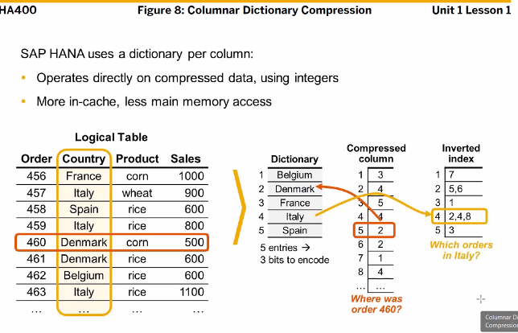
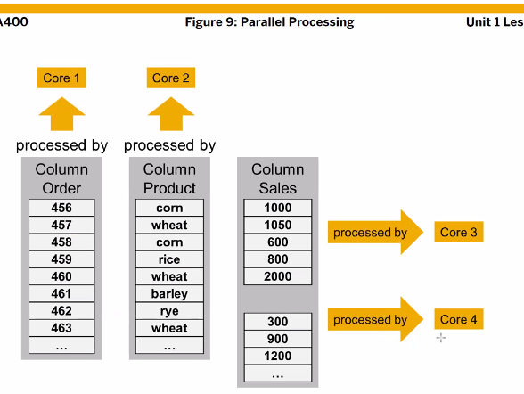
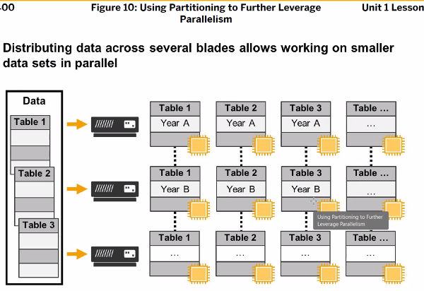

# HANA Studio

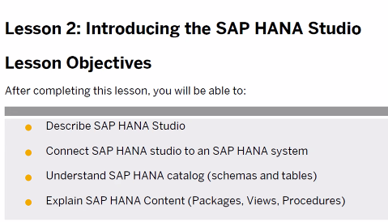
Eclips 툴로 사용이 가능하다. ( 이게 Base )

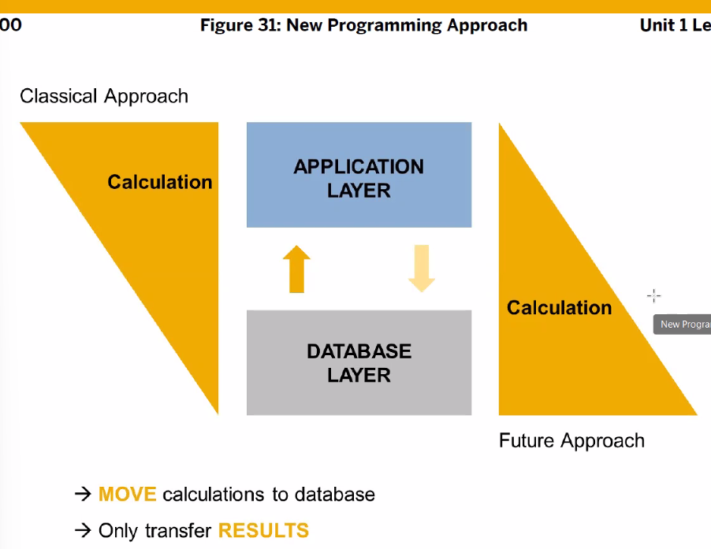
TODO ( 면접용 ) push down 이 무엇인가?

> 기존 ABAP Program에서 하던 계산 로직(Internal Table을 Loop돌며 데이터를 처리하는 방식)을 DB계층에 배치해 데이터의 빠른 검색과 어플리케이션 실행량을 감소시키는 패러다임.
>
> 기존 ABAP Program에서 하던 계산 로직(Internal Table을 Loop돌며 데이터를 처리하는 방식)을 DB계층에 배치해 데이터의 빠른 검색과 어플리케이션 실행량을 감소시키는 패러다임.

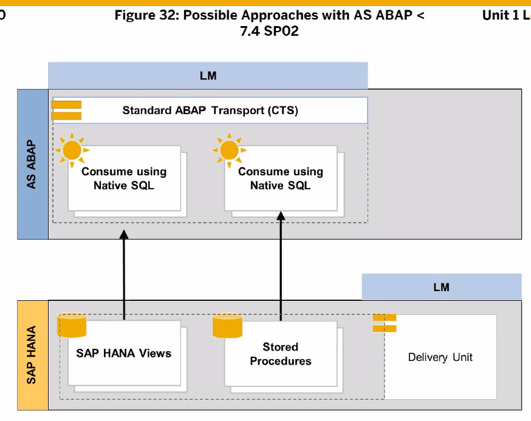
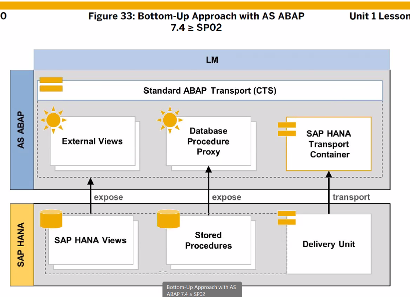

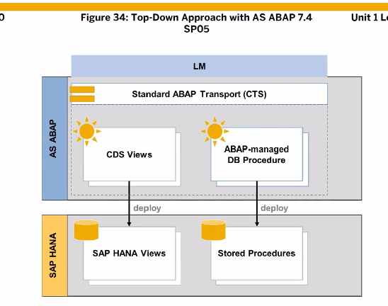
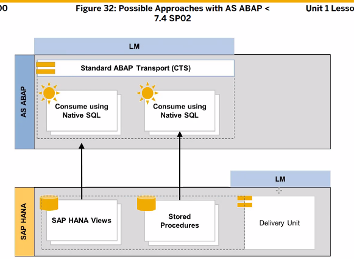

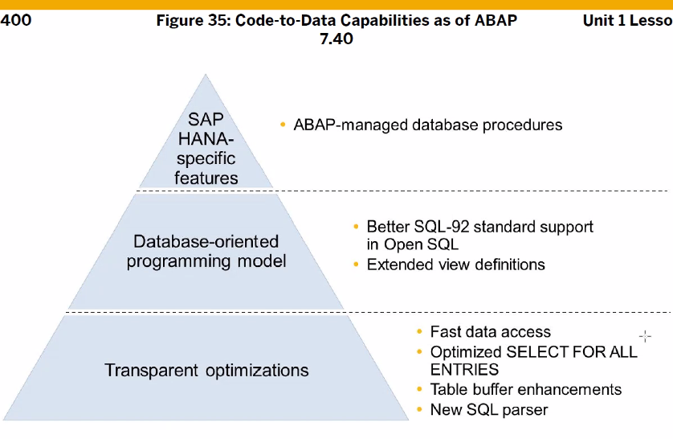

버전이 업 되며 (7.4 이후) 모든 DB 툴에서 사용이 가능해졌다.

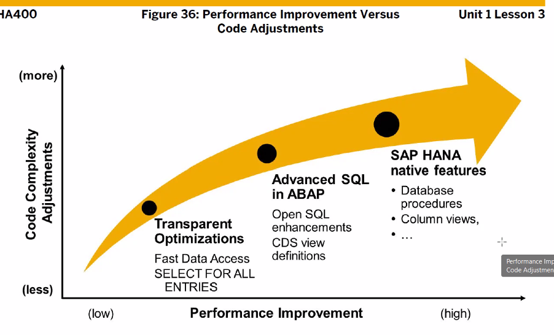
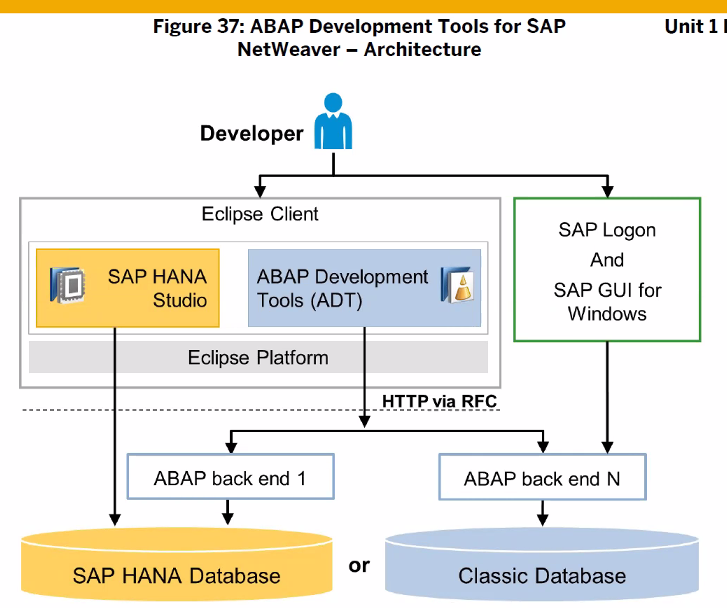
이클립스에 설치하기
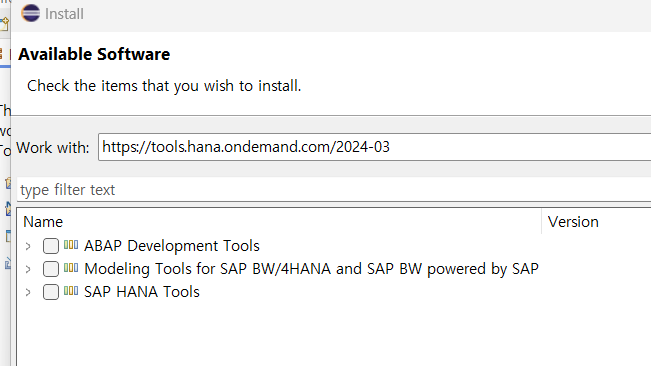

> https://tools.hana.ondemand.com/2024-03 
> 뒤에는 이클립스 버전

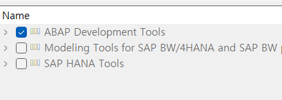
체크 후 next
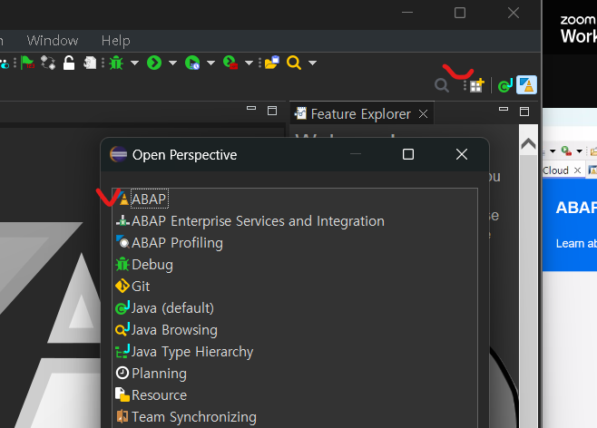
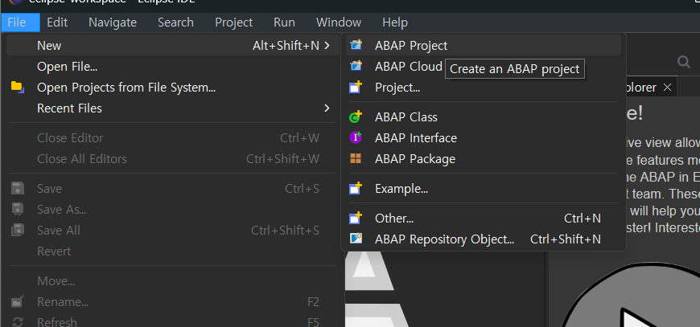
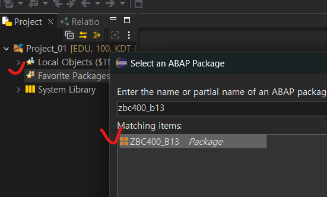

# Code-to-Data

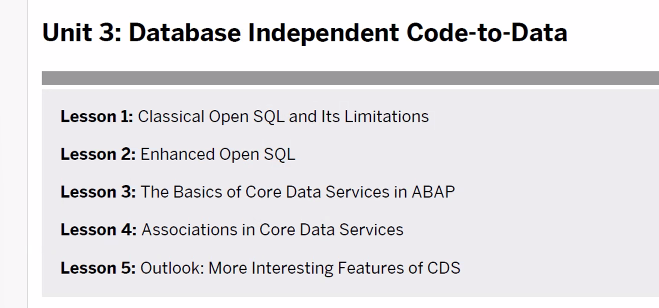

# Standard SQL

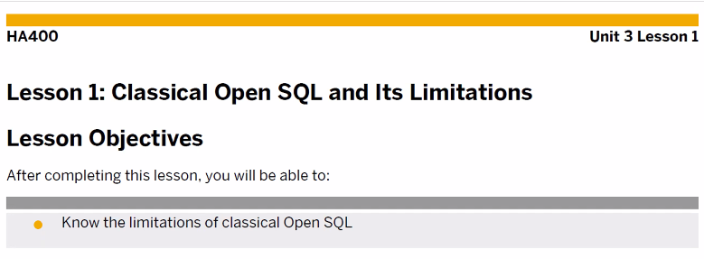
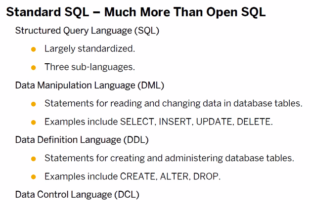
DML , DDL, DCL
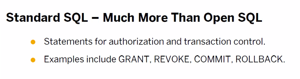
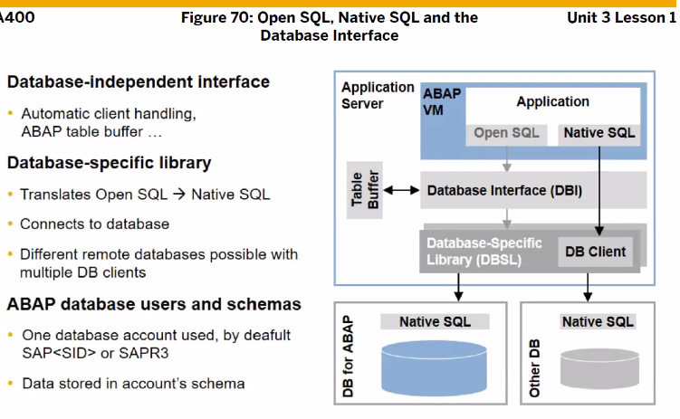
Old OPEN SQL의 제한 사항들
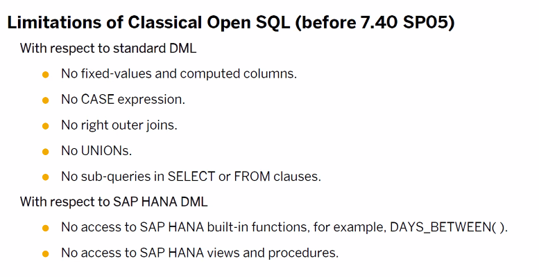

# Enhanced Open SQL

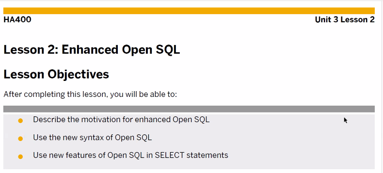
New Open SQL을 써보자
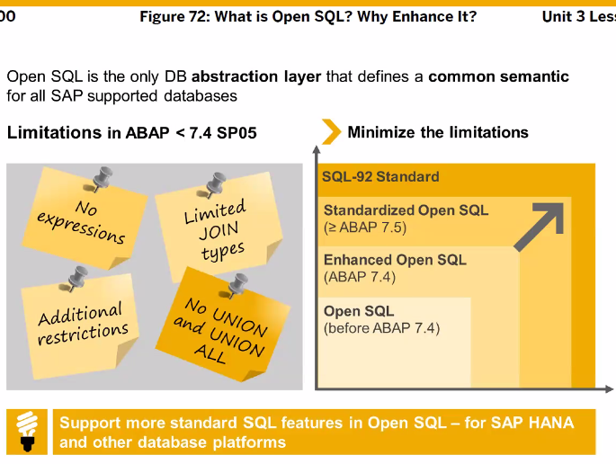
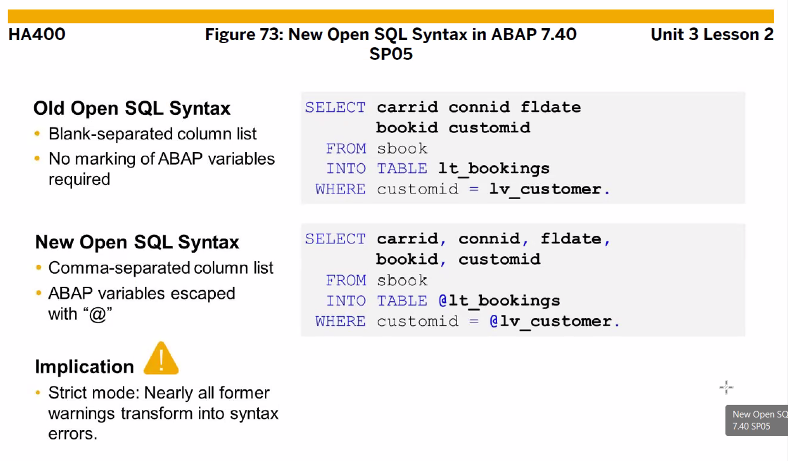
SELECT 절에서 컬럼은 **,** 로 구분해줘야 하며
변수나 상수 앞에는 **@** 을 붙여줘야 한다.
문법이 좀 더 엄격하므로 TYPE에 신경 써줘야 한다.
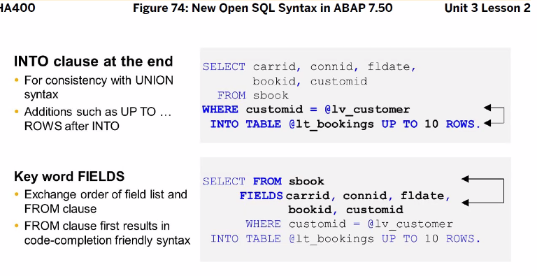
새 문법에서는 INTO 절 위치 또한 중요하다. SELECT FROM WHERE INTO 순이다.
FIELDS는 옵션
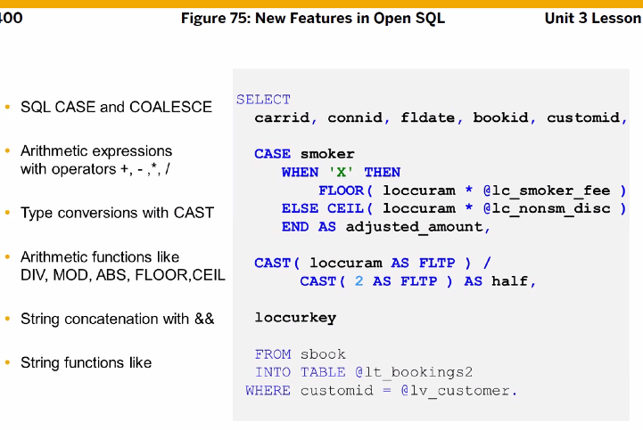
SELECT 절에서 CASE 문 사용이 가능하다. 연산도 가능하다.

## 실습

```ABAP
REPORT ZABAP_B13_47.

DATA: GT_DATA TYPE TABLE OF ZSSEATS_B13.

SELECT CARRID, CONNID, FLDATE, SEATSMAX, SEATSOCC,
  SEATSMAX - SEATSOCC AS SEATSFREE,
  DIVISION( SEATSOCC * 100, SEATSMAX, 2 ) AS BOOKRATE
FROM SFLIGHT
  INTO CORRESPONDING FIELDS OF TABLE @GT_DATA.

  CL_DEMO_OUTPUT=>DISPLAY( GT_DATA ).
```

TODO. PUSH DOWN 설명 여기 :: 이렇듯 OPEN SQL 안에서 계산하는 방식을 CODE TO DATA 또는 PUSH DOWN 이라고 부른다.

CASE문 사용해보기, GT_DATA 변수 선언 없이 사용해보기
```ABAP
REPORT ZABAP_B13_48.

* Simple CASE Expression
 SELECT ID, NAME, CUSTTYPE,
  CASE CUSTTYPE
    WHEN 'P' THEN 'Private Customer'
    WHEN 'B' THEN 'Business Customer'
    ELSE ' '
  END AS CUSTTYPE_TXT
FROM SCUSTOM
INTO TABLE @DATA(GT_DATA) UP TO 30 ROWS.
  "  변수 선언이 없는 GT_DATA는 이렇게 써줘야 한다. 괄호 안에 SPACE BAR 없음

CL_DEMO_OUTPUT=>DISPLAY( GT_DATA ).
```

이렇듯 GT_DATA 선언 없이도 사용이 가능하다.
@DATA(GT_DATA)

다른 CASE문 예제
```ABAP
* Complex CASE Expression
SELECT ID, NAME, CUSTTYPE,
  CASE WHEN CUSTTYPE = 'P' THEN  'Private Customer'
       WHEN CUSTTYPE = 'B' THEN  'Business Customer'
        ELSE ' '
  END AS CUSTTYPE_TXT
FROM SCUSTOM
INTO TABLE @DATA(GT_DATA) UP TO 30 ROWS.

CL_DEMO_OUTPUT=>DISPLAY( GT_DATA ).
```

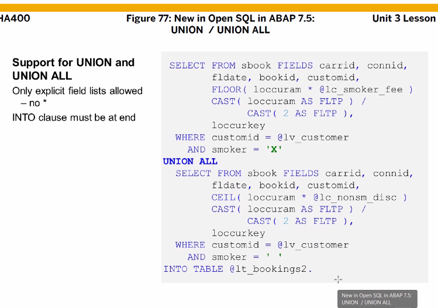
UNION 을 쓸때 SELECT * 에 * 을 쓸 수 없다.
UNION ALL일때 두 테이블의 필드 갯수와 이름, TYPE이 같아야 한다.
또한 INTO 절은 젤 마지막에 써야함. (순서)

> UNION 은 중복 허용x
> UNION ALL은 중복 허용o

퀴즈05 번을 New SQL문으로 고쳐쓰기
```ABAP
REPORT ZABAP_B00_49.

DATA: BEGIN OF GS_OUTPUT,
        CARRID TYPE SBOOK-CARRID,
        CONNID TYPE SBOOK-CONNID,
        DAYS   TYPE I,
      END OF GS_OUTPUT,
      GT_OUTPUT LIKE TABLE OF GS_OUTPUT.

SELECT CARRID, CONNID,
       SUM( DATS_DAYS_BETWEEN( ORDER_DATE, FLDATE ) ) AS DAYS,
       COUNT( * ) AS CNT
  FROM SBOOK
  GROUP BY CARRID, CONNID
  INTO TABLE @DATA(GT_DATA).

LOOP AT GT_DATA INTO DATA(GS_DATA).
  MOVE-CORRESPONDING GS_DATA TO GS_OUTPUT.
  GS_OUTPUT-DAYS = GS_DATA-DAYS / GS_DATA-CNT.

  APPEND GS_OUTPUT TO GT_OUTPUT.
ENDLOOP.

SORT GT_OUTPUT BY CARRID CONNID.

CL_DEMO_OUTPUT=>DISPLAY( GT_OUTPUT ).
```

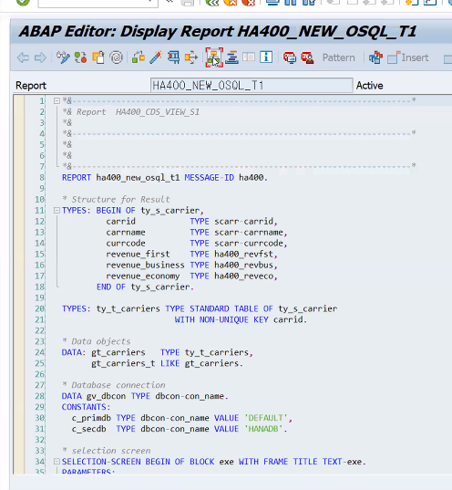
```ABAP
* Classic Open SQL
SELECT CARRID CARRNAME CURRCODE
  FROM SCARR
  CONNECTION (PV_DBCON)
  INTO TABLE LT_SCARR.

SELECT CARRID CLASS LOCCURKEY LOCCURAM
  FROM SBOOK
  CONNECTION (PV_DBCON)
  INTO TABLE LT_SBOOK
   WHERE CANCELLED <> 'X'.

LOOP AT LT_SCARR INTO LS_SCARR.
  CLEAR LS_CARRIER.

  LOOP AT LT_SBOOK INTO LS_SBOOK
                   WHERE CARRID = LS_SCARR-CARRID.
    IF LS_SBOOK-LOCCURKEY <> LS_SCARR-CURRCODE.
      MESSAGE 'Inconsistent data' TYPE 'A'.
    ENDIF.
    CASE LS_SBOOK-CLASS.
      WHEN 'F'.  "First Class Booking
        LS_CARRIER-REVENUE_FIRST =         LS_CARRIER-REVENUE_FIRST
                                         + LS_SBOOK-LOCCURAM.
      WHEN 'C'. "Business Class Booking
        LS_CARRIER-REVENUE_BUSINESS =      LS_CARRIER-REVENUE_BUSINESS
                                         + LS_SBOOK-LOCCURAM.
      WHEN 'Y'.  "Economy Class Booking
        LS_CARRIER-REVENUE_ECONOMY =       LS_CARRIER-REVENUE_ECONOMY
                                         + LS_SBOOK-LOCCURAM.
    ENDCASE.
  ENDLOOP.
  MOVE-CORRESPONDING LS_SCARR TO LS_CARRIER.
  APPEND LS_CARRIER TO CT_CARRIERS.
ENDLOOP.

```

을 New Open SQL로
```ABAP
  SELECT FROM SCARR AS C LEFT OUTER JOIN SBOOK AS B ON C~CARRID = B~CARRID
    FIELDS C~CARRID, C~CARRNAME, C~CURRCODE,
    SUM( CASE B~CLASS WHEN 'F' THEN B~LOCCURAM ELSE 0 END ) AS REVENUE_FIRST,
    SUM( CASE B~CLASS WHEN 'C' THEN B~LOCCURAM ELSE 0 END ) AS REVENUE_BUSINESS,
    SUM( CASE B~CLASS WHEN 'Y' THEN B~LOCCURAM ELSE 0 END ) AS REVENUE_ECONOMY
    WHERE B~CANCELLED <> 'X'
    GROUP BY C~CARRID, C~CARRNAME, C~CURRCODE
    INTO TABLE @CT_CARRIERS.
```

JOIN문을 쓸때에는

> SELECT FROM JOIN ON FIELDS WHERE GROUP BY HAVING INTO 순서로 함