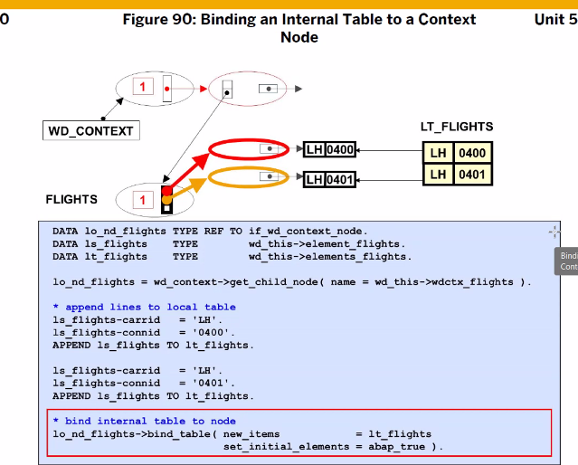
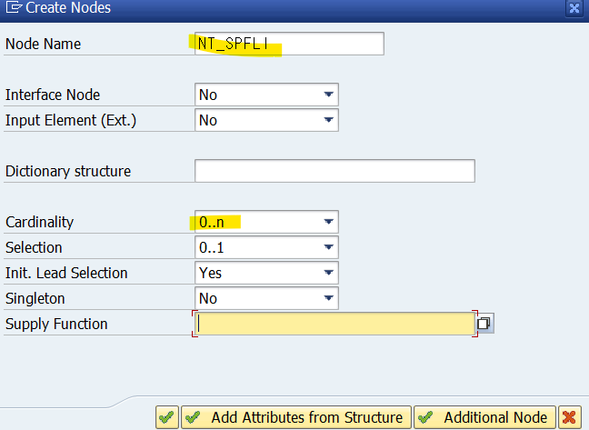
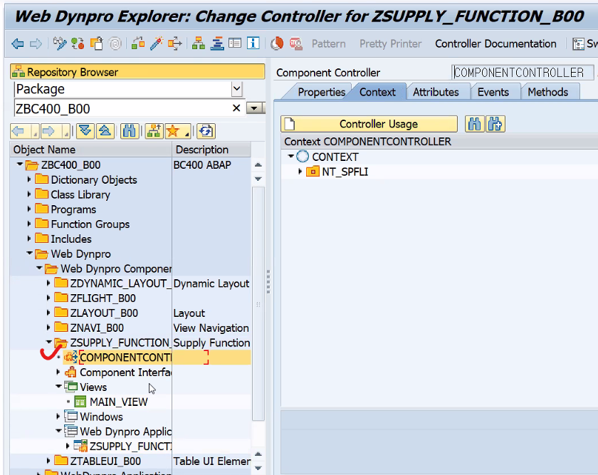

[출처](https://blog.naver.com/o_owo_o3o/222899979428)


해당 view가 종료될때 자동으로 호출되어 지는 것 : WDDOEXIT


````ABAP
CLASS zcl_mcbc_meal_airline3_dpc_ext DEFINITION
  PUBLIC
  INHERITING FROM zcl_mcbc_meal_airline3_dpc
  CREATE PUBLIC .

  PUBLIC SECTION.
  PROTECTED SECTION.
    METHODS mealset_create_entity REDEFINITION.
    METHODS mealset_update_entity REDEFINITION.
    METHODS mealset_delete_entity REDEFINITION.
    METHODS mealset_get_entityset REDEFINITION.
    METHODS mealset_get_entity    REDEFINITION.
  PRIVATE SECTION.
ENDCLASS.


CLASS ZCL_MCBC_MEAL_AIRLINE3_DPC_EXT IMPLEMENTATION.


  METHOD mealset_create_entity.

    DATA ls_meal TYPE zvmeals.
    DATA ls_smeal TYPE smeal.
    DATA ls_smealt TYPE smealt.


    io_data_provider->read_entry_data( IMPORTING es_data = ls_meal ).
    DATA(lo_msgcont) = mo_context->get_message_container( ).

    SELECT COUNT( * )
      FROM scarr
     WHERE carrid = ls_meal-airlineid.
    IF sy-dbcnt = 0.
      lo_msgcont->add_message_text_only(
        EXPORTING
          iv_msg_type = lo_msgcont->gcs_message_type-error      " Message Type - defined by GCS_MESSAGE_TYPE
          iv_msg_text = 'Please enter/select valid AirlineID'   " Message Text
      ).
    ENDIF.

    IF ls_meal-mealnumber = '00000000' OR ls_meal-mealnumber IS INITIAL.
      lo_msgcont->add_message_text_only(
        EXPORTING
          iv_msg_type = lo_msgcont->gcs_message_type-error      " Message Type - defined by GCS_MESSAGE_TYPE
          iv_msg_text = 'Please enter/select valid Meal Number' " Message Text
      ).
    ENDIF.

    IF ls_meal-mealtype IS INITIAL.
      lo_msgcont->add_message_text_only(
        EXPORTING
          iv_msg_type = lo_msgcont->gcs_message_type-error      " Message Type - defined by GCS_MESSAGE_TYPE
          iv_msg_text = 'Please enter/select valid Meal Type'   " Message Text
      ).
    ENDIF.

    IF lines( lo_msgcont->get_messages( ) ) > 0.
      RAISE EXCEPTION TYPE /iwbep/cx_mgw_busi_exception
        EXPORTING
          message_container = lo_msgcont.
    ELSE.
      ls_smeal = CORRESPONDING #( ls_meal MAPPING carrid = airlineid ).
*      ls_smeal-carrid = ls_meal-airlineid.

      INSERT smeal FROM ls_smeal.
      IF sy-subrc = 0.
        ls_smealt = CORRESPONDING #( ls_meal MAPPING carrid = airlineid ).
        ls_smealt-sprache = sy-langu.
*        ls_smealt-text = ls_meal-text.
        MODIFY smealt FROM ls_smealt.

        er_entity = ls_meal.
      ELSE.
        lo_msgcont->add_message_text_only(
          EXPORTING
            iv_msg_type = lo_msgcont->gcs_message_type-error      " Message Type - defined by GCS_MESSAGE_TYPE
            iv_msg_text = 'Creation failed may be duplicate key'  " Message Text
        ).

        RAISE EXCEPTION TYPE /iwbep/cx_mgw_busi_exception
          EXPORTING
            message_container = lo_msgcont.

      ENDIF.
    ENDIF.

  ENDMETHOD.


  METHOD mealset_delete_entity.

    DATA ls_meal TYPE zvmeals.

    io_tech_request_context->get_converted_keys( IMPORTING es_key_values = ls_meal ).
    DATA(lo_msgcont) = mo_context->get_message_container( ).

    DELETE FROM smeal
     WHERE carrid = ls_meal-airlineid
       AND mealnumber = ls_meal-mealnumber.
    IF sy-subrc = 0.
      DELETE FROM smealt                      " All texts will be deleted irrespective of Languages
       WHERE carrid = ls_meal-airlineid
         AND mealnumber = ls_meal-mealnumber.
    ELSE.
      lo_msgcont->add_message_text_only(
        EXPORTING
          iv_msg_type = lo_msgcont->gcs_message_type-error " Message Type - defined by GCS_MESSAGE_TYPE
          iv_msg_text = 'Deletion failed may be wrong key' " Message Text
      ).
    ENDIF.

    IF lines( lo_msgcont->get_messages( ) ) > 0.
      RAISE EXCEPTION TYPE /iwbep/cx_mgw_busi_exception
        EXPORTING
          message_container = lo_msgcont.
    ENDIF.

  ENDMETHOD.


  METHOD mealset_get_entity.

    DATA ls_meal TYPE zcl_mcbc_meal_airline_mpc=>ts_meal.

*-- Reads the key values of URI into data structure of Entity Type
    io_tech_request_context->get_converted_keys( IMPORTING es_key_values = ls_meal ).

*-- Reads a unique row based on keys passed in URI
    SELECT SINGLE *
      INTO CORRESPONDING FIELDS OF @er_entity
      FROM zmeals( p_logon_langu = @sy-langu, p_suppl_langu = 'D' )
     WHERE airlineid  = @ls_meal-airlineid
       AND mealnumber = @ls_meal-mealnumber.

  ENDMETHOD.


  METHOD mealset_get_entityset.

    DATA lt_meals TYPE zcl_mcbc_meal_airline_mpc=>tt_meal.

*-- This comparison pattern is too long; it must be 256 characters or fewer
*-- Part-field access (offset = 0, length = 10) to a data object of the size 9 exceeds valid boundaries.
    DATA search_cond TYPE c LENGTH 52.  " Deliberately made char type to avoid dumps instead of string

*-- /EntitySetName/$count - works neither filtering nor searching
    IF io_tech_request_context->has_count( ).
      SELECT COUNT( * )
        FROM zmeals( p_logon_langu = @sy-langu, p_suppl_langu = 'D' ).

      es_response_context-count = sy-dbcnt.
      RETURN.
    ENDIF.

*-- Meals?$format=json&$inlinecount=allpages&$filter=AirlineID eq 'AA'
    DATA(where_cond) = io_tech_request_context->get_osql_where_clause_convert( ).
    search_cond = io_tech_request_context->get_search_string( ).
    DATA(sort_tab) = io_tech_request_context->get_orderby( ).
    DATA(sort_cond) = REDUCE string( INIT str = ``
                                     FOR row IN sort_tab
                                     NEXT str = |{ str }{ row-property } { COND string( WHEN row-order = 'desc' THEN `DESCENDING,` ELSE `,` ) }|
                                   ).
*-- Default Sort order
    IF sort_cond IS INITIAL.
      sort_cond = `AIRLINEID, MEALNUMBER`.
    ELSE.
      sort_cond = substring( val = sort_cond len = strlen( sort_cond ) - 1 ).
    ENDIF.

*-- Just a Query to get all rows of the entity
    IF search_cond IS INITIAL.
      SELECT *
        FROM zmeals( p_logon_langu = @sy-langu, p_suppl_langu = 'D' )
       WHERE (where_cond)
       ORDER BY (sort_cond)
        INTO CORRESPONDING FIELDS OF TABLE @lt_meals.
    ELSE.
      search_cond = |%{ search_cond }%|.

      SELECT *
        FROM zmeals( p_logon_langu = @sy-langu, p_suppl_langu = 'D' )
       WHERE (where_cond)
         AND ( airlineid LIKE @search_cond(4) OR
               mealnumber LIKE @search_cond(10) OR
               mealtype LIKE @search_cond(4) OR
               text LIKE @search_cond(52)
             )
       ORDER BY (sort_cond)
        INTO CORRESPONDING FIELDS OF TABLE @lt_meals.
    ENDIF.

*-- Client side paging
*-- /EntitySetName?$format=json&$inlinecount=allpages
    IF io_tech_request_context->has_inlinecount( ).
      es_response_context-inlinecount = lines( lt_meals ).
    ENDIF.

*-- $top & $skip
    DATA(from) = io_tech_request_context->get_skip( ).
    DATA(to) = from + io_tech_request_context->get_top( ).
    IF ( from + to ) = 0.
      et_entityset[] = lt_meals[].
    ELSE.
      from = from + 1.

*      LOOP AT lt_meals FROM from TO to ASSIGNING FIELD-SYMBOL(<fs_entity>).
*        APPEND <fs_entity> TO et_entityset.
*      ENDLOOP.

      APPEND LINES OF lt_meals FROM from TO to TO et_entityset.
    ENDIF.

  ENDMETHOD.


  METHOD mealset_update_entity.

    DATA ls_meal TYPE zvmeals.
    DATA ls_mealkey TYPE zvmeals.

    io_data_provider->read_entry_data( IMPORTING es_data = ls_meal ).
    io_tech_request_context->get_converted_keys( IMPORTING es_key_values = ls_mealkey ).
    ls_meal-airlineid = ls_mealkey-airlineid.   " Overwrite like this / give a error
    ls_meal-mealnumber = ls_mealkey-mealnumber.

    DATA(lo_msgcont) = mo_context->get_message_container( ).

    IF ls_meal-mealtype IS INITIAL.
      lo_msgcont->add_message_text_only(
        EXPORTING
          iv_msg_type = lo_msgcont->gcs_message_type-error    " Message Type - defined by GCS_MESSAGE_TYPE
          iv_msg_text = 'Please enter/select valid Meal Type' " Message Text
      ).
    ELSE.
      UPDATE smeal SET mealtype = ls_meal-mealtype
       WHERE carrid = ls_meal-airlineid
         AND mealnumber = ls_meal-mealnumber.
      IF sy-subrc = 0.
        UPDATE smealt SET text = ls_meal-text
         WHERE carrid = ls_meal-airlineid
           AND mealnumber = ls_meal-mealnumber
           AND sprache = sy-langu.
      ELSE.
        lo_msgcont->add_message_text_only(
          EXPORTING
            iv_msg_type = lo_msgcont->gcs_message_type-error  " Message Type - defined by GCS_MESSAGE_TYPE
            iv_msg_text = 'Updation failed may be wrong key'  " Message Text
        ).
      ENDIF.
    ENDIF.

    IF lines( lo_msgcont->get_messages( ) ) > 0.
      RAISE EXCEPTION TYPE /iwbep/cx_mgw_busi_exception
        EXPORTING
          message_container = lo_msgcont.
    ENDIF.

  ENDMETHOD.
ENDCLASS.
````








spfli


sflight


완성된 구조




주석 풀기


