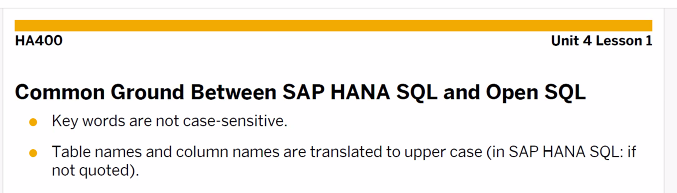
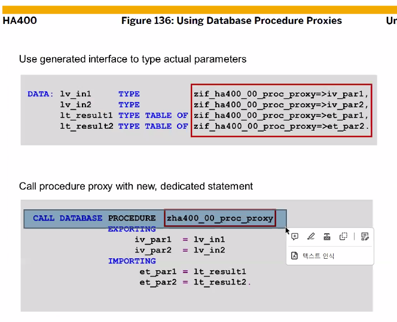
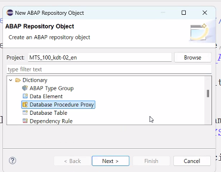
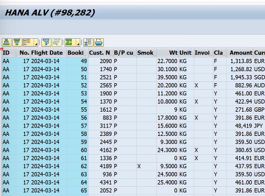

[TOC]

[참고1](https://i009727.tistory.com/55)




- SELECT FROM 과 같은 키워드의 대소문자는 구분하지 않는다
- 테이블 이름과 컬럼 이름은 대소문자 구분하지 않는다. 어차피 전부 대문자로 변환된다. 단 HANA DB에서는 ' ' 가 오면 대소문자 구분을 해준다.


NOS는 SELECT 컬럼, 컬럼 FROM 혹은 SELECT FROM FIELDS 가 와야 한다.
테이블.컬럼 -> 테이블~컬럼 이렇게 틸드(~) 로 구분하게 되었다.


컬럼구분은 , 으로 repzme 은 스키마이다. 그 스키마에 있는 테이블 갖고와
클라이언트를 자동으로 처리하지 않기에 and mandt 해서 클라이언트 지정해줘야해
join 구문 아래 이미지


## AMDP Method


tables는 올 수 없으며 스칼라 컬럼이 와야 한다.


주석은 (--)로 한다.

ABAP Workbench에서 CUD는 불가능하다. R만 가능
ADT 툴에서만 가능하다.


로그인 한 클라이언트 : session_context( 'CLIENT' )
문장의 끝에는 ; 가 와야한다.


```ABAP
CLASS ZCL_AMDP_B13 DEFINITION
  PUBLIC
  FINAL
  CREATE PUBLIC .

  PUBLIC SECTION.
    INTERFACES: IF_AMDP_MARKER_HDB.

    TYPES: BEGIN OF TS_FLIGHT,
             CARRID    TYPE SFLIGHT-CARRID,
             CONNID    TYPE SFLIGHT-CONNID,
             FLDATE    TYPE SFLIGHT-FLDATE,
             SEATSMAX  TYPE SFLIGHT-SEATSMAX,
             SEATSOCC  TYPE SFLIGHT-SEATSOCC,
             SEATSFREE TYPE I,
           END OF TS_FLIGHT.
    TYPES: TT_FLIGHT TYPE TABLE OF TS_FLIGHT.

    CLASS-METHODS:
      GET_FLIGHT IMPORTING VALUE(IV_CARRID) TYPE SFLIGHT-CARRID
                 EXPORTING VALUE(ET_FLIGHT) TYPE TT_FLIGHT.
  PROTECTED SECTION.
  PRIVATE SECTION.
ENDCLASS.


CLASS ZCL_AMDP_B13 IMPLEMENTATION.
  METHOD GET_FLIGHT BY DATABASE PROCEDURE FOR HDB LANGUAGE SQLSCRIPT
                    OPTIONS READ-ONLY
                    USING SFLIGHT.
    ET_FLIGHT = SELECT CARRID, CONNID, FLDATE, SEATSMAX, SEATSOCC,
                       SEATSMAX-SEATSOCC AS SEATSFREE
                FROM SFLIGHT
                WHERE MANDT = SESSION_CONTEXT( 'CLIENT' )
                   AND CARRID = :IV_CARRID;
  ENDMETHOD.
ENDCLASS.
```

```abap
REPORT ZABAP_B13_50.

DATA: GT_FLIGHT TYPE ZCL_AMDP_B13=>TT_FLIGHT.

PARAMETERS: PA_CAR TYPE SFLIGHT-CARRID.

CALL METHOD ZCL_AMDP_B13=>GET_FLIGHT
    EXPORTING
        IV_CARRID = PA_CAR
    IMPORTING
        ET_FLIGHT = GT_FLIGHT.

CL_DEMO_OUTPUT=>DISPLAY( GT_FLIGHT ).
* F8 키로 실행하기
```

## ADBC


**Native SQL 사용하는 사례** 

- DB 마이그레이션 할때
- HANA DB에 접속해서 VIEW를 만들때 Native Query를 사용한다.


```ABAP
*&---------------------------------------------------------------------*
*& Report ZABAP_B13_51
*&---------------------------------------------------------------------*
*&
*&---------------------------------------------------------------------*
REPORT ZABAP_B13_51.

DATA: GV_SQL TYPE STRING, "Native sql
      GV_MSG TYPE STRING. "error message

DATA: GO_SQL TYPE REF TO CL_SQL_STATEMENT,
      GO_RESULT TYPE REF TO CL_SQL_RESULT_SET,
      GX_ROOT TYPE REF TO CX_ROOT,
      GR_DATA TYPE REF TO DATA.

DATA: GT_FLIGHT TYPE TABLE OF SFLIGHT.

PARAMETERS: PA_CAR TYPE SFLIGHT-CARRID.
TRY.
* CL_SQL_STATEMENT Object 생성a 및 DB 연결.
  CREATE OBJECT GO_SQL
  EXPORTING
    CON_REF = CL_SQL_CONNECTION=>GET_CONNECTION( 'DEFAULT' ).

* 띄어쓰기를 주의해주자
*  CONCATENATE `SELECT * FROM SFLIGHT WHERE MANDT = ` SY-MANDT
*               ` AND CARRID = '` PA_CAR `'` INTO GV_SQL.

* String Templates/string expressions
* 또는 이렇게 문자열을 합칠수도 있다. 대소문자 구분은 하지 않는다.
  GV_SQL = |SELECT * FROM SFLIGHT WHERE MANDT = { SY-MANDT }| &&
           | AND CARRID = '{ PA_CAR }'|.

*  QUERY 실행.
  GO_RESULT = GO_SQL->EXECUTE_QUERY( GV_SQL ).

*  Target variable
  GET REFERENCE OF GT_FLIGHT INTO GR_DATA.
  GO_RESULT->SET_PARAM_TABLE( GR_DATA ).

*  Target variable에 데이터 할당.
  GO_RESULT->NEXT_PACKAGE( ).

  CL_DEMO_OUTPUT=>DISPLAY( GT_FLIGHT ).

*  Resource close.
  GO_RESULT->CLOSE( ).

CATCH CX_SQL_EXCEPTION INTO GX_ROOT.
*  Error 발생시 에러 메시지 읽어와서 Information 메시지 표시.
  GV_MSG = GX_ROOT->GET_TEXT( ).
  MESSAGE GV_MSG TYPE 'I'.
ENDTRY.
```


native sql은 문법 오류를 잡아주지 않는다.
잘 쓸일이 없으나 써야할때는 ADBC를 사용하도록 한다.

CX_ROOT 혹은 CX_SQL~ 어쩌고로 외우자

- 변수명 앞에 콜론(:) 기호를 추가해야 한다.
- WHERE(조건) 구문 내에 클라이언트 구분자, 즉 MANDT 필드를 반드시 기술해야 한다.
  - 미기술시, 인덱스활용이 불가능해 테이블 full-scan으로인해 성능이 저하된다.

## Information Models 


view , procedures 생성하기


INPUT / OUTPUT PARAM으로 이루어져있다.


HANA DB에 로그인해서 VIEW를 수정했을 경우 애와 연결되어 있는 EXTERNAL VIEW는 자동으로 동기화되지 않기에 수동으로 해줘야만 합니다.


CA_ 한 후 Ctrl + Space 를 해주세요


F3 해서 활성화하면 Dictionary View에 데이터가 생긴다.







활성화 시키면

이렇게 생성된다

```ABAP
*&---------------------------------------------------------------------*
*& Report ZABAP_B13_53
*&---------------------------------------------------------------------*
*&
*&---------------------------------------------------------------------*
REPORT ZABAP_B13_53.

DATA: GT_EARLY TYPE TABLE OF ZIF_ZEARLY_BIRD_PROXY_B13=>ET_EARLY,
      GT_LATE  TYPE TABLE OF ZIF_ZEARLY_BIRD_PROXY_B13=>ET_LATE.

PARAMETERS: PA_NUM TYPE ZIF_ZEARLY_BIRD_PROXY_B13=>IV_NUMBER.

CALL DATABASE PROCEDURE ZEARLY_BIRD_PROXY_B13
  EXPORTING
    IV_NUMBER = PA_NUM
    IV_MANDT = SY-MANDT
  IMPORTING
    ET_LATE = GT_LATE
    ET_EARLY = GT_EARLY.

CL_DEMO_OUTPUT=>DISPLAY( GT_LATE ).
```

10을 입력하면 이렇게 떠요


Column store 가 Defalut 이다.


search , check box advanced options


## HANA ALV (ALV IDA)


기본 원칙

- 데이터 읽어와서 스크린에 데이터를 Display 한다.
- db - read - itab 에 할당 - alv grid에 display의 과정이었는데
  얘는 그냥 db - read - screen에 display 순서임
- ALV의 여러가지 기능이 있는데 이것을 PUSH DOWN 해서 가져다 쓴다
- ITAB에 데이터 안 담아!!
- 장점 : 결과가 매우 빠르게 표시 (성능 GOOD)


```ABAP
*&---------------------------------------------------------------------*
*& Report ZABAP_B13_54
*&---------------------------------------------------------------------*
*&
*&---------------------------------------------------------------------*
REPORT ZABAP_B13_54.

DATA: GO_SALV TYPE REF TO IF_SALV_GUI_TABLE_IDA.

GO_SALV = CL_SALV_GUI_TABLE_IDA=>CREATE(
          IV_TABLE_NAME = 'SBOOK').

GO_SALV->FULLSCREEN( )->DISPLAY( ).
```




