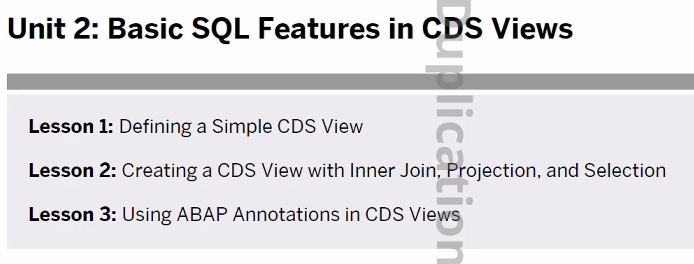
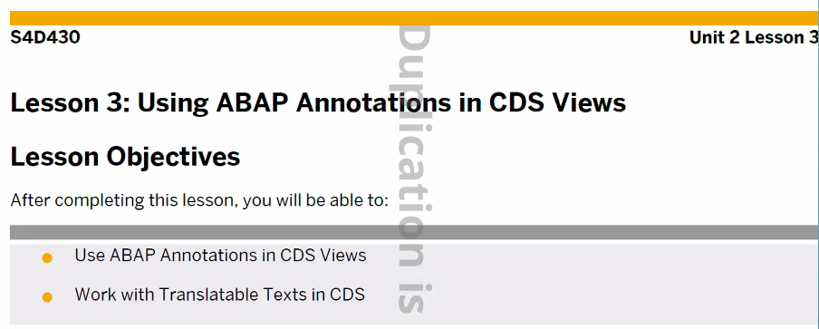
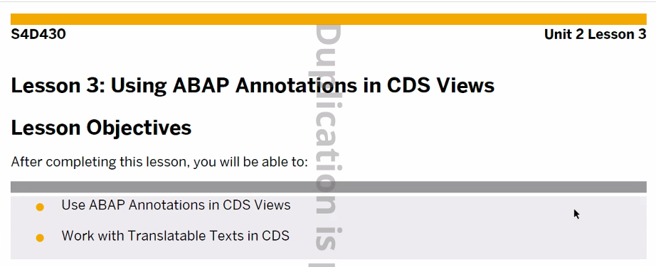
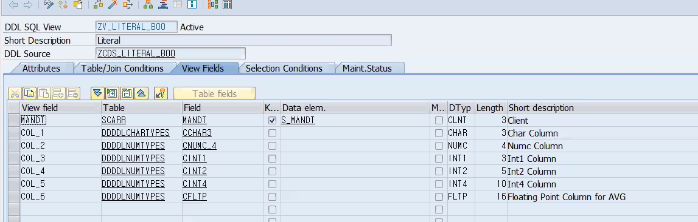
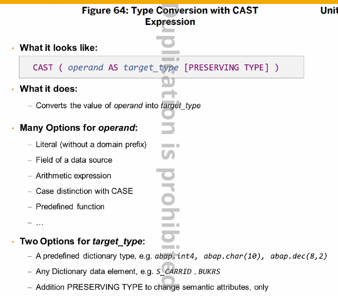

[TOC]

[참고1](https://blog.naver.com/hyomin08011/223399459314)

# CDS VIEW

: CDS View 에 @AbapCatalog.sqlViewName 의 Annotation 에 의해 ABAP Dictionary 객체를 만들어 줌

보통 ALV Report 개발할때, Display Structure 만들어 Fieldcatalog 를 지정하고, 모델링한 쿼리문으로 데이터를 가져와서 화면에 출력을 하게 되는데요.

CDS View 하나 잘 만들면 Display Structure 까지 한번에 만들어서 진행할 수 있습니다. 


CDS는 ADT에서만 가능 워크벤치는 READ-ONLY


Data Difinition은 두개의 view를 생성한다. (cds, sql view)
cds에는 어노테이션이 있는데 속성을 지정할 수 있다.


## 실습


```sql
 -- 이렇게 이름 지정
@AbapCatalog.sqlViewName: 'ZV_CONNECT_B13'
@AbapCatalog.compiler.compareFilter: true
@AbapCatalog.preserveKey: true
@AccessControl.authorizationCheck: #NOT_REQUIRED
@EndUserText.label: 'Flight Connection'
@Metadata.ignorePropagatedAnnotations: true
define view zcds_connect1_b13 as select from spfli
{
    carrid as carrier,
    connid, 
    countryfr,
    cityfrom,
    airpfrom,
    countryto,
    cityto,
    airpto
}

-- 활성화 하면 두개의 뷰가 생성된다 (sql, cds view)

```

F8로 실행하면


## 어노테이션 @


주로 메타데이터 정의할때 사용한다.
sqlViewName은 무조건 적줘야 한다 (어노테이션 필수 **), 뷰 이름과 똑같이 지어주도록 한다.

# CDS VIEW의 SQL




```JAVA
// 로 주석 가능
/**/ 로 주석 가능
// Ctrl + F7 로 주석 가능
```


Naming

SQL VIEW의 NAME은 CDS VIEW와 다르게 지어주자

```sql
@AbapCatalog.sqlViewName: 'ZV_INNER_B13'
@AbapCatalog.compiler.compareFilter: true
@AbapCatalog.preserveKey: true
@AccessControl.authorizationCheck: #NOT_REQUIRED
@EndUserText.label: 'Inner_Join'
@Metadata.ignorePropagatedAnnotations: true
define view zcds_inner_join_b13 as select from sflight
    inner join scarr 
    on sflight.carrid = scarr.carrid
{
    key sflight.carrid,
    key connid,
    key carrname,
    fldate,
    seatsmax,
    seatsocc,
    seatsmax - seatsocc as free
}
```


order by 절은 올 수 없다.




## 실습


key 사이에 저런거 허용하지 않음

```sql
@AbapCatalog.sqlViewName: 'ZBC13_JOIN'
@AbapCatalog.compiler.compareFilter: true
@AbapCatalog.preserveKey: true
@AccessControl.authorizationCheck: #NOT_REQUIRED
@EndUserText.label: 'JOIN'
@Metadata.ignorePropagatedAnnotations: true
define view zb13_JOIN as select from sbook as a 
    inner join scustom as b on a.customid = b.id
{
    key a.carrid,
    key a.connid,
    key a.fldate,
    key a.bookid,
    a.forcuram as amount,
    a.forcurkey as currency,
    a.class,
    a.luggweight,
    a.wunit,
    a.order_date,
    a.agencynum,
    a.counter,
    b.postcode,
    b.name,
    b.street,
    b.city,
    b.country
} where a.cancelled <> 'X'
```


CDS VIEW 는 UI5, ODATA에서 사용이 가능하다
이때 어노테이션이 사용된다


```java
@AbapCatalog.sqlViewName: 'ZV_CONNECT_B13'
@AbapCatalog.compiler.compareFilter: true
@AbapCatalog.preserveKey: true
@AccessControl.authorizationCheck: #NOT_REQUIRED
@EndUserText.label: 'Flight Connection'
@Metadata.ignorePropagatedAnnotations: true
define view zcds_connect1_b13 as select from spfli
{
    carrid as carrier,
    connid, 
    countryfr,
    cityfrom,
    airpfrom,
    countryto,
    cityto,
    airpto,
    @Semantics.quantity.unitOfMeasure: 'distid'
    distance,
    @Semantics.unitOfMeasure: true
    distid
    
    //    @Semantics.unitOfMeasure: true 아래처럼 올 수 있다.
    distid @<Semantics.unitOfMeasure: true
}

// 활성화 하면 두개의 뷰가 생성된다 (sql, cds view)
```


```java
@AbapCatalog.sqlViewName: 'ZV_LITERAL_B13'
@AbapCatalog.compiler.compareFilter: true
@AbapCatalog.preserveKey: true
@AccessControl.authorizationCheck: #NOT_REQUIRED
@EndUserText.label: 'literal'
@Metadata.ignorePropagatedAnnotations: true
define view zcds_literal_b13
  as select from scarr
{
  'CDS'   as col_1,
  '2942'  as col_2,

  50      as col_3,
  5935    as col_4,
  873260  as col_5,
  9257.40 as col_6
}
```


```java
{
  'CDS'   as col_1,
  '2942'  as col_2,

  50      as col_3,
  5935    as col_4,
  873260  as col_5,
  9257.40 as col_6
}
```


Data Type이 과연 어떻게 왔는지 잘 확인해보아라




preserving type은 타입을 바꾸려는게 아니라 고객 번호(s_customer)라는 의미로 바꾸겠다는 의미이다. '123' 이나 s_customer이나 타입은 같거든

int type을 fltp로 바꿔서 계산해야한다 ( / 할때)


