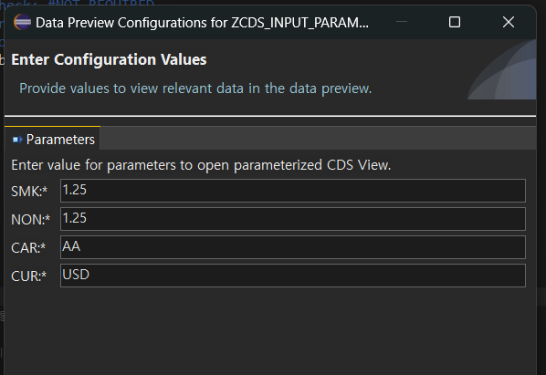

[TOC]

# Input Parameter


## 실습

```sql
@AbapCatalog.sqlViewName: 'ZV_INPARAM_B13'
@AbapCatalog.compiler.compareFilter: true
@AbapCatalog.preserveKey: true
@AccessControl.authorizationCheck: #NOT_REQUIRED
@EndUserText.label: 'input parameter'
@Metadata.ignorePropagatedAnnotations: true
define view zcds_input_param_b13
  with parameters
    smk : abap.dec( 3, 2 ),
    non : abap.dec( 3, 2 )
  as select from sbook
{
    key carrid as Carrid,
    key connid as Connid,
    key fldate as Fldate,
    key bookid as Bookid,
    
    case smoker when 'X'
        then loccuram * $parameters.smk
    else loccuram * $parameters.non
    end as adj_amount, loccurkey
}
```

Shift + F3 후 F8을 하게 되면


이렇게 값이 나온다.

``` sql
@AbapCatalog.sqlViewName: 'ZV_INPARAM_B13'
@AbapCatalog.compiler.compareFilter: true
@AbapCatalog.preserveKey: true
@AccessControl.authorizationCheck: #NOT_REQUIRED
@EndUserText.label: 'input parameter'
@Metadata.ignorePropagatedAnnotations: true
define view zcds_input_param_b13
  with parameters
    smk : abap.dec( 3, 2 ),
    non : abap.dec( 3, 2 ),
    car : s_carr_id,
    cur : s_currcode
  as select from sbook
{
  key carrid as Carrid,
  key connid as Connid,
  key fldate as Fldate,
  key bookid as Bookid,
  loccuram,
  smoker,
  
//  CURRENCY_CONVERSION 함수는 통화 환율에 기반하여 소스 값의 변환을 지원합니다. 
// amount , 변환될 소스 금액
// source_currency , 소스 통화 키
// target_currnecy 대상 통화 키
// exchange_rate_date 변환에 고려되어야 할 TCURR 테이블의 환율 날짜입니다.

  currency_conversion( amount => loccuram, source_currency => loccurkey, target_currency => $parameters.cur, exchange_rate_date => fldate ) as amount,

      case smoker when 'X'
          then loccuram * $parameters.smk
      else loccuram * $parameters.non
      end    as adj_amount,
      loccurkey
}
where
  carrid = $parameters.car
```




파라미터 값 넘겨줄때 변수앞에는 @을 붙여줘야 한다.
```ABAP
*&---------------------------------------------------------------------*
*& Report ZABAP_B13_56
*&---------------------------------------------------------------------*
*&
*&---------------------------------------------------------------------*
REPORT ZABAP_B13_56.

PARAMETERS: PA_CAR TYPE SBOOK-CARRID,
            PA_SMK TYPE P LENGTH 3 DECIMALS 2.

CONSTANTS: GC_NON TYPE P LENGTH 3 DECIMALS 2 VALUE '0.90'.

* 순서는 중요하지가 않다.
SELECT  FROM ZCDS_INPUT_PARAM_B13(
  SMK = @PA_SMK,
  CAR = @PA_CAR,
  CUR = 'USD',
  NON = @GC_NON )
  FIELDS * INTO TABLE @DATA(GT_DATA)
  UP TO 50 ROWS.

CL_DEMO_OUTPUT=>DISPLAY( GT_DATA ).
```


총 7가지의 시스템 필드를 사용할 수 있다.


## 실습

```SQL
@AbapCatalog.sqlViewName: 'ZV_SYSTEMFIELED'
@AbapCatalog.compiler.compareFilter: true
@AbapCatalog.preserveKey: true
@AccessControl.authorizationCheck: #NOT_REQUIRED
@EndUserText.label: 'CDS System Fields'
@Metadata.ignorePropagatedAnnotations: true
define view zcds_systemfield_b13
  with parameters
    p_langu : spras @<Environment.systemField: #SYSTEM_LANGUAGE
// 만약 $session.system_language로 오게되면 로그인한 계정의 lang만을 들고오므로 유연성이 떨어진다. 
  as select from tcurw
{
  key spras as Spras,
  key kurst as Kurst,
      curvw as Curvw
} where spras = $parameters.p_langu
```


F8로 실행 후 그냥 넘기면 EN으로 로그인 되어있기 때문에 LANG은 영어로 
3을 넣어서 넘기면 한국어로 데이터가 표출된다.

```ABAP
*&---------------------------------------------------------------------*
*& Report ZABAP_B13_57
*&---------------------------------------------------------------------*
*&
*&---------------------------------------------------------------------*
REPORT ZABAP_B13_57.

SELECT FROM ZCDS_SYSTEMFIELD_B13
  FIELDS *
  INTO TABLE @DATA(GT_DATA).

  CL_DEMO_OUTPUT=>DISPLAY( GT_DATA ).
```

PA_LANGU에 값을 넘겨줘보자
```ABAP
*&---------------------------------------------------------------------*
*& Report ZABAP_B13_57
*&---------------------------------------------------------------------*
*&
*&---------------------------------------------------------------------*
REPORT ZABAP_B13_57.

SELECT FROM ZCDS_SYSTEMFIELD_B13(
  P_LANGU = 3
  )
  FIELDS *
  INTO TABLE @DATA(GT_DATA).

CL_DEMO_OUTPUT=>DISPLAY( GT_DATA ).
```

이렇게 하면 한국어 뜸

# CDS Associations


join이 필요하면 join을 한다.
장점 : 다른 CDS를 사용할 수 있다


Association VS JOIN 차이점

inner join은 은 두 개 테이블을 결합해서 필드를 가져올 때 사용하는 역할
association 은 테이블 간의 관계를 정해주는 역할 (느슨한 결합, 실제 결합되지 않음, 필요할때만 JOIN이 된다.)


JOIN은 언제 될까? 다른 CDS VIEW에서 사용하며 EXPOSE되어 있는 필드가 올때 (이미지 상에서는 C.어쩌고 처럼 C 테이블 필드만 오고 있기에 JOIN되지 아니한다.)


## 실습 (Asso의 expose 라고 불림)


전혀 join 되어있지 않다.

```sql
@AbapCatalog.sqlViewName: 'ZV_ASSO_B13'
@AbapCatalog.compiler.compareFilter: true
@AbapCatalog.preserveKey: true
@AccessControl.authorizationCheck: #NOT_REQUIRED
@EndUserText.label: 'CDS Association'
@Metadata.ignorePropagatedAnnotations: true
define view zcds_asso_b13
  as select from spfli
  association [1] to scarr as _Carrier on spfli.carrid = _Carrier.carrid
{
  key carrid,
  key connid,
      countryfr,
      cityfrom,
      airpfrom,
      countryto,
      cityto,
      airpto,
      
      _Carrier
}
```


저렇게 on으로 조건이 들어올 수 있다 $projection 또한 올 수 있다.
단, projection으로 올때는 조건이 있다.

carrid가 아니라 id가 와야 한다. 필드에 있는 이름이 조건절에 들어가야한다.
CDS VIEW 는 JOIN문 대신에 Association을 더 많이 사용한다. (재사용성이 좋아서)

```sql
@AbapCatalog.sqlViewName: 'ZV_ASSO_B13'
@AbapCatalog.compiler.compareFilter: true
@AbapCatalog.preserveKey: true
@AccessControl.authorizationCheck: #NOT_REQUIRED
@EndUserText.label: 'CDS Association'
@Metadata.ignorePropagatedAnnotations: true
define view zcds_asso_b13
  as select from spfli
//  association [1] to scarr as _Carrier on spfli.carrid = _Carrier.carrid
    association to sflight as _Flight
    on $projection.carrid = _Flight.carrid
    and $projection.connid = _Flight.connid
{
  key carrid,
  key connid,
      countryfr,
      cityfrom,
      airpfrom,
      countryto,
      cityto,
      airpto,
      
      _Flight
}
```

```ABAP
*&---------------------------------------------------------------------*
*& Report ZABAP_B13_58
*&---------------------------------------------------------------------*
*&
*&---------------------------------------------------------------------*
REPORT ZABAP_B13_58.


PARAMETERS: PA_CAR TYPE SPFLI-CARRID.

SELECT FROM ZCDS_ASSO_B13
  FIELDS CARRID, CONNID,
  \_Flight-FLDATE,
  \_Flight-SEATSMAX,
  \_Flight-SEATSOCC
  INTO TABLE @DATA(GT_DATA) UP TO 30 ROWS.

  CL_DEMO_OUTPUT=>DISPLAY( GT_DATA ).
```

\ 역슬래쉬 (prifix) 이용해서 가져오기

APPEND structure 의 이름은 ZZ 또는 YY로 시작해야한다.

# Enhancing a CDS View


## Append View


Append View는 사용하지말자 왜? 그냥 여기서 교육장에서만 예외


naming

z,y로 시작해야해
한번 이동되면 rename할 수 없다
key 라는 키워드를 사용할 수 없다


[ ] 는 배열이다. (CDS 확장에 제한 두는 것)
[ ] 안에 값들은 , 로 구분해준다

- #NONE 이 오면 다른 Value는 올 수 x

- #GROUP BY , #UNION은 단독으로 절대 올 수 없다 #Projection_list와 함께 와야한다. 

  > 왜? 필드 리스트를 의미하는 projection list이거든, 필드 추가 없이 group by와 union은 할 수 없다.

- defalut value는 #Projection_list


소용돌이 모양의 저 아이콘은 어떤 extend view에 의해 확장된건지 알 수 있으며 누르면 이동 가능

## 실습

```sql
@AbapCatalog.sqlViewName: 'ZV_CASE_B13'
@AbapCatalog.compiler.compareFilter: true
@AbapCatalog.preserveKey: true
@AccessControl.authorizationCheck: #NOT_REQUIRED
@EndUserText.label: 'case'
@Metadata.ignorePropagatedAnnotations: true
define view zcds_case_b13
  as select from scustom
{
  key id        as Id,
      name      as Name,
      street    as Street,
      postcode  as Postcode,
      city      as City,
      country   as Country,
      region    as Region,
      telephone as Telephone,
      custtype  as Custtype,
      //      case custtype when 'P' then 'Private Customer'
      //      when 'B' then 'Business Customer'
      //      else ' '
      //      end       as Custtype_txt
      //      혹은 이런 방식으로도 가능
      case when custtype = 'P' then 'Private Customer'
      when custtype = 'B' then 'Business Customer'
      else ' '
       end      as Custtype_txt
}
```

```sql
@AbapCatalog.sqlViewAppendName: 'ZV_APPCUST_B13'
@EndUserText.label: 'Extend View'
extend view zcds_case_b13 with zcds_ext_custom_b13
{
    scustom.discount,
    scustom.email,
    'Customer' as col_cust,
    
    // Function
    concat_with_space(scustom.id, scustom.name, 2) as col_custid
}
```


이렇게 refresh 하면 소용돌이 아이콘이 생김. 얘가 어디에 쓰이는지 알 수 있음

이렇게~


이름은 늘 z,y로 시작하고 max 16

abap standard repository object를 확장할 수 있는 것 : enhnacements