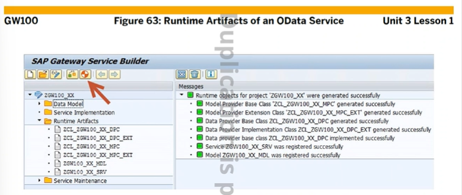
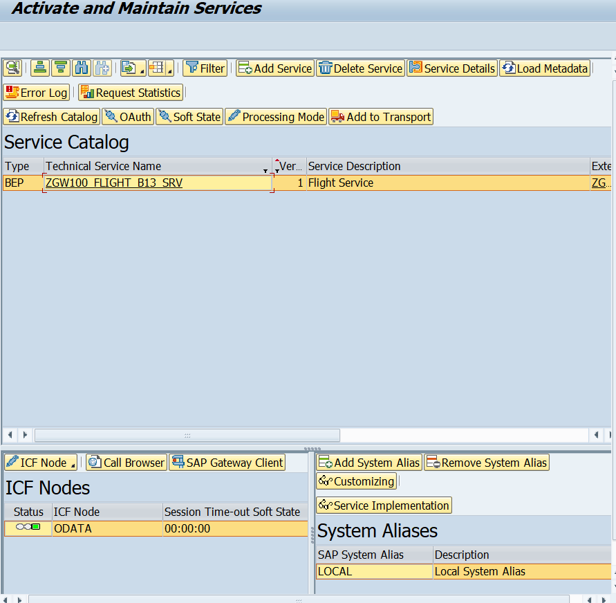
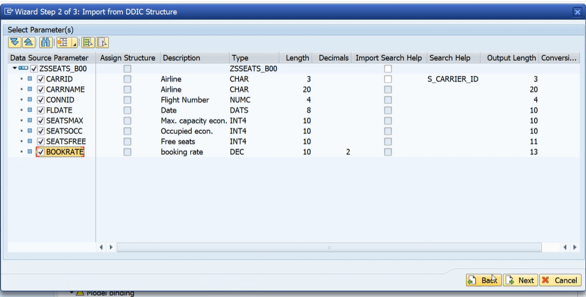

[TOC]

# SAP GATEWAY (GW100)

ODATA Service를 개발하는 방법


ABAP 서버에서 하는게 아니라 UI5는 BAS에서 개발하는 거라 데이터 주고받기 위해 SAP Gateway를 사용한다.
JSON / XML / ODATA / Resource가 있는데 우린 ODATA를 사용하잖아


1. SEGW (Tcode) 에서 project를 생성
2. 데이터 모델을 정의 한다 (data definition)
3. service Implementation
4. service 유지보수


1. project create (tcode : SEGW)

   sap gateway service builder가 실행된다
   z,y로 이름 생성


association을 가지고 관계는 설정된다


runtime object 버튼을 클릭하면 runtime시에 사용되는 object를 생성해줘야 한다.


CRUD :: Create, Read, Update, Delete
Read 와 Query??

> Read는 특정 한건의 데이터를 읽어올때 사용한다.
> Query는 EntitySet


Gateway Service Catalog


## 실습

/nsegw


gateway service가 만들어졌다.
이것을 통해 data definition을 해줘야 한다.
$tmp란? 


local object를 말하는 것이다. 아이디별로 하나씩 생성되는 $tmp
change request 번호를 묻지 않음
운영 시스템에서 사용하는것임!

# Data Definition


폭포수 모델


4번과 5번 순서는 바꿔도 된다


Generated Model Provider Base Class


## 실습

F1을 눌러서 수정모드로 바꿔야 저게 뜸


엔티티를 생성해보자


하나 이상의 key를 선택해줘야 한다.


이렇게 완성이된다.
entity type은 data type인데 여러 property로 되어 있으므로 structure type이라고 보면 된다. entity sets은 집합을 뜻한다. (flightset)
Airlineid, connectid등등이 entity 이다.

클릭하면~


frontend server 오른쪽 클릭, local로 돌릴거면 local로 등록
별도의 서버가 있으면 그 서버 이름으로 와야한다.



녹색 신호등이 보여야 한다.

만약 녹색이 아니면 저렇게 활성화라 시켜봐라


----

또다른 ex 내가 만든 structure를 가지고 사용하기




# CRUD


## READ , QUERY

F1으로 수정 모드


하나 이상의 key를 선택해줘야 한다.


더블클릭해서 구현 하는거 아니고 저 3번 버튼 눌러야함


GET_ENTITYSET을 먼저 한 다음 GET_ENTITY를 해주도록 한다.

```ABAP
METHOD FLIGHTSET_GET_ENTITY.
 * 테이블에서 데이터 읽어오기 
  DATA: LS_DATA TYPE BAPISFLDAT.

  IO_TECH_REQUEST_CONTEXT->GET_CONVERTED_KEYS(
    IMPORTING
      ES_KEY_VALUES =    ER_ENTITY              " Entity Key Values - converted
  ).
  CALL FUNCTION 'BAPI_FLIGHT_GETDETAIL'
    EXPORTING
      AIRLINEID    = ER_ENTITY-AIRLINE
      CONNECTIONID = ER_ENTITY-CONNECTID
      FLIGHTDATE   = ER_ENTITY-FLIGHTDATE
    IMPORTING
      FLIGHT_DATA  = LS_DATA.
  MOVE-CORRESPONDING LS_DATA TO ER_ENTITY.

ENDMETHOD.
```

```ABAP
  METHOD FLIGHTSET_GET_ENTITYSET.
    DATA: LT_LIST   TYPE TABLE OF BAPISFLDAT,
          LT_RETURN TYPE TABLE OF BAPIRET2.

*    BAPI FUNCTION MODULE.
    CALL FUNCTION 'BAPI_FLIGHT_GETLIST'
      TABLES
        FLIGHT_LIST = LT_LIST
        RETURN      = LT_RETURN.

    READ TABLE LT_RETURN
    WITH KEY TYPE = 'E' TRANSPORTING NO FIELDS.
    IF SY-SUBRC = 0.
      RAISE EXCEPTION TYPE /IWBEP/CX_MGW_BUSI_EXCEPTION.
    ELSE.
      MOVE-CORRESPONDING LT_LIST TO ET_ENTITYSET.

    ENDIF.

  ENDMETHOD.
```

```ABAP
METHOD CARRIERSET_GET_ENTITYSET.
  DATA: LT_SCARR TYPE TABLE OF SCARR.

  SELECT * INTO TABLE LT_SCARR
    FROM SCARR.

  MOVE-CORRESPONDING LT_SCARR TO ET_ENTITYSET.

ENDMETHOD.
```

```ABAP
method CARRIERSET_GET_ENTITY.

  DATA: LS_SCARR TYPE SCARR.

  IO_TECH_REQUEST_CONTEXT->GET_CONVERTED_KEYS(
    IMPORTING
      ES_KEY_VALUES = ER_ENTITY ).

  SELECT SINGLE *
    INTO LS_SCARR
    FROM SCARR
    WHERE CARRID = ER_ENTITY-CARRID.

  MOVE-CORRESPONDING LS_SCARR TO ER_ENTITY.

endmethod.
```

```ABAP
METHOD SEATFREESET_GET_ENTITYSET.
  DATA: LT_DATA TYPE TABLE OF ZSSEATS_B13.

*  두 테이블에 있는 값들을 가져와야할때 ( JOIN 이나 VIEW 사용 )

**  old open sql 사용
*  SELECT A~CARRID A~CONNID A~FLDATE
*         A~SEATSMAX A~SEATSOCC B~CARRNAME
*    INTO CORRESPONDING FIELDS OF TABLE LT_DATA
*     FROM SFLIGHT AS A INNER JOIN SCARR AS B
*                       ON A~CARRID = B~CARRID.

*    LOOP AT LT_DATA INTO DATA(LS_DATA).
*      LS_DATA-SEATSFREE = LS_DATA-SEATSMAX - LS_DATA-SEATSOCC.
*      LS_DATA-BOOKRATE = LS_DATA-SEATSOCC / LS_DATA-SEATSMAX * 100.
*
*      MODIFY LT_DATA FROM LS_DATA.
*    ENDLOOP.

* New Open SQL
  SELECT A~CARRID, A~CONNID, A~FLDATE, B~CARRNAME,
         A~SEATSOCC, A~SEATSMAX,
         A~SEATSMAX - A~SEATSOCC AS SEATSFREE,
         DIVISION( A~SEATSOCC * 100, A~SEATSMAX, 2 ) AS BOOKRATE
  FROM SFLIGHT AS A INNER JOIN SCARR AS B
    ON A~CARRID = B~CARRID
    INTO CORRESPONDING FIELDS OF TABLE @LT_DATA.

  MOVE-CORRESPONDING LT_DATA TO ET_ENTITYSET.

ENDMETHOD.
```

저장 후 F3, 뒤로 가서도 F3 계속


F8로 실행 했을때 200이 떠야한다.


이거 눌러서 JOSN으로 데이터 바꾸기 가능 , 데이터 갯수 아는것도 가능


$count 하면 entity 갯수 알 수 있음


