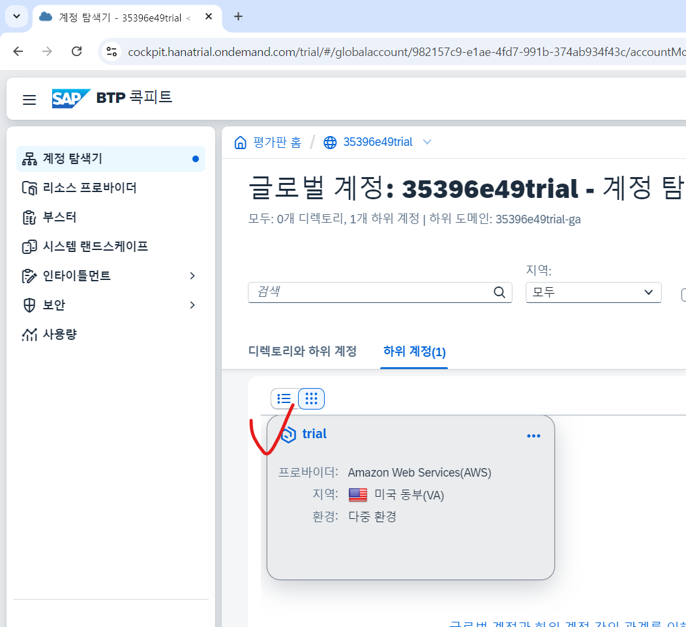
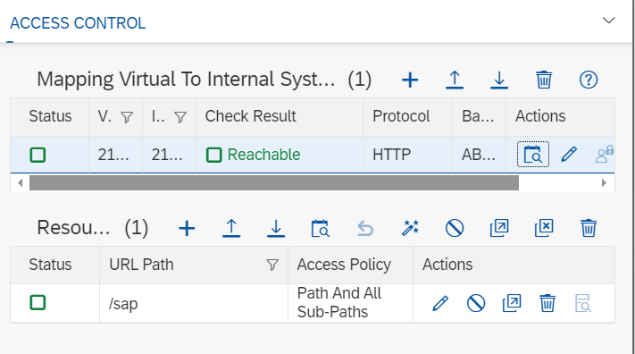
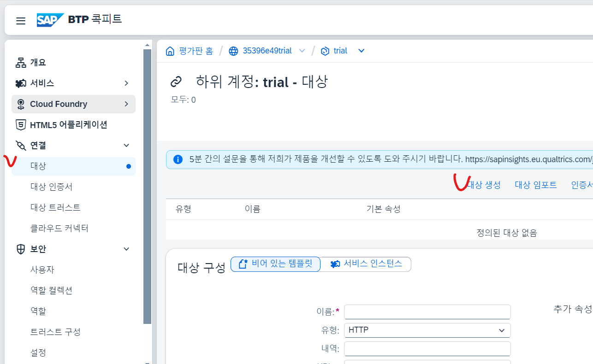

# UI5 계정 생성 ( 90일 제한 )




전부 체크한 후 저장
https://localhost:8443/
cloud connector가 기본적으로 깔려있어야 뜬다.


SAP JVM도 설치해야함
Cloud Connector 와
Administrator / sync00


 패스워드 문제가 생기면 여기 들어가서 비번 바꾸기
[링크](https://account.sap.com/manage/accounts)



초록불 뜨면 로그아웃



Basic 


---


ERROR는 저 버튼 클릭해서 확인해보자

```ABAP
METHOD PRODUCTSET_GET_ENTITY.

  DATA: LS_DATA   TYPE BAPI_EPM_PRODUCT_HEADER,
        LT_RETURN TYPE TABLE OF BAPIRET2,
        LS_PRODUCT TYPE BAPI_EPM_PRODUCT_ID.

*  GET 에서 /PRODUCTID('T')에서 T를 가져오는 방법
  IO_TECH_REQUEST_CONTEXT->GET_CONVERTED_KEYS(
  IMPORTING
   ES_KEY_VALUES = ER_ENTITY ).

  LS_PRODUCT-PRODUCT_ID = ER_ENTITY-PRODUCT_ID.

  CALL FUNCTION 'BAPI_EPM_PRODUCT_GET_DETAIL'
    EXPORTING
      " PRODUCT_ID 가 STRUCTURE로 되어 있음. 그래서 컴포넌트 하나만
      " 보낼 순 없음. DATA TYPE이 맞아야 함.
      PRODUCT_ID = LS_PRODUCT
    IMPORTING
      HEADERDATA = LS_DATA
    TABLES
      RETURN     = LT_RETURN.

  IF LT_RETURN IS INITIAL.
    MOVE-CORRESPONDING LS_DATA TO ER_ENTITY.
  ELSE.
    RAISE EXCEPTION TYPE /IWBEP/CX_EPM_BUSI_EXCEPTION.
  ENDIF.

ENDMETHOD.
```

```ABAP
  METHOD PRODUCTSET_GET_ENTITYSET.

    DATA: LT_DATA   TYPE TABLE OF BAPI_EPM_PRODUCT_HEADER,
          LT_RETURN TYPE TABLE OF BAPIRET2.

    CALL FUNCTION 'BAPI_EPM_PRODUCT_GET_LIST'
      TABLES
        HEADERDATA = LT_DATA
        RETURN     = LT_RETURN.

    IF LT_RETURN IS INITIAL. "no error.
      MOVE-CORRESPONDING LT_DATA TO ET_ENTITYSET.
    ELSE. "error.
      RAISE EXCEPTION TYPE /IWBEP/CX_MGW_BUSI_EXCEPTION.
    ENDIF.

  ENDMETHOD.
```


위와 같이 Structure type이다

----

VSCode 8000 포트 :

NODE 설치
npm i -D @ui5/cli
npm start

-----------

```sql
@AbapCatalog.sqlViewName: 'ZV_FREESEATS'
@AbapCatalog.compiler.compareFilter: true
@AbapCatalog.preserveKey: true
@AccessControl.authorizationCheck: #NOT_REQUIRED
@EndUserText.label: 'freeseats'
@Metadata.ignorePropagatedAnnotations: true
@OData.publish: true
@OData.entityType.name: 'seatfree'
@OData.entitySet.name: 'SeatfreeSet'
define view zcds_freeseats_b13 as select from sflight
inner join scarr
on sflight.carrid = scarr.carrid
{
    key sflight.carrid,
    key sflight.connid,
    key sflight.fldate,
    sflight.seatsmax,
    sflight.seatsocc,
    sflight.seatsmax - sflight.seatsocc as seatsfree,
    division(sflight.seatsocc * 100, sflight.seatsmax, 2) as bookrate,
    scarr.carrname
}
```

> @OData.publish: true
> @OData.entityType.name: 'seatfree'
> @OData.entitySet.name: 'SeatfreeSet'

이제 프론트엔드 서버에 ??
/o /iwfnd/maint_service (TCODE)


Add Service


확인 후 녹색인지 확인

저걸로 하고 

```sql
@AbapCatalog.sqlViewName: 'ZV_FREESEATS'
@AbapCatalog.compiler.compareFilter: true
@AbapCatalog.preserveKey: true
@AccessControl.authorizationCheck: #NOT_REQUIRED
@EndUserText.label: 'freeseats'
@Metadata.ignorePropagatedAnnotations: true
@OData.publish: true
@OData.entityType.name: 'seatfree'
@OData.entitySet.name: 'seatfreeSet'
define view zcds_freeseats_b13 as select from sflight
inner join scarr
on sflight.carrid = scarr.carrid
{
    @UI.lineItem: [{ position: 10 }]
    key sflight.carrid,
    @UI.lineItem: [{ position: 30 }]
    key sflight.connid,
    @UI.lineItem: [{ position: 40 }]
    key sflight.fldate,
    @UI.lineItem: [{ position: 50 }]
    sflight.seatsmax,
    @UI.lineItem: [{ position: 60 }]
    sflight.seatsocc,
    @UI.lineItem: [{ position: 70 }]
    sflight.seatsmax - sflight.seatsocc as seatsfree,
    @UI.lineItem: [{ position: 80 }]
    division(sflight.seatsocc * 100, sflight.seatsmax, 2) as bookrate,
    @UI.lineItem: [{ position: 20 }]
    scarr.carrname
}

```

이클립스에서 data definition으로 저걸 생성 후 이 데이터를 연동 시키면


go 누르면 데이터 뜸


