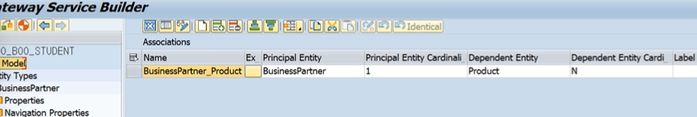

```ABAP
METHOD CONNECTSET_GET_ENTITYSET.
* 데이터를 밖으로 내보내주는 곳
  DATA: LT_SPFLI TYPE TABLE OF SPFLI.

  SELECT * INTO TABLE LT_SPFLI
    FROM SPFLI.

  IF SY-SUBRC <> 0.
    RAISE EXCEPTION TYPE /IWBEP/CX_MGW_BUSI_EXCEPTION.
  ELSE.
    MOVE-CORRESPONDING LT_SPFLI TO ET_ENTITYSET.
  ENDIF.
ENDMETHOD.
```


```abap
METHOD CONNECTSET_GET_ENTITY.
*  특정 엔티티 처리하는 로직
  DATA: LS_DATA TYPE SPFLI,
        LS_KEY  LIKE LINE OF IT_KEY_TAB.

  LOOP AT IT_KEY_TAB INTO LS_KEY.
    CASE LS_KEY-NAME.
      WHEN 'Carrid'.
        LS_DATA-CARRID = LS_KEY-VALUE.
      WHEN 'Connid'.
        LS_DATA-CONNID = LS_KEY-VALUE.
    ENDCASE.
  ENDLOOP.

  SELECT SINGLE * FROM SPFLI INTO LS_DATA
    WHERE CARRID = LS_DATA-CARRID AND CONNID = LS_DATA-CONNID.

  IF SY-SUBRC <> 0.
    RAISE EXCEPTION TYPE /IWBEP/CX_MGW_BUSI_EXCEPTION.
  ENDIF.
  MOVE-CORRESPONDING LS_DATA TO ER_ENTITY.
ENDMETHOD.
```

이런 다른 방법도 존재한다.
```ABAP
METHOD CONNECTSET_GET_ENTITY.
*  특정 엔티티 처리하는 로직
  DATA: LS_DATA TYPE SPFLI,
        LS_KEY  LIKE LINE OF IT_KEY_TAB.

  IO_TECH_REQUEST_CONTEXT->GET_CONVERTED_KEYS(
  IMPORTING
    ES_KEY_VALUES = ER_ENTITY ).

    SELECT SINGLE *
      INTO LS_DATA
      FROM SPFLI
      WHERE CARRID = ER_ENTITY-CARRID
        AND CONNID = ER_ENTITY-CONNID.

  IF SY-SUBRC <> 0.
    RAISE EXCEPTION TYPE /IWBEP/CX_MGW_BUSI_EXCEPTION.
  ENDIF.
  MOVE-CORRESPONDING LS_DATA TO ER_ENTITY.
ENDMETHOD.
```

주의 : 앞에 프로퍼티 이름의 대/소문자 구분 꼭 해줘야 함.
Carrid 인지 CARRID인지 carrid인지
key 가 두개라면? key 두개를 다 SELECT WHERE 절에 써줘야 한다.

# Association

: 엔티티와 엔티티의 관계 설정


1 : n 의 관계를 가지고 있다.


다 완성되면 이러한 관계가 형성된다.

run time object 버튼 (빨간 버튼) 눌러주도록 한다.


```ABAP
METHOD SEATFREESET_GET_ENTITYSET.
  DATA: LT_DATA TYPE TABLE OF ZSSEATS_B13.

*  두 테이블에 있는 값들을 가져와야할때 ( JOIN 이나 VIEW 사용 )

**  old open sql 사용
*  SELECT A~CARRID A~CONNID A~FLDATE
*         A~SEATSMAX A~SEATSOCC B~CARRNAME
*    INTO CORRESPONDING FIELDS OF TABLE LT_DATA
*     FROM SFLIGHT AS A INNER JOIN SCARR AS B
*                       ON A~CARRID = B~CARRID.

*    LOOP AT LT_DATA INTO DATA(LS_DATA).
*      LS_DATA-SEATSFREE = LS_DATA-SEATSMAX - LS_DATA-SEATSOCC.
*      LS_DATA-BOOKRATE = LS_DATA-SEATSOCC / LS_DATA-SEATSMAX * 100.
*
*      MODIFY LT_DATA FROM LS_DATA.
*    ENDLOOP.

  DATA: LV_SOURCE_NAME TYPE /IWBEP/MGW_TECH_NAME,
        RT_CARRID      TYPE RANGE OF SCARR-CARRID,
        RS_CARRID      LIKE LINE OF RT_CARRID,
        LS_CARRIER     TYPE ZCL_ZGW100_FLIGHT_B13_MPC=>TS_CARRIER.

* 여기서 이 TS_CARRIER는 무엇일까?

* 이러한 방법도 가능하고
*  IO_TECH_REQUEST_CONTEXT->GET_CONVERTED_KEYS(
*  IMPORTING
*    ES_KEY_VALUES = ER_ENTITY ).

* 이러한 방법도 가능하다.
  CALL METHOD IO_TECH_REQUEST_CONTEXT->GET_SOURCE_ENTITY_TYPE_NAME
    RECEIVING
      RV_ENTITY_TYPE = LV_SOURCE_NAME.  " Technical name

  CASE LV_SOURCE_NAME.
    WHEN ZCL_ZGW100_FLIGHT_B13_MPC=>GC_CARRIER.
      IO_TECH_REQUEST_CONTEXT->GET_CONVERTED_SOURCE_KEYS(
        IMPORTING
          ES_KEY_VALUES =     LS_CARRIER    "Source Entity Key Values - converted
      ).
      IF LS_CARRIER IS NOT INITIAL.
        RS_CARRID-SIGN = 'I'.
        RS_CARRID-OPTION = 'EQ'.
        RS_CARRID-LOW = LS_CARRIER-CARRID.
        APPEND RS_CARRID TO RT_CARRID.
      ENDIF.
  ENDCASE.

* New Open SQL
  SELECT A~CARRID, A~CONNID, A~FLDATE, B~CARRNAME,
         A~SEATSOCC, A~SEATSMAX,
         A~SEATSMAX - A~SEATSOCC AS SEATSFREE,
         DIVISION( A~SEATSOCC * 100, A~SEATSMAX, 2 ) AS BOOKRATE
  FROM SFLIGHT AS A INNER JOIN SCARR AS B
                    ON A~CARRID = B~CARRID
  WHERE A~CARRID IN @RT_CARRID
  INTO CORRESPONDING FIELDS OF TABLE @LT_DATA.

  MOVE-CORRESPONDING LT_DATA TO ET_ENTITYSET.
/sap/opu/odata/SAP/ZTBSD0010_GT_SRV_01/SOP_HEADERSet(Sopnum='SOP0000006', Ctrycode='CH')/SOP_ItemSet
SOP_HEADERSet('SOP0000006','CH')
"Sopnum" : "SOP0000006",
        "Ctryname" : "중국",
        "Ctrycode" : "CH",
ENDMETHOD.
```

## UI5

```JS
<mvc:View controllerName="zodataassob13.controller.Main"
    xmlns:mvc="sap.ui.core.mvc" displayBlock="true"
    xmlns="sap.m">
    <Page id="page" title="{i18n>title}">
        <!-- <content /> -->
        <Table id="tabCar" items='{/CARRIERSet}'
               selectionChange="onSelectionChange" mode="SingleSelectMaster" growing="true" growingThreshold="10">
               <columns>
                <Column id="colCar">
                    <header><Text id="hTxtCar" text="Airline Code"></Text></header>
                </Column>
                <Column id="colNam">
                    <header><Text id="hTxtNam" text="Airline Name"></Text></header>
                </Column>
                <Column id="colCur">
                    <header><Text id="hTxtCur" text="Currency Code"></Text></header>
                </Column>
                <Column id="colUrl">
                    <header><Text id="hTxtUrl" text="Url"></Text></header>
                </Column>
               </columns>

               <items>
                <ColumnListItem id="colListCar">
                    <cells>
                        <Text id="celTxtCar" text="{Carrid}"></Text>
                        <Text id="celTxtNam" text="{Carrname}"></Text>
                        <Text id="celTxtCur" text="{Currcode}"></Text>
                        <Text id="celTxtUrl" text="{Url}"></Text>
                    </cells>
                </ColumnListItem>
               </items>
        </Table>
        <!-- 꼭 SAP Gateway로  URL 상태 확인 후 Items에 잘 적어놓을것! -->
        <Table id="tabSeat" items="{SeatfreeSet}" growing="true" growingThreshold="15">
            <columns>
                <Column id="colCarrid">
                    <header><Text id="hTxtCarrid" text="Airline Code"></Text></header>
                </Column>
                <Column id="colCon">
                    <header><Text id="hTxtCon" text="Connection No."></Text></header>
                </Column>
                <Column id="colFdt">
                    <header><Text id="hTxtFdt" text="Flight Date"></Text></header>
                </Column>
                <Column id="colMax">
                    <header><Text id="hTxtMax" text="Economic Seats"></Text></header>
                </Column>
                <Column id="colOcc">
                    <header><Text id="hTxtOcc" text="Booked Seats"></Text></header>
                </Column>
                <Column id="colFree">
                    <header><Text id="hTxtFree" text="Free Seats"></Text></header>
                </Column>
                <Column id="colRate">
                    <header><Text id="hTxtRate" text="Booked Rate"></Text></header>
                </Column>
            </columns>

            <items>
                <ColumnListItem id="colListSeats">
                    <cells>
                        <Text id="celTxtCarid" text="{Carrid}"></Text>
                        <Text id="celTxtConid" text="{Connid}"></Text>
                        <Text id="celTxtFldat" text="{Fldate}"></Text>
                        <Text id="celTxtMax"   text="{Seatsax}"></Text>
                        <Text id="celTxtOcc"   text="{Seatsocc}"></Text>
                        <Text id="celTxtFree"  text="{Seatsfree}"></Text>
                        <Text id="celTxtRate"  text="{Bookrate}"></Text>
                    </cells>
                </ColumnListItem>
            </items>
        </Table>
    </Page>
</mvc:View>
```

```JS
sap.ui.define([
    "sap/ui/core/mvc/Controller"
],
function (Controller) {
    "use strict";

    return Controller.extend("zodataassob13.controller.Main", {
        onInit: function () {},
        onSelectionChange: function (evnet) {
            var oItem = evnet.getParameter("listItem");
            var sPath = oItem.getBindingContext().getPath();
            var oTabSeat = this.getView().byId('tabSeat');
            oTabSeat.bindElement(sPath);
        }
    });
});
```

## ABAP EX10, 11


저 체크를 해주도록 한다.
TODO. ABAP addressable 이게 뭐지?


둘의 이름이 다르므로 매칭!

```ABAP
METHOD BUSINESSPARTNERS_GET_ENTITYSET.
  DATA: LT_LIST   TYPE TABLE OF BAPISFLDAT,
        LT_RETURN TYPE TABLE OF BAPIRET2,
        LT_HEADER TYPE TABLE OF BAPI_EPM_BP_HEADER,
        LS_HEADER LIKE LINE OF LT_HEADER,
        ET_ENTITY LIKE LINE OF ET_ENTITYSET.

*    BAPI FUNCTION MODULE.
  CALL FUNCTION 'BAPI_EPM_BP_GET_LIST'
    TABLES
      BPHEADERDATA = LT_HEADER            " EPM: Business Partner header data ( BOR SEPM004 )
      RETURN       = LT_RETURN.           " Return Parameter

  IF LT_RETURN IS NOT INITIAL.
    MO_CONTEXT->GET_MESSAGE_CONTAINER( )->ADD_MESSAGES_FROM_BAPI( LT_RETURN ).
    RAISE EXCEPTION TYPE /IWBEP/CX_MGW_BUSI_EXCEPTION.
  ENDIF.

* BAPI_EPM_BP_HEADER 와 BUSINESSPARTNERS entity의 이름이 서로 조금씩 다르기 때문에 서로 매핑해주기 위한 작업
  LOOP AT LT_HEADER INTO LS_HEADER.
    MOVE-CORRESPONDING LS_HEADER TO ET_ENTITY.
*    이릉이 같을 경우 굳이 매칭 안 시켜줘도 된다.
    ET_ENTITY-BUSINESSPARTNERID = LS_HEADER-BP_ID.
    ET_ENTITY-BUSINESSPARTNERROLE = LS_HEADER-BP_ROLE.
    ET_ENTITY-EMAILADDRESS = LS_HEADER-EMAIL_ADDRESS.
    ET_ENTITY-COMPANYNAME = LS_HEADER-COMPANY_NAME.
    ET_ENTITY-CURRENCYCODE = LS_HEADER-CURRENCY_CODE.
    ET_ENTITY-ADDRESSTYPE = LS_HEADER-ADDRESS_TYPE.
    APPEND ET_ENTITY TO ET_ENTITYSET.
    CLEAR: ET_ENTITY.
  ENDLOOP.
ENDMETHOD.
```

```ABAP
METHOD BUSINESSPARTNERS_GET_ENTITY.
  DATA: LS_BP_ID  TYPE BAPI_EPM_BP_ID,
        LS_HEADER TYPE BAPI_EPM_BP_HEADER,
        LT_RETURN TYPE TABLE OF BAPIRET2.

  IO_TECH_REQUEST_CONTEXT->GET_CONVERTED_KEYS(
    IMPORTING
      ES_KEY_VALUES =   ER_ENTITY               " Entity Key Values - converted
  ).

  LS_BP_ID-BP_ID = ER_ENTITY-BUSINESSPARTNERID.

  CALL FUNCTION 'BAPI_EPM_BP_GET_DETAIL'
    EXPORTING
      BP_ID      = LS_BP_ID               " EPM: Business Partner ID to be used in BAPIs
    IMPORTING
      HEADERDATA = LS_HEADER            " EPM: Business Partner header data ( BOR SEPM004 )
    TABLES
      RETURN     = LT_RETURN.          " Return Parameter

  IF LT_RETURN IS NOT INITIAL.
    RAISE EXCEPTION TYPE /IWBEP/CX_MGW_BUSI_EXCEPTION.
  ENDIF.

  ER_ENTITY-BUSINESSPARTNERID = LS_HEADER-BP_ID.
  ER_ENTITY-BUSINESSPARTNERROLE = LS_HEADER-BP_ROLE.
  ER_ENTITY-EMAILADDRESS = LS_HEADER-EMAIL_ADDRESS.
  ER_ENTITY-COMPANYNAME = LS_HEADER-COMPANY_NAME.
  ER_ENTITY-CURRENCYCODE = LS_HEADER-CURRENCY_CODE.
  ER_ENTITY-ADDRESSTYPE = LS_HEADER-ADDRESS_TYPE.
ENDMETHOD.
```

TEST


테스트 완료

Association



이런 관계를 설정해 준 후 runtime object 버튼 클릭

```ABAP
METHOD PRODUCTSET_GET_ENTITYSET.
  DATA: LS_ENTITY LIKE LINE OF ET_ENTITYSET,
        LT_HEADER TYPE TABLE OF BAPI_EPM_PRODUCT_HEADER,
        LS_HEADER LIKE LINE OF LT_HEADER,
        LT_RETURN TYPE TABLE OF BAPIRET2.

  DATA: LS_BP_ID           TYPE BAPI_EPM_BP_ID,
        LS_BP_HEADER       TYPE BAPI_EPM_BP_HEADER,
        LS_SO_SUPPLIER     TYPE BAPI_EPM_SUPPLIER_NAME_RANGE,
        LT_SO_SUPPLIER     TYPE TABLE OF BAPI_EPM_SUPPLIER_NAME_RANGE,
        LS_BUSINESSPARTNER TYPE CL_GW100_S_NAVIGATION_MPC=>TS_BUSINESSPARTNER,
        LV_SOURCE_ENTITY   TYPE /IWBEP/MGW_TECH_NAME.

  LV_SOURCE_ENTITY = IO_TECH_REQUEST_CONTEXT->GET_SOURCE_ENTITY_SET_NAME( ).

  CASE LV_SOURCE_ENTITY.
    WHEN CL_GW100_S_NAVIGATION_MPC=>GC_BUSINESSPARTNER.
      IO_TECH_REQUEST_CONTEXT->GET_CONVERTED_SOURCE_KEYS(
        IMPORTING
          ES_KEY_VALUES =    LS_BUSINESSPARTNER              " Source Entity Key Values - converted
      ).
      LS_BP_ID-BP_ID = LS_BUSINESSPARTNER-BUSINESSPARTNERID.
      CALL FUNCTION 'BAPI_EPM_BP_GET_DETAIL'
        EXPORTING
          BP_ID      = LS_BP_ID           " EPM: Business Partner ID to be used in BAPIs
        IMPORTING
          HEADERDATA = LS_BP_HEADER           " EPM: Business Partner header data ( BOR SEPM004 )
        TABLES
          RETURN     = LT_RETURN.             " Return Parameter

      IF LT_RETURN IS NOT INITIAL.
        MO_CONTEXT->GET_MESSAGE_CONTAINER( )->ADD_MESSAGES_FROM_BAPI( LT_RETURN ).
        RAISE EXCEPTION TYPE /IWBEP/CX_MGW_BUSI_EXCEPTION.
      ENDIF.
      LS_SO_SUPPLIER-SIGN = 'I'.
      LS_SO_SUPPLIER-OPTION = 'EQ'.
      LS_SO_SUPPLIER-LOW = LS_BP_HEADER-COMPANY_NAME.
      APPEND  LS_SO_SUPPLIER TO LT_SO_SUPPLIER.
  ENDCASE.

  CALL FUNCTION 'BAPI_EPM_PRODUCT_GET_LIST'
    TABLES
      HEADERDATA            = LT_HEADER
      SELPARAMSUPPLIERNAMES = LT_SO_SUPPLIER
      RETURN                = LT_RETURN.
ENDMETHOD.
```


## 질문


Addressable ??

```xml
<d:CompanyName>OffiPOR</d:CompanyName>
```

```js
OData.request({
				requestUri: '/sap/opu/odata/sap/ZTBSD0011_GT_SRV' + "/SOP_CHARTSet",
				method: "GET"
			}, function(data) {
				if (data) {
					set_chart(data.results)
				}
			}, function(error) {
				console.error(error); // 오류 발생 시
			});
```


