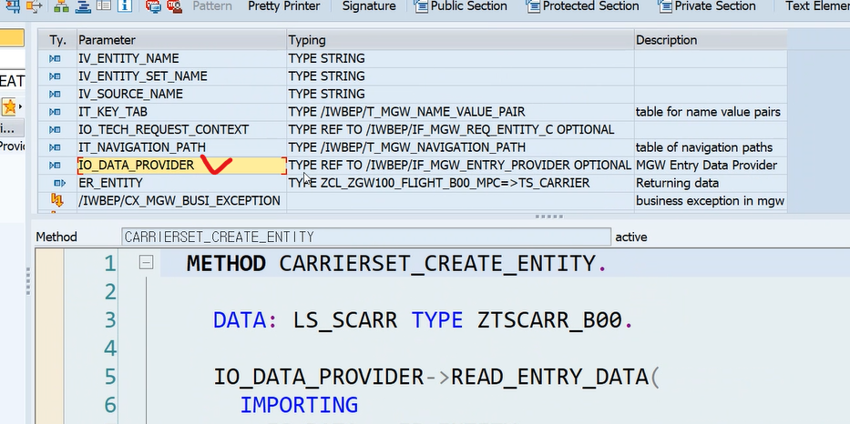
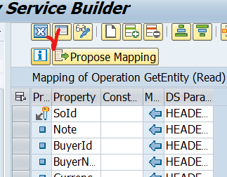

# ODATA Query Option

[노션](https://www.notion.so/240919-OData-Quiz-106fe6ac59b680b086d0c857b3fef54c)

```ABAP
METHOD CARIERSET_CREATE_ENTITY.

    DATA: LS_SCARR TYPE ZTSCARR_B19.

    IO_DATA_PROVIDER->READ_ENTRY_DATA(
      IMPORTING
        ES_DATA = ER_ENTITY
    ).

    MOVE-CORRESPONDING ER_ENTITY TO LS_SCARR.

    INSERT ZTSCARR_B19 FROM LS_SCARR.
    IF SY-SUBRC <> 0.
      RAISE EXCEPTION TYPE /IWBEP/CX_MGW_BUSI_EXCEPTION.
    ENDIF.

  ENDMETHOD.
METHOD CARIERSET_DELETE_ENTITY.
    DATA: LS_DATA  TYPE ZCL_ZGW100_FLIGHT19_B1_MPC=>TS_CARIER,
          LS_SCARR TYPE ZTSCARR_B19.

    IO_TECH_REQUEST_CONTEXT->GET_CONVERTED_KEYS(
      IMPORTING
        ES_KEY_VALUES = LS_DATA ).

    MOVE-CORRESPONDING LS_DATA TO LS_SCARR.
    DELETE ZTSCARR_B19 FROM LS_SCARR.
    IF SY-SUBRC <> 0.
      RAISE EXCEPTION TYPE /IWBEP/CX_MGW_BUSI_EXCEPTION.
    ENDIF.

  ENDMETHOD.
METHOD CARIERSET_UPDATE_ENTITY.
    DATA: LS_DATA  TYPE ZCL_ZGW100_FLIGHT19_B1_MPC=>TS_CARIER,
          LS_SCARR TYPE ZTSCARR_B19.

    IO_DATA_PROVIDER->READ_ENTRY_DATA(
      IMPORTING
        ES_DATA = LS_DATA
        ).

    MOVE-CORRESPONDING LS_DATA TO LS_SCARR.
    UPDATE ZTSCARR_B19 FROM LS_SCARR.
    IF SY-SUBRC <> 0.
      RAISE EXCEPTION TYPE /IWBEP/CX_MGW_BUSI_EXCEPTION.
    ELSE.
      MOVE-CORRESPONDING LS_DATA TO ER_ENTITY.
    ENDIF.

  ENDMETHOD.
```

1. 누나 저 그 실수한거 때문에 carrierset인데 carierset이라고 되어있고 carrier 관련에서 써있는 워딩들이 대부분 carier라고 되어있을 거에요 이 부분 위주만 수정하면 되요~!


IO_TECH_REQ에서 필터를 불러와 사용


REQ , RES,
USE AS REQUEST , REQ BODY에 값 넣어

RESPONSE에 상태코드 200은 성공, 201은 Create 성공

import 할 데이터? 파라미터?
수정하고자 하는 데이터 받아서 처리


update 성공시 204

get key처럼 key만 읽어와서 삭제처리

EX 12 ~ 14까지 함

---------

## EX 15


Properties는 abap db 데이터를 일시적으로 담기위한 바구니 같은 애다.
그러니까 실제 DB 데이터와 비슷하게 생성해주도록 한다. (클라이언트와 데이터를 주고 받을때 클라이언트에게 쉬운 이름을 주어지기 위해 이름 변경이 가능한 부분..)

abap db에 있는 standard table에 default가 무엇인지 확인하고 (현재 여기서는 확인이 어려움.. 실무가면 다 알 수 있음) create를 해줘야 한다. 넣어줘야 할 컴포넌트가 무엇인지 꼭 확인해라!!


밑줄친 부분 타입 같아서 저 둘중 하나만 와도 된다 ER_ENTITY가 훨 나을듯

```ABAP
  METHOD BUSINESSPARTNERS_CREATE_ENTITY.
    DATA: LS_ENTRY_DATA TYPE CL_GW100_S_CUD_MPC=>TS_BUSINESSPARTNER,
          LS_HEADER     TYPE BAPI_EPM_BP_HEADER,
          LS_BP_ID      TYPE BAPI_EPM_BP_ID,
          LT_RETURN     TYPE TABLE OF BAPIRET2.

    IO_DATA_PROVIDER->READ_ENTRY_DATA(
      IMPORTING
        " LS_ENTRY_DATA 대신 ER_ENTITY로 받을 수 있다.
        ES_DATA = LS_ENTRY_DATA
    ).

    LS_HEADER-COMPANY_NAME = LS_ENTRY_DATA-COMPANYNAME.
    LS_HEADER-EMAIL_ADDRESS = LS_ENTRY_DATA-EMAILADDRESS.
    LS_HEADER-CURRENCY_CODE = LS_ENTRY_DATA-CURRENCYCODE.
    LS_HEADER-CITY = LS_ENTRY_DATA-CITY.
    LS_HEADER-STREET = LS_ENTRY_DATA-STREET.
    LS_HEADER-COUNTRY = LS_ENTRY_DATA-COUNTRY.
    LS_HEADER-ADDRESS_TYPE = LS_ENTRY_DATA-ADDRESSTYPE.
    LS_HEADER-BP_ROLE = LS_ENTRY_DATA-BUSINESSPARTNERROLE.

    CALL FUNCTION 'BAPI_EPM_BP_CREATE'
      EXPORTING
        HEADERDATA        = LS_HEADER                 " EPM: Business Partner header data ( BOR SEPM004 )
*        PERSIST_TO_DB     = ABAP_TRUE        " EPM: Boolean flag to be used as BAPI parameter
      IMPORTING
        " 대신 ER_ENTITY로 받게된다면 여기 BAPY_EMP_BP_ID를 스트럭처 타입으로
        " 선언해서 받은 뒤 가져와야 한다.
        BUSINESSPARTNERID = LS_BP_ID        " EPM: Business Partner ID to be used in BAPIs
      TABLES
        RETURN            = LT_RETURN.              " Return Parameter


    IF LT_RETURN IS NOT INITIAL.
      RAISE EXCEPTION TYPE /IWBEP/CX_MGW_BUSI_EXCEPTION.
    ENDIF.

* 받은 리턴값을 체크해보자..
    ER_ENTITY-BUSINESSPARTNERID = LS_BP_ID.
    ER_ENTITY-COMPANYNAME = LS_HEADER-COMPANY_NAME.
    ER_ENTITY-EMAILADDRESS = LS_HEADER-EMAIL_ADDRESS.
    ER_ENTITY-CURRENCYCODE = LS_HEADER-CURRENCY_CODE.
    ER_ENTITY-CITY = LS_HEADER-CITY.
    ER_ENTITY-COUNTRY = LS_HEADER-COUNTRY.
    ER_ENTITY-STREET = LS_HEADER-STREET.
    ER_ENTITY-ADDRESSTYPE = LS_HEADER-ADDRESS_TYPE.
    ER_ENTITY-BUSINESSPARTNERROLE = LS_HEADER-BP_ROLE.

  ENDMETHOD.
```

두번째 방법
```ABAP
  METHOD BUSINESSPARTNERS_CREATE_ENTITY.

    DATA: LS_BUSINESS   TYPE ZCL_ZGW100_B00_STUDENT_MPC=>TS_BUSINESSPARTNER,
          LS_HEADERDATA TYPE BAPI_EPM_BP_HEADER,
          LS_BP_ID      TYPE BAPI_EPM_BP_ID.

    DATA: LT_RETURN TYPE TABLE OF BAPIRET2.

    IO_DATA_PROVIDER->READ_ENTRY_DATA(
      IMPORTING
        ES_DATA = ER_ENTITY  " ls_business
    ).

    MOVE-CORRESPONDING ER_ENTITY TO LS_HEADERDATA.
    LS_HEADERDATA-BP_ROLE       = ER_ENTITY-BUSINESSPARTNERROLE.
    LS_HEADERDATA-EMAIL_ADDRESS = ER_ENTITY-EMAILADDRESS.
    LS_HEADERDATA-COMPANY_NAME  = ER_ENTITY-COMPANYNAME.
    LS_HEADERDATA-CURRENCY_CODE = ER_ENTITY-CURRENCYCODE.
    LS_HEADERDATA-ADDRESS_TYPE  = ER_ENTITY-ADDRESSTYPE.

    CALL FUNCTION 'BAPI_EPM_BP_CREATE'
      EXPORTING
        HEADERDATA        = LS_HEADERDATA
      IMPORTING
        BUSINESSPARTNERID = LS_BP_ID
      TABLES
        RETURN            = LT_RETURN.

    IF LT_RETURN IS NOT INITIAL.
      RAISE EXCEPTION TYPE /IWBEP/CX_MGW_BUSI_EXCEPTION.
    ENDIF.

   ER_ENTITY-BUSINESSPARTNERID = LS_BP_ID-BP_ID.

  ENDMETHOD.
```


이 테이블에 데이터가 생성됩니다. 확인할때 여기
UPDATE

```ABAP
METHOD BUSINESSPARTNERS_UPDATE_ENTITY.
  DATA: LS_ENTRY_DATA TYPE CL_GW100_S_CUD_MPC=>TS_BUSINESSPARTNER,
        LS_HEADER     TYPE BAPI_EPM_BP_HEADER,
        LS_HEADERTAX  TYPE BAPI_EPM_BP_HEADERX,
        LS_BP_ID      TYPE BAPI_EPM_BP_ID,
        LT_RETURN     TYPE TABLE OF BAPIRET2.

  LS_HEADER-COMPANY_NAME = LS_ENTRY_DATA-COMPANYNAME.
  LS_HEADER-EMAIL_ADDRESS = LS_ENTRY_DATA-EMAILADDRESS.
  LS_HEADER-CURRENCY_CODE = LS_ENTRY_DATA-CURRENCYCODE.
  LS_HEADER-CITY = LS_ENTRY_DATA-CITY.
  LS_HEADER-STREET = LS_ENTRY_DATA-STREET.
  LS_HEADER-COUNTRY = LS_ENTRY_DATA-COUNTRY.
  LS_HEADER-ADDRESS_TYPE = LS_ENTRY_DATA-ADDRESSTYPE.
  LS_HEADER-BP_ROLE = LS_ENTRY_DATA-BUSINESSPARTNERROLE.
  LS_HEADER-BP_ID = LS_BP_ID.

  LS_HEADERTAX-COMPANY_NAME = 'X'.
  LS_HEADERTAX-EMAIL_ADDRESS = 'X'.
  LS_HEADERTAX-CURRENCY_CODE = 'X'.
  LS_HEADERTAX-CITY = 'X'.
  LS_HEADERTAX-STREET = 'X'.
  LS_HEADERTAX-COUNTRY = 'X'.
  LS_HEADERTAX-ADDRESS_TYPE = 'X'.
  LS_HEADERTAX-BP_ROLE = 'X'.
  LS_HEADERTAX-BP_ID =  LS_ENTRY_DATA-BUSINESSPARTNERID.

  CALL FUNCTION 'BAPI_EPM_BP_CHANGE'
    EXPORTING
      BP_ID         = LS_BP_ID                 " EPM: Business Partner ID to be used in BAPIs
      HEADERDATA    = LS_HEADER                " EPM: Business Partner header data ( BOR SEPM004 )
      HEADERDATAX   = LS_HEADERTAX          " EPM: Business Partner header modif. info ( BOR SEPM004 )
*      PERSIST_TO_DB = ABAP_TRUE        " EPM: Boolean flag to be used as BAPI parameter
    TABLES
      RETURN        = LT_RETURN.                  " BAPI error messages

  IF LT_RETURN IS NOT INITIAL.
    RAISE EXCEPTION TYPE /IWBEP/CX_MGW_BUSI_EXCEPTION.
  ENDIF.
ENDMETHOD.
```

다른방법
```ABAP
  METHOD BUSINESSPARTNERS_UPDATE_ENTITY.

    DATA: LS_BPID    TYPE BAPI_EPM_BP_ID,
          LS_HEADER  TYPE BAPI_EPM_BP_HEADER,
          LS_HEADERX TYPE BAPI_EPM_BP_HEADERX.

    DATA: LT_RETURN TYPE TABLE OF BAPIRET2.

    IO_DATA_PROVIDER->READ_ENTRY_DATA(
      IMPORTING
        ES_DATA = ER_ENTITY
    ).

    LS_BPID-BP_ID = ER_ENTITY-BUSINESSPARTNERID.

    LS_HEADER-BP_ID        = ER_ENTITY-BUSINESSPARTNERID.
    LS_HEADER-BP_ROLE      = ER_ENTITY-BUSINESSPARTNERROLE.
    LS_HEADER-COMPANY_NAME = ER_ENTITY-COMPANYNAME.
    LS_HEADER-CITY         = ER_ENTITY-CITY.
    LS_HEADER-COUNTRY      = ER_ENTITY-COUNTRY.
    LS_HEADER-STREET       = ER_ENTITY-STREET.
    LS_HEADER-ADDRESS_TYPE = ER_ENTITY-ADDRESSTYPE.
    LS_HEADER-EMAIL_ADDRESS = ER_ENTITY-EMAILADDRESS.
    LS_HEADER-CURRENCY_CODE = ER_ENTITY-CURRENCYCODE.

    LS_HEADERX-BP_ID = ER_ENTITY-BUSINESSPARTNERID.
    LS_HEADERX-BP_ROLE       = 'X'.
    LS_HEADERX-COMPANY_NAME  = 'X'.
    LS_HEADERX-CITY          = 'X'.
    LS_HEADERX-COUNTRY       = 'X'.
    LS_HEADERX-STREET        = 'X'.
    LS_HEADERX-ADDRESS_TYPE  = 'X'.
    LS_HEADERX-EMAIL_ADDRESS = 'X'.
    LS_HEADERX-CURRENCY_CODE = 'X'.

    CALL FUNCTION 'BAPI_EPM_BP_CHANGE'
      EXPORTING
        BP_ID       = LS_BPID
        HEADERDATA  = LS_HEADER
        HEADERDATAX = LS_HEADERX
      TABLES
        RETURN      = LT_RETURN.

    IF LT_RETURN IS NOT INITIAL.
      RAISE EXCEPTION TYPE /IWBEP/CX_MGW_BUSI_EXCEPTION.
    ENDIF.

  ENDMETHOD.
```


UPDATE할때는 뒤에 X가 붙어야 한다. 저렇게 해줘야 데이터가 변경이 된다

이렇게 X 붙은 데이터 말이다


JSON으로 바꾸자..보기 편하다


PUT은 이렇게 될 경우 없는 필드는 NULL 값으로 처리된다.
PATCH 나 MERGE는 NULL이 아니라 변경된 데이터만 바뀐다

DELETE
```ABAP
  METHOD BUSINESSPARTNERS_DELETE_ENTITY.
    DATA: LS_ENTRY_DATA TYPE CL_GW100_S_CUD_MPC=>TS_BUSINESSPARTNER,
          LS_BP_ID      TYPE BAPI_EPM_BP_ID,
          LT_RETURN     TYPE TABLE OF BAPIRET2.

    IO_TECH_REQUEST_CONTEXT->GET_CONVERTED_KEYS(
      IMPORTING
        ES_KEY_VALUES =   LS_ENTRY_DATA               " Entity Key Values - converted
    ).

    LS_BP_ID-BP_ID = LS_ENTRY_DATA-BUSINESSPARTNERID.

    CALL FUNCTION 'BAPI_EPM_BP_DELETE'
      EXPORTING
        BP_ID  = LS_BP_ID               " EPM: Business Partner ID to be used in BAPIs
      TABLES
        RETURN = LT_RETURN.       " Return Parameter
    IF LT_RETURN IS NOT INITIAL.
      RAISE EXCEPTION TYPE /IWBEP/CX_MGW_BUSI_EXCEPTION.
    ENDIF.
  ENDMETHOD.
```

```ABAP
  METHOD BUSINESSPARTNERS_DELETE_ENTITY.

    DATA: LS_ENTITY TYPE ZCL_ZGW100_B00_STUDENT_MPC=>TS_BUSINESSPARTNER,
          LS_BPID   TYPE BAPI_EPM_BP_ID.

    DATA: LT_RETURN TYPE TABLE OF BAPIRET2.

    DATA: LT_KEYS TYPE /IWBEP/T_MGW_TECH_PAIRS.

    IO_TECH_REQUEST_CONTEXT->GET_CONVERTED_KEYS(
      IMPORTING
        ES_KEY_VALUES = LS_ENTITY ).

*    LT_KEYS = IO_TECH_REQUEST_CONTEXT->GET_KEYS( ).

    LS_BPID-BP_ID = LS_ENTITY-BUSINESSPARTNERID.

    CALL FUNCTION 'BAPI_EPM_BP_DELETE'
      EXPORTING
        BP_ID  = LS_BPID
      TABLES
        RETURN = LT_RETURN.

    IF LT_RETURN IS NOT INITIAL.
      RAISE EXCEPTION TYPE /IWBEP/CX_MGW_BUSI_EXCEPTION.
    ENDIF.

  ENDMETHOD.
```

----


## 실습


F4


드래그앤드롭하면 필터링 기능 사용이 가능하다


RUNTIME


특정 한건의 데이터를 가져오는 것 (DETAIL)


RUNTIME


DELETE도 똑같이


