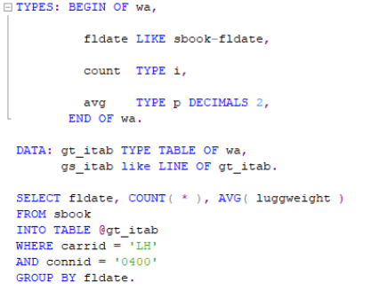
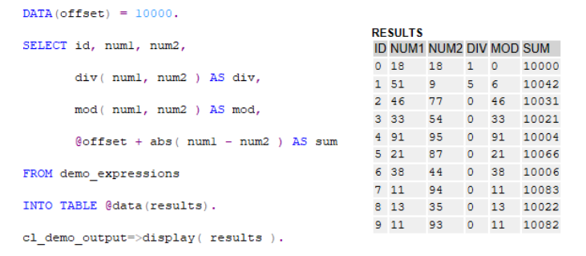
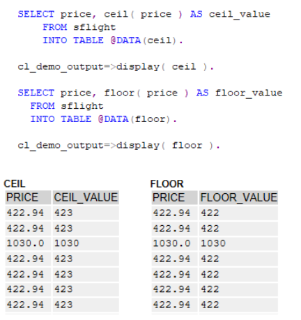
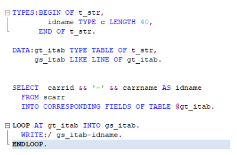
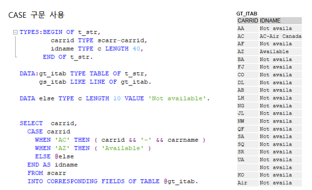
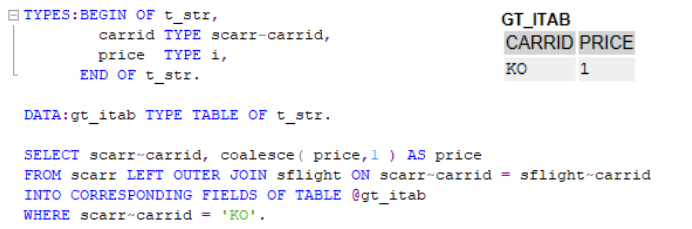
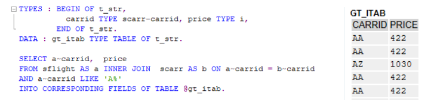
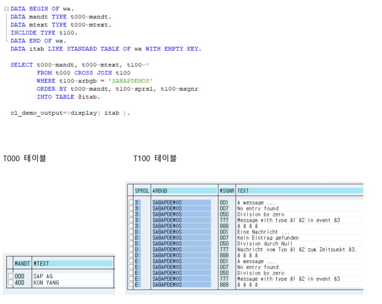
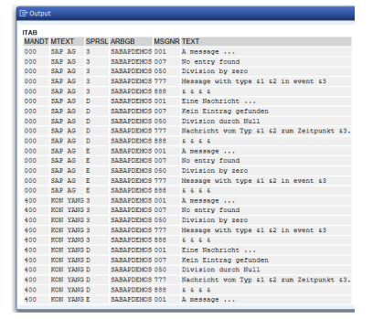

[TOC]

# NEW OPEN SQL의 탄생

OPEN SQL은 SAP에 사용되는 모든 데이터베이스에서 사용할 수 있도록 정의된 SQL 구문이다. NEW OPEN SQL 은 HANA 데이터베이스에서만 사용되는 것이 아니라 SQP에 설치된 모든 데이터 베이스에서 동작한다.

SAP NETWEAVER 7.4 이후부터 NEW OPEN SQL을 사용할 수 있다. NEW OPEN SQL의 특징 CODE PUSHDOWN (Calculations into DB) 방식 기존 OPEN SQL에서 사용하던 기능들을 지원한다. (ex. FOR ALL ENTRIES, Aggregate 함수) 

변수 앞에 @를 사용한다. 컬럼 구분을 위해 쉼표 ( , )기호를 사용한다. 
사칙연산, CASE 조건식, 문자열 연결, 형 변환 SELECT문에서 처리 가능하다. 
Colaesce 사용해서 NULL 대체 가능하다. 
Constant Value 사용 가능하다. 
JOIN 구문의 확장이 가능하다. 

**CODE PUSHDOWN** (Calculations into DB) NEW OPEN SQL과 OPEN SQL의 차이점은 데이터를 Calculation하는 시점이다. 

기존 OPEN SQL은 AS ABAP=> DB => CALCULATION AS ABAP으로 Application Layer에서 Calculation이 이루어지고 NEW OPEN SQL은 AS ABAP => CALCULATION DB => AS ABAP으로 Database Layer에서 Calculation이 이루어지게 된다.

# 사용 예제 

## @기호와 쉼표( , ) 기호 사용


NEW OPEN SQL에서는 변수 앞에 @를 사용하고 컬럼을 나누기 위해 쉼표 ( , )를 사용한다. COUNT와 AVG 같은 기존의 Aggregate 함수 사용이 가능하다.

## DIV, MOD, ABS, 계산식, DIRECT 변수사용


NEW OPEN SQL 문의 SELCET에서 DIV(몫), MOD(나머지), ABS(절대값) 계산식을 사용하여 DIRECT 변수 선언한 results에 데이터를 가져오도록 사용 가능하다.

## CEIL, FLOOR, DIRECT 변수 사용


SELECT 문에서 CEIL(올림)과 FLOOR(내림) 적용하고 DIRECT 변수에 데이터를 가져오도록 사용 CEIL과 FLOOR는 가장 가까운 정수로 올리거나 내림 한다

## 문자열 연결


NEW OPEN SQL 내에서 CONCENTRATE 구문을 사용하지 않고 문자열을 && 기호를 사용하여 연 결할 수 있다. 연결된 문자열의 최대 길이는 255자 이다.

## CASE 구문 사용


NEW OPEN SQL에서 CASE 구문을 이용하여 컬럼 값에 따라서 분기문으로 처리할 수 있다.

## Coalesce 옵션 사용


Coalesce 옵션은 괄호안의 컬럼의 값이 NULL일 경우 다른 값으로 대체하여 출력할 수 있다. 

ABAP에서 데이터 선언 시 기본으로 Initial Value로 지정되고 NULL값과는 다른 값이다. 따라서 Coalesce 구문은 outer join과 같이 값이 존재하지 않는 경우에 활용 가능하다. 

## Constant Value 사용


NEW OPEN SQL에서 SELECT LIST에 Constant value를 사용할 수 있으며 해당 record가 존재할 시 gv_exist에 X를 반환한다. 조건에 맞는 데이터 존재 여부확인시 활용이 가능하다.

## JOIN

NEW OPEN SQL에서는 RIGHT JOIN이 추가적으로 지원된다. 또한 OUTER JOIN 시 WHERE 조건에 OUTER JOIN으로 사용된 컬럼이 조건에 포함될 수 있도록 변경되었다. JOIN 테이블과 Subquery 의 최대 개수가 50개로 확장되었다.


NEW OPEN SQL에서 JOIN의 ON 조건에 LIKE, BETWEEN, <,>과 기능을 사용 가능하다

```abap
  SELECT A~CARRID, A~CONNID, A~FLDATE, B~CARRNAME,
         A~SEATSOCC, A~SEATSMAX,
         A~SEATSMAX - A~SEATSOCC AS SEATSFREE,
         DIVISION( A~SEATSOCC * 100, A~SEATSMAX, 2 ) AS BOOKRATE
  FROM SFLIGHT AS A INNER JOIN SCARR AS B
    ON A~CARRID = B~CARRID
    INTO CORRESPONDING FIELDS OF TABLE @LT_DATA.

  MOVE-CORRESPONDING LT_DATA TO ET_ENTITYSET.

ENDMETHOD.
```

## CROSS JOIN


CROSS JOIN은 한쪽 테이블의 모든 행과 다른 테이블의 모든 행을 JOIN 시키는 기능을 한다.

