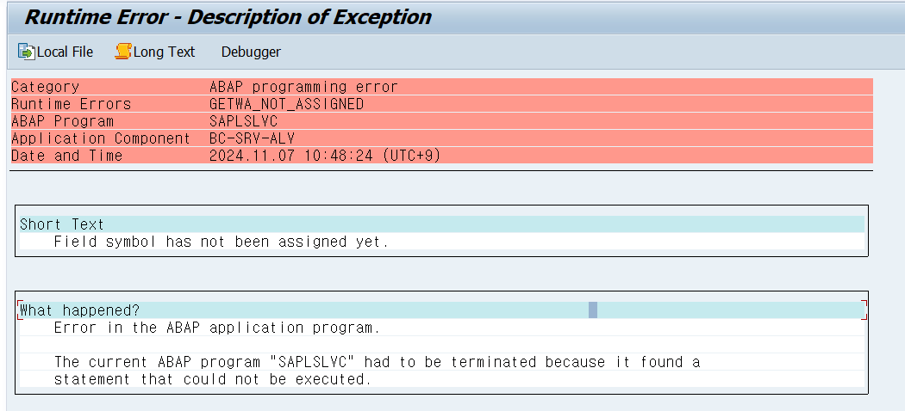

```ABAP
     LOOP AT LT_HEADER INTO DATA(LS_HEADER2)
       FROM 1 TO 3.
       MOVE-CORRESPONDING LS_SOPW TO ZTBSD0091.
       ZTBSD0091-MATCODE = LS_HEADER2-MATCODE.
       ZTBSD0091-UNITCODE = 'EA'.
       ZTBSD0091-AMOUNTPRD = LS_HEADER2-AMOUNT.
       INSERT INTO ZTBSD0091 VALUES ZTBSD0091.
     ENDLOOP.
     ENDLOOP.

   LOOP AT LT_ZTBSD0090 INTO DATA(LS_DATA1).
     LS_SOPW-SOPWNUM = LS_DATA-SOPWNUM.
     LS_SOPW-SALESDATE = LS_DATA-SALESDATE.

      LOOP AT LT_HEADER INTO DATA(LS_HEADER3)
       FROM 4 TO 6.
       MOVE-CORRESPONDING LS_SOPW TO ZTBSD0091.
       ZTBSD0091-MATCODE = LS_HEADER3-MATCODE.
       ZTBSD0091-UNITCODE = 'EA'.
       ZTBSD0091-AMOUNTPRD = LS_HEADER3-AMOUNT.
       INSERT INTO ZTBSD0091 VALUES ZTBSD0091.
     ENDLOOP.
     ENDLOOP.
   LOOP AT LT_ZTBSD0090 INTO DATA(LS_DATA2).
     LS_SOPW-SOPWNUM = LS_DATA-SOPWNUM.
     LS_SOPW-SALESDATE = LS_DATA-SALESDATE.

      LOOP AT LT_HEADER INTO DATA(LS_HEADER4)
       FROM 7 TO 9.
       MOVE-CORRESPONDING LS_SOPW TO ZTBSD0091.
       ZTBSD0091-MATCODE = LS_HEADER4-MATCODE.
       ZTBSD0091-UNITCODE = 'EA'.
       ZTBSD0091-AMOUNTPRD = LS_HEADER4-AMOUNT.
       INSERT INTO ZTBSD0091 VALUES ZTBSD0091.
     ENDLOOP.
```


ALV의 필드가 맞지 아니함
그 전에 했던거 : 테이블에 필드 하나 추가해버림

```ABAP
      LOOP AT LT_HEADER INTO DATA(LS_HEADER1).
         READ TABLE GT_MATDATA INTO GS_MATDATA WITH KEY MATCODE = LS_HEADER1-MATCODE.
         CHECK GS_MATDATA-PRODTYPE = 'CAN'.
         CHECK SY-TABIX = 1.
         MOVE-CORRESPONDING LS_SOPW TO ZTBSD0091.
*         INSERT INTO ZTBSD0091 VALUES ZTBSD0091.
         BREAK-POINT.
      ENDLOOP.
```

```ABAP
LOOP AT GROUP BY <ITAB> ASSIGNING FILED-SYMBOL(<FS_01>) 

                                              GROUP BY  ( KEY = <FS_01>-KEY

                                                                     KEY = <FS_02>-KEY

                                                                     SIZE = GROUP SIZE

                                                                     INDEX = GROUPINDEX )

                                              ASSIGNING FILED-SYMBOL(<FS_02>). 

 

  LOOP AT GROUP <FS_02> ASSIGNING FIELD-SYMBOL(<FS_03>).


  ENDLOOP.

 

ENDLOOP.
```

```ABAP
FORM MAX_AMOUN_CHECK CHANGING GS_MATDATA.
	DATA: MAX_AMOUNT TYPE I.

    IF GS_MATDATA-MATNAME CP '*페트병'.
      GS_MATDATA-MATTYPE = 2.
      MAX_AMOUNT = 20000.
    ELSEIF GS_MATDATA-MATNAME CP '*유리병'.
      GS_MATDATA-MATTYPE = 1.
      MAX_AMOUNT = 60000.
    ELSE.
      GS_MATDATA-MATTYPE = 0.     " 캔
      MAX_AMOUNT = 100000.
    ENDIF.

*    최대 생산량을 넘을 경우 최대 생산량 까지만
    IF GS_MATDATA-AMOUNTPRD > MAX_AMOUNT.
      GS_MATDATA-AMOUNTPRD = MAX_AMOUNT.
    ENDIF.
ENDFORM.
```

```ABAP
   LOOP AT LT_ZTBSD0090 INTO DATA(LS_DATA). " 52개를 돌려서 안에 3개씩 데이터를 넣도록 한다.
      LS_DATA-STATUS = 'X'.
      LS_SOPW-SALESDATE = LS_DATA-SALESDATE.
      LS_SOPW-SOPWNUM = LS_DATA-SOPWNUM.

*   SUM 된 자재코드들 52개씩 만들어주기 생성일 / 창고코드 넣기
*   52로 나눈뒤, 하나의 수를 일단 구해서 돌림
*   캔 / 페트병 / 유리병으로 하나씩 골라서 넣는다 (종류 상관 없음 )
*   9개를 자재타입으로 그룹화 한다.
      LOOP AT GT_MATDATA INTO GS_MATDATA
                         GROUP BY ( KEY1 = GS_MATDATA-PRODTYPE
                                    INDEX = GROUP INDEX
                                    SIZE = GROUP SIZE )
                         ASSIGNING FIELD-SYMBOL(<LS_GROUP>).

        DATA: FS_INDEX TYPE N VALUE 1.
        LOOP AT GROUP <LS_GROUP> ASSIGNING FIELD-SYMBOL(<FS_LOOP>).  " 1,2,3

          READ TABLE LT_HEADER INTO LS_HEADER WITH KEY MATCODE = <FS_LOOP>-MATCODE.
          FS_INDEX = FS_INDEX + 1.

          CHECK <LS_GROUP>-INDEX = 1.

          ZTBSD0091-AMOUNTPRD = LS_HEADER-AMOUNT.
          ZTBSD0091-MATCODE = <FS_LOOP>-MATCODE.
          ZTBSD0091-UNITCODE = 'EA'.

          APPEND ZTBSD0091 TO LT_TEST.
        ENDLOOP.
      ENDLOOP.
        MOVE-CORRESPONDING LS_DATA TO ZTBSD0090.
        APPEND ZTBSD0090 TO LT_TEST2.
    ENDLOOP.
```

```ABAP
*&---------------------------------------------------------------------*
*& Include          MZBSD0040F01
*&---------------------------------------------------------------------*
*&---------------------------------------------------------------------*
*& Module INIT_ALV OUTPUT
*&---------------------------------------------------------------------*
*&
*&---------------------------------------------------------------------*
MODULE INIT_ALV OUTPUT.
  PERFORM SET_LIST_BOX. " list 박스 생성하기

  IF GO_CONT IS INITIAL.
    PERFORM CREATE_OBJECT_0100.
    PERFORM SET_LAYOUT_0100.
    PERFORM SET_ALV_FIELDCAT_0100.
    PERFORM SET_ALV_DISPLAY_0100.
  ENDIF.
ENDMODULE.
*&---------------------------------------------------------------------*
*& Form SET_LIST_BOX
*&---------------------------------------------------------------------*
*& text
*&---------------------------------------------------------------------*
*& -->  p1        text
*& <--  p2        text
*&---------------------------------------------------------------------*
FORM SET_LIST_BOX.
*  DB에 있는 연도 중복 제거 후 가져오기
    DATA : LT_DROPLIST TYPE VRM_VALUES,
           LS_DROPLIST TYPE VRM_VALUE.

* APPEND는 스택임
    SELECT DISTINCT
      SALESYEAR AS KEY,
      SALESYEAR AS TEXT
    FROM ZTBSD0010 INTO TABLE @LT_DROPLIST.

** 생성을 위해 올해 연도 넣기
*    LS_DROPLIST-KEY = SY-DATUM+0(4).
*    LS_DROPLIST-TEXT = SY-DATUM+0(4).
*    APPEND LS_DROPLIST TO LT_DROPLIST.

* TODO. 대체 왜? 마지막에 하나가 비워진채로 들어가지?
    CALL FUNCTION 'VRM_SET_VALUES'
      EXPORTING
        ID     = 'GV_LIST'
        VALUES = LT_DROPLIST.  " Listbox Data
ENDFORM.
*&---------------------------------------------------------------------*
*& Form CREATE
*&---------------------------------------------------------------------*
*& text
*&---------------------------------------------------------------------*
*& -->  p1        text
*& <--  p2        text
*&---------------------------------------------------------------------*
FORM CREATE .
* 판매계획 생성 버튼 클릭
*  필수값 입력 안했으면 경고창 띄워
  IF GV_LIST IS INITIAL OR ZTBSD0010-CTRYCODE IS INITIAL.
      PERFORM MESSAGE_INFO USING 'REQ'.
      RETURN.
  ENDIF.

* 제품별 수량 계산해서 넣기
  PERFORM SET_DATA_PROD.

* 일단 헤더를 생성해본다 AREA1
  PERFORM SET_DATA_HEADER.

  PERFORM ALV_REFRESH.

* 판매운영계획번호 : 국가 는 1대1

ENDFORM.
*&---------------------------------------------------------------------*
*& Form CREATE_OBJECT_0100
*&---------------------------------------------------------------------*
*& text
*&---------------------------------------------------------------------*
*& -->  p1        text
*& <--  p2        text
*&---------------------------------------------------------------------*
FORM CREATE_OBJECT_0100 .
CREATE OBJECT GO_CONT
      EXPORTING
        CONTAINER_NAME = 'AREA1'.

    CREATE OBJECT GO_ALV
      EXPORTING
        I_PARENT = GO_CONT.
ENDFORM.
*&---------------------------------------------------------------------*
*& Form SET_LAYOUT_0100
*&---------------------------------------------------------------------*
*& text
*&---------------------------------------------------------------------*
*& -->  p1        text
*& <--  p2        text
*&---------------------------------------------------------------------*
FORM SET_LAYOUT_0100 .
  GS_LAYOUT-ZEBRA = 'X'.
  GS_LAYOUT-CWIDTH_OPT = 'A'.
  GS_LAYOUT-GRID_TITLE = '제품별 판매계획'.
ENDFORM.
*&---------------------------------------------------------------------*
*& Form SET_ALV_DISPLAY_0100
*&---------------------------------------------------------------------*
*& text
*&---------------------------------------------------------------------*
*& -->  p1        text
*& <--  p2        text
*&---------------------------------------------------------------------*
FORM SET_ALV_DISPLAY_0100 .
*  ZTBMM1010 에서 MATTYPE이 C (완제품)인 것만 가져와서 담는다.

    CALL METHOD GO_ALV->SET_TABLE_FOR_FIRST_DISPLAY
      EXPORTING
*        Local Structure는 올 수 없다.
         I_STRUCTURE_NAME = 'ZSBSD10'           " Internal Output Table Structure Name
         IS_LAYOUT        = GS_LAYOUT
      CHANGING
        IT_OUTTAB        = GT_MATDATA
        IT_FIELDCATALOG  = GT_FCAT.              " FIELD CATALOG
ENDFORM.
*&---------------------------------------------------------------------*
*& Form ALV_REFRESH
*&---------------------------------------------------------------------*
*& text
*&---------------------------------------------------------------------*
*& -->  p1        text
*& <--  p2        text
*&---------------------------------------------------------------------*
FORM ALV_REFRESH .
  DATA LS_STABLE TYPE LVC_S_STBL.
  CALL METHOD GO_ALV->REFRESH_TABLE_DISPLAY
     EXPORTING
        IS_STABLE = LS_STABLE.       " WITH STABLE ROWS/COLUMNS

    CALL METHOD GO_ALV2->REFRESH_TABLE_DISPLAY
     EXPORTING
        IS_STABLE = LS_STABLE.       " WITH STABLE ROWS/COLUMNS
ENDFORM.
*&---------------------------------------------------------------------*
*& Form CALC_DATE
*&---------------------------------------------------------------------*
*& text
*&---------------------------------------------------------------------*
*&      --> P_
*&      <-- LS_LAST_YEAR
*&---------------------------------------------------------------------*
FORM CALC_DATE USING P_TYPE P_VALUE CHANGING P_LS_LAST_YEAR.

*  DATE 변수 선언
  DATA : SIGNUM         TYPE C VALUE '+',
          LV_DIAS           TYPE I,
          LV_MONTHS    TYPE T5A4A-DLYMO,
          LV_YEARS         TYPE T5A4A-DLYYR,
          LV_DAY            TYPE T5A4A-DLYDY,
          DATE          TYPE D.

  IF P_TYPE = 'YEAR_MINUS'.
    LV_YEARS = 1.
    SIGNUM = '-'.
    DATE = SY-DATUM.
  ENDIF.

  IF P_TYPE = 'YEAR_PLUS'.
    LV_YEARS = 1.
    SIGNUM = '+'.
    DATE = SY-DATUM.
  ENDIF.

*  PERFORM CALC_DATE USING 'DAY' SY-TABIX CHANGING LV_DAY.

*  IF P_TYPE = 'DAY'.
*    LV_DAY = P_VALUE * 7.
*    LV_YEARS = 1.
**    내년 1월 첫째주 구해오기
*    PERFORM GET_WEEK_FIRST CHANGING DATE.
**    PERFORM CALC_DATE USING 'B_YEAR' 1 CHANGING DATE.
*  ENDIF.

  CALL FUNCTION 'RP_CALC_DATE_IN_INTERVAL'
    EXPORTING
      DATE      = DATE
      MONTHS    = LV_MONTHS
      DAYS      = LV_DAY
      SIGNUM    = SIGNUM    " Signum : "+" or "-" to add or remove
      YEARS     = LV_YEARS
    IMPORTING
      CALC_DATE = P_LS_LAST_YEAR.
ENDFORM.
*&---------------------------------------------------------------------*
*& Form SET_DATA_PROD
*&---------------------------------------------------------------------*
*& text
*&---------------------------------------------------------------------*
*& -->  p1        text
*& <--  p2        text
*&---------------------------------------------------------------------*
FORM SET_DATA_PROD .

*  올해 연도가 생성된다면 내년 연도 찍기 (TODO. 드롭박스 disalbe 하는 방법????)
* 사실 판매계획연도 생성은 내년것만 가능하다 (READ ONLY 처리 필요)

*   수량을 직접 계산해서 넣어준다.
* 2. 전년도 가져오기
DATA: LS_LAST_YEAR TYPE D,
      YEAR  TYPE D.

YEAR = SY-DATUM+0(4).

PERFORM CALC_DATE USING 'YEAR_MINUS' YEAR CHANGING LS_LAST_YEAR.  "전년도
PERFORM CALC_DATE USING 'YEAR_PLUS' YEAR CHANGING LS_PLUS_YEAR.   "내년

GV_LIST = LS_PLUS_YEAR.

* 3. 전년도 판매수량을 가지고 온다.
DATA : LS_ZTBSD0011 TYPE ZTBSD0011,
       LT_ZTBSD0011 TYPE TABLE OF ZTBSD0011.

* 자재마스터에 있는 완제품(C)을 모두 가져온다 (ZTBMM1010)
* 자재마스터 이름을 가지고 온다 (ZTBMM1011)
* 판매운영계획에서 전년도 판매수량을 가지고 온다 ( 조건 : 생성하려는 국가(ZTBSD0010-CTRYCODE), 전년도 )
SELECT D~SALESYEAR, C~MATCODE, B~MATNAME, C~AMOUNTPRD, A~PRODTYPE
  FROM ZTBMM1010 AS A
  INNER JOIN ZTBMM1011 AS B ON A~MATCODE EQ B~MATCODE
  LEFT JOIN ZTBSD0011 AS C ON A~MATCODE EQ C~MATCODE
  INNER JOIN ZTBSD0010 AS D ON C~SOPNUM = D~SOPNUM
      INTO CORRESPONDING FIELDS OF TABLE @GT_MATDATA
      WHERE D~SALESYEAR = @LS_LAST_YEAR+0(4)
          AND A~MATTYPE = 'C'
          AND C~CTRYCODE = @ZTBSD0010-CTRYCODE.

  LOOP AT GT_MATDATA INTO DATA(GS_MATDATA).
    GS_MATDATA-SALESYEAR = GV_LIST.  " 계획 세우는건 올해만 가능, 올해 연도 넣기
    GS_MATDATA-UNITCODE = 'EA'. " 수량단위는 완제품일 경우 EA로 통합

*     전년도 수량 * 1.01
    GS_MATDATA-AMOUNTPRD = TRUNC( GS_MATDATA-AMOUNTPRD ) * AMOUNT_CS.

    MODIFY GT_MATDATA FROM GS_MATDATA.
  ENDLOOP.
ENDFORM.
*&---------------------------------------------------------------------*
*& Form SET_ALV_FIELDCAT_0100
*&---------------------------------------------------------------------*
*& text
*&---------------------------------------------------------------------*
*& -->  p1        text
*& <--  p2        text
*&---------------------------------------------------------------------*
FORM SET_ALV_FIELDCAT_0100 .
  DATA: LS_FCAT TYPE LVC_S_FCAT.

  CLEAR LS_FCAT.
  LS_FCAT-FIELDNAME = 'PRODTYPE'.     " Field의 이름
  LS_FCAT-COLTEXT   = '자재유형'.  " Field Label 설정( Text ELements 반드시 사용 )
  APPEND LS_FCAT TO GT_FCAT.

  CLEAR LS_FCAT.
  LS_FCAT-FIELDNAME = 'AMOUNTPRD'.     " Field의 이름
  LS_FCAT-COLTEXT   = '판매계획수량'.  " Field Label 설정( Text ELements 반드시 사용 )
  LS_FCAT-EMPHASIZE = 'C300'.     " 열에 색상 넣기
  APPEND LS_FCAT TO GT_FCAT.

  CLEAR LS_FCAT.
  LS_FCAT-FIELDNAME = 'UNITCODE'.     " Field의 이름
  LS_FCAT-COLTEXT   = '단위'.  " Field Label 설정( Text ELements 반드시 사용 )
  APPEND LS_FCAT TO GT_FCAT.

ENDFORM.
*&---------------------------------------------------------------------*
*& Module INIT_ALV2 OUTPUT
*&---------------------------------------------------------------------*
*&
*&---------------------------------------------------------------------*
MODULE INIT_ALV2 OUTPUT.
    IF GO_CONT2 IS INITIAL.
    PERFORM CREATE_OBJECT2_0100.
    PERFORM SET_LAYOUT2_0100.
    PERFORM SET_ALV_DISPLAY2_0100.
  ENDIF.
ENDMODULE.
*&---------------------------------------------------------------------*
*& Form CREATE_OBJECT2_0100
*&---------------------------------------------------------------------*
*& text
*&---------------------------------------------------------------------*
*& -->  p1        text
*& <--  p2        text
*&---------------------------------------------------------------------*
FORM CREATE_OBJECT2_0100 .
CREATE OBJECT GO_CONT2
      EXPORTING
        CONTAINER_NAME = 'AREA2'.

    CREATE OBJECT GO_ALV2
      EXPORTING
        I_PARENT = GO_CONT2.
ENDFORM.
*&---------------------------------------------------------------------*
*& Form SET_LAYOUT2_0100
*&---------------------------------------------------------------------*
*& text
*&---------------------------------------------------------------------*
*& -->  p1        text
*& <--  p2        text
*&---------------------------------------------------------------------*
FORM SET_LAYOUT2_0100 .
  GS_LAYOUT2-ZEBRA = 'X'.
  GS_LAYOUT2-CWIDTH_OPT = 'A'.
  GS_LAYOUT2-GRID_TITLE = '판매운영계획'.
ENDFORM.
*&---------------------------------------------------------------------*
*& Form SET_ALV_DISPLAY2_0100
*&---------------------------------------------------------------------*
*& text
*&---------------------------------------------------------------------*
*& -->  p1        text
*& <--  p2        text
*&---------------------------------------------------------------------*
FORM SET_ALV_DISPLAY2_0100 .
    CALL METHOD GO_ALV2->SET_TABLE_FOR_FIRST_DISPLAY
      EXPORTING
*        Local Structure는 올 수 없다.
         I_STRUCTURE_NAME = 'ZTBSD11'           " Internal Output Table Structure Name
         IS_LAYOUT        = GS_LAYOUT2
      CHANGING
        IT_OUTTAB        = GT_HEADER.
ENDFORM.
*&---------------------------------------------------------------------*
*& Form SET_DATA_HEADER
*&---------------------------------------------------------------------*
*& text
*&---------------------------------------------------------------------*
*& -->  p1        text
*& <--  p2        text
*&---------------------------------------------------------------------*
FORM SET_DATA_HEADER .
    SELECT CTRYCODE, CTRYNAME FROM ZTBSD1040
      WHERE CTRYCODE = @ZTBSD0010-CTRYCODE INTO CORRESPONDING FIELDS OF TABLE @GT_HEADER.

    LOOP AT GT_HEADER INTO GS_HEADER.
      GS_HEADER-SALESYEAR = GV_LIST.
       MODIFY GT_HEADER FROM GS_HEADER.
    ENDLOOP.
ENDFORM.
*&---------------------------------------------------------------------*
*& Form SAVE
*&---------------------------------------------------------------------*
*& text
*&---------------------------------------------------------------------*
*& -->  p1        text
*& <--  p2        text
*&---------------------------------------------------------------------*
FORM SAVE .
*생성 하겠냐는 컨펌창 띄우기
  PERFORM CON_POPUP USING '생성' CHANGING LV_ANSWER.
  CHECK LV_ANSWER = '1'.
*  테이블 세개를 UPDATE 시켜야 함
*  ZTBSD0010 . ZTBSD0011, ZTBSD0090 , PK 주의
  PERFORM INSERT.
ENDFORM.
*&---------------------------------------------------------------------*
*& Form RESET
*&---------------------------------------------------------------------*
*& text
*&---------------------------------------------------------------------*
*& -->  p1        text
*& <--  p2        text
*&---------------------------------------------------------------------*
FORM RESET .    " 새로고침 버튼
  REFRESH: GT_HEADER, GT_MATDATA.
  CLEAR: GV_LIST, ZTBSD0010-CTRYCODE.
  PERFORM ALV_REFRESH.
ENDFORM.
*&---------------------------------------------------------------------*
*& Form GET_NUMBER_RANGE
*&---------------------------------------------------------------------*
*& text
*&---------------------------------------------------------------------*
*&      <-- LV_NUM
*&---------------------------------------------------------------------*
FORM GET_NUMBER_RANGE USING NUM_TYPE CHANGING P_LV_NUM.
  CALL FUNCTION 'NUMBER_GET_NEXT'
  EXPORTING
    NR_RANGE_NR                   = '01'
    OBJECT                        =  NUM_TYPE
 IMPORTING
   NUMBER                        = P_LV_NUM.
  IF SY-SUBRC <> 0.
    PERFORM MESSAGE_INFO USING 'ERROR'.
  ENDIF.
ENDFORM.
*&---------------------------------------------------------------------*
*& Form MESSAGE_INFO
*&---------------------------------------------------------------------*
*& text
*&---------------------------------------------------------------------*
*&      --> P_
*&---------------------------------------------------------------------*
FORM MESSAGE_INFO  USING  P_ROW.
  IF P_ROW = 'ROW'.
    MESSAGE S008 DISPLAY LIKE 'E'.
  ELSEIF P_ROW = 'DELETE'.
     MESSAGE S014 DISPLAY LIKE 'E'.
  ELSEIF P_ROW = 'ERROR'.
    MESSAGE S016 DISPLAY LIKE 'E'.
  ELSEIF P_ROW = 'SUCCESS'.
    MESSAGE S011 DISPLAY LIKE 'S'.
  ELSEIF P_ROW = 'REQ'.
   MESSAGE ID 'ZCOMMON_MSG' TYPE 'I' NUMBER '000'.
  ENDIF.
ENDFORM.
*&---------------------------------------------------------------------*
*& Form PROD_Q
*&---------------------------------------------------------------------*
*& text
*&---------------------------------------------------------------------*
*& -->  p1        text
*& <--  p2        text
*&---------------------------------------------------------------------*
FORM PROD_Q . " 생산수량 * 1.05 하고 제한 걸기 AMOUNT_PQ

  DATA: LV_NUM TYPE CHAR10,
        LT_ZTBSD0090 TYPE TABLE OF ZTBSD0090,
        LT_ZTBSD0091 TYPE TABLE OF ZTBSD0091,
        LT_VALUE TYPE TABLE OF I WITH EMPTY KEY.

*  SUM SELECT
  SELECT A~MATCODE, SUM( A~AMOUNTPRD ) AS AMOUNT
    FROM ZTBSD0011 AS A
    GROUP BY A~MATCODE INTO TABLE @DATA(LT_HEADER).

* 그냥 빈 테이블 생성 함.
  SELECT A~SOPWNUM, A~SALESDATE, A~WHCODE, B~MATCODE, B~AMOUNTPRD, B~UNITCODE, B~WEEK
    FROM ZTBSD0090 AS A JOIN ZTBSD0091 AS B ON A~SOPWNUM = B~SOPWNUM
    INTO TABLE @DATA(LT_SOPW).

  REFRESH LT_SOPW.
  DATA LS_SOPW LIKE LINE OF LT_SOPW.

* 판매계획수량 SUM해서 가져온거 테이블에 집어 넣는중 ( 9개 )
  LOOP AT LT_HEADER INTO DATA(LS_HEADER).
    LS_SOPW-MATCODE = LS_HEADER-MATCODE.
*    생산 수량 = 현재 판매 수량 * 1.05
    LS_SOPW-AMOUNTPRD = TRUNC( LS_HEADER-AMOUNT ) * AMOUNT_PQ.
    LS_HEADER-AMOUNT = CEIL( LS_SOPW-AMOUNTPRD / 52 ).
    LS_SOPW-UNITCODE = 'EA'.

    APPEND LS_SOPW TO LT_SOPW.
    MODIFY LT_HEADER FROM LS_HEADER.
    CLEAR: LS_SOPW.
  ENDLOOP.

* TODO.  TABLES PERFORM 보내서 참조 타입으로 쓰는 방법

*   TODO. FOR문 잘 써보기, 52개 생성하기
  LT_VALUE = VALUE #( FOR J = 1 WHILE J <= 52 ( J ) ).

  DATA: LV_DAY TYPE ZTBSD0090-SALESDATE,
        LV_IDX TYPE N LENGTH 2,    " 인덱스는 정수형으로 설정
        LV_IDX_C TYPE C LENGTH 2,
        LV_WEEK TYPE SCAL-WEEK,
        DATE TYPE D,
        STP TYPE N VALUE 1.    " 창고 코드를 번갈아가며 넣기 위함

   LOOP AT LT_VALUE INTO DATA(LS_VAL).

*     판매계획번호
     PERFORM GET_NUMBER_RANGE USING 'ZBBSD0090' CHANGING LV_NUM.
     LS_SOPW-SOPWNUM = |SW{ LV_NUM }|.

      CASE STP.
        WHEN 1.
          LS_SOPW-WHCODE = 'STP0000002'.
          STP = 2.
        WHEN 2.
          LS_SOPW-WHCODE = 'STP0000003'.
          STP = 3.
        WHEN OTHERS.
          LS_SOPW-WHCODE = 'STP0000004'.
          STP = 1.
      ENDCASE.

      LV_IDX = LS_VAL.
      LV_IDX_C = LV_IDX.
      LV_WEEK = |{ LS_PLUS_YEAR+0(4) }{ LV_IDX_C }|.

*      1월 첫째주 월요일에 시작하도록 한다.
     PERFORM GET_WEEK_FIRST USING LV_WEEK CHANGING LS_SOPW-SALESDATE.

     MOVE-CORRESPONDING LS_SOPW TO ZTBSD0090.
     APPEND ZTBSD0090 TO LT_ZTBSD0090.
*     INSERT INTO ZTBSD0090 VALUES ZTBSD0090.
     CLEAR: ZTBSD0090, LS_SOPW.
   ENDLOOP.

   DATA LS_AMOUNT TYPE ZTBSD0091-AMOUNTPRD.  " 수량을 52주로 나눈 값을 구하기 위함

   DATA : LT_TEST TYPE TABLE OF ZTBSD0091.
   DATA : LT_TEST2 TYPE TABLE OF ZTBSD0090.

   SORT LT_HEADER BY MATCODE ASCENDING.

*  LOOP AT LT_ZTBSD0090 INTO DATA(LS_DATA). " 52개를 돌려서 안에 3개씩 데이터를 넣도록 한다.
*   LS_DATA-STATUS = 'X'.
*   LS_SOPW-SALESDATE = LS_DATA-SALESDATE.
*   LS_SOPW-SOPWNUM = LS_DATA-SOPWNUM.
*   LS_SOPW-WEEK = SY-TABIX.
*
*
*
**      SUM 된 자재코드들 52개씩 만들어주기 생성일 / 창고코드 넣기
**      52로 나눈뒤, 하나의 수를 일단 구해서 돌림
**      캔 / 페트병 / 유리병으로 하나씩 골라서 넣는다 (종류 상관 없음 )
**      9개를 자재타입으로 그룹화 한다.
**       LOOP AT GT_MATDATA INTO GS_MATDATA.
**          ZTBSD0091-MATCODE = GS_MATDATA-MATCODE.
**          MOVE-CORRESPONDING LS_SOPW TO ZTBSD0091.
**          ZTBSD0091-AMOUNTPRD = LS_HEADER-AMOUNT.
**          ZTBSD0091-MATCODE = LS_SOPW-MATCODE.
**          ZTBSD0091-UNITCODE = 'EA'.
**          APPEND ZTBSD0091 TO LT_TEST.
**       ENDLOOP.
*      MOVE-CORRESPONDING LS_DATA TO ZTBSD0090.
*      APPEND ZTBSD0090 TO LT_TEST2.
*    ENDLOOP.

   LOOP AT LT_ZTBSD0090 INTO DATA(LS_DATA).
     LS_SOPW-SOPWNUM = LS_DATA-SOPWNUM.
     LS_SOPW-SALESDATE = LS_DATA-SALESDATE.
 LOOP AT LT_HEADER INTO DATA(LS_HEADER2)
       FROM 1 TO 3.
       MOVE-CORRESPONDING LS_SOPW TO ZTBSD0091.
       ZTBSD0091-MATCODE = LS_HEADER2-MATCODE.
       ZTBSD0091-UNITCODE = 'EA'.
       ZTBSD0091-AMOUNTPRD = LS_HEADER2-AMOUNT.
       ZTBSD0091-WEEK = SY-TABIX.
*       INSERT INTO ZTBSD0091 VALUES ZTBSD0091.
       APPEND ZTBSD0091 TO LT_TEST.
     ENDLOOP.
     APPEND ZTBSD0090 TO LT_TEST2.
     ENDLOOP.

   LOOP AT LT_ZTBSD0090 INTO DATA(LS_DATA1).
     LS_SOPW-SOPWNUM = LS_DATA-SOPWNUM.
     LS_SOPW-SALESDATE = LS_DATA-SALESDATE.

      LOOP AT LT_HEADER INTO DATA(LS_HEADER3)
       FROM 4 TO 6.
       MOVE-CORRESPONDING LS_SOPW TO ZTBSD0091.
       ZTBSD0091-MATCODE = LS_HEADER3-MATCODE.
       ZTBSD0091-UNITCODE = 'EA'.
       ZTBSD0091-AMOUNTPRD = LS_HEADER3-AMOUNT.
       ZTBSD0091-WEEK = SY-TABIX.
*       INSERT INTO ZTBSD0091 VALUES ZTBSD0091.
       APPEND ZTBSD0091 TO LT_TEST.
     ENDLOOP.
     APPEND ZTBSD0090 TO LT_TEST2.
     ENDLOOP.
   LOOP AT LT_ZTBSD0090 INTO DATA(LS_DATA2).
     LS_SOPW-SOPWNUM = LS_DATA-SOPWNUM.
     LS_SOPW-SALESDATE = LS_DATA-SALESDATE.

      LOOP AT LT_HEADER INTO DATA(LS_HEADER4)
       FROM 7 TO 9.
       MOVE-CORRESPONDING LS_SOPW TO ZTBSD0091.
       ZTBSD0091-MATCODE = LS_HEADER4-MATCODE.
       ZTBSD0091-UNITCODE = 'EA'.
       ZTBSD0091-AMOUNTPRD = LS_HEADER4-AMOUNT.
       ZTBSD0091-WEEK = SY-TABIX.
*       INSERT INTO ZTBSD0091 VALUES ZTBSD0091.
       APPEND ZTBSD0091 TO LT_TEST.
     ENDLOOP.
     APPEND ZTBSD0090 TO LT_TEST2.
     ENDLOOP.

    BREAK-POINT.

ENDFORM.
*&---------------------------------------------------------------------*
*& Form INSERT
*&---------------------------------------------------------------------*
*& text
*&---------------------------------------------------------------------*
*& -->  p1        text
*& <--  p2        text
*&---------------------------------------------------------------------*
FORM INSERT .
*  Number Range 생성해보자
  DATA LV_NUM TYPE CHAR10.
  PERFORM GET_NUMBER_RANGE USING 'ZBBSD0010' CHANGING LV_NUM.

  PERFORM ZTBSD0010_INSERT USING LV_NUM.
  PERFORM ZTBSD0011_INSERT USING LV_NUM.

* 업데이트 전에 생산수량 * 1.05 하고 제한 확인하고 넘겨야 함
  PERFORM PROD_Q.

*  INSERT INTO ZTBSD0010 VALUES ZTBSD0010.
*  INSERT INTO ZTBSD0011 VALUES ZTBSD0011.


ENDFORM.
*&---------------------------------------------------------------------*
*& Form GET_EMPID
*& Form GET_EMPID
*&---------------------------------------------------------------------*
FORM GET_EMPID.
  SELECT * FROM ZTBSD1030 INTO TABLE GT_ZTBSD1030.
  READ TABLE GT_ZTBSD1030 INTO GS_ZTBSD1030 WITH KEY LOGID = SY-UNAME.
ENDFORM.
*&---------------------------------------------------------------------*
*& Form CON_POPUP
*&---------------------------------------------------------------------*
*& text
*&---------------------------------------------------------------------*
*&      --> P_
*&      <-- LV_ANSWER
*&---------------------------------------------------------------------*
FORM CON_POPUP USING P_VALUE CHANGING LV_ANSWER.

  DATA DOMAIN TYPE CHAR10 VALUE '판매운영계획'.

  CALL FUNCTION 'POPUP_TO_CONFIRM'
  EXPORTING
    TITLEBAR       = | { DOMAIN } 문서 { P_VALUE  } |
    TEXT_QUESTION  = | 해당 { DOMAIN } 문서를 { P_VALUE  }하시겠습니까? |
    TEXT_BUTTON_1  = 'YES'
    TEXT_BUTTON_2  = 'NO'
    DISPLAY_CANCEL_BUTTON = ''
  IMPORTING
    ANSWER         = LV_ANSWER
  EXCEPTIONS
    TEXT_NOT_FOUND = 1
    OTHERS         = 2.
ENDFORM.
*&---------------------------------------------------------------------*
*& Form ZTBSD0010_INSERT
*&---------------------------------------------------------------------*
*& text
*&---------------------------------------------------------------------*
*&      --> LV_NUM
*&---------------------------------------------------------------------*
FORM ZTBSD0010_INSERT USING P_LV_NUM.
  ZTBSD0010-SOPNUM = |SOP{ P_LV_NUM }|.
  ZTBSD0010-SALESYEAR = GV_LIST.

  PERFORM GET_EMPID.
  ZTBSD0010-SOPDAT = SY-DATUM.
  ZTBSD0010-EMPID = GS_ZTBSD1030-EMPID.
ENDFORM.
*&---------------------------------------------------------------------*
*& Form ZTBSD0011_INSERT
*&---------------------------------------------------------------------*
*& text
*&---------------------------------------------------------------------*
*&      --> LV_NUM
*&---------------------------------------------------------------------*
FORM ZTBSD0011_INSERT USING P_LV_NUM.
  LOOP AT GT_MATDATA INTO GS_MATDATA.
    ZTBSD0011-SOPNUM = |SOP{ P_LV_NUM }|.
    ZTBSD0011-CTRYCODE = ZTBSD0010-CTRYCODE.
    ZTBSD0011-MATCODE = GS_MATDATA-MATCODE.
    ZTBSD0011-AMOUNTPRD = GS_MATDATA-AMOUNTPRD.
    ZTBSD0011-UNITCODE = GS_MATDATA-UNITCODE.
  ENDLOOP.
ENDFORM.
*&---------------------------------------------------------------------*
*& Form GET_WEEK_FIRST
*&---------------------------------------------------------------------*
*& text
*&---------------------------------------------------------------------*
*&      <-- DATE
*&---------------------------------------------------------------------*
FORM GET_WEEK_FIRST USING WEEK CHANGING P_DATE.
CALL FUNCTION 'WEEK_GET_FIRST_DAY'
  EXPORTING
    WEEK         =  WEEK                " Week for which the date is to be determined
  IMPORTING
    DATE         =    P_DATE              " Date of the first day of the week
  EXCEPTIONS
    WEEK_INVALID = 1                " Week was incorrectly specified
    OTHERS       = 2
  .
IF SY-SUBRC <> 0.
  PERFORM MESSAGE_INFO USING 'ERROR'.
ENDIF.
ENDFORM.
*&---------------------------------------------------------------------*
*& Form MAX_AMOUN_CHECK
*&---------------------------------------------------------------------*
*& text
*&---------------------------------------------------------------------*
*&      --> GS_MATDATA_PRODTYPE
*&      <-- LS_HEADER_AMOUNT
*&      <-- GS_MATDATA_TYPENUM
*&---------------------------------------------------------------------*
FORM MAX_AMOUN_CHECK  USING    GS_MATDATA_PRODTYPE
                      CHANGING LS_HEADER_AMOUNT.

 	DATA: MAX_AMOUNT TYPE I.

    IF GS_MATDATA_PRODTYPE = 'CAN'.
      MAX_AMOUNT = 100000.
    ELSEIF GS_MATDATA_PRODTYPE = 'GLA'.
      MAX_AMOUNT = 60000.
    ELSE.
      MAX_AMOUNT = 20000.
    ENDIF.

*    최대 생산량을 넘을 경우 최대 생산량 까지만
    IF LS_HEADER_AMOUNT > MAX_AMOUNT.
      LS_HEADER_AMOUNT = MAX_AMOUNT.
    ENDIF.

ENDFORM.
```

```ABAP
  LOOP AT LT_ZTBSD0090 INTO DATA(LS_DATA).
     LS_SOPW-SOPWNUM = LS_DATA-SOPWNUM.
     LS_SOPW-SALESDATE = LS_DATA-SALESDATE.
     LV_IDX_C = SY-TABIX.
     LOOP AT LT_HEADER INTO DATA(LS_HEADER2)
       FROM 1 TO 3.
       MOVE-CORRESPONDING LS_SOPW TO ZTBSD0091.
       ZTBSD0091-MATCODE = LS_HEADER2-MATCODE.
       ZTBSD0091-UNITCODE = 'EA'.
       ZTBSD0091-AMOUNTPRD = LS_HEADER2-AMOUNT.
       ZTBSD0091-WEEK = LV_IDX_C.
       APPEND ZTBSD0091 TO LT_TEST.
     ENDLOOP.
      INSERT ZTBSD0091 FROM TABLE LT_TEST ACCEPTING DUPLICATE KEYS.
REFRESH : LT_TEST.
     APPEND ZTBSD0090 TO LT_TEST2.
     ENDLOOP.

     REFRESH : LT_TEST2,LT_TEST.

   LOOP AT LT_ZTBSD0090 INTO DATA(LS_DATA1).
     LS_SOPW-SOPWNUM = LS_DATA-SOPWNUM.
     LS_SOPW-SALESDATE = LS_DATA-SALESDATE.
     LV_IDX_C = SY-TABIX.

      LOOP AT LT_HEADER INTO DATA(LS_HEADER3)
       FROM 4 TO 6.
       MOVE-CORRESPONDING LS_SOPW TO ZTBSD0091.
       ZTBSD0091-MATCODE = LS_HEADER3-MATCODE.
       ZTBSD0091-UNITCODE = 'EA'.
       ZTBSD0091-AMOUNTPRD = LS_HEADER3-AMOUNT.
       ZTBSD0091-WEEK = LV_IDX_C.
*       INSERT ZTBSD0091 FROM TABLE ZTBSD0091.
       APPEND ZTBSD0091 TO LT_TEST.
     ENDLOOP.
     INSERT ZTBSD0091 FROM TABLE LT_TEST ACCEPTING DUPLICATE KEYS.
     REFRESH : LT_TEST.
     APPEND ZTBSD0090 TO LT_TEST2.
     ENDLOOP.

     REFRESH : LT_TEST2, LT_TEST.

   LOOP AT LT_ZTBSD0090 INTO DATA(LS_DATA2).
     LS_SOPW-SOPWNUM = LS_DATA-SOPWNUM.
     LS_SOPW-SALESDATE = LS_DATA-SALESDATE.
     LV_IDX_C = SY-TABIX.

      LOOP AT LT_HEADER INTO DATA(LS_HEADER4)
       FROM 7 TO 9.
       MOVE-CORRESPONDING LS_SOPW TO ZTBSD0091.
       ZTBSD0091-MATCODE = LS_HEADER4-MATCODE.
       ZTBSD0091-UNITCODE = 'EA'.
       ZTBSD0091-AMOUNTPRD = LS_HEADER4-AMOUNT.
       ZTBSD0091-WEEK = LV_IDX_C.
*       INSERT ZTBSD0091 FROM TABLE ZTBSD0091.
       APPEND ZTBSD0091 TO LT_TEST.
     ENDLOOP.
     INSERT ZTBSD0091 FROM TABLE LT_TEST ACCEPTING DUPLICATE KEYS.
     REFRESH : LT_TEST.
     APPEND ZTBSD0090 TO LT_TEST2.
     ENDLOOP.
```

