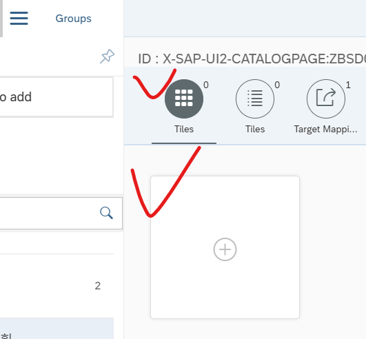

/nsegw
sap gateway service
create project

basic

저 체크 부분 : 내가 만든 서비스

Main.View

```js
<Input
    id="inpDepid"
    maxLength="8"
    width="200px"
    type="Text"
    showSuggestion="true"
    showValueHelp="true"
    valueHelpRequest="onValueHelpRequest"
/>
```

> valueHelpRequest="onValueHelpRequest" 로 서치헬프 달 수 있음

Main Controller


터미널에서

피오리를 아밥 서버에 저장해보자

```bash
npx fiori add deploy-config
```


ABAP 선택 후 
이름은 Z,Y로 시작

패키지로 저장하면 change request 번호가 꼭 와야 한다


```bash
npm run deploy
```

yes 후에 SAP GUI에서 확인


배포완료

피오리 런치패드 생성 순서 

- 시멘틱 오브젝트? 
  - /n /ui2/semobj (T-CODE) **LOCK 걸려있음**
- Create Catalog
- Tile Create
- ROLE 생성
- Catalog, User 할당

---

## Tile Create

[링크](https://210.16.199.140:8443/sap/bc/ui5_ui5/sap/arsrvc_upb_admn/main.html?scope=CUST)





---

## ROLE 생성

- PFCG (T-CODE)


저장 후 백
사용할 유저들 추가해주면 된다

/UI2/FLP (T-CODE)

[링크](https://210.16.199.141:8443/sap/bc/ui2/flp)

로그인 후

홈 페이지 편집 클릭


----

# 24.12.03 런치패드 테마

/n UI5/THEMe_DESIGNER

[링크](https://210.16.199.141:8443/sap/bc/theming/theme-designer)


