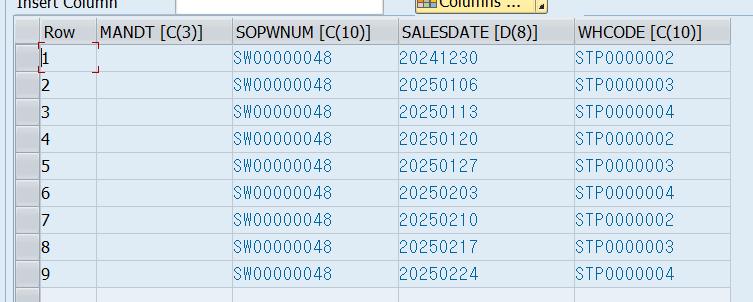

# FOR문

```ABAP
DATA lt_test TYPE TABLE OF i WITH EMPTY KEY.
lt_test = VALUE #( FOR j = 1 WHILE j <= 10 ( j ) ).
```

```abap
  TYPES: BEGIN OF S,
            COL1 TYPE C LENGTH 5,
            COL2 TYPE I,
            COL3 TYPE I,
        END OF S.
  TYPES ITAB_TYPE TYPE TABLE OF S WITH EMPTY KEY.
  DATA(ITAB) = VALUE ITAB_TYPE( ( COL1 = 'a' COL2 = 1 COL3 = 30 )
                                ( COL1 = 'bb' COL2 = 2 COL3 = 10 )
                                ( COL1 = 'ccc' COL2 = 3 COL3 = 20 ) ).
  TYPES int_tab_type TYPE TABLE OF i WITH EMPTY KEY.
  DATA(inttab) = VALUE int_tab_type( ( 99 ) ( 100 ) ).

*  자재코드 하나를 꺼낸다. 52로 나눈다. 그 전에 일단 52로 나눠서 테이블을 생성
   DATA(IT7) = VALUE STRING_TABLE( FOR WA1 IN ITAB
                                FOR WA2 IN INTTAB
                                ( |Comp. 1st itab: "{ WA1-COL1 }", comp. 2nd itab: "{ WA2 }"| ) ).
```


