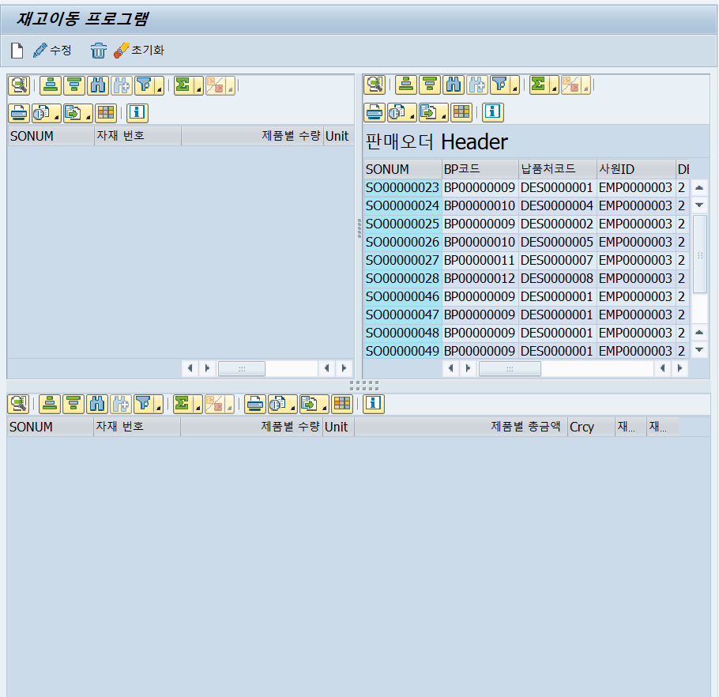

[TOC]



# F01

```ABAP
*&---------------------------------------------------------------------*
*& Include          ZBRMM0010F01
*&---------------------------------------------------------------------*
*&---------------------------------------------------------------------*
*& Form SONUM_HELP
*&---------------------------------------------------------------------*
*& text
*&---------------------------------------------------------------------*
*& -->  p1        text
*& <--  p2        text
*&---------------------------------------------------------------------*
FORM SONUM_HELP USING P_VAL TYPE HELP_INFO-DYNPROFLD.

* 판매오더 번호에 서치헬프 달기
  DATA: BEGIN OF LS_SONUM.
  DATA: SONUM TYPE ZTBSD0030-SONUM,
        END OF LS_SONUM.

  DATA: LT_SONUM LIKE TABLE OF LS_SONUM.

  SELECT A~SONUM FROM ZTBSD0031 AS A
    WHERE A~INVMOVE = 2
    ORDER BY A~SONUM DESCENDING
    INTO TABLE @LT_SONUM.

  CALL FUNCTION 'F4IF_INT_TABLE_VALUE_REQUEST'
  EXPORTING
    RETFIELD        = 'PA_SONUM'
    DYNPPROG        = SY-CPROG
    DYNPNR          = SY-DYNNR
    DYNPROFIELD     = P_VAL
    VALUE_ORG       = 'S'
    WINDOW_TITLE    = '판매오더번호 선택'
  TABLES
    VALUE_TAB       = LT_SONUM.
ENDFORM.
*&---------------------------------------------------------------------*
*& Form SET_LAYOUT_0100
*&---------------------------------------------------------------------*
*& text
*&---------------------------------------------------------------------*
*& -->  p1        text
*& <--  p2        text
*&---------------------------------------------------------------------*
FORM SET_LAYOUT_0100.
  GS_LAYOUT-ZEBRA = 'X'.
  GS_LAYOUT-CWIDTH_OPT = 'A'.
  GS_LAYOUT-GRID_TITLE = '판매오더 Header'.
ENDFORM.
*&---------------------------------------------------------------------*
*& Form SET_ALV_FIELDCAT_0100
*&---------------------------------------------------------------------*
*& text
*&---------------------------------------------------------------------*
*& -->  p1        text
*& <--  p2        text
*&---------------------------------------------------------------------*
FORM SET_ALV_FIELDCAT_0100.
  DATA: LS_FCAT TYPE LVC_S_FCAT.

*  CLEAR LS_FCAT.
*  LS_FCAT-FIELDNAME = 'MATCODE'.
*  LS_FCAT-COLTEXT   = '자재번호'.
*  LS_FCAT-COL_POS = 1.
*  APPEND LS_FCAT TO GT_FCAT.
ENDFORM.
*&---------------------------------------------------------------------*
*& Form SET_ALV_DISPLAY_0100
*&---------------------------------------------------------------------*
*& text
*&---------------------------------------------------------------------*
*& -->  p1        text
*& <--  p2        text
*&---------------------------------------------------------------------*
FORM SET_ALV_DISPLAY_0100.
  CALL METHOD AVL_GRID_TOP_L->SET_TABLE_FOR_FIRST_DISPLAY
    EXPORTING
      I_BYPASSING_BUFFER            =     'X'
      I_STRUCTURE_NAME              =     'ZTBSD0030'
      IS_LAYOUT                     =      GS_LAYOUT
    CHANGING
      IT_OUTTAB                     =      GT_ALV_ZTBSD0030
      IT_FIELDCATALOG              =       GT_FCAT.

  CALL METHOD AVL_GRID_TOP_R->SET_TABLE_FOR_FIRST_DISPLAY
    EXPORTING
      I_BYPASSING_BUFFER            =     'X'
      I_STRUCTURE_NAME              =     'ZTBSD0031'
      IS_LAYOUT                     =      GS_LAYOUT2
    CHANGING
      IT_OUTTAB                     =      GT_ALV_ZTBSD0031
      IT_FIELDCATALOG              =       GT_FCAT2.

  CALL METHOD AVL_GRID_BOTTOM->SET_TABLE_FOR_FIRST_DISPLAY
    EXPORTING
      I_BYPASSING_BUFFER            =     'X'
      I_STRUCTURE_NAME              =     'ZTBSD0031'
      IS_LAYOUT                     =      GS_LAYOUT2
    CHANGING
      IT_OUTTAB                     =      GT_ALV_ZTBSD0031
      IT_FIELDCATALOG              =       GT_FCAT2.

  PERFORM ERROR USING '조회'.
ENDFORM.
*&---------------------------------------------------------------------*
*& Form ERROR
*&---------------------------------------------------------------------*
*& text
*&---------------------------------------------------------------------*
*&      --> P_
*&---------------------------------------------------------------------*
FORM ERROR USING P_VALUE.
  IF SY-SUBRC <> 0.
    MESSAGE S094 DISPLAY LIKE 'E' WITH P_VALUE.
    RETURN.
  ELSE.
    MESSAGE S095 DISPLAY LIKE 'S' WITH P_VALUE.
  ENDIF.
ENDFORM.
*&---------------------------------------------------------------------*
*& Form CREATE_SPLIT_0100
*&---------------------------------------------------------------------*
*& text
*&---------------------------------------------------------------------*
*& -->  p1        text
*& <--  p2        text
*&---------------------------------------------------------------------*
FORM CREATE_SPLIT_0100 .
  CREATE OBJECT GO_SPLIT
    EXPORTING
      PARENT            = GO_DOCK
      ROWS              = 1      " 몇 개의 행으로 나눌 것인지.
      COLUMNS           = 2.      " 몇 개의 열로 나눌 것인지.

  GO_CON_TOP_R = GO_SPLIT->GET_CONTAINER( ROW = 1 COLUMN = 1 ).
  GO_CON_TOP_L = GO_SPLIT->GET_CONTAINER( ROW = 1 COLUMN = 2 ). " 판매운영계획 헤더

  CREATE OBJECT AVL_GRID_TOP_R
     EXPORTING
       I_PARENT = GO_CON_TOP_R.

  CREATE OBJECT AVL_GRID_TOP_L
     EXPORTING
       I_PARENT = GO_CON_TOP_L.

  CREATE OBJECT AVL_GRID_BOTTOM
     EXPORTING
       I_PARENT = GO_DOCK2.

  PERFORM ERROR USING 'CONTAINER'.
ENDFORM.
*&---------------------------------------------------------------------*
*& Form GET_DATA
*&---------------------------------------------------------------------*
*& text
*&---------------------------------------------------------------------*
*&      --> P_
*&---------------------------------------------------------------------*
FORM GET_DATA USING P_TYPE.

  DATA : RT_SONUM TYPE RANGE OF ZTBSD0030-SONUM,
         RT_DATE TYPE RANGE OF ZTBSD0030-SODAT.

  IF PA_SONUM IS NOT INITIAL.
    RT_SONUM = VALUE #( ( SIGN = 'I'
                          OPTION = 'EQ'
                          LOW = PA_SONUM ) ).
  ENDIF.

  IF SO_DAT IS NOT INITIAL.
    RT_DATE = VALUE #( ( SIGN = 'I'
                         OPTION = 'BT'
                         LOW = SY-DATUM+0(6) && '01'
                         HIGH = SY-DATUM ) ).
  ENDIF.

  IF P_TYPE <> 'INIT'.

  ELSE.
    SELECT * FROM ZTBSD0030 AS A
      WHERE A~SONUM IN @RT_SONUM
      AND A~SODAT IN @RT_DATE
      INTO CORRESPONDING FIELDS OF TABLE @GT_ALV_ZTBSD0030.
  ENDIF.


ENDFORM.
```

# IO1

```ABAP
*&---------------------------------------------------------------------*
*& Include          ZBRMM0010I01
*&---------------------------------------------------------------------*
*&---------------------------------------------------------------------*
*&      Module  EXIT  INPUT
*&---------------------------------------------------------------------*
*       text
*----------------------------------------------------------------------*
MODULE EXIT INPUT.
 CASE OK_CODE.
    WHEN 'EXIT'.
      LEAVE PROGRAM.
    WHEN 'CANCEL'.
      LEAVE TO SCREEN 0.
  ENDCASE.
ENDMODULE.
*&---------------------------------------------------------------------*
*&      Module  USER_COMMAND_0100  INPUT
*&---------------------------------------------------------------------*
*       text
*----------------------------------------------------------------------*
MODULE USER_COMMAND_0100 INPUT.
  CASE OK_CODE.
    WHEN 'BACK'.
      LEAVE TO SCREEN 0.
  ENDCASE.
ENDMODULE.
```

# O01

```ABAP
*&---------------------------------------------------------------------*
*& Include          ZBRMM0010O01
*&---------------------------------------------------------------------*
*&---------------------------------------------------------------------*
*& Module STATUS_0100 OUTPUT
*&---------------------------------------------------------------------*
*&
*&---------------------------------------------------------------------*
MODULE STATUS_0100 OUTPUT.
  SET PF-STATUS 'S100'.
  SET TITLEBAR 'T100'.
ENDMODULE.
*&---------------------------------------------------------------------*
*& Module CLEAR_OK_CODE OUTPUT
*&---------------------------------------------------------------------*
*&
*&---------------------------------------------------------------------*
MODULE CLEAR_OK_CODE OUTPUT.
  CLEAR: OK_CODE.
ENDMODULE.
*&---------------------------------------------------------------------*
*& Module INIT_ALV OUTPUT
*&---------------------------------------------------------------------*
*&
*&---------------------------------------------------------------------*
MODULE INIT_ALV OUTPUT.
  IF GO_DOCK IS INITIAL.
    PERFORM CREATE_OBJECT_0100.
    PERFORM CREATE_SPLIT_0100.
    PERFORM SET_LAYOUT_0100.
    PERFORM SET_ALV_FIELDCAT_0100.
    PERFORM SET_ALV_DISPLAY_0100.
  ENDIF.
ENDMODULE.
*&---------------------------------------------------------------------*
*& Form CREATE_OBJECT_0100
*&---------------------------------------------------------------------*
*& text
*&---------------------------------------------------------------------*
*& -->  p1        text
*& <--  p2        text
*&---------------------------------------------------------------------*
FORM CREATE_OBJECT_0100.
  CREATE OBJECT GO_DOCK
    EXPORTING
      REPID = SY-REPID
      DYNNR = SY-DYNNR
      SIDE  = CL_GUI_DOCKING_CONTAINER=>DOCK_AT_TOP " Left, Top, Bottom, Right "
      RATIO = 50.

  CREATE OBJECT GO_DOCK2
    EXPORTING
      REPID = SY-REPID
      DYNNR = SY-DYNNR
      SIDE  = CL_GUI_DOCKING_CONTAINER=>DOCK_AT_BOTTOM " Left, Top, Bottom, Right "
      RATIO = 50.
ENDFORM.
```

# TOP

```ABAP
*&---------------------------------------------------------------------*
*& Include ZBRMM0010TOP                             - Report ZBRMM0010
*&---------------------------------------------------------------------*
REPORT ZBRMM0010 MESSAGE-ID ZCOMMON_MSG.

TABLES : ZTBSD0030, ZTBSD0031.

DATA : OK_CODE TYPE SY-UCOMM.


* --------------------------------------------------------------------*
* CONTAINER
*--------------------------------------------------------------------*
DATA: GO_DOCK           TYPE REF TO CL_GUI_DOCKING_CONTAINER,
      GO_DOCK2           TYPE REF TO CL_GUI_DOCKING_CONTAINER,
      GO_SPLIT          TYPE REF TO CL_GUI_SPLITTER_CONTAINER,
      GO_CON_TOP_R      TYPE REF TO CL_GUI_CONTAINER,
      GO_CON_TOP_L      TYPE REF TO CL_GUI_CONTAINER,
      GO_CON_BOTTOM     TYPE REF TO CL_GUI_CONTAINER,
      AVL_GRID_TOP_L    TYPE REF TO CL_GUI_ALV_GRID,
      AVL_GRID_TOP_R    TYPE REF TO CL_GUI_ALV_GRID,
      AVL_GRID_BOTTOM   TYPE REF TO CL_GUI_ALV_GRID.


DATA : GS_LAYOUT          TYPE LVC_S_LAYO,
       GS_LAYOUT2         TYPE LVC_S_LAYO,
       GT_FCAT            TYPE LVC_T_FCAT,
       GT_FCAT2           TYPE LVC_T_FCAT,
       GT_ROW             TYPE LVC_T_ROID,
       GS_ROW             TYPE LVC_S_ROID.


* --------------------------------------------------------------------*
* 첫번째.  재고이동 Header
*--------------------------------------------------------------------*


DATA     :  BEGIN               OF GS_ALV_ZTBSD0030.  " Inbound Grid
            INCLUDE             TYPE  ZTBSD0030.
DATA     :  MATNAME            TYPE ZTBMM1011-MATNAME   " 자재명
          , CTRYNAME           TYPE ZTBSD1040-CTRYNAME    " 국가명
          , EMPNAME_F           TYPE ZTBSD1030-EMPNAME    " 담당자명
          , EMPNAME_L           TYPE ZTBSD1030-EMPNAME    " 담당자명
          , END                OF GS_ALV_ZTBSD0030.

DATA : GT_ALV_ZTBSD0030 LIKE TABLE OF GS_ALV_ZTBSD0030.


* --------------------------------------------------------------------*
* 두번째. 재고이동 Item
*--------------------------------------------------------------------*


DATA     :  BEGIN               OF GS_ALV_ZTBSD0031.  " Inbound Grid
            INCLUDE             TYPE  ZTBSD0031.
DATA     :  MATNAME            TYPE ZTBMM1011-MATNAME   " 자재명
          , CTRYNAME           TYPE ZTBSD1040-CTRYNAME    " 국가명
          , EMPNAME_F           TYPE ZTBSD1030-EMPNAME    " 담당자명
          , EMPNAME_L           TYPE ZTBSD1030-EMPNAME    " 담당자명
          , END                OF GS_ALV_ZTBSD0031.

DATA : GT_ALV_ZTBSD0031 LIKE TABLE OF GS_ALV_ZTBSD0031.
```

# S01

```ABAP
*&---------------------------------------------------------------------*
*& Include          ZBRMM0010S01
*&---------------------------------------------------------------------*

 INITIALIZATION.

  SELECTION-SCREEN BEGIN OF BLOCK BLK1 WITH FRAME TITLE TEXT-T01.

    PARAMETERS: PA_SONUM TYPE ZTBSD0030-SONUM.
    SELECT-OPTIONS: SO_DAT FOR ZTBSD0030-SODAT.


  SELECTION-SCREEN END OF BLOCK BLK1.

  INITIALIZATION.

  SO_DAT-SIGN   = 'I'.
  SO_DAT-OPTION = 'BT'.
  SO_DAT-LOW    = SY-DATUM+0(6) && '01'.
  SO_DAT-HIGH   = SY-DATUM.
  APPEND SO_DAT.

* 판매오더번호 서치헬프
  AT SELECTION-SCREEN ON VALUE-REQUEST FOR PA_SONUM.
    PERFORM SONUM_HELP USING 'PA_SONUM'.

   START-OF-SELECTION.
   PERFORM GET_DATA USING 'INIT'.

   CALL SCREEN 100.
```

