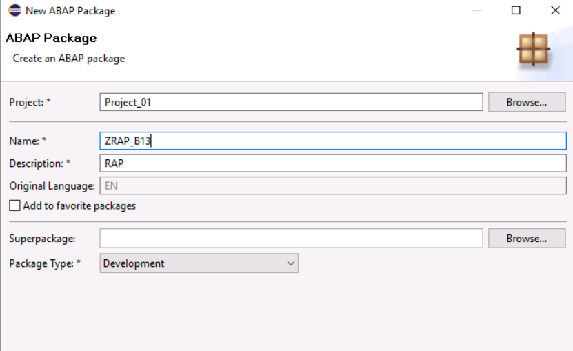
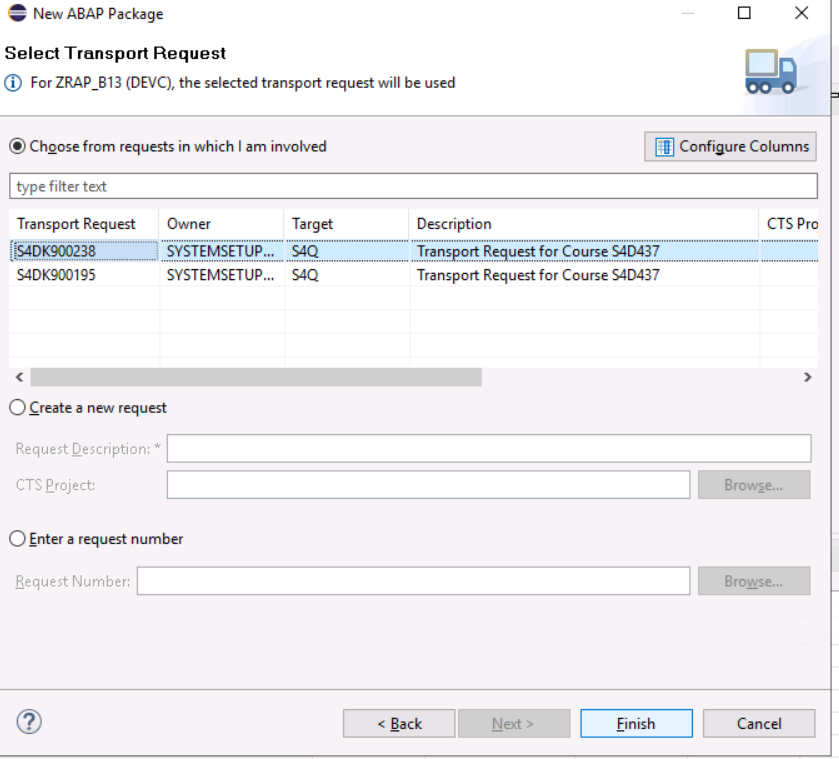

| 본인번호 | 이름          | System        | Username                    | Password                    |
| -------- | ------------- | ------------- | --------------------------- | --------------------------- |
|          |               |               |                             |                             |
| 00       | 박이배 강사님 | ST-UT44S-006  | A71834879-026               | Rubble_Sarcastic_Facility63 |
| 01       | 강나영        | A71834879-027 | Rubble_Sarcastic_Facility63 |                             |
| 02       | 강현준        | A71834879-028 | Rubble_Sarcastic_Facility63 |                             |
| 03       | 권민지        | A71834879-029 | Rubble_Sarcastic_Facility63 |                             |
| 04       | 김건희        | A71834879-030 | Rubble_Sarcastic_Facility63 |                             |
| 05       |               | A71834879-031 | Rubble_Sarcastic_Facility63 |                             |
| 06       | 김재하        | A71834879-032 | Rubble_Sarcastic_Facility63 |                             |
| 07       | 박수현        | A71834879-033 | Rubble_Sarcastic_Facility63 |                             |
| 08       | 서희경        | A71834879-034 | Rubble_Sarcastic_Facility63 |                             |
| 09       | 송은지        | A71834879-035 | Rubble_Sarcastic_Facility63 |                             |
| 10       | 양정민        | A71834879-036 | Rubble_Sarcastic_Facility63 |                             |
| 11       | 오지원        | A71834879-037 | Rubble_Sarcastic_Facility63 |                             |
| 12       | 윤소영        | A71834879-038 | Rubble_Sarcastic_Facility63 |                             |
| 13       |               | ST-UT44S-007  | A71834879-026               | Rubble_Sarcastic_Facility63 |
| 14       | 이로운        | A71834879-027 | Rubble_Sarcastic_Facility63 |                             |
| 15       | 이재신        | A71834879-028 | Rubble_Sarcastic_Facility63 |                             |
| 16       | 이정아        | A71834879-029 | Rubble_Sarcastic_Facility63 |                             |
| 17       | 이준수        | A71834879-030 | Rubble_Sarcastic_Facility63 |                             |
| 18       | 이준호        | A71834879-031 | Rubble_Sarcastic_Facility63 |                             |
| 19       | 정재우        | A71834879-032 | Rubble_Sarcastic_Facility63 |                             |
| 20       | 주현수        | A71834879-033 | Rubble_Sarcastic_Facility63 |                             |
| 21       | 진유진        | A71834879-034 | Rubble_Sarcastic_Facility63 |                             |
| 22       | 채은비        | A71834879-035 | Rubble_Sarcastic_Facility63 |                             |
| 23       | 최은오        | A71834879-036 | Rubble_Sarcastic_Facility63 |                             |
| 24       | 최현지        | A71834879-037 | Rubble_Sarcastic_Facility63 |                             |
| 25       | 하정훈        | A71834879-038 | Rubble_Sarcastic_Facility63 |                             |







TABLE 에서 PK는 기본적으로 두개
KEY중 하나는 Client


```sql
key client      : abap.clnt not null;
key course_uuid : abap.raw(16) not null;
course_id       : abap.char(10);
course_name     : abap.char(64);
course_length   : abap.int1;
country         : zland_b13;
@Semantics.amount.currencyCode : 'zcourse_b13.currency_code'
price           : abap.curr(15,2);
currency_code   : abap.cuky;
blocked         : abap_boolean;
discription     : abap.char(128);
changed_by      : syuname;
changed_at      : timestampl;
```


```sql
CLASS zfill_course2_b13 DEFINITION
  PUBLIC
  FINAL
  CREATE PUBLIC .
  
  PUBLIC SECTION.
  
    INTERFACES if_oo_adt_classrun .
  PROTECTED SECTION.
  PRIVATE SECTION.
ENDCLASS.
  
CLASS zfill_course2_b13 IMPLEMENTATION.
  METHOD if_oo_adt_classrun~main.
    DATA : gt_course TYPE TABLE OF zcourse_b13.
    gt_course = VALUE #( (
        course_uuid     = cl_system_uuid=>create_uuid_x16_static( )
        course_id       = 'S4D430'
        course_name     = 'S4D43012'
        course_length   = 2
        country         = 'US'
        price           = '5000.00'
        currency_code   = 'USD'
        blocked         = ' '
        discription     = 'ABAP CDS'
    ) ).
    DELETE FROM zcourse_b13.
    INSERT zcourse_b13 FROM TABLE gt_course.
    out->write( 'TABLE CONTENT IS CREATE' ).
  ENDMETHOD.
ENDCLASS.
```

