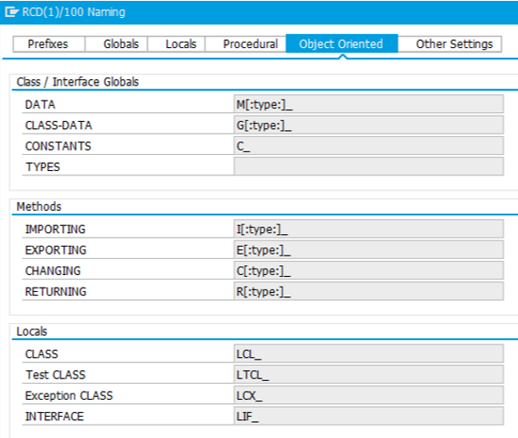
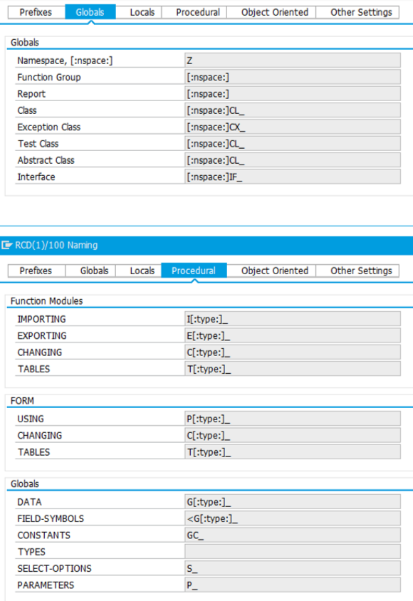

#  단축키

F8 : 실행하기
F4 : help
Ctrl + F3
Active 된 상태에서 F8 하면 실행된다
Ctrl + / 주석 처리
Ctrl + . 주석 해제
Ctrl + Shift + F12 : break point 설정
Shift + F1 프리티어

**디버깅 모드** 안에서
F5 : 한 라인 실행
F8 : 다음 break point로 이동
F6 : 한단계씩 이동하며, 서브루틴을 만나면 실행 후 다음 단계로 이동합니다.
F7 : 현재 실행중인 서브루틴을 빠져나오고 다음 단계로 이동합니다.

| **단축키**               | **내역**                             |
| ------------------------ | ------------------------------------ |
| Find / Replace text      | 도움말                               |
| Copy selection           | 연결                                 |
| Close                    | Ctrl + F4                            |
| Ctrl + F1                | Ctrl + Shift + F4                    |
| Cut selection            | Ctrl + X                             |
| Paste selection          | Ctrl + V                             |
| Redo typing              | Ctrl + Y                             |
| Select all               | Ctrl + A                             |
| Undo typing              | Ctrl + Z                             |
| Shift + F3               | 프로그램 종료                        |
| Shift + F5               | 기타오브젝트                         |
| Shift + F12              | 전체 화면 설정/해제                  |
| Ctrl + Home              | 문서의 맨 앞으로 이동                |
| Ctrl + End               | 문서의 맨 마지막으로 이동            |
| Ctrl + Z                 | 실행 취소                            |
| Ctrl + Y                 | 실행 취소한 것을 취소                |
| Ctrl + X                 | 자르기                               |
| Ctrl + C                 | 복사                                 |
| Ctrl + V                 | 붙이기                               |
| Ctrl + A                 | 모두 선택하기                        |
| Ctrl + D                 | 현재 줄 아래에 복사                  |
| Ctrl + F                 | 찾기                                 |
| Ctrl + H                 | 찾아서 바꾸기                        |
| Ctrl + L                 | 블록 설정한 것 소문자로 변환         |
| Ctrl + U                 | 블록 설정한 것 대문자로 변환         |
| Ctrl + J                 | 블록 설정한 것 줄마다 첫 글자 대문자 |
| Ctrl + T                 | 블록 설정한 것 맨 앞에 글자만 대문자 |
| Ctrl + K                 | 블록 설정한 것 대소문자 변경         |
| Ctrl + O                 | 지정 라인으로 이동                   |
| Ctrl + /                 | 명령어 창으로 이동                   |
| Ctrl + ,                 | 커서 위치 라인 주석 처리             |
| Ctrl + .                 | 커서 위치 라인 주석 풀기             |
| Ctrl + <                 | 선택한 라인 전체 주석 처리           |
| Ctrl + >                 | 선택한 라인 전체 주석 풀기           |
| Ctrl + *                 | Toggle Outlining                     |
| Ctrl + Shift + -         | Collapse All                         |
| Ctrl + Shift + +         | Open All                             |
| Ctrl + Shift + T         | 한 줄 복사행 맨 앞으로 이동          |
| Ctrl + Shift + X         | 한 줄 잘라내기                       |
| Ctrl + Shift + L         | 한 줄 지우기                         |
| Ctrl + Alt + M           | 북마크 추가 삭제                     |
| Ctrl + M                 | 다음 북마크로 이동                   |
| Ctrl + Shift + M         | 이전 북마크로 이동                   |
| Ctrl + Alt + 1 ~ 9       | 1~9번 북마크 추가 삭제               |
| Ctr+1  ~ 9               | 1~9번 북마크로 이동                  |
| Ctr + Alt + +            | 글자 크기 크게                       |
| Ctr + Alt + -            | 글자 크기 작게                       |
| Ctr + Alt + up(화살표)   | 라인을 위로 이동                     |
| Ctr + Alt + down(화살표) | 라인을 아래로 이동                   |

global class = zcl, ycl
elementary variable = lv, gv
structure variable =  gs, ls
internal table = gt, lt

# ABAP Naming Conventions

[출처링크](https://docs.abapopenchecks.org/checks/69/)

# TCodes for ABAP

**SE80 Object Navigator**
**SE24 CLASS Builder**
**SE11 ABAP Dictionary**
**SE37 ABAP Function Modules**
**SE38 ABAP Editor**
**SE41 Menu Painter**
**SE51 Screen Painter**
SE30 ABAP Objects Runtime Analysis
SE32 ABAP Text Element Maintenance
SE33 Context Builder
SE35 ABAP/4 Dialog Modules
SE36 Logical databases
SE39 Splitscreen Editor: Program Compare
SE40 MP: Standards Maint. and Translation
SE43 Maintain Area Menu
SE52 Parameterized screenpainter call
SE55 Internal table view maintenance call
SE56 internal call: display table view
SE57 internal delete table view call
SE61 R/3 Documentation
SE62 Industry Utilities
SE63 Translation: Initial Screen
SE71 SAPscript form
SE72 SAPscript Styles
SE73 SAPscript font maintenance (revised)
SE74 SAPscript format conversion
SE75 SAPscript Settings
SE76 SAPscript: Form Translation
SE77 SAPscript Translation Styles
SE78 SAPscript: Graphics administration
SE81 Application Hierarchy
SE82 Application Hierarchy
SE84 R/3 Repository Information System
SE85 ABAP/4 Repository Information System
SE86 ABAP Repository Information System
SE88 Development Coordination Info System
SE89 Maintain Trees in Information System
SE91 Maintain Messages
SE92 New SysLog Msg Maintenance as of 46A
SE93 Maintain Transaction Codes
SE94 Customer enhancement simulation
SE95 Modification Browser
SEPS SAP Electronic Parcel Service
SERP Reporting: Change Tree Structure
SEU Repository Browser
SF01 Client-Specific File Names
SFAW Field Selection Maintenance

SCMP View / Table Comparison
SCU0 Table Analyses And Comparison
SCU1 Table Comparison - Export to Tape
SCU2 Table Comparison Against Tape
SCU3 Table History
SE16 Display Table Content
SE17 Generate Table Display
SE54 Generate table view
SM31 Table maintenance
SM31_OLD Old Table Maintenance
SM32 Maintain Table Parameter ID TAB
SM33 Display Table ParameterID TAB

SPAM Software Update Manager

SAINT Add-on Installation Tool

